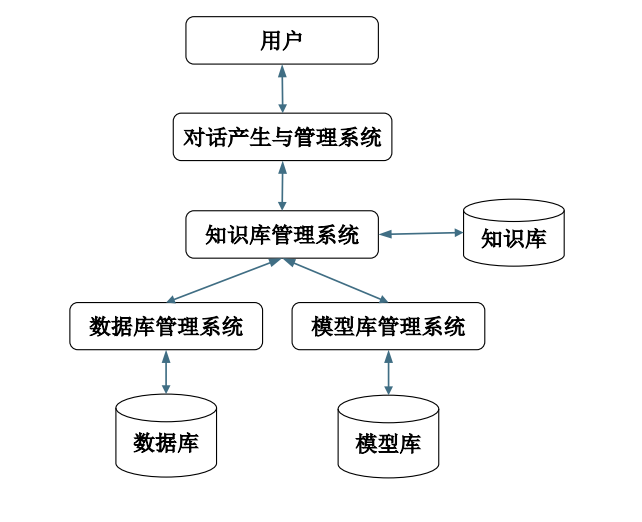
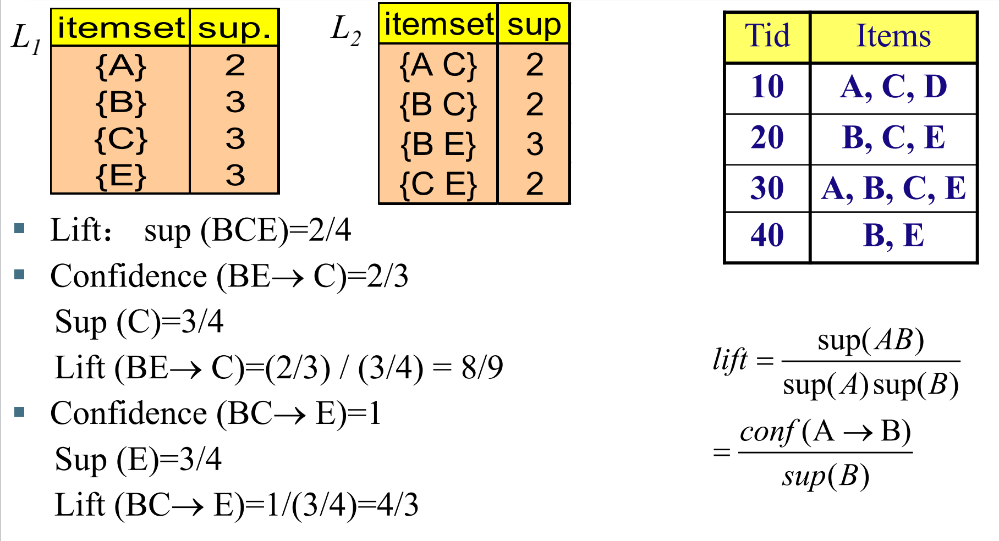
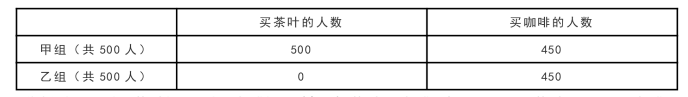
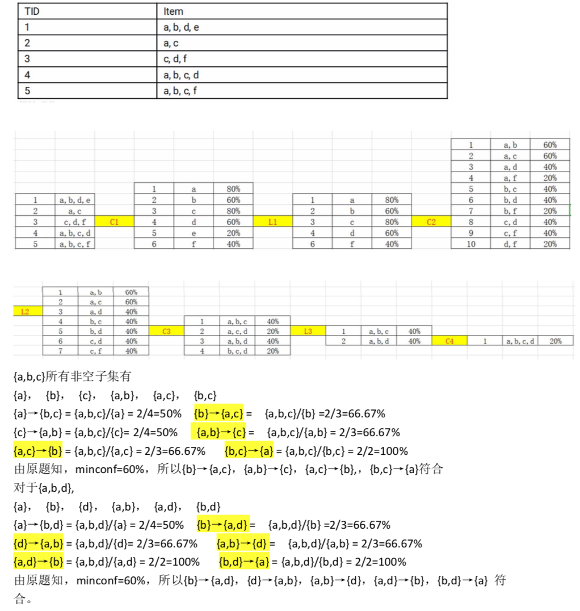
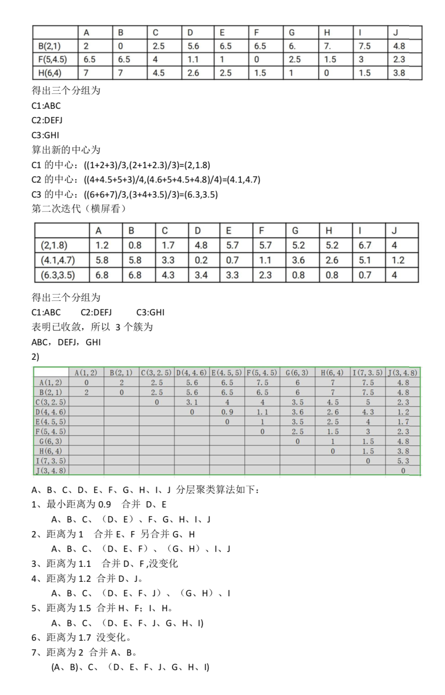

#  商务智能

- [商务智能](#商务智能)
  - [1. 导言](#1-导言)
  - [2. 商务智能过程](#2-商务智能过程)
  - [3. 关联分析](#3-关联分析)
  - [4. 分类](#4-分类)
  - [5. 数值预测](#5-数值预测)
  - [6. 聚类](#6-聚类)
  - [7. 数据预处理](#7-数据预处理)
  - [8. 数据仓库](#8-数据仓库)
  - [9. 在线分析处理](#9-在线分析处理)
  - [专业考](#专业考)
    - [1. 选择题](#1-选择题)
    - [2. 简单题](#2-简单题)
    - [3. 计算题](#3-计算题)

## 1. 导言

> 商务智能的基本概念  

工业界 - 商务智能可以被看作是一类技术或工具，利用它们可以对大量的数据进行收集、管理、分析和挖掘，以改善业 务决策水平，增强企业的竞争力。  

学术界 - 商务智能是一套理论、方法和应用，通过它们可以快速地发现海量数据中隐含的各种知识，有效地解决企业面 临的管理和决策问题，支持企业的战略实施。  

> 数据（data)  

是对事物描述的符号。在计算机科学中，数据是数字、文字、图像、声音等可以输入到计算机被识别的符号.  

> 信息（information）

通过一定的技术和方法，对数据进行集成、分析， 挖掘其潜在的规律和内涵，得到的结果是信息。  
信息是具有商务意义的数据.  

> 知识（knowledge）  

当信息用于商务决策，并基于决策开展相应的商务活动时，信息就上升为知识。  
信息转化为知识的过程不仅需要信息，而且需要结 合决策者的经验和能力，用以解决实际的问题。  

> 商务智能的系统构成  

六个主要组成部分  

- 数据源  
- 数据仓库  
- 在线分析处理  
- 数据探查  
- 数据挖掘  
- 业务性能管理  

> 数据源  

企业内部的操作型系统，即支持各业务部分日常运营的信息系统.  
企业的外部，如人口统计信息、竞争对手信息等.  

> 数据仓库（data warehouse）  

各种数据源的数据经过抽取、转换之后需要放到一个供分析使用的环境，以便对数据进行管理，这就是数据仓库.  

数据集市（data mart）：通常针对单个部门的数据仓库，区别于企业范围内的数据仓库。  

数据仓库可以将分析数据与实现业务处理的操作型数据隔离，一方面不影响业务处理系统的性能，另一方面为数据的分析提供了一个综合的、集成的、 统一的数据管理平台。  

> 在线分析处理（online analytical processing）  

在线分析处理：业务性能度量可以通过多个维度、 多个层次进行多种聚集汇总，通过交互的方式发现业务运行的关键性能指标的异常之处。  

多维数据可以进行多种操作 - 如切片、切块、下钻、上卷等.

> 数据探查（exploration）  

包括灵活的查询、即时报表以及统计方法等.  
该类方法属于被动分析方法.  
探查数据的方法可以借助统计上的中心性、发散性 以及相关性的统计量分析，多变量分析时也可以借助可视化技术。  

> 数据挖掘（data mining）  

数据挖掘是从大量数据中自动发现隐含的信息和知识的过程，属于主动分析方法，不需要分析者的先验假设，可以发现未知的知识.  

常用的分析方法包括分类、聚类、关联分析、数值 预测、序列分析、社会网络分析等.  

> 数据挖掘：分类  

分类（classification）是通过对具有类别的对象的数据集进行学习，概括其主要特征，构建分类模型，根据该模型预测对象的类别的一种数据挖掘和机器学习技术。  

> 数据挖掘：聚类  

聚类（clustering）是依据物以类聚的原理，将没有类别的对象根据对象的特征自动聚集成不同簇的过程，使得属于同一个簇的对象之间非常相似，属于不同簇的对象之间不相似。  
其典型应用是客户分群.  

> 数据挖掘：关联分析  

关联分析最早用于分析超市中顾客一次购买的物品之间的关联性.  

> 数据挖掘：数值预测  

数值预测用于预测连续变量的取值。  
常用的预测方法是回归分析.  
例如，可以根据客户个人特征，如年龄、工作类型、 受教育程度、婚姻状况等，来预测其每月的消费额度。  

> 数据挖掘：序列分析  

序列分析是对序列数据库进行分析，从中挖掘出有意义模式的技术。  

序列模式（sequential pattern）的发现属于序列分析，它是从序列数据库中发现的一种有序模式.  

> 数据挖掘：社会网络分析  

社会网络（social network）是由个人或组织及其之间的关系构成的网络.  
社会网络分析（social network analysis）是对社会网络的结构和属性进行分析，以发现其中的局部或全局特点，发现其中有影响力的个人或组织，发现网络的动态变化规律等。  

> 业务绩效管理  

业务绩效管理（business performance management），简称BPM，又称为企业绩效管理（corporate performance management），是对企业的关键性能指标，如销售、成本、 利润以及可盈利性等，进行度量、监控和比较的方法和工具。  

## 2. 商务智能过程

> 商务智能系统的开发过程

1. 规划

- 识别业务需求
- 识别信息需求
- 时间成本规划

重要性方面，可以从三个方面进行衡量  

- 衡量商务智能提供的信息的可操作性；
- 衡量实施商务智能可能给企业带来的回报；
- 衡量实施商务智能可以帮助企业实现短期目标；

实现的难易程度

- 商务智能的实现需要涉及的范围  
- 衡量数据的可获取性  

2. 分析

- 详细的需求分析
- 数据定义
- 技术选择

分析阶段，针对在规划阶段最终选择要实现商务智能的业务部门或业务领域，进行详细的需求分析  

- 收集需要的各类数据
- 选择需要的商务智能支撑技术，如数据仓库、在线分析数据或者数据挖掘等

3. 设计

- 数据仓库
- 数据集市
- 数据仓库挖掘
- OLAP设计

如果要创建数据仓库，则进行数据仓库的模型设计，常用的是多维数据模型。数据集市可以从数据仓库中抽取数据进行构建。  
在不构建数据仓库的情况下，也可以直接为某个业务部门设计和实现数据集市。  
如果要实现OLAP解决问题，则要设计多维分析的聚集操作类型。  
如果要借助数据挖掘技术，则需要选择具体的算法。

4. 实现

- 构建数据仓库
- 构建数据集市
- 增强报表查询
- 在线分析处理
- 数据挖掘算法
- 企业绩效管理

实现阶段，选择ETL工具实现源数据的抽取，构建数据仓库和（或）数据集市。  
对数据仓库或数据集市的数据，选取并应用相应的查询或分析工具，包括增强型的查询、 报表工具、在线分析处理工具、数据挖掘系 统以及企业绩效管理工具等。  
在具体应用该系统之前，需要完成对系统的数据加载和应用测试，设计系统的访问控制和安全管理方法。  

> 商务智能系统成功的关键因素  

- 业务驱动  
- 高层支持  
- 业务人员和IT人员的合作  
- 循序渐进  
- 培训

> 数据仓库与数据库  

联系表现在两个方面  

- 数据仓库中的大部分数据来自于业务系统的数据库中  
- 当前绝大多数数据仓库都是利用数据库系统来管理的  

区别：构建目的、管理的数据、管理方法都不同  

1. 数据库主要用于实现企业的日常业务运营，提高业务运营的效率；数据仓库的构建主要用于集成多个数据源的数据，这些数据最终用于分析。  
2. 数据库通常只包含当前数据，数据的存储尽量避免冗余，数据的组织按照业务过程涉及的数据实现，是应用驱动的。数据仓库中的数据是按照主题组织的，将某一主题的所有数据集成在一起，数据存在冗余。  
3. 数据库中的数据需要进行频繁的插入、删除、修改等更新操作，需要复杂的并发控制机制保证事务运行的隔离性。
4. 数据仓库中的数据主要用于分析处理，除了初始的导入 和成批的数据清除操作之外，数据很少需要更新操作。
5. 数据库中数据的更新操作的时效性很强，事务的吞吐率 是个非常重要的指标。而数据仓库的数据量十分庞大，分析时通常涉及大量数据，时效性不是最关键的。数据仓库中的数据质量非常关键，不正确的数据将导致错误的分析结果。  

> OLTP vs. OLAP  

在线事务处理（online transaction processing）， 简称OLTP，是数据库管理系统的主要功能，用于 完成企业内部各个部门的日常业务操作。  
在线分析处理（online analytical processing）， 简称OLAP，是数据仓库系统的主要应用，提供数 据的多维分析以支持决策过程。  

|  | 在线事务处理OLTP | 在线分析处理OLAP |
| ----  | ----  | ---- |
| 用户 | 普通职员  |  管理人员，分析人员 |
| 功能 | 日常业务处理 |  决策支持  |
| 数据库设计 | 高度规范化 | 非规范化 |
| 数据处理  | 在线插入、删除、修改  | 批量加载和删除 |
| 使用方式  | 重复操作  | 即时的图表形式的交互查询 |
| 执行单元  | 短的事务处理 | 复杂的查询 |
| 数据 | 当前、细节数据 | 历史的汇总数据 |
| 性能指标  | 事务吞吐量  | 查询响应时间 |
| 事务特性 | 并发控制和事务恢复很重要 | 并发控制和事务恢复不重要 |

> DSS

决策支持系统（decision support system）  

- 一种交互式的基于计算机的系统，用于协助决策者使用数据和模型解决非结构化的问题.  
- 决策支持系统的用户主要是管理人员和业务分析人员，主要目的是辅助决策者进行科学决策.  

1. 数据库管理系统用于抽取、存储、 更新决策所需的数据。
2. 模型库管理系统主要用于管理决策所需的各种模型。
3. 知识库管理系统提供知识的表示、 存储和管理，用于支持定量模型无法解决的决策过程，帮助用户建立、 应用和管理描述性、过程性和推理性知识。
4. 对话产生与管理系统主要负责用户与系统的交互。

## 3. 关联分析

> 关联规则的挖掘: - 从交易数据库、关系数据库以及其他的数据集中发现项或对象的频繁的模式(frequent patterns)、关联(associations)的过程.  

> Support(支持度)  sup(X)=|X|/n  

若support(X) >=minsup ，则X称为频繁项集 (frequent itemset)，也可以说X是频繁的.  

> confidence （置信度）  

Conf(X → Y )=|XY| / |X|=sup(XY) / sup(X)  

> 挖掘关联规则: 主要步骤  

1. 发现所有的频繁集 (frequent itemsets): 支持 度>= minimum support的所有项集.
2. 将每个频繁集生成可能的关联规则.

> Lift (增益,提升度)

lift = P(AUB)/(P(A)P(B))  =  conf(A → B) / sup(B)  

>1: positively correlated  
=1: independent  
<1: negatively correlated  

## 4. 分类

分类任务就是通过学习得到一个目标函数（ 分类模型）f，把每个属性集x映射到一个预先定义的类标号y。  

> k 最近邻算法 The k-Nearest Neighbor Algorithm  

-------------------todo-------------------

> 决策树 Decision Tree  

-------------------todo-------------------

> 决策树的剪枝(pruning)

1. 过度拟合（overfitting）—— 过度拟合了训练集中的样本特点，训练集的准确度高，但通常具有较低的概括（generalization）能力，在预测未知类别对象时的准确率较低.
2. 拟合不足（underfitting）—— 如果过早地停止对结点的进一步分裂也会导致拟合不足问题.
3. 剪枝（pruning）优化 - 先剪枝（pre-pruning） - 后剪枝（post-pruning）.  

> 朴素贝叶斯分类 (Naïve Bayes)  

-------------------todo-------------------

> 平滑处理  

-------------------todo-------------------  

## 5. 数值预测

-------------------todo-------------------  

## 6. 聚类

1. Partitioning approach（分区法）： - 构建分区: k-means, k-medoids, CLARANS  
2. Hierarchical approach（层次法）: - 分层分解：Diana, Agnes, BIRCH, ROCK, CAMELEON  
3. Density-based approach（基于密度的方法）: - 基于连接性和密度函数: DBSCAN, OPTICS, DenClue  
4. Model-based（基于模型的方法）: - 根据假设为每个类构建一个模型： SOM, EM, COBWEB  
5. Frequent pattern-based（基于频繁模式法）: - 基于频繁模式的分析: pCluster; - 多层次粒度结构: STING, WaveCluster, CLIQUE
6. Grid-based approach（基于栅格法）
7. User-guided or constraint-based(基于约束法) - 考虑用户指定的或相对于某特定应用的约束：COD (obstacles)

-------------------todo-------------------  

## 7. 数据预处理

-------------------todo-------------------  

## 8. 数据仓库

-------------------todo-------------------  

## 9. 在线分析处理

-------------------todo-------------------  

## 专业考

### 1. 选择题

1. 某超市通过分析销售就数据后发现，买啤酒的人很大概率也会同时购买尿布，这种属于数 据挖掘的那类问题?(**A**)  
A. 关联规则发现 B. 聚类 C. 分类 D. 预测  

2. 以下两种描述分别对应哪两种对分类算法的评价标准?(**A**) (a)警察抓小偷，描述警察抓的人中有多少个是小偷的标准。 (b)描述有多少比例的小偷给警察抓了的标准。  
A. Precision,Recall B. Recall, Precision C. Precision, ROC D. Recall, ROC  

3. 将原始数据进行集成、变换、维度规约、数值规约是一下哪个任务的主要工作?(**C**)  
A. 频繁模式挖掘 B. 分类和预测 C. 数据预处理 D. 数据流挖掘  

4. 当不知道数据所带标签时，可以使用哪种技术促使带同类标签的数据与带其他标签的数据 相分离?(**B**)  
A.分类 B.聚类 C.关联分析 D.隐马尔可夫链  

5. 建立一个模型，通过这个模型根据一致的变量值来预测其他某个变量值属于数据挖掘的哪 一类任务?(**C**)  
A.根据内容检索 B.建模描述 C.预测建模 D.寻找模式和规则  

6. 假设 12 个销售价格记录组已经排序如下:5，10，11，13，15，35，50，55，72，92，204， 215，事用如下每种方法将它们划分成四个箱。等频(等深)划分时，15 在第几个箱子内?(**B**)  
 A.第一个 B. 第二个 C. 第三个 D. 第四个  

7. 上题中，等宽划分时(宽度为 50)，15 又在哪个箱子里?(**A**)  
A.第一个 B. 第二个 C. 第三个 D. 第四个  

8. 下面那个不属于数据的属性类型(**D**)  
A.标称 B.序数 C.区间 D.相异  

9. 假定属性 income 的最大最小值分别是 12000 元和 98000 元。利用最大最小规范化的方法将 属性的值映射到 0 至 1 的范围内。对属性 income 的 73600 元将被转化为(**D**)  
A.0.821 B.1.224 C.1.458 D.0.716  

10. 假定用于分析的数据包含属性 age。数据元组中 age 的值如下(按递增序):13，15，16， 16，19，20，20，21，22，22，25，25，25，30，33，33，35，35，36，40，45，46，52，70， 问题:使用按箱平均值平滑方法对上述数据进行平滑，箱的深度为 3.第二个箱子值为(**A**)  
A.18.3 B.22.6 C.26.8 D.27.9  

11. 一岁大学内的各年级人数分别为:一年级 200 人，二年级 160 人，三年级 130 人，四年级 110 人。则年纪属性的众数是(**A**)  
A.一年级 B.二年级 C.三年级 D.四年级  

12. 数据仓库是随时间变化的，下面的描述不正确的是(**C**)   
A.数据仓库随时间的变化不断增加新的数据内容;
B.捕捉到的新数据会覆盖原来的快照;
C.数据仓库随时间不断删去旧的数据内容; 
D.数据仓库中包含大量的综合数据，这些综合数据会随着时间变化不断地进行重新综合。  

13. OLAP 技术的核心是(**D**)  
A.在线性 B.对用户的快速响应 C.互操作性 D.多维分析  

14. 设 X={1，2，3}是频繁项集，则可由 X 产生的关联规则的个数是(**C**)  
A.4 B.5 C.6 D.7  

15. 频繁项集、频繁闭项集、最大频繁项集之间的关系是(**C**)   
A.最大频繁项集⊆频繁项集⊆频繁闭项集 
B.频繁项集⊆频繁闭项集⊆最大频繁项集
C.最大频繁项集⊆频繁闭项集⊆频繁项集
D.频繁闭项集⊆频繁项集⊆最大频繁项集  

16. 考虑下面的频繁 3-项集的集合:{1，2，3}{1，2，4}{1，2，5}{1，3，4}{1，3，5}{2，3， 4}{2，3，5}{3，4，5}假定数据集中只有 5 个项，采用合并策略，由候选产生过程得到 4-项集 不包含(**CD**)  
A.1，2，3，4， B.1，2，3，5 C.1，2，4，5  D.1，3，4，5  

17. 以下算法属于分类算法的是(**B**)  
A.DBSCAN     B.C4.5 C.K-means D.EM  

18. 简单的将数据对象集划分为不重叠的子集，使得每个数据对象恰好在一个子集中，这种聚 类类型称作(**B**)  
A.层次聚类 B.划分聚类 C.非互斥聚类 D.模糊聚类  
 
 ### 2. 简单题  

 1. 简述商务智能系统的构成。   

 商务智能系统六个主要组成部分:   

 1)数据源-企业内部的操作型系统，即支持各业务部分日常运营的信息系统，企业的外部，如 人口统计信息、竞争对手信息等;  

 2)数据仓库-各种数据源的数据经过抽取、转换之后需要放到一个供分析使用的环境，以便对数 据进行管理，这就是数据仓库。数据集市-通常针对单个部门的数据仓库，区别于企业范围内的 数据仓库。  

3)在线分析处理-业务性能度量可以通过多个维度、多个层次进行多种聚集汇总，通过交互方 式发现业务运行的关键性能指标的异常之处。  
4)数据探查-包括灵活的查询、即时报表以及统计方法等，属于被动分析方法。   

5)数据挖掘-数据挖掘是从大量数据中自动发现隐含的信息和知识的过程，属于主动分析方法， 不需要分析者的先验假设，可以发现未知的知识。常用的分析方法包括分类、聚类、关联分析、 数值预测、序列分析、社会网络分析等。   

6)业务性能管理-业务绩效管理(businessperformance management)，简称 BPM，又称为企 业绩效管理(corporate performance management)，是对企业的关键性能指标，如销售、成 本、利润以及可盈利性等，进行度量、监控和比较的方法和工具。这些信息通常通过可视化的 工具如平衡积分卡和仪表盘等进行展示。  

2. 说明提升度的概念及其计算方法。  

提升度(Lift):表示“包含 A 的事务中同时包含 B 事务的比例”与“包含 B 事务的比例”的 比值。公式表达:Lift=(P(A&B)/P(A))/P(B)=P(A&B)/P(A)/P(B)。  

提升度反映了关联规则中的 A 与 B 的相关性，提升度>1 且越高表明正相关性越高，提升度<1 且越低表明负相关性越高，提升度=1 表明没有相关性。  

例子，已知有 1000 名顾客买年货，分为甲乙两组，每组各 500 人，其中甲组有 500 人买了茶叶， 同时又有 450 人买了咖啡;乙组有 450 人买了咖啡，如表所示:  

求解"茶叶→咖啡"的提升度。  

分析-设 X= {买茶叶}，Y={买咖啡}，则规则"茶叶→咖啡"表示"即买了茶叶，又买了咖啡"，于 是，"茶叶→咖啡"的置信度为 Confidence(X→Y)= 450 / 500 = 90%  
"茶叶→咖啡"的提升度为  
Lift(X→Y)= Confidence(X→Y) / P(Y) = 90% / ((450+450) / 1000) = 90% / 90% = 1
由于提升度 Lift(X→Y)=1，表示 X 与 Y 相互独立，即是否有 X，对于 Y 的出现无影响。也 就是说，是否购买咖啡，与有没有购买茶叶无关联。即规则"茶叶→咖啡"不成立，或者说关联 性很小，几乎没有，虽然它的支持度和置信度都高达 90%，但它不是一条有效的关联规则。 满足最小支持度和最小置信度的规则，叫做“强关联规则”。然而，强关联规则里，也分有效 的强关联规则和无效的强关联规则。    

3. 说明数据预处理都包含那些主要任务    

1)数据离散化(discretization)-又称标准化(standardization)，通过将属性的取值范围 进行统一，避免不同的属性在数据分析的过程中具有不平等的地位常用方法(最小-最大法 (min-maxnormalization)/ z-score)  

2)数据规范化(normalization)-分箱离散化--基于熵的离散化--离散化方法 ChiMerge  

3)数据清洗(datacleaning)-处理数据的缺失、噪音数据的处理以及数据不一致的识别和处 理处理数据的缺失:如果数据集含有分类属性，一种简单的填补缺失值的方法为，将属于同一类的对象的该属性值的均值赋予此缺失值;对于离散属性或定性属性，用众数代替均值。更复 杂的方法，可以将其转换为分类问题或数值预测问题。  

4)特征提取与特征选择-介绍面向分类的特征选择方法。有效地特征选择不仅降低数据量，提 高分类模型的构建效率，有时还可以提高分类准确率。特征选择方法有很多，总结它们的共同 特点，其过程可以分为以下几步:1、根据一定的方法选择一个属性子集;2、衡量子集的相关 性;3、判断是否需要更新属性子集，若是，转第 1 步继续，若否，进入下一步;4、输出最终 选取的属性子集。  

4. 说明分类与聚类概念的不同之处 

分类:通过学习得到一个目标函数 f，把每个属性集 x 映射到一个预先定义的类标号 y。分类是 有监督学习。分类模型用于预测未知记录的类标签。  
聚类:将数据对象分到各个簇中，聚类是无监督学, 作为一种深入了解数据分布的独立工具。 作为其他算法的预处理步骤。

5. 说明数据仓库与数据库的不同之处   

1)面向主题--操作型数据库的数据组织面向事务处理任务，各个业务系统之间各自分离，而数 据仓库中的数据是按照一定的主题域进行组织。主题是一个抽象的概念，是指用户使用数据仓 库进行决策时所关心的重点方面，一个主题通常与多个操作型信息系统相关。  

2)集成的--面向事务处理的操作型数据库通常与某些特定的应用相关，数据库之间相互独立， 并且往往是异构的。而数据仓库中的数据是在对原有分散的数据库数据抽取、清理的基础上经 过系统加工、汇总和整理得到的，必须消除源数据中的不一致性，以保证数据仓库内的信息是 关于整个企业的一致的全局信息。  

3)相对稳定的--操作型数据库中的数据通常实时更新，数据根据需要及时发生变化。数据仓库 的数据主要供企业决策分析之用，所涉及的数据操作主要是数据查询，一旦某个数据进入数据 仓库以后，一般情况下将被长期保留，也就是数据仓库中一般有大量的查询操作，但修改和删 除操作很少，通常只需要定期的加载、刷新。  

4)反映历史变化--操作型数据库主要关心当前某一个时间段内的数据，而数据仓库中的数据通 常包含历史信息，系统记录了企业从过去某一时点(如开始应用数据仓库的时点)到目前的各个 阶段的信息，通过这些信息，可以对企业的发展历程和未来趋势做出定量分析和预测。  

6. 举例说明多维数据分析的主要操作类型有哪些?  

有切片，切块，旋转，下钻，上卷。  

切片--固定某一维的取值为其中的一个类别，其他维不变得到的立方体称为一个切片、或取两 个维中的部分或全部类别，固定其他任何维的取值为其中的一个类别后得到的二维平面。  

切块--固定某一维的取值为其中的一个区间，其他维不变得到的立方体称为一个切块、或取三 个维中的部分或全部类别，固定其他任何维的取值为其中的一个类别后得到的三维立方体。  

旋转--行列交换、行维或列维移动到列维或行维上、将行维或列维用其他的维代替，就好象在 旋转立方体一样。  

下钻--在显示当前层数据的下一层更细的数据 ----增加一个新的维度: (county,product)(country,product,year)/(country, product, year)-->(country, product, quarter)   

上卷--对数据进行汇总在给定的立方体数据中将其中一个维度的层次用其上层的属性代替。 (country, product, quarter)-->(country, product, year)
或者减少一个维度--(country, product, quarter)-->(county, product)

7. 举例说明支持度、置信度的概念机器计算方法。  
 
支持度:X 和 Y 同时出现在数据集 D 中的概率。  

置信度:X 在数据集 D 中出现时，Y 同时出现的条件概率。    

举例:总共有 10000 个消费者购买了商品，其中购买尿布的有 1000 人，购买啤酒的有 2000 人， 购买面包的有 500 人，同时购买尿布和啤酒的有 800 人，同时购买尿布的面包的有 100 人。  

1)支持度(support)-{X,Y}同时出现的概率，  
例如:{尿布，啤酒}同时出现的概率 support=同时购买{X,Y}的人数/总人数  
{尿布，啤酒}的支持度=800 / 10000 = 0.08  
{尿布，面包}的支持度=100/ 10000 = 0.01  

2)置信度(confidence)-购买 X 的人，同时购买 X,Y 的概率，例如:购买尿布的人，同时购买 啤酒的概率，而这个概率就是购买尿布时购买啤酒的置信度   
confidence(X−>Y)=同时购买{X,Y}的人数/购买 X 的人数   
confidence(Y−>X)=同时购买{X,Y}的人数/购买 Y 的人数  
( 尿布 -> 啤酒)的置信度 = 800 / 1000 = 0.8  
( 啤酒 -> 尿布)的置信度 = 800 / 2000 = 0.4  

8. 简述商务智能的概念。  

商务智能(Business intelligence)  
工业界- 商务智能可以被看作是一类技术或工具，利用它们可以对大量的数据进行收集、管理、 分析和挖掘，以改善业务决策水平，增强企业的竞争力  

学术界- 商务智能是一套理论、方法和应用，通过它们可以快速地发现海量数据中隐含的各种 知识，有效地解决企业面临的管理和决策问题，支持企业的战略实施。  

9. 说说你对分类与预测概念的理解  

分类和预测是两种数据分析的形式，可用于提取描述重要数据类的模型或预测未来的数据趋势。  

分类:用于预测数据对象的分类标号(或离散值)，如，通过构造分类模型对银行贷款进行风 险评估(安全或危险)   

预测:用于预测数据对象的连续取值，如，建立预测模型利用顾客收入与职业(参数)预测其 可能用于购买计算机设备的支出大小。

### 3. 计算题

1. 假设如下表中的数据为购物交易数据，设 minsup=40% 和 minconf=60%，请找出所有 的频繁项集以及关联规则。  

2. 假设 10 个对象的两个属性取值分别为 A(1,2)、B(2,1)、C(3,2.5)、D(4,4.6)、E(4.5,5)、 F(5,4.5)、G(6,3)、H(6,4)、I(7,3.5)、J(3,4.8)。  
1)用 K 均值法将其聚为 3 个簇。  
2)用凝聚层次聚类算法将其聚类，输出 3 个簇。  

1)由题意知 K=3，所以选取三个初始中心 B，F，H，曼哈顿距离为|x1-x2|+|y1-y2| 第一次迭代   

