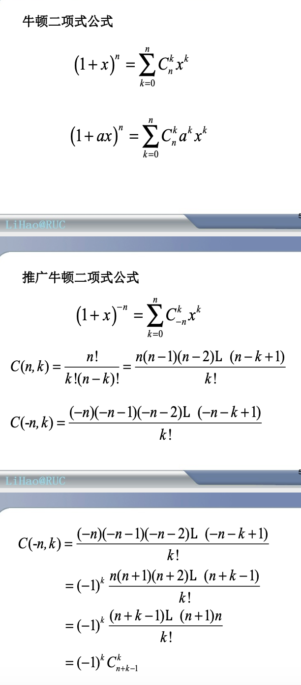
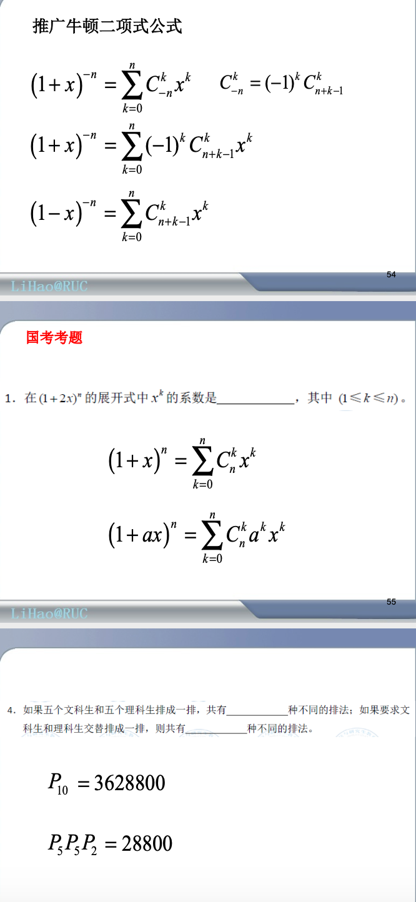

#  组合数学

## 课件内容

### 1. 排列与组合

定义1.1 从n个不同的元素中, 取r个并按次序排列, 称为从n中取r个的一个排列, 全部这样的排列数记为P(n, r).  

P(n, r) = n(n −1) ... (n − r +1) =n! / (n−r)!  

定义1.2 从n个不同的元素中, 取r个但是不考虑次序时候, 称为从n中取r个的一个组合, 全部这样的组合总数记为C(n, r).    

C(n,r) = P(n,r) / r! =n! / (r!(n − r)!)  

定义1.3 从n个不同的元素中, 取r个沿一 圆周排列, 称为从n中取r个的一个圆周 排列, 全部这样的排列数记为Q(n, r).  

Q(n,r) =  P(n,r) / r    Q(n,n) = (n-1)!

 例 由字母a,b,c,d,e,f所组成4个字母的 “单词”, 问:   
 (1) 如果每个字母在“单 词”中至多出现一次, 这样的单词个数 有多少?   
 (2)如果字母允许重复可组成 多少个单词?   

解   
(1) 每个字母在单词中至多出现一次, 其单词个数=P(6,4)=6!/(6-4)!=360.  
(2) 如果字母允许重复可组成的单词 个数为64=1296.  

 例 从{1,2,3,4,5,6,7,8,9}中选取不同的数字且 使4,5,6不相邻的7位数有多少个?(这里不相 邻是指不出现4,5,6的任意一个排列)  

 解   
 先算4,5,6相邻的7位数的个数. 7位数中的7 位数字, 除4,5,6外还有4位数字,应该从 {1,2,3,7,8,9}中选取, 可以有P(6,4)种选取方式.       

由于4,5,6的全排列数=3!=6, 因此4,5,6相 邻的7位数的个数=6×5×P(6,4)=10800. 这样4,5,6不相邻的7位数的个数为:
N=P(9,7)- 6×5×P(6,4) =181440-10800 =17064.  

例 5对夫妻参加一宴会，围一圆桌坐 下，要求每对夫妻相邻，问有多少种 方案?  

解 先让5位先生先围圆桌坐下，排列数 为4!，再让5位妻子坐下，并满足夫 妻相邻的要求，每位妻子有2种选择， 故满足要求的方案数为
254!.  

**二项式公式**  

### 2. 排列组合的生成算法

组合数学的主要问题:  
(1) 存在:满足一定条件配置的存在性.   
(2) 计数:计算出满足条件配置的数目.  
(3) 算法:构造所有配置的算法.   
(4) 优化:优化算法.  

#### 2.1. 排列生成算法
排列生成有几种典型算法, 这些算法都很有成效. 它们在实际中具有广泛应用价值.  
1.  序数法  
2.  字典序法  
3.  邻位互换法(Johnson-Trotter)   
4.  轮转法

### 3. 可重组合与组合恒等式

允许重复的排列--- 多重集的排列 
多重集—元素可以多次出现的集合， 即元素可以重复。我们把某个元素ai出 现的次数ni(ni=0,1,2,...)叫做该元素的 重复数，通常把含有k种不同元素的多 重集S记作{n ⋅a ,n ⋅a ,...,n ⋅a }   

可重排列
定义 从一个多重集{n1 ⋅a1 ,n2 ⋅a2 ,...,nk ⋅ak } 
中有序选取的r个元素叫做S的一个 r-(可重)排列。当 r = n(n = n1 + n2 + ... + nk ) 时也叫做S的一个排列.  

定理设多重集 S={∞⋅a1,∞⋅a2,...,∞⋅ak} ,则r-(可重)排列数是 k^r  

定理:设S={n1⋅a1,n2⋅a2,...,nk⋅ak},且n=∑k ni,则S的排列数等于 n!/ ( n1!⋅ n2!⋅ . . . ⋅ nk!)  

例 求有4个数位的二进制数的个数   

解:问题相当于多重集{∞⋅0,∞⋅1}的4-排列问题，故其个数为N=2^4 =16    

例 用两面红旗，三面⻩旗依次悬挂在一根旗杆上，问可以组成多少种不同的标志?  
解:所求的标志数是多重集{2红旗，3⻩旗}的排列 数，故N=5!/(2!*3!)=10  

>允许重复的组合----可重组合   

允许重复(可重)的组合是指从S ={1,2,...n} 中取r个元素a1,a2,...,ar ,允许重复，即允许
ai = aj ,i ≠ j.允许重复的组合个数记作C(n,r)  

定理 从S ={1,2,...n} 中取r个作可重的组合， 其个数为C(n+r-1,r)  

>不相邻的组合  

不相邻的组合是指从序列{1,2,...,n}中取r 个，不允许重复且不存在i,i+1两个相邻的 数同时出现于一个组合中的组合  
定理  从A={1,2,...,n}中取r个作不相邻的组合，其个数为C(n-r+1,r)  

>若干组合等式  

(1) C(n,r)=C(n,n-r)  

(2) C(n,k)=C(n-1,k)+C(n-1,k-1)   

(3) C(n,r)=C(n-1,r)+C(n-1,r-1) 

(4) C(n+r+1,r)= C(n+r,r)+C(n+r-1,r-1)+C(n+r-2,r-2)+...+ C(n+1,1)+C(n,0).  

