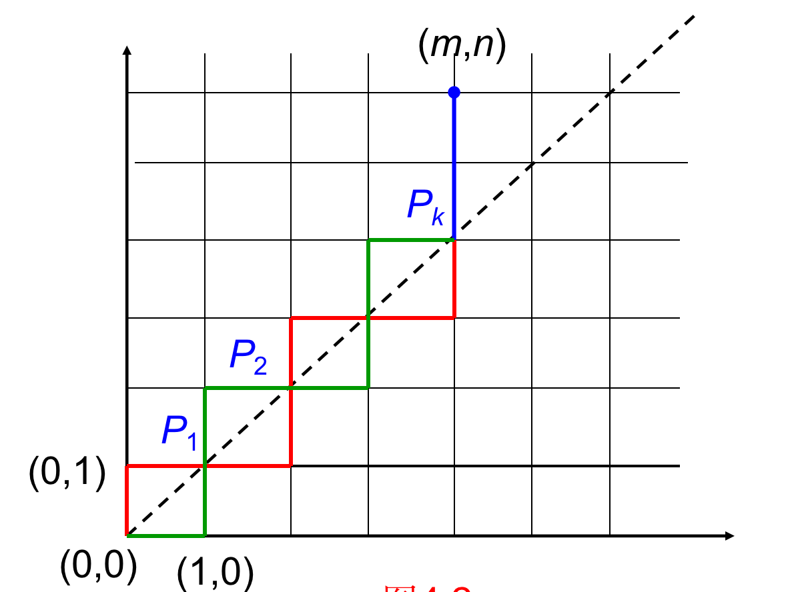
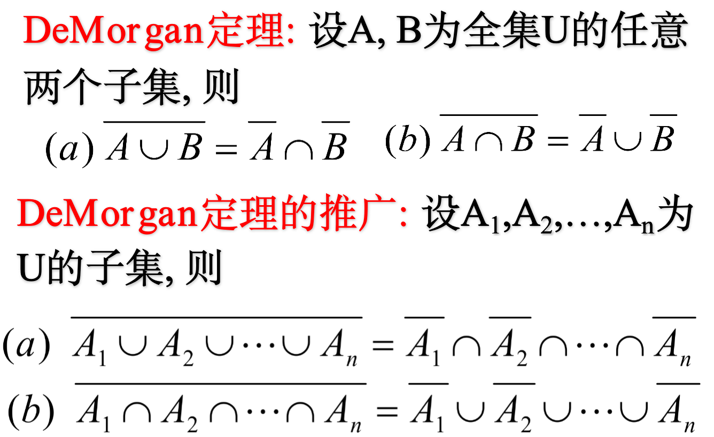
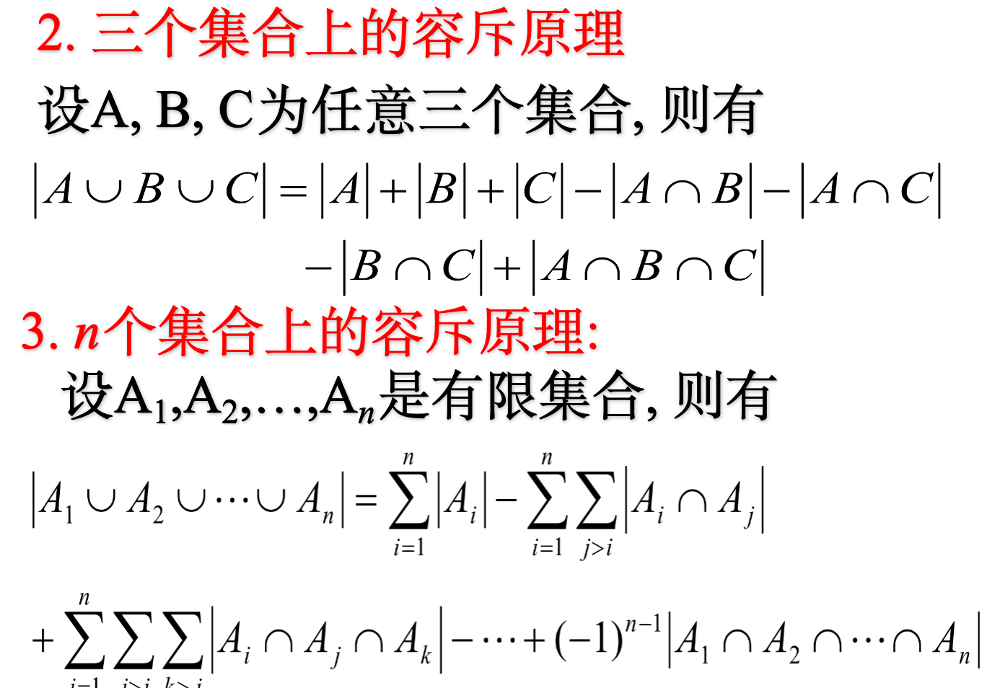
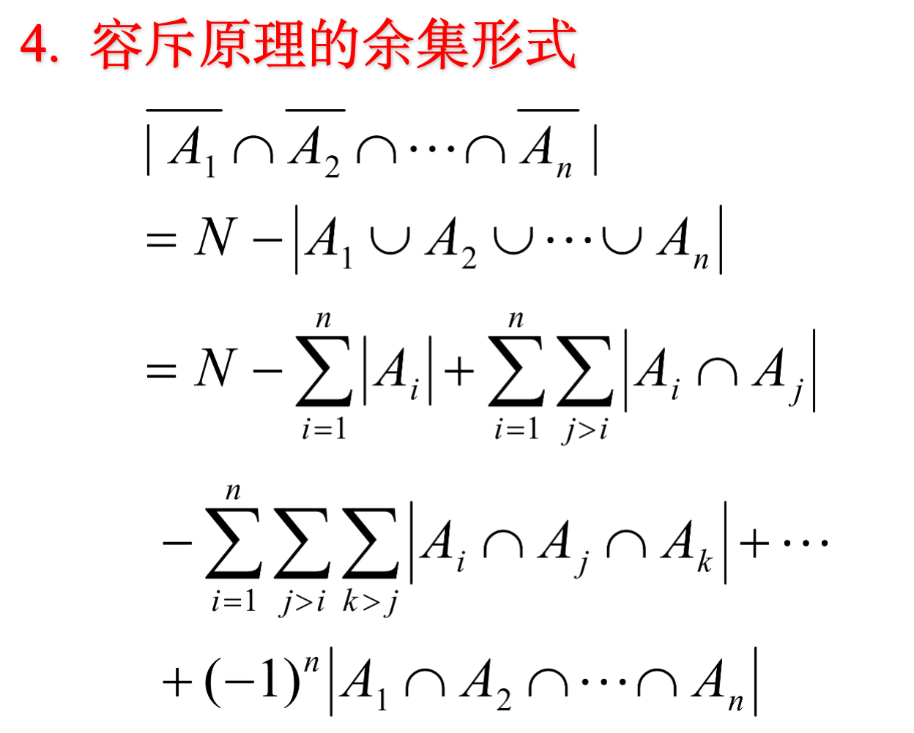
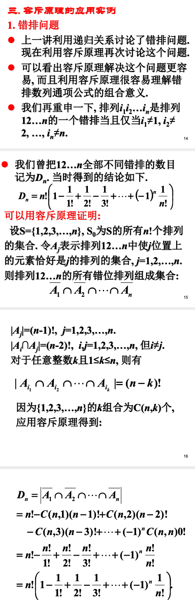
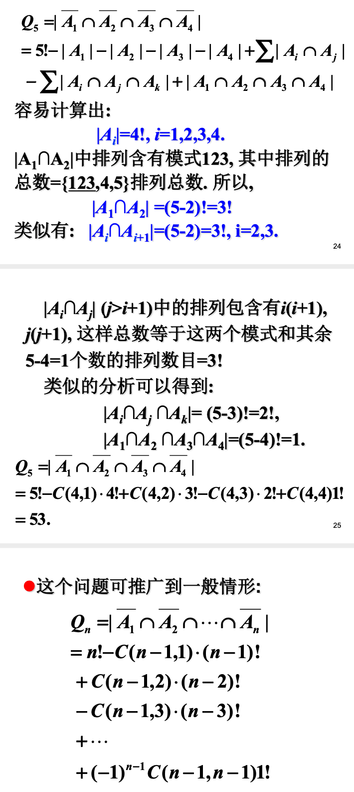

#  组合数学

## 课件内容

### 1. 排列与组合

定义1.1 从n个不同的元素中, 取r个并按次序排列, 称为从n中取r个的一个排列, 全部这样的排列数记为P(n, r).  

P(n, r) = n(n −1) ... (n − r +1) =n! / (n−r)!  

定义1.2 从n个不同的元素中, 取r个但是不考虑次序时候, 称为从n中取r个的一个组合, 全部这样的组合总数记为C(n, r).    

C(n,r) = P(n,r) / r! =n! / (r!(n − r)!)  

定义1.3 从n个不同的元素中, 取r个沿一 圆周排列, 称为从n中取r个的一个圆周 排列, 全部这样的排列数记为Q(n, r).  

Q(n,r) =  P(n,r) / r    Q(n,n) = (n-1)!

 例 由字母a,b,c,d,e,f所组成4个字母的 “单词”, 问:   
 (1) 如果每个字母在“单 词”中至多出现一次, 这样的单词个数 有多少?   
 (2)如果字母允许重复可组成 多少个单词?   

解   
(1) 每个字母在单词中至多出现一次, 其单词个数=P(6,4)=6!/(6-4)!=360.  
(2) 如果字母允许重复可组成的单词 个数为64=1296.  

 例 从{1,2,3,4,5,6,7,8,9}中选取不同的数字且 使4,5,6不相邻的7位数有多少个?(这里不相 邻是指不出现4,5,6的任意一个排列)  

 解   
 先算4,5,6相邻的7位数的个数. 7位数中的7 位数字, 除4,5,6外还有4位数字,应该从 {1,2,3,7,8,9}中选取, 可以有P(6,4)种选取方式.       

由于4,5,6的全排列数=3!=6, 因此4,5,6相 邻的7位数的个数=6×5×P(6,4)=10800. 这样4,5,6不相邻的7位数的个数为:
N=P(9,7)- 6×5×P(6,4) =181440-10800 =17064.  

例 5对夫妻参加一宴会，围一圆桌坐 下，要求每对夫妻相邻，问有多少种 方案?  

解 先让5位先生先围圆桌坐下，排列数 为4!，再让5位妻子坐下，并满足夫 妻相邻的要求，每位妻子有2种选择， 故满足要求的方案数为
254!.  

**二项式公式**  

### 2. 排列组合的生成算法

组合数学的主要问题:  
(1) 存在:满足一定条件配置的存在性.   
(2) 计数:计算出满足条件配置的数目.  
(3) 算法:构造所有配置的算法.   
(4) 优化:优化算法.  

#### 2.1. 排列生成算法
排列生成有几种典型算法, 这些算法都很有成效. 它们在实际中具有广泛应用价值.  
1.  序数法  
2.  字典序法  
3.  邻位互换法(Johnson-Trotter)   
4.  轮转法

### 3. 可重组合与组合恒等式

允许重复的排列--- 多重集的排列 
多重集—元素可以多次出现的集合， 即元素可以重复。我们把某个元素ai出 现的次数ni(ni=0,1,2,...)叫做该元素的 重复数，通常把含有k种不同元素的多 重集S记作{n ⋅a ,n ⋅a ,...,n ⋅a }   

可重排列
定义 从一个多重集{n1 ⋅a1 ,n2 ⋅a2 ,...,nk ⋅ak } 
中有序选取的r个元素叫做S的一个 r-(可重)排列。当 r = n(n = n1 + n2 + ... + nk ) 时也叫做S的一个排列.  

定理设多重集 S={∞⋅a1,∞⋅a2,...,∞⋅ak} ,则r-(可重)排列数是 k^r  

定理:设S={n1⋅a1,n2⋅a2,...,nk⋅ak},且n=∑k ni,则S的排列数等于 n!/ ( n1!⋅ n2!⋅ . . . ⋅ nk!)  

例 求有4个数位的二进制数的个数   

解:问题相当于多重集{∞⋅0,∞⋅1}的4-排列问题，故其个数为N=2^4 =16    

例 用两面红旗，三面⻩旗依次悬挂在一根旗杆上，问可以组成多少种不同的标志?  
解:所求的标志数是多重集{2红旗，3⻩旗}的排列 数，故N=5!/(2!*3!)=10  

>允许重复的组合----可重组合   

允许重复(可重)的组合是指从S ={1,2,...n} 中取r个元素a1,a2,...,ar ,允许重复，即允许
ai = aj ,i ≠ j.允许重复的组合个数记作C(n,r)  

定理 从S ={1,2,...n} 中取r个作可重的组合， 其个数为C(n+r-1,r)  

>不相邻的组合  

不相邻的组合是指从序列{1,2,...,n}中取r 个，不允许重复且不存在i,i+1两个相邻的 数同时出现于一个组合中的组合  
定理  从A={1,2,...,n}中取r个作不相邻的组合，其个数为C(n-r+1,r)  

>若干组合等式  

(1) C(n,r)=C(n,n-r)  

(2) C(n,k)=C(n-1,k)+C(n-1,k-1)   

(3) C(n,r)=C(n-1,r)+C(n-1,r-1) 

(4) C(n+r+1,r)= C(n+r,r)+C(n+r-1,r-1)+C(n+r-2,r-2)+...+ C(n+1,1)+C(n,0).  

(5) C(m,0)+C(m,1)+…+C(m,m)=2m.  
(x+y)m=xm+C(m,1)xm-1y+C(m,2) xm-2y2+…+ym  

(6) C(n,0)-C(n,1)+C(n,2)-…+(-1)^nC(n,n)=0.     

(7) C(m+n,r)=C(m,0)C(n,r)+C(m,1)C(n,r-1)+…+ C(m,r)C(n,0) ,  r<min(m,n).   

(8) C(m+n,m) =C(m,0)C(n,0)+ C(m,1)C(n,1)+…+ C(m,m)C(n,m), m=<n.

例1 设某地的街道把城市分割成矩形方格, 每个方格称为块. 某甲从家里出发上班, 向东要走m块, 向北要走n块. 问某甲上班的路径有多少种?

某甲上班路径数等于从原点到 (m, n)点的总路径数:C(m+n,m) = C(m+n,n)

例2 从(0,0)点到达(m,n)点, 其中m<n. 要求中间所经过的路径上的点(a,b)恒满足a<b, 问有多少不同的路径  

解 与例1不同, 现在要求路径不经过y=x上的点. 这样, 从(0,0)点第1步必须到(0,1)点, 而不允许到(1,0)点.   

问题也可以提为: 求从(0,1)点到(m,n)点并且所经过的点(a,b)均满足条件a<b的路径数.   
由于m<n, 显然从(1,0)点到(m,n)点的每一条路径, 必然穿过y=x上的点.   
从(0,0)到(m,n)的路径可以分成两类:  
  第一类: 经过(1,0)点. 这类路径至少要穿过一次y=x上的点.  
  第二类: 经过(0,1)点. 这类路径可以分成两部分.  

第一部分: 不经过y=x上任何的点. 这正是题目中要求的路径.   
第二部分:  至少经过一次y=x上的点.  
下面我们说明:  第一类路径数目正好等于第二类中第二部分的路径数目.   
这可以通过建立起从(1,0)到(m,n)点的路径与从(0,1)到(m,n)点但经过y=x线上点的路径间之间一一对应关系来加以证明.  
 
设从(1,0)到(m,n)点的某一路径与y=x的交点从左到右依次为P1,P2, …, Pk.   
可以如下构造出(0,1)到(m,n)的一条路径, 而且经过y=x上的点同样的点P1,P2, ….,Pk.   
构造方法: 把该路径(0,0)到Pk点之间部分的路径对y=x取对称. 如图: 绿线是过(1,0)的一条路径, 红线是通过对y=x取对称所得的从(0,0) 经过(0,1)并经过y=x上的点同样的点P1,P2, …,Pk的路径.  

 

这样建立了从(1,0)点到(m,n)点的一条路径与从(0,1)到(m,n)点且过y=x上点的路径之间的一一对应关系.   
利用以上结论, 可以用两种方式得到题目中要求的路径数目N:  
N=从(0,0)点到(m,n)点的总路径数 - 2×从(1,0)点到(m,n)点的路径数  
     N=C(m+n,m)-2C(m+n-1,m-1)=C(m+n-1, m)-C(m+n-1,m-1).  

     N=从(0,1)点到(m,n)点的路径数- 从(1,0)点到(m,n)点的路径数  
     N=C(m+n-1, m)-C(m+n-1,m-1).    

例3 音乐会票价为50元一张, 排队买票的顾客中有n位持50元的钞票, m位持100元的钞票. 售票处没有50元的零钱. 问有多少种排队的办法使购票能顺利进行, 不出现找不出钱的状态, 假定每位顾客只买一张票, 而且m≥n.  

分析: 可以用m+n维0, 1向量来表示一种排队状态, 令该向量为: (a1,a2,…, am+n), 其中ai=0 或1, i=1,2,…,m+n.   
 ai=0表示第i个顾客持50元的票款；    
 ai=1表示第i个顾客持100元的票款.   

这样的向量有n个0元素, m个1元素, 共有C(m+n, m)个.   
可以建立(m+n)维0,1向量与从(0,0)点到达(m,n)点路径间一一对应: 从(0,0)点出发, 第i步: 若ai=0沿x轴方向走一个单位, 若ai=1沿y轴方向走一个单位, i=1,…,m+n.  
要保证顾客能顺利地买到票相当于要求路径上各点(x,y)必须满足y≥x.  

我们的问题相当于求从(0,0)点到(m,n)点的路径中, 不穿越过y=x线上点的路径数(可以经过), 即需求出路径上各点(x,y)满足条件 x≥y的路径数.  
这个问题与例2的问题不一样, 那里不允许经过y=x上点. 现在可以经过, 但不许穿过y=x这条直线是的点.   
但是我们可以把这个问题转化为例2中的情况来加以解决. 实际上相当于进行一个坐标变换.  

满足要求的路径一定不会经过(0,1)点.  
可以建立一个新坐标系: 原点在(-1,0), 这样我们原来(m,n)点在新坐标系里面的坐标就成了(m,n+1), 自然n+1>m. 
从新坐标系原点出发到达(m,n+1)点的路径, 如果所经过的点(a,b)满足a>b, 则(0,1)点后的路径正好是满足条件的路径.  
所以只需求出(0,0)到(m,n+1)不经过y=x上点的路径数.  

 

这样变换之后, n+1相当于例2中的n, 而m则相当于其中的m. 由此我们知道所要求的路径数目N如下:

N = (m+n)!/((n+1)!m!)(n+1-m) 

#### 国考题

1. 由3个a，1个b，2个c这六个元素组成的不同排列的总数是  

6！/（3！1！2！）= 60   

2. 把4个相异的球放到3个相异的盒子里，使得不出现空盒，有多少种不同的放法。

C13*C42*P2 = 36  

3. 把6个相同的球放到3个同学手里，允许有的同学未分配到球的情况出现，则有多少种不同的分法

C82 = 28  

### 4.  母函数与递归关系

母函数定义  
定义  利用给定序列a0,a1,a2,…所构造的函数F(x)= a0+a1x+a2x2+…称为序列a0, a1, a2,…的母函数.   
母函数定义中的级数是形式幂级数, 不必关心收敛性, x只是一个形式变量.  
有限序列 a0, a1,…, an也可以定义它的母函数. (后面添加0)  

母函数的运算  
设序列{ai}的母函数A(x)=Σaixi, {bi}的母函数为B(x)= Σbixi. 运算定义如下:  
(1) 相等:A(x)=B(x) <=>{ai}={bi} <=>ai= bi,   i=1,2,…  
(2) 相加:  A(x)+B(x)=Σ (ai+bi) xi  
(3) 相减:  A(x)-B(x)=Σ (ai-bi) xi   
(4) 数乘:  cA(x)=Σ (cai) xi   
(5) 相乘:  A(x)B(x)=Σcixi, 其中  
      c0=a0b0,  
      c1=a0b1+a1b0,  
      c2=a0b2+a1b1+a2b0, ………….,  
      cr=a0br+a1br-1+…+arb0, ………….  
(6) 逆: 如果A(x)B(x)=1, 则称B(x)为A(x)的逆, 记为B(x)=A-1(x) =1/A(x).(显然两者互为逆.)  

思考题: A(x)可逆的条件是什么?  
注意到以上所列的这些运算公式是定义, 是不能够证明的. 这样定义的合理性, 需要代数系统的观点.   
可以证明按照上述定义, 所有形式幂级数全体够成一个交换环, 而过去我们熟悉的在一个给定域上收敛的幂级数的全体做成这个环的一个子环.   

用母函数方法解计数问题  
为了求|An|=an，分两步：  
由An的组合意义，求出an的母函数f(x);  
母函数f(x)展开，求出an的表达式。  

### 5.  常系数递归关系

### 6.  整数拆分与指数型母函数

### 7.  容斥原理与鸽笼原理

1. 两个集合的容斥原理    
设A和B是分别具有性质P1和P2的元素的集合, 则 ｜AUB｜ = ｜A|+|B|-|AnB|  

例 求1到500之间能被5或7整除的正整数个数.   
解 设A为被5整除的整数集合, B为被7整除的整数集合, 用[x]表示x的整数部分, 则有  

|A| = [500/5] =100  
|B| = [500/7] =71  

同时被5和7整除的整数个数  

|AnB| = [500/(5*7)] = 14  

故能被5或7整除的整数个数  ｜AUB｜ = ｜A|+|B|-|AnB| = 100 + 71 - 14 = 157  

例子：把6个不同的球放入3个不同的盒子，且不允许空盒.有多少种方法？  

3^6 - (2^6 + 2^6 + 2^6) + (1+1+1) - 0 = 540

例 小王要为公司审阅7本书，于是他雇了7个人来审阅它们。他希望每本书有两个审阅者，于是在第一个星期，他给每人一本书来审阅，接着在第二个星期开始重新分配。一共有多少种方式可以完成这两次分配，使得每本书有两个不同的审阅者？  

(7!)^2(1-1+(1/2!)-(1/3!)+...+(1/7!))  

2. 有限制的排列  
所谓有限制的排列, 顾名思义, 就是对排列加上某种或某些限制.   
例 求字母a,b,c,d,e,f和g具有下列性质的排列个数：在这些排列中, 模式ace和df都不出现.   
解 设A1, A2分别为出现模式ace和模式df的排列的集合, 则有  
    |A1|=5!  (=ace, A1为, b,d,f,g的排列);   
    |A2|=6! (= df,  A2为, a,b,c,e,g的排列);  

|A1∩A2|=4!   
(A1∩A2为 , , b, g的全部排列).  
由容斥原理, 模式ace和模式df都不出现的排列个数为:  

7!-|A1|-|A2|+|A1nA2| = 7!-5!-6!+4! = 4224  

 3. 相对禁位排列  
在错排问题中,每个元素不许出现在原来的位置, 这是一种绝对的禁位排列. 还有一类是相对禁位排列.  
例 有5个学生每天要排成一列去散步. 除第一个学生之外, 每个学生前面都有一个学生. 每天都是同一个人在自己前面走显得单调,第2天他们决定改变排队次序, 使得每个同学前面的人与第1天不同. 问有多少种不同的排队方式?  

分析: 如果把第1天排队的同学按次序编号为1,2,3,4,5. 我们所要求的排列为其中不出现模式12, 23, 34, 45的全部排列. 31425是一个符合要求的排列, 而25341不符合要求. 因为出现的34模式.   
这个问题可以利用容斥原理来解决.  
设Ai表示出现i(i+1)模式的全体排列, i=1,2,3,4. 符合要求的排列是这些模式都不出现. 用Q5来表示符合要求的排列总数.   

    

