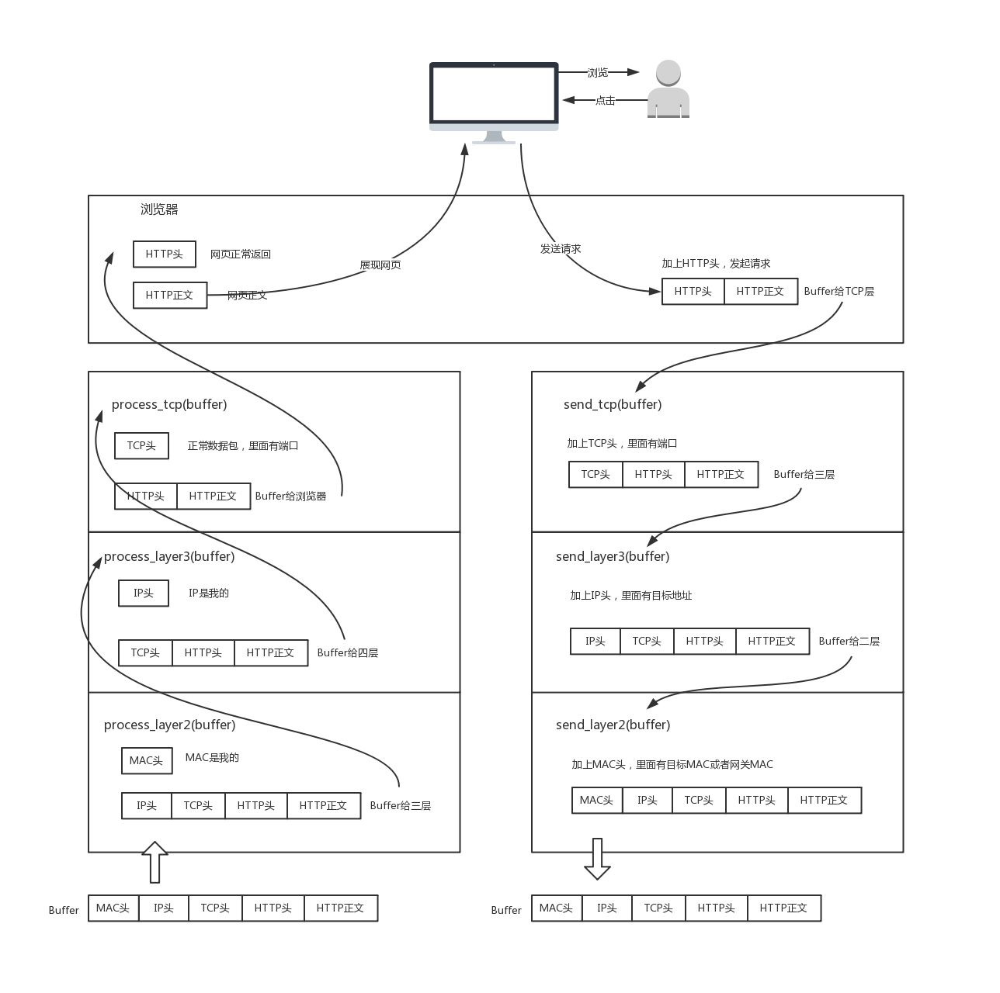

# 网络协议

- [网络协议](#网络协议)
  - [1. 网络分层](#1-网络分层)
  - [2. 物理层](#2-物理层)
    - [2.1. 物理层的基本概念](#21-物理层的基本概念)
    - [2.2. 数据通信的基础知识](#22-数据通信的基础知识)
    - [2.3. 物理层下面的传输媒体](#23-物理层下面的传输媒体)
    - [2.4. 信道复用技术](#24-信道复用技术)
    - [2.5. 物理层设备](#25-物理层设备)
  - [3. 数据链路层](#3-数据链路层)
    - [3.1 使用点对点信道的数据链路层](#31-使用点对点信道的数据链路层)
    - [3.2. 点对点协议 PPP](#32-点对点协议-ppp)
    - [3.3. 使用广播信道的数据链路层](#33-使用广播信道的数据链路层)
    - [3.4. 扩展的局域网](#34-扩展的局域网)
  - [4. 网络层](#4-网络层)
    - [4.1. 网际协议IP](#41-网际协议ip)
    - [4.2. 分类的 IP 地址](#42-分类的-ip-地址)
      - [特殊地址](#特殊地址)
    - [4.3. 划分子网](#43-划分子网)
    - [4.4. 网际控制报文协议ICMP](#44-网际控制报文协议icmp)
    - [4.5. 因特网的路由选择协议](#45-因特网的路由选择协议)
    - [4.6. IP 多播](#46-ip-多播)
    - [4.7. 虚拟专用网 VPN 和网络地址转换 NAT](#47-虚拟专用网-vpn-和网络地址转换-nat)
    - [4.8. IPv6](#48-ipv6)
  - [5. 运输层](#5-运输层)
    - [用户数据报协议 UDP](#用户数据报协议-udp)
    - [面向报文的 UDP](#面向报文的-udp)
    - [传输控制协议 TCP](#传输控制协议-tcp)
    - [自动重传请求ARQ (Automatic Repeat reQuest)](#自动重传请求arq-automatic-repeat-request)
    - [信道利用率](#信道利用率)
    - [连续 ARQ 协议](#连续-arq-协议)
      - [累积确认](#累积确认)
      - [Go-back-N（回退 N）](#go-back-n回退-n)
      - [TCP 可靠通信的具体实现](#tcp-可靠通信的具体实现)
      - [需要强调三点](#需要强调三点)
    - [超时重传时间的选择](#超时重传时间的选择)
      - [选择确认 SACK(Selective ACK)](#选择确认-sackselective-ack)
    - [TCP 的流量控制](#tcp-的流量控制)
      - [利用滑动窗口实现流量控制](#利用滑动窗口实现流量控制)
    - [TCP的拥塞控制](#tcp的拥塞控制)
      - [拥塞控制与流量控制的关系](#拥塞控制与流量控制的关系)
      - [几种拥塞控制方法](#几种拥塞控制方法)
        - [慢开始和拥塞避免](#慢开始和拥塞避免)
        - [慢开始算法的原理](#慢开始算法的原理)
        - [传输轮次(transmission round)](#传输轮次transmission-round)
        - [设置慢开始门限状态变量ssthresh](#设置慢开始门限状态变量ssthresh)
      - [乘法减小(multiplicative decrease)](#乘法减小multiplicative-decrease)
      - [加法增大(additive increase)](#加法增大additive-increase)
      - [快重传和快恢复](#快重传和快恢复)
      - [快恢复算法](#快恢复算法)
  - [应用层](#应用层)
    - [DNS](#dns)
      - [域名的解析过程](#域名的解析过程)
      - [名字的高速缓存](#名字的高速缓存)
    - [文件传送协议 FTP](#文件传送协议-ftp)
      - [FTP 的基本工作原理](#ftp-的基本工作原理)
      - [主进程的工作步骤如下](#主进程的工作步骤如下)
    - [远程终端协议 TELNET](#远程终端协议-telnet)
    - [电子邮件](#电子邮件)
    - [协议配置](#协议配置)
      - [动态主机配置协议 DHCP(Dynamic Host Configuration Protocol)](#动态主机配置协议-dhcpdynamic-host-configuration-protocol)
      - [简单网络管理协议 SNMP](#简单网络管理协议-snmp)
  - [网络安全](#网络安全)
  - [名词解释](#名词解释)
    - [1. 数据链路层](#1-数据链路层)
    - [2. 网络层](#2-网络层)
    - [3. 传输层](#3-传输层)
    - [4. 应用层](#4-应用层)
  - [计算题](#计算题)
  - [2. 国考题](#2-国考题)
    - [2.1. 2003 年网络](#21-2003-年网络)
    - [2.2. 2004 年网络](#22-2004-年网络)
    - [2.3. 2005 年网络](#23-2005-年网络)
    - [2.4. 2006 年网络](#24-2006-年网络)
    - [2.5. 2007 年网络](#25-2007-年网络)
    - [2.6. 2008 年网络](#26-2008-年网络)
    - [2.7. 2009 年网络](#27-2009-年网络)
    - [2.8. 2010 年网络](#28-2010-年网络)
    - [2.9. 2011 年网络](#29-2011-年网络)
    - [2.10. 2012 年网络](#210-2012-年网络)
    - [2.11. 2013 年网络](#211-2013-年网络)
    - [2.12. 2014 年网络](#212-2014-年网络)

## 1. 网络分层

五层协议的体系结构  

1. 应用层: 支持网络应用 ftp, smtp, http
2. 传输层: 主机进程间的数据传递 tcp, udp
3. 网络层: 将数据报从信源传递到信宿 ip, 路由选择协议
4. 链路层: 数据在网络上的相邻结点间的传输 ppp, ethernet
5. 物理层: 信道上传送的位流

## 2. 物理层

### 2.1. 物理层的基本概念

物理层的主要任务描述为确定与传输媒体的接口的一些特性，即：  
**机械特性**   指明接口所用接线器的形状和尺寸、引线数目和排列、固定和锁定装置等等。  
**电气特性**   指明在接口电缆的各条线上出现的电压的范围。  
**功能特性**   指明某条线上出现的某一电平的电压表示何种意义。  
**过程特性**   指明对于不同功能的各种可能事件的出现顺序。  

### 2.2. 数据通信的基础知识

几个术语  

数据(data)——运送消息的实体。  
信号(signal)——数据的电气的或电磁的表现。  
“模拟的”(analogous)——代表消息的参数的取值是连续的。  
“数字的”(digital)——代表消息的参数的取值是离散的。  
码元(code)——在使用时间域（或简称为时域）的波形表示数字信号时，代表不同离散数值的基本波形。  

有关信号的几个基本概念  

单向通信（单工通信）——只能有一个方向的通信而没有反方向的交互。  
双向交替通信（半双工通信）——通信的双方都可以发送信息，但不能双方同时发送(当然也就不能同时接收)。  
双向同时通信（全双工通信）——通信的双方可以同时发送和接收信息。  

基带信号（即基本频带信号）——来自信源的信号。像计算机输出的代表各种文字或图像文件的数据信号都属于基带信号。  
基带信号往往包含有较多的低频成分，甚至有直流成分，而许多信道并不能传输这种低频分量或直流分量。因此必须对基带信号进行调制(modulation)。  
通带信号——把基带信号经过载波调制后，把信号的频率范围搬移到较高的频段以便在信道中传输（即仅在一段频率范围内能够通过信道）。  

基带信号(baseband)就是将数字信号 1 或 0 直接用两种不同的电压来表示，然后送到线路上去传输。  
宽带信号(broadband)则是将基带信号进行调制后形成的频分复用模拟信号。  
通带信号(passband)被搬移到某个更大频率范围的信号。  

几种最基本的调制方法  
  
基带信号往往包含有较多的低频成分，甚至有直流成分，而许多信道并不能传输这种低频分量或直流分量。为了解决这一问题，就必须对基带信号进行调制(modulation)。  
最基本的二元制调制方法有以下几种：  
调幅(AM)：载波的振幅随基带数字信号而变化。  
调频(FM)：载波的频率随基带数字信号而变化。  
调相(PM) ：载波的初始相位随基带数字信号而变化。  

所谓调制就是进行波形变换。或者更严格地讲，是进行频谱变换，将基带数字信号的频谱变换成为适合于在模拟信道中传输的频谱。最基本的调制方法有以下几种：  
(1)调幅(AM) 即载波的振幅随基带数字信号而变化。例如，0对应于无载波输出，而1对应于有载波输出。  
(2)调频(FM) 即载波的频率随基带数字信号而变化。例如，0对应于频率f1，而1对应于频率f2。  
(3)调相(PM) 即载波的初始相位随基带数字信号而变化。例如，0对应于相位0o，而1对应于180o。  

根据载波的三个特性：幅度、频率、相位，产生常用的三种调制技术：  
幅移键控法 Amplitude-shift keying (ASK)  
频移键控法 Frequency-shift keying (FSK)  
相移键控法 Phase-shift keying (PSK)  

调制解调器的速率  

目前调制解调器的信息传输速率已很接近于香农的信道容量极限了。  
要提高信息传输速率，只能设法提高信噪比。  
在电话的用户线上，最大的噪声来自模拟到数字的模数转换所带来的量化噪声。  

调制解调器使用异步通信方式  

数据通信可分为同步通信和异步通信两大类：  
同步通信要求接收端时钟频率和发送端时钟频率一致。发送端发送连续的比特流。  
异步通信时不要求接收端时钟和发送端时钟同步。发送端发送完一个字节后，可经过任意长的时间间隔再发送下一个字节。  
异步通信的通信开销较大，但接收端可使用廉价的、具有一般精度的时钟来进行数据通信。  

数字传输系统  

现在的数字传输系统均采用脉码调制 PCM (Pulse Code Modulation)体制。  
PCM最初并不是为传送计算机数据用的。它是为了使电话局之间一条中继线不是只传送一路电话而是可以传送几十路的电话。由于历史上的原因，PCM有两个互不兼容的国际标准，即北美的24路PCM(简称为T1)和欧洲的30路PCM(简称为E1)。  
T1的速率是1.544 Mb/s，E1的速率是2.048 Mb/s。  

脉码调制PCM  
  
为了将模拟电话信号转变为数字信号，必须先对电话信号进行取样。根据取样定理，只要：取样频率不低于电话信号最高频率的2倍，就可以从取样脉冲信号无失真地恢复出原来的电话信号。标准的电话信号的最高频率为3.4kHz，为方便起见，取样频率就定为8kHz，相当于取样周期为125 s。  

PCM的基本原理  

T为取样周期。连续的电话信号经取样后成为如图中(a)所示的离散脉冲信号，其振幅对应于取样时刻电话信号的数值。  
下一步就是编码。为简单起见,图(c)将不同振幅的脉冲编为4位二进制码元。在我国使用的PCM体制中，电话信号是采用8 bit编码,也就是说,将取样后的模拟的电话信号量化为256个不同等级中的一个。模拟信号转换为数字信号后就进行传输。  
在接收端进行解码的过程与编码过程相反。经滤波后最后得出恢复后的模拟电话信号图中的(e)。  

这样，一个话路的模拟电话信号，经模数变换后，就变成为每秒8000个脉冲信号，每个脉冲信号再编为8位二进制码元。因此一个标准话路的PCM信号速率为64 kb/s。  
以kb/s的速率是最早制订出的话音编码的标准速率。  
随着话音编码技术的不断发展，人们可以用更低的数据率来传送同样质量的话音信号。现在已经能够用32kb/s，16kb/s或甚至低到8kb/s(或更低)的数据率来传送一路话音信号。  

时分复用

为了有效地利用传输线路，可将多个话路的PCM 信号用时分复用 TDM (Time Division Multiplexing)的方法装成时分复用帧，然后发送到线路上。  
中国采用欧洲体制，以 E1 为一次群。  
美国和日本等国采用北美体制，以 T1 为一次群。  

E1的一个时分复用帧(其长度T＝125s)共划分为32相等的时隙，时隙的编号为CH0-CH31。时隙CH0用作帧同步用，时隙CH16用来传送信令(如用户的拨号信令)。可供用户使用的话路是时隙CH1-CH15和CH17-CH31，共30个时隙用作30个话路。每个时隙共传送8 bit。因此整个的32个时隙共用256bit。每秒传送8000个帧，因此PCM一次群E1的数据率就是2.048Mb/s。  
北美使用的T1系统共有24个话路。每个话路的取样脉冲用7bit编码，然后再加上1位信令码元，因此一个话路也是占用8bit。帧同步码是在24路的编码之后加上1bit，这样每帧共有193bit。因此T1一次群的数据率为1.544Mb/s。  

E1 的时分复用帧  

信道的极限容量  

任何实际的信道都不是理想的，在传输信号时会产生各种失真以及带来多种干扰。  
码元(时间轴上的一个信号编码单元)传输的速率越高，或信号传输的距离越远，在信道的输出端的波形的失真就越严重。  

数字信号通过实际的信道  

1924年，尼奎斯特（H. Nyquist）推导出理想低通信道的最高码元传输速率 = 2H Baud  

每赫带宽的理想低通信道的最高码元传输速率是每秒 2  个码元。  
Baud 是波特，是码元传输速率的单位，1 波特为每秒传送 1 个码元。  

实际的信道所能传输的最高码元速率，要明显地低于尼氏准则给出上限数值。  
当信号电平分为Ｖ级，尼奎斯特（H. Nyquist）无噪声有限带宽信道的最大数据传输率公式表示为：最大数据传输率 = 2Hlog2V (bps)  
这说明，任意信号通过一个带宽为Ｈ的低通滤波器，则每秒采样2Ｈ次就能完整地重现该信号。  
例如，V=2（只有两级），无噪声的3k Hz信道传输二进制最高的速率是6000 bps。  

波特(Baud)和比特(bit)是两个完全不同的概念。  
波特是码元传输的速率单位（每秒传多少个码元）。码元传输速率也称为调制速率、波形速率或符号速率。  
比特是信息量的单位。  
信息的传输速率“比特/秒”与码元的传输速率“波特”在数量上却有一定的关系。  
若1个码元只携带 1 bit 的信息量，则“比特/秒”和“波特”在数值上相等。  
若1个码元携带n bit 的信息量，则 M Baud的码元传输速率所对应的信息传输速率为M*n b/s。  

波特率（baud）和比特率（bit）的关系  

波特率：信号每秒钟变化的次数，也称调制速率。  
比特率：每秒钟传送的二进制位数。  
波特率与比特率的关系取决于信号值与比特位的关系。  
例：每个信号值可表示３位，则比特率是波特率的３倍；每个信号值可表示１位，则比特率和波特率相同。  
例如，有一个带宽为3kHz的理想低通信道，其最高码元传输速率为6000 Baud(即每秒传6000个码元)。若1个码元能携带3bit的信息量，则最高信息传输速率为18000 b/s。  

信噪比

香农(Shannon)用信息论的理论推导出了带宽受限且有高斯白噪声干扰的信道的极限、无差错的信息传输速率。  

信道的极限信息传输速率 C 可表达为 C = W log2(1+S/N)  b/s  
W 为信道的带宽（以 Hz 为单位）；  
S 为信道内所传信号的平均功率；  
N 为信道内部的高斯噪声功率。  

热噪声出现的大小用信噪比（信号功率与噪声功率之比: 用S/N或SNR表示）来衡量。  

S：信号功率，N：噪声功率  
10log10S/N, 单位：分贝（dB）  
即，人们常说的信噪比，是指10log10S/N值  

如信噪比10分贝，实际上S/N=10  
如信噪比20分贝，实际上S/N=100  
如信噪比30分贝，实际上S/N=1000  

香农公式表明  

信道的带宽或信道中的信噪比越大，则信息的极限传输速率就越高。  
只要信息传输速率低于信道的极限信息传输速率，就一定可以找到某种办法来实现无差错的传输。  
若信道带宽 W 或信噪比 S/N 没有上限（当然实际信道不可能是这样的），则信道的极限信息传输速率 C 也就没有上限。  
实际信道上能够达到的信息传输速率要比香农的极限传输速率低不少。  

### 2.3. 物理层下面的传输媒体

导引型传输媒体  

1. 双裸线  
一种最简单的传输介质，也称平行线。两根裸露在空气中的铜导线彼此隔离地并排放在一起构成图。  
串扰严重，速率低，距离短。  

2. 双绞线  
也称双扭线，由两根互相绝缘的铜导线，用规则的方法扭绞起来构成图。  
双绞线的扭绞结构是为了减少相邻导线之间的串扰和消除外界干扰。  

- 屏蔽双绞线 STP (Shielded Twisted Pair)  
- 无屏蔽双绞线 UTP (Unshielded Twisted Pair)  

3. 同轴电缆  

- 50 欧姆 同轴电缆  
- 75 欧姆 同轴电缆  

双裸线、双绞线、同轴电缆的优缺点  

- 双裸线构成的线路的串扰现象非常严重。
- 双绞线减少相邻导线间的串扰。主要缺点是存在较强的趋肤效应，随着传输速率的增加，导线中的电流趋向于在导体的外层流动，从而减少可使用的有效截面积，增大导线的电阻和信号的衰减。
- 同轴电缆由于外导体的作用，外来的电磁干扰被有效地屏蔽了，因此具有很好的扰干扰特性，并且因趋肤效应所引起的功率损失也大大减小。同时，与双绞线相比，同轴电缆具有更宽的带宽和更快的传输速率。

非导引型传输媒体  

无线传输所使用的频段很广。  
短波通信主要是靠电离层的反射，但短波信道的通信质量较差。  
微波在空间主要是直线传播。  

- 地面微波接力通信
- 卫星通信  

### 2.4. 信道复用技术

复用(multiplexing)是通信技术中的基本概念。  

> 频分复用 FDM(Frequency Division Multiplexing)

用户在分配到一定的频带后，在通信过程中自始至终都占用这个频带。  
频分复用的所有用户在同样的时间占用不同的带宽资源（请注意，这里的“带宽”是频率带宽而不是数据的发送速率）。  

> 时分复用TDM(Time Division Multiplexing)

时分复用则是将时间划分为一段段等长的时分复用帧（TDM 帧）。每一个时分复用的用户在每一个 TDM 帧中占用固定序号的时隙。  
每一个用户所占用的时隙是周期性地出现（其周期就是 TDM  帧的长度）。  
TDM 信号也称为等时(isochronous)信号。  
时分复用的所有用户是在不同的时间占用同样的频带宽度。  

时分复用可能会造成线路资源的浪费  

使用时分复用系统传送计算机数据时，由于计算机数据的突发性质，用户对分配到的子信道的利用率一般是不高的。  

> 统计时分复用 STDM(Statistic TDM)  

> 波分复用 WDM(Wavelength Division Multiplexing)  

波分复用就是光的频分复用。  

> 码分复用 CDM(Code Division Multiplexing)  

常用的名词是码分多址 CDMA (Code Division Multiple Access)。  
各用户使用经过特殊挑选的不同码型，因此彼此不会造成干扰。  
这种系统发送的信号有很强的抗干扰能力，其频谱类似于白噪声，不易被敌人发现。  
每一个比特时间划分为 m 个短的间隔，称为码片(chip)。  

> 码片序列(chip sequence)

每个站被指派一个唯一的 m bit 码片序列。  
如发送比特 1，则发送自己的 m bit 码片序列。  
如发送比特 0，则发送该码片序列的二进制反码。  
例如，S 站的 8 bit 码片序列是 00011011。  
发送比特 1 时，就发送序列 00011011，  
发送比特 0 时，就发送序列 11100100。  
S 站的码片序列：(–1 –1 –1 +1 +1 –1 +1 +1)  

码片序列的正交关系  

令向量 S 表示站 S 的码片向量，令 T 表示其他任何站的码片向量。  
两个不同站的码片序列正交，就是向量 S 和T 的规格化内积(inner product)都是 0： S * T = 0

### 2.5. 物理层设备

中继器/转发器(RP，Repeater)  
工作在物理层上的连接设备。  
适用于完全相同的两类网络的互连，主要功能是通过对数据信号的重新发送或者转发，来扩大网络传输的距离。  
中继器是对信号进行再生和还原的网络设备，用于扩展局域网网段的长度（仅用于连接相同的局域网网段）  

集线器  
主要功能是对接收到的信号进行再生整形放大，以扩大网络的传输距离，同时把所有节点集中在以它为中心的节点上。  
它工作于OSI(开放系统互联参考模型)参考模型第一层，即“物理层”。  
集线器每个接口简单的收发比特，收到1就转发1，收到0就转发0，不进行碰撞检测。  

## 3. 数据链路层

数据链路层使用的信道主要有以下两种类型：  

1. 点对点信道。这种信道使用一对一的点对点通信方式。  
2. 广播信道。这种信道使用一对多的广播通信方式，因此过程比较复杂。广播信道上连接的主机很多，因此必须使用专用的共享信道协议来协调这些主机的数据发。  

数据链路层的简单模型

### 3.1 使用点对点信道的数据链路层

数据链路和帧  

链路(link)是一条无源的点到点的物理线路段，中间没有任何其他的交换结点。  
一条链路只是一条通路的一个组成部分。  

数据链路(data link) 除了物理线路外，还必须有通信协议来控制这些数据的传输。若把实现这些协议的硬件和软件加到链路上，就构成了数据链路。  
现在最常用的方法是使用适配器（即网卡）来实现这些协议的硬件和软件。  
一般的适配器都包括了数据链路层和物理层这两层的功能。  

数据链路层传送的是帧

数据链路层像个数字管道  
常常在两个对等的数据链路层之间画出一个数字管道，而在这条数字管道上传输的数据单位是帧。  

早期的数据通信协议曾叫作通信规程(procedure)。因此在数据链路层，规程和协议是同义语。  

> 封装成帧

封装成帧(framing)就是在一段数据的前后分别添加首部和尾部，然后就构成了一个帧。确定帧的界限。  
首部和尾部的一个重要作用就是进行帧定界。  

> 透明传输

解决透明传输问题  

发送端的数据链路层在数据中出现控制字符“SOH”或“EOT”的前面插入一个转义字符“ESC”(其十六进制编码是 1B)。  
字节填充(byte stuffing)或字符填充(character stuffing)——接收端的数据链路层在将数据送往网络层之前删除插入的转义字符。  
如果转义字符也出现数据当中，那么应在转义字符前面插入一个转义字符。当接收端收到连续的两个转义字符时，就删除其中前面的一个。  

用字节填充法解决透明传输的问题  

> 错误检测和纠正

差错出现的特点：随机，连续突发（burst）  
处理差错的两种基本策略  

1. 使用纠错码：发送方在每个数据块中加入足够的冗余信息，使得接收方能够判断接收到的数据是否有错，并能纠正错误。  
2. 使用检错码：发送方在每个数据块中加入足够的冗余信息，使得接收方能够判断接收到的数据是否有错，但不能判断哪里有错。  

> 纠错码

码字（codeword）：一个帧包括m个数据位，r个校验位，n = m + r，则此n比特单元称为n位码字。  
海明距离（Hamming distance）：两个码字之间不同的比特(对应)位数目。  
例：0000000000 与0000011111的海明距离为5  
如果两个码字的海明距离为d，则需要d个单比特错就可以把一个码字转换成另一个码字；  
对于n位码字的集合，只有2m个码字是有效的。也就是说，通常并未使用所有2n个码字。  

[关于海明码的原理和计算](https://www.jianshu.com/p/54d1adc74314)

纠正码字中的单个数据位错误

在实际通信中使用纠错码好还是检错码好呢？  
例如：假设一个信道误码率是10-6，且出错是孤立产生的（即只有单比特错），数据块长度为1000比特，如果采用纠错编码，需要10个校验位（210>1011），传送1M数据需要10000个校验位；如果采用检错编码，每个数据块只需一个奇偶校验位，传送1M数据只需1000个校验位和一个重传的数据1001位，共需要2001比特的额外开销。  
在多数通信中采用检错编码，但在单工信道中需要纠错编码。  

> 改进的奇偶校验

将数据位组成一个n位宽，K位高的长方形距阵来发送，然后对每一列单独计算奇偶位，并附在最后一行作为冗余位。  

> 检错码

使用纠错码传数据，效率低，适用于不可能重传的场合；大多数情况采用检错码加重传。  
循环冗余码（CRC码，多项式编码）  
110001，表示成多项式 x^5 + x^4 + 1  
生成多项式G(x)  
发方、收方事前商定；  
生成多项式的高位和低位必须为1  
生成多项式必须比传输信息对应的多项式短。  

CRC码基本思想  
校验和（checksum）加在帧尾，使带校验和的帧的多项式能被G(x)除尽；收方接收时，用G(x)去除它，若有余数，则传输出错。  
校验和计算算法  
设G(x)为 r 阶，在帧的末尾加 r 个0，使帧为m+r位，相应多项式为xrM(x)；  
按模2除法用对应于G(x)的位串去除对应于xrM(x)的位串；  
按模2减法从对应于xrM(x)的位串中减去余数(等于或小于r位)，结果就是要传送的带校验和的多项式T(x)。  

多项式编码校验和计算示例  

CRC的检错能力  
发送：T(x)；接收：T(x) + E(x), E(x) 不等于 0；  
余数((T(x) + E(x)) / G(x)) = 0 + 余数(E(x) / G(x))  
若余数(E(x) / G(x)) = 0，则差错不能发现；否则，可以发现。  

CRC检错能力的几种情况分析  
如果只有单比特错，即E(x) = x^i，而G(x)中至少有两项，余数(E(x) / G(x)) 不等于 0，所以可以查出单比特错；  
如果发生两个孤立单比特错，即E(x) = xi + xj = xj (xi-j + 1)，假定G(x)不能被x整除，那么能够发现两个比特错的充分条件是：xk + 1不能被G(x)整除 (k =< i - j)；  
如果有奇数个比特错，即E(x)包括奇数个项，G(x)选(x + 1)的倍数就能查出奇数个比特错；  

> 帧检验序列 FCS

在数据后面添加上的冗余码称为帧检验序列 FCS (Frame Check Sequence)。  
循环冗余检验 CRC 和帧检验序列 FCS并不等同。  
CRC 是一种常用的检错方法，而 FCS 是添加在数据后面的冗余码。  
FCS 可以用 CRC 这种方法得出，但 CRC 并非用来获得 FCS 的惟一方法。  

只要得出的余数R 不为0，就表示检测到了差错。  
但这种检测方法并不能确定究竟是哪一个或哪几个比特出现了差错。  
一旦检测出差错，就丢弃这个出现差错的帧。  
只要经过严格的挑选，并使用位数足够多的除数P，那么出现检测不到的差错的概率就很小很小。  

仅用循环冗余检验 CRC 差错检测技术只能做到无差错接受(accept)。  
“无差错接受”是指：“凡是接受的帧（即不包括丢弃的帧），我们都能以非常接近于 1 的概率认为这些帧在传输过程中没有产生差错”。  
也就是说：“凡是接受的帧都没有传输差错”（有差错的帧就丢弃而不接受）。  
要做到“可靠传输”（即发送什么就收到什么）就必须再加上确认和重传机制。  

### 3.2. 点对点协议 PPP

现在全世界使用得最多的数据链路层协议是点对点协议 PPP (Point-to-Point Protocol)。  
用户使用拨号电话线接入因特网时，一般都是使用 PPP 协议。  

PPP 协议应满足的需求  

- 简单——这是首要的要求
- 封装成帧
- 透明性
- 多种网络层协议
- 多种类型链路
- 差错检测
- 检测连接状态
- 最大传送单元
- 网络层地址协商
- 数据压缩协商  

PPP 协议不需要的功能

- 纠错
- 流量控制
- 序号
- 多点线路
- 半双工或单工链路

PPP 协议有三个组成部分  

1. 一个将 IP 数据报封装到串行链路的方法。
2. 链路控制协议 LCP (Link Control Protocol)。
3. 网络控制协议 NCP (Network Control Protocol)。  

PPP 协议的帧格式  

标志字段 F = 0x7E （符号“0x”表示后面的字符是用十六进制表示。十六进制的 7E 的二进制表示是 01111110）。  
地址字段 A 只置为 0xFF。地址字段实际上并不起作用。  
控制字段 C 通常置为 0x03。  
PPP 是面向字节的，所有的 PPP 帧的长度都是整数字节。  

当 PPP 用在同步传输链路时，协议规定采用硬件来完成比特填充（和 HDLC 的做法一样）。  
当 PPP 用在异步传输时，就使用一种特殊的字符填充法。  

> 字符填充

将信息字段中出现的每一个 0x7E 字节转变成为 2 字节序列(0x7D, 0x5E)。  
若信息字段中出现一个 0x7D 的字节, 则将其转变成为 2 字节序列(0x7D, 0x5D)。  
若信息字段中出现 ASCII 码的控制字符（即数值小于 0x20 的字符），则在该字符前面要加入一个 0x7D 字节，同时将该字符的编码加以改变。  

> 零比特填充

PPP 协议用在 SONET/SDH 链路时，是使用同步传输（一连串的比特连续传送）。这时 PPP 协议采用零比特填充方法来实现透明传输。  
在发送端，只要发现有 5 个连续 1，则立即填入一个 0。接收端对帧中的比特流进行扫描。每当发现 5 个连续1时，就把这 5 个连续 1 后的一个 0 删除。  

PPP 协议之所以不使用序号和确认机制是出于以下的考虑：

- 在数据链路层出现差错的概率不大时，使用比较简单的 PPP 协议较为合理。
- 在因特网环境下，PPP 的信息字段放入的数据是 IP 数据报。数据链路层的可靠传输并不能够保证网络层的传输也是可靠的。
- 帧检验序列 FCS 字段可保证无差错接受。  

PPP 协议的工作状态  

当用户拨号接入 ISP 时，路由器的调制解调器对拨号做出确认，并建立一条物理连接。  
PC 机向路由器发送一系列的 LCP 分组（封装成多个 PPP 帧）。  
这些分组及其响应选择一些 PPP 参数，和进行网络层配置，NCP 给新接入的 PC机分配一个临时的 IP 地址，使 PC 机成为因特网上的一个主机。  
通信完毕时，NCP 释放网络层连接，收回原来分配出去的 IP 地址。接着，LCP 释放数据链路层连接。最后释放的是物理层的连接。  

### 3.3. 使用广播信道的数据链路层

> 局域网的数据链路层

局域网最主要的特点是：网络为一个单位所拥有，且地理范围和站点数目均有限。  
局域网具有如下的一些主要优点：  
具有广播功能，从一个站点可很方便地访问全网。局域网上的主机可共享连接在局域网上的各种硬件和软件资源。  
便于系统的扩展和逐渐地演变，各设备的位置可灵活调整和改变。  
提高了系统的可靠性、可用性和残存性。  

局域网的拓扑

> 数据链路层的两个子层

为了使数据链路层能更好地适应多种局域网标准，802 委员会就将局域网的数据链路层拆成两个子层：  
逻辑链路控制 LLC (Logical Link Control)子层  
媒体接入控制 MAC (Medium Access Control)子层。  
与接入到传输媒体有关的内容都放在 MAC子层，而 LLC 子层则与传输媒体无关，不管采用何种协议的局域网对 LLC 子层来说都是透明的  

> 适配器的作用  

网络接口板又称为通信适配器(adapter)或网络接口卡 NIC (Network Interface Card)，或“网卡”。  
适配器的重要功能：  
进行串行/并行转换。  
对数据进行缓存。  
在计算机的操作系统安装设备驱动程序。  
实现以太网协议。  

以太网发送的数据都使用曼彻斯特(Manchester)编码  

曼彻斯特编码中，每一位的中间有一跳变，位中间的跳变既作时钟信号，又作数据信号；从高到低跳变表示" 1"，从低到高跳变表示" 0"。  
差分曼彻斯特编码，每位中间的跳变仅提供时钟定时，而用每位开始时有无跳变表示"0"或"1"，有跳变为"0"，无跳变为"1"。  
两种曼彻斯特编码是将时钟和数据包含在数据流中，在传输代码信息的同时，也将时钟同步信号一起传输到对方，每位编码中有一跳变，不存在直流分量，因此具有自同步能力和良好的抗干扰性能。但每一个码元都被调成两个电平，所以数据传输速率只有调制速率的1/2。  

> 载波监听多点接入/碰撞检测  CSMA/CD

CSMA/CD 表示 Carrier Sense Multiple Access with Collision Detection。  
“多点接入”表示许多计算机以多点接入的方式连接在一根总线上。  
“载波监听”是指每一个站在发送数据之前先要检测一下总线上是否有其他计算机在发送数据，如果有，则暂时不要发送数据，以免发生碰撞。  
总线上并没有什么“载波”。因此， “载波监听”就是用电子技术检测总线上有没有其他计算机发送的数据信号。  

> 碰撞检测

“碰撞检测”就是计算机边发送数据边检测信道上的信号电压大小。  
当几个站同时在总线上发送数据时，总线上的信号电压摆动值将会增大（互相叠加）。  
当一个站检测到的信号电压摆动值超过一定的门限值时，就认为总线上至少有两个站同时在发送数据，表明产生了碰撞。  
所谓“碰撞”就是发生了冲突。因此“碰撞检测”也称为“冲突检测”。  

> 检测到碰撞后  

在发生碰撞时，总线上传输的信号产生了严重的失真，无法从中恢复出有用的信息来。  
每一个正在发送数据的站，一旦发现总线上出现了碰撞，就要立即停止发送，免得继续浪费网络资源，然后等待一段随机时间后再次发送。  

> 电磁波在总线上的有限传播速率的影响  

- 当某个站监听到总线是空闲时，也可能总线并非真正是空闲的。
- A 向 B 发出的信息，要经过一定的时间后才能传送到 B。
- B 若在 A 发送的信息到达 B 之前发送自己的帧(因为这时 B 的载波监听检测不到 A 所发送的信息)，则必然要在某个时间和 A 发送的帧发生碰撞。
- 碰撞的结果是两个帧都变得无用。  

> 重要特性  

- 使用 CSMA/CD 协议的以太网不能进行全双工通信而只能进行双向交替通信（半双工通信）。  
- 每个站在发送数据之后的一小段时间内，存在着遭遇碰撞的可能性。  
- 这种发送的不确定性使整个以太网的平均通信量远小于以太网的最高数据率。  

> 争用期

最先发送数据帧的站，在发送数据帧后至多经过时间 2T（两倍的端到端往返时延）就可知道发送的数据帧是否遭受了碰撞。  
以太网的端到端往返时延 2T 称为争用期，或碰撞窗口。  
经过争用期这段时间还没有检测到碰撞，才能肯定这次发送不会发生碰撞。  

> 二进制指数类型退避算法 (truncated binary exponential type)

发生碰撞的站在停止发送数据后，要推迟（退避）一个随机时间才能再发送数据。  
基本退避时间取为争用期 2T。  
从整数集合[0,1,…, (2^k-1)]中随机地取出一个数，记为 r。重传所需的时延就是 r 倍的基本退避时间。  
参数 k 按下面的公式计算：  
                 k = Min[重传次数, 10]  
当 k =< 10 时，参数 k 等于重传次数。  
当重传达 16 次仍不能成功时即丢弃该帧，并向高层报告。  

> 争用期的长度

以太网取 51.2 us 为争用期的长度。  
对于 10 Mb/s 以太网，在争用期内可发送512 bit，即 64 字节。  
以太网在发送数据时，若前 64 字节没有发生冲突，则后续的数据就不会发生冲突。  

> 最短有效帧长

如果发生冲突，就一定是在发送的前 64 字节之内。  
由于一检测到冲突就立即中止发送，这时已经发送出去的数据一定小于 64 字节。  
以太网规定了最短有效帧长为 64 字节，凡长度小于 64 字节的帧都是由于冲突而异常中止的无效帧。  

> 强化碰撞

当发送数据的站一旦发现发生了碰撞时：  
立即停止发送数据；  
再继续发送若干比特的人为干扰信号(jamming signal)，以便让所有用户都知道现在已经发生了碰撞。  

> 以太网的信道利用率

以太网的信道被占用的情况：  
争用期长度为 2T，即端到端传播时延的两倍。检测到碰撞后不发送干扰信号。  
帧长为 L (bit)，数据发送速率为 C (b/s)，因而帧的发送时间为 L/C = T0 (s)。  

一个帧从开始发送，经可能发生的碰撞后，将再重传数次，到发送成功且信道转为空闲(即再经过时间   使得信道上无信号在传播)时为止，是发送一帧所需的平均时间。  

要提高以太网的信道利用率，就必须减小 T 与 T0 之比。在以太网中定义了参数 a，它是以太网单程端到端时延 T 与帧的发送时间 T0 之比：a=T/T0  

a→0 表示一发生碰撞就立即可以检测出来，并立即停止发送，因而信道利用率很高。  
a 越大，表明争用期所占的比例增大，每发生一次碰撞就浪费许多信道资源，使得信道利用率明显降低。  

> 对以太网参数的要求

当数据率一定时，以太网的连线的长度受到限制，否则 T 的数值会太大。  
以太网的帧长不能太短，否则 T0 的值会太小，使 a 值太大。  

> 信道利用率的最大值 Smax  

在理想化的情况下，以太网上的各站发送数据都不会产生碰撞（这显然已经不是 CSMA/CD，而是需要使用一种特殊的调度方法），即总线一旦空闲就有某一个站立即发送数据。  
发送一帧占用线路的时间是 T0 + T，而帧本身的发送时间是 T0。于是我们可计算出理想情况下的极限信道利用率 Smax为：  

Smax = T0/(TO+T) = 1/(1+a)

> 以太网的 MAC 层

在局域网中，硬件地址又称为物理地址，或 MAC 地址。  
802 标准所说的“地址”严格地讲应当是每一个站的“名字”或标识符。  

适配器从网络上每收到一个 MAC 帧就首先用硬件检查 MAC 帧中的 MAC 地址.  
如果是发往本站的帧则收下，然后再进行其他的处理。  
否则就将此帧丢弃，不再进行其他的处理。  
“发往本站的帧”包括以下三种帧：  
单播(unicast)帧（一对一）  
广播(broadcast)帧（一对全体）  
多播(multicast)帧（一对多）  

常用的以太网MAC帧格式有两种标准 ：  
DIX Ethernet V2 标准  
IEEE 的 802.3 标准  
最常用的 MAC 帧是以太网 V2 的格式。  

以太网的 MAC 帧格式  

> 无效的 MAC 帧  

- 数据字段的长度与长度字段的值不一致；  
- 帧的长度不是整数个字节；  
- 用收到的帧检验序列 FCS 查出有差错；  
- 数据字段的长度不在 46 ~ 1500 字节之间。  
- 有效的 MAC 帧长度为 64 ~ 1518 字节之间。  
- 对于检查出的无效 MAC 帧就简单地丢弃。以太网不负责重传丢弃的帧。  

> 帧间最小间隔  

帧间最小间隔为 9.6 us，相当于 96 bit 的发送时间。  
一个站在检测到总线开始空闲后，还要等待 9.6 us 才能再次发送数据。  
这样做是为了使刚刚收到数据帧的站的接收缓存来得及清理，做好接收下一帧的准备。  

### 3.4. 扩展的局域网

> 在数据链路层扩展局域网

在数据链路层扩展局域网是使用网桥。  
网桥工作在数据链路层，它根据 MAC 帧的目的地址对收到的帧进行转发。  
网桥具有过滤帧的功能。当网桥收到一个帧时，并不是向所有的接口转发此帧，而是先检查此帧的目的 MAC 地址，然后再确定将该帧转发到哪一个接口  

网桥的内部结构

使用网桥带来的好处  

- 过滤通信量。
- 扩大了物理范围。
- 提高了可靠性。
- 可互连不同物理层、不同 MAC 子层和不同速率（如10 Mb/s 和 100 Mb/s 以太网）的局域网。  

网桥使各网段成为隔离开的碰撞域  

使用网桥带来的缺点

- 存储转发增加了时延。  
- 在MAC 子层并没有流量控制功能。  
- 具有不同 MAC 子层的网段桥接在一起时时延更大。  
- 网桥只适合于用户数不太多(不超过几百个)和通信量不太大的局域网，否则有时还会因传播过多的广播信息而产生网络拥塞。这就是所谓的广播风暴。  

网桥和集线器（或转发器）不同  

集线器在转发帧时，不对传输媒体进行检测。  
网桥在转发帧之前必须执行 CSMA/CD 算法。若在发送过程中出现碰撞，就必须停止发送和进行退避。  

目前使用得最多的网桥是透明网桥(transparent bridge)。  
“透明”是指局域网上的站点并不知道所发送的帧将经过哪几个网桥，因为网桥对各站来说是看不见的。  
透明网桥是一种即插即用设备，其标准是 IEEE 802.1D。  

网桥应当按照以下自学习算法处理收到的帧和建立转发表  

- 若从 A 发出的帧从接口 x 进入了某网桥，那么从这个接口出发沿相反方向一定可把一个帧传送到 A。  
- 网桥每收到一个帧，就记下其源地址和进入网桥的接口，作为转发表中的一个项目。  
- 在建立转发表时是把帧首部中的源地址写在“地址”这一栏的下面。  
- 在转发帧时，则是根据收到的帧首部中的目的地址来转发的。这时就把在“地址”栏下面已经记下的源地址当作目的地址，而把记下的进入接口当作转发接口。  

网桥在转发表中登记以下三个信息  

在网桥的转发表中写入的信息除了地址和接口外，还有帧进入该网桥的时间。  
这是因为以太网的拓扑可能经常会发生变化，站点也可能会更换适配器（这就改变了站点的地址）。另外，以太网上的工作站并非总是接通电源的。  
把每个帧到达网桥的时间登记下来，就可以在转发表中只保留网络拓扑的最新状态信息。这样就使得网桥中的转发表能反映当前网络的最新拓扑状态。  

网桥的自学习和转发帧的步骤归纳  

网桥收到一帧后先进行自学习。查找转发表中与收到帧的源地址有无相匹配的项目。如没有，就在转发表中增加一个项目（源地址、进入的接口和时间）。如有，则把原有的项目进行更新。  
转发帧。查找转发表中与收到帧的目的地址有无相匹配的项目。  

- 如没有，则通过所有其他接口（但进入网桥的接口除外）按进行转发。
- 如有，则按转发表中给出的接口进行转发。
- 若转发表中给出的接口就是该帧进入网桥的接口，则应丢弃这个帧（因为这时不需要经过网桥进行转发）。  

## 4. 网络层

### 4.1. 网际协议IP

网际协议 IP 是 TCP/IP 体系中两个最主要的协议之一。与 IP 协议配套使用的还有三个协议：  

地址解析协议 ARP(Address Resolution Protocol)  
网际控制报文协议 ICMP(Internet Control Message Protocol)  
网际组管理协议 IGMP(Internet Group Management Protocol)  

> 虚拟互连网络

所谓虚拟互连网络也就是逻辑互连网络，它的意思就是互连起来的各种物理网络的异构性本来是客观存在的，但是我们利用 IP 协议就可以使这些性能各异的网络从用户看起来好像是一个统一的网络。  
使用 IP 协议的虚拟互连网络可简称为 IP 网。  
使用虚拟互连网络的好处是：当互联网上的主机进行通信时，就好像在一个网络上通信一样，而看不见互连的各具体的网络异构细节。  

> 网络互相连接起来要使用一些中间设备

中间设备又称为中间系统或中继(relay)系统。  

1. 物理层中继系统：转发器(repeater)或集线器(Hub)。  
2. 数据链路层中继系统：网桥或桥接器(bridge)。  
3. 网络层中继系统：路由器(router)。  
4. 网桥和路由器的混合物：桥路器(brouter)。  
5. 网络层以上的中继系统：网关(gateway)。  

> 路由器在网际互连中的作用  

- 当主机 A 要向另一个主机 B 发送数据报时，先要检查目的主机 B 是否与源主机 A 连接在同一个网络上。  
- 如果是，就将数据报直接交付给目的主机 B 而不需要通过路由器。  
- 但如果目的主机与源主机 A 不是连接在同一个网络上，则应将数据报发送给本网络上的某个路由器，由该路由器按照转发表指出的路由将数据报转发给下一个路由器。这就叫作间接交付。  

### 4.2. 分类的 IP 地址

IP 地址就是给每个连接在因特网上的主机（或路由器）分配一个在全世界范围是唯一的 32 位的标识符。  
IP 地址现在由因特网名字与号码指派公司ICANN (Internet Corporation for Assigned Names and Numbers)进行分配  

每一类地址都由两个固定长度的字段组成，其中一个字段是网络号 net-id，它标志主机（或路由器）所连接到的网络，而另一个字段则是主机号 host-id，它标志该主机（或路由器）。  
两级的 IP 地址可以记为：  

IP 地址 ::= { <网络号>, <主机号>}  

::= 代表“定义为”  

IP 地址中的网络号字段和主机号字段  

点分十进制记法  

常用的三种类别的 IP 地址

  

> IP 地址的一些重要特点

(1) IP 地址是一种分等级的地址结构。分两个等级的好处是：  
第一，IP 地址管理机构在分配 IP 地址时只分配网络号，而剩下的主机号则由得到该网络号的单位自行分配。这样就方便了 IP 地址的管理。  
第二，路由器仅根据目的主机所连接的网络号来转发分组（而不考虑目的主机号），这样就可以使路由表中的项目数大幅度减少，从而减小了路由表所占的存储空间。  

(2) 实际上 IP 地址是标志一个主机（或路由器）和一条链路的接口。  
当一个主机同时连接到两个网络上时，该主机就必须同时具有两个相应的 IP 地址，其网络号 net-id 必须是不同的。这种主机称为多归属主机(multihomed host)。  
由于一个路由器至少应当连接到两个网络（这样它才能将 IP 数据报从一个网络转发到另一个网络），因此一个路由器至少应当有两个不同的 IP 地址。  

(3) 用转发器或网桥连接起来的若干个局域网仍为一个网络，因此这些局域网都具有同样的网络号 net-id。  
(4) 所有分配到网络号 net-id 的网络，无论是范围很小的局域网，还是覆盖很大地理范围的广域网，都是平等的。  

#### 特殊地址

特殊IP地址  
0.0.0.0：			本主机  
00…00主机：		本网中的主机  
255.255.255.255：		局域网中的广播  
网络11…11：		对一个远程网的广播  
127.x.y.z：			回路测试或C/S环境S的地址  
A、B、C类三段私有地址：  
10.0.0.0~10.255.255.255/8；172.16.0.0~172.31.255.255/12； 192.168.0.0 ~255.255/16  

> IP 地址与硬件地址

> 地址解析协议 ARP

不管网络层使用的是什么协议，在实际网络的链路上传送数据帧时，最终还是必须使用硬件地址。  
每一个主机都设有一个 ARP 高速缓存(ARP cache)，里面有所在的局域网上的各主机和路由器的 IP 地址到硬件地址的映射表。  
当主机 A 欲向本局域网上的某个主机 B 发送 IP 数据报时，就先在其 ARP 高速缓存中查看有无主机 B 的 IP 地址。如有，就可查出其对应的硬件地址，再将此硬件地址写入 MAC 帧，然后通过局域网将该 MAC 帧发往此硬件地址。  

ARP 高速缓存的作用  

- 为了减少网络上的通信量，主机 A 在发送其 ARP 请求分组时，就将自己的 IP 地址到硬件地址的映射写入 ARP 请求分组。  

- 当主机 B 收到 A 的 ARP 请求分组时，就将主 机 A 的这一地址映射写入主机 B 自己的 ARP 高速缓存中。这样，以后主机 B 向 A 发送数据报时就直接使用该缓存中的记录，不必每次都要发送查询请求了。  

应当注意的问题  

- ARP 是解决同一个局域网上的主机或路由器的IP 地址和硬件地址的映射问题。  

- 如果所要找的主机和源主机不在同一个局域网上，那么就要通过 ARP 找到一个位于本局域网上的某个路由器的硬件地址，然后把分组发送给这个路由器，让这个路由器把分组转发给下一个网络。剩下的工作就交由下一个网络来做。  

- 从IP地址到硬件地址的解析是自动进行的，主机的用户对这种地址解析过程是不知道的。

- 只要主机或路由器要和本网络上的另一个已知 IP 地址的主机或路由器进行通信，ARP 协议就会自动地将该 IP 地址解析为链路层所需要的硬件地址。

> 使用 ARP 的四种典型情况

1. 发送方是主机，要把IP数据报发送到本网络上的另一个主机。这时用 ARP 找到目的主机的硬件地址。
2. 发送方是主机，要把 IP 数据报发送到另一个网络上的一个主机。这时用 ARP 找到本网络上的一个路由器的硬件地址。剩下的工作由这个路由器来完成。
3. 发送方是路由器，要把 IP 数据报转发到本网络上的一个主机。这时用 ARP 找到目的主机的硬件地址。
4. 发送方是路由器，要把 IP 数据报转发到另一个网络上 的一个主机。这时用 ARP 找到本网络上另一个路由器 的硬件地址。剩下的工作由这个路由器来完成。

> IP 数据报的格式

- 一个 IP 数据报由首部和数据两部分组成。
- 首部的前一部分是固定长度，共 20 字节，是所有IP数据报必须具有的。
- 在首部的固定部分的后面是一些可选字段，其长度是可变的。

> 分组转发算法  

(1) 从数据报的首部提取目的主机的 IP 地址 D, 得出目的网络地址为 N。  
(2) 若网络 N 与此路由器直接相连，则把数据报直接交付目的主机 D；否则是间接交付，执行(3)。  
(3) 若路由表中有目的地址为 D 的特定主机路由，则把数据报传送给路由表中所指明的下一跳路由器；否则，执行(4)。  
(4) 若路由表中有到达网络 N 的路由，则把数据报传送给路由表指明的下一跳路由器；否则，执行(5)。  
(5) 若路由表中有一个默认路由，则把数据报传送给路由表中所指明的默认路由器；否则，执行(6)。  
(6) 报告转发分组出错。  

### 4.3. 划分子网

> 划分子网的基本思路

划分子网纯属一个单位内部的事情。单位对外仍然表现为没有划分子网的网络。  
从主机号借用若干个位作为子网号 subnet-id，而主 机号 host-id 也就相应减少了若干个位。  

IP地址 ::= {<网络号>, <子网号>, <主机号>}  

当没有划分子网时，IP 地址是两级结构。  
划分子网后 IP 地址就变成了三级结构。  
划分子网只是把 IP 地址的主机号 host-id 这部分进行再划分，而不改变 IP 地址原来的网络号 net-id。  

> 子网掩码的概述及作用

子网掩码是一个应用于TCP/IP网络的32位二进制值，每节8位，必须结合IP地址对应使用。 （常见的 255.255.255.0 等）

子网掩码32位都与IP地址32位对应，如果某位是网络地址，则子网掩码为1，否则为0。 (11111111.11111111.11111111.0)

子网掩码可以通过与IP地址 “与”计算，分离出IP地址中的网络地址和主机地址，用于判断该IP地址是在局域网上，还是在广域网上。

子网掩码一般用于将网络进一步划分为若干子网，以避免主机过多而拥堵或过少而IP浪费。

> 为什么要使用子网掩码

子网掩码可以分离出IP地址中的网络地址和主机地址，那为什么要分离呢？

因为两台计算机要通讯，首先要判断是否处于同一个广播域内，即网络地址是否相同。如果网络地址相同，表明接受方在本网络上，那么可以把数据包直接发送到目标主机，否则就需要路由网关将数据包转发送到目的地。

比如说我们本机ip与子网掩码计算出一个网络地址为 x.x.x.x

另一个ip地址与子网掩码计算出一个网络地址为 y.y.y.y

如果 x.x.x.x 与 y.y.y.y 相等，那么这两个主机可以ping通

> 子网掩码的分类

缺省子网掩码

(未划分子网)

子网掩码32位与IP地址32位对应,如果某位是网络地址，则子网掩码为1，否则为0。例如A类IP地址，第一节为网络地址，其余三节为主机地址，故掩码为“11111111.00000000.00000000.00000000”  

A类网络缺省子网掩码：255.0.0.0  
B类网络缺省子网掩码：255.255.0.0  
C类网络缺省子网掩码：255.255.255.0  

自定义子网掩码

(用于划分子网)

将一个网络划分为若干子网，希望每个子网拥有不同的网络地址或子网地址。因为 IP 是有限的，实际上我们是将主机地址分为两个部分：子网网络地址、子网主机地址。形式如下：

未做子网划分的ip地址：网络地址＋主机地址  
做子网划分后的ip地址：网络地址＋（子网网络地址＋子网主机地址）  

> 子网掩码和ip地址的关系

子网掩码是用来判断任意两台计算机的IP地址是否属于同一子网络的根据。具体说就是两台计算机各自的IP地址与子网掩码进行“与”运算后，如果得出的结果是相同的，则说明这两台计算机是处于同一个子网络上的，可以进行直接的通讯。

例如：设IP地址为192.168.10.2，子网掩码为255.255.255.240，那么子网掩码是怎样来区分网络地址和主机地址的呢。

主机地址为：0.0.0.2（将掩码取反，然后与运算）

> 为什么要要划分子网

例如：在A类IP地址中，每个A类网络可能有16，777，214台主机，它们处于同一广播域。在同一广播域中有这么多主机是不可能的，网络会因为广播通信而饱和。另一方面，IP地址资源越来越少。为实现更小的广播域，就需要进一步分成更小的网络。划分子网后，通过使用掩码，把子网隐藏起来，使得从外部看网络没有变化，这就是子网掩码。

> 子网划分

子网划分是通过借用IP地址中若干位主机地址来充当子网的网络地址，从而将原网络划分为若干子网。

划分子网时，随着子网地址借用主机位数的增多，子网的数目随之增加，但每个子网中的可用主机数逐渐减少。

如C类地址，原有8位主机位，​-2即254个主机地址，默认子网掩码255.255.255.0。(全0或全1不可用） 借用1位主机位，产生​2个子网，每个子网有2^7个主机地址； 借用2位主机位，产生​4个子网，每个子网有2^6个主机地址; …… 根据子网ID借用的主机位数，我们可以计算出划分的子网数、掩码、每个子网主机数，列表如下：

C 类IP 地址子网划分  

|借用位数 | 子网掩码 | 子网个数 | 每个子网中主机数 |
| --- | --- | --- | --- |
| 1 | 255.255.255.128 | | 2^(8-1) - 2 = 126 |
| 2 | 255.255.255.192 | | 2^(8-2) - 2 = 62 |
| 3 | 255.255.255.224 | | 30 |
| 4 | 255.255.255.240 | | 14 |
| 5 | 255.255.255.248 | | 6 |
| 6 | 255.255.255.252 | | 2 |
| 7 | 255.255.255.254 | | 0 |

B类IP 地址子网划分

|借用位数 | 子网掩码 | 子网个数 | 每个子网中主机数 |
| --- | --- | --- | --- |
| 1 | 255.255.128.0 | | 2^(16-1) - 2 = 32768-2=32766 |
| 2 | 255.255.192.0 | | 2^(16-2) - 2 = 16382 |
| 3 | 255.255.224.0 | | 8190 |
| 4 | 255.255.240.0 | | 4094 |
| 5 | 255.255.248.0 | | 2046 |
| 6 | 255.255.252.0 | | 1022 |
| 7 | 255.255.254.0 | | 510 |
| 8 | 255.255.254.0 | | 254 |

A类IP地址子网划分

|借用位数 | 子网掩码 | 子网个数 | 每个子网中主机数 |
| --- | --- | --- | --- |
| 2 | 255.192.0.0 | | 4194302 |
| 3 | 255.224.0.0 | | 2097150 |
| 4 | 255.240.0.0 | | 1048574 |
| 5 | 255.248.0.0 | | 524286 |
| 6 | 255.252.0.0 | | 262142 |
| 7 | 255.254.0.0 | | 131070 |
| 8 | 255.254.0.0 | | 65534 |

> 子网掩码计算

1、利用子网数来计算

1) 将子网数目转化为二进制来表示  
2) 取得该二进制的位数，为 N  
3) 取得该 IP地址的类子网掩码，将其主机地址部分的的前N位置 1 即得出该IP地址划分子网的子网掩码。  

如欲将C类IP地址192.168.10.0划分成4个子网：  
1)4=100  
2)该二进制为三位数，N = 3  
3)将A类地址的子网掩码255.255.255.0的主机地址前3位置 1，得到子网掩码255.255.255.224。(具体见下图）

2、利用主机数来计算

1) 将主机数目转化为二进制来表示  
2) 如果主机数小于或等于254（注意去掉保留的两个IP地址），则取得该主机的二进制位数。  
3) 将该类IP地址的主机地址位数全部置1，然后从后向前的将N位全部置为 0，即为子网掩码值。  

如欲将B类IP地址192.168.10.0划分成若干子网，每个子网内有主机25台： 1) 25=11001 2)该二进制为十位数，N = 5 3)将该B类地址的子网掩码 255.255.255.0的主机地址全部置 1，得到255.255.255.255，然后再从后向前将后5位置0，即为：11111111.11111111.11111111.11100000，即255.255.252.224。

> 无分类编址 CIDR

无类域间路由（Classless Inter-Domain Routing，CIDR）可以将路由集中起来，在路由表中更灵活地定义地址。它不区分 A 类、B 类、C 类地址，而是使用 CIDR 前缀的值指定地址中作为网络 ID 的位数。  

CIDR使用各种长度的“网络前缀”(network- prefix)来代替分类地址中的网络号和子网号。  
IP 地址从三级编址(使用子网掩码)又回到了两级编址。  

无分类的两级编址的记法是:  
IP地址 ::= {<网络前缀>, <主机号>}  

CIDR 还使用“斜线记法”(slash notation)，它又称为 CIDR记法，即在 IP 地址面加上一个斜线“/”，然后写上网络前缀所占的位数(这个数值对应于三级编址中子网掩码中 1 的个数)。  

CIDR 把网络前缀都相同的连续的 IP 地址组成 “CIDR 地址块”。  

CIDR 把网络前缀都相同的连续的 IP 地址组成“CIDR 地址块”。  

128.14.32.0/20 表示的地址块共有 212 个地址(因为斜线后面的 20 是网络前缀的位数，所以这个地址的机号是 12 位)。  
这个地址块的起始地址是 128.14.32.0。  
在不需要指出地址块的起始地址时，也可将这样的地址块简称为“/20 地址块”。  
128.14.32.0/20 地址块的最小地址:128.14.32.0  
128.14.32.0/20 地址块的最大地址:128.14.47.255 n 全 0 和全 1 的主机号地址一般不使用。  

> CIDR 记法的其他形式

10.0.0.0/10 可简写为 10/10，也就是把点分十进制中低位连续的 0 省略。  
10.0.0.0/10 隐含地指出 IP 地址 10.0.0.0 的掩码是 255.192.0.0。  
网络前缀的后面加一个星号 * 的表示方法，如 00001010 00*，在星号 * 之前是网络前缀，而星号 * 表示 IP 地址中的主机号，可以是任意值。  

> 常用的 CIDR 地址块

> 构成超网

前缀长度不超过 23 位的 CIDR 地址块都包含了多个 C  类地址。  
这些 C 类地址合起来就构成了超网。  
CIDR 地址块中的地址数一定是 2 的整数次幂。  
网络前缀越短，其地址块所包含的地址数就越多。而在三级结构的IP地址中，划分子网是使网络前缀变长，地址空间变短。  
CIDR的一个好处是：可以更加有效地分配 IPv4 的地址空间，可根据客户的需要分配适当大小的 CIDR 地址块。  

> 最长前缀匹配

使用 CIDR 时，路由表中的每个项目由“网络前缀”和“下一跳地址”组成。在查找路由表时可能会得到不止一个匹配结果。  
应当从匹配结果中选择具有最长网络前缀的路由：最长前缀匹配(longest-prefix matching)。  
网络前缀越长，其地址块就越小，因而路由就越具体(more specific) 。  
最长前缀匹配又称为最长匹配或最佳匹配。  

### 4.4. 网际控制报文协议ICMP

为了提高 IP 数据报交付成功的机会，在网际层使用了网际控制报文协议 ICMP (Internet Control Message Protocol)。  
ICMP 允许主机或路由器报告差错情况和提供有关异常情况的报告。  
ICMP 不是高层协议，而是 IP 层的协议。  
ICMP 报文作为 IP 层数据报的数据，加上数据报的首部，组成 IP 数据报发送出去。  
  
> ICMP协议是一个网络层协议

一个新搭建好的网络，往往需要先进行一个简单的测试，来验证网络是否畅通；但是IP协议并不提供可靠传输。如果丢包了，IP协议并不能通知传输层是否丢包以及丢包的原因。  
所以我们就需要一种协议来完成这样的功能——ICMP协议。  
ICMP 报文作为 IP 层数据报的数据，加上数据报的首部，组成 IP 数据报发送出去。  
ICMP只能搭配IPv4使用，如果是IPv6的情况下, 需要是用ICMPv6。  

> ICMP协议的功能

1. 确认IP包是否成功到达目标地址
2. 通知在发送过程中IP包被丢弃的原因

> ICMP 报文的种类

ICMP 报文的种类有两种，即 ICMP 差错报告报文和ICMP 询问报文。  
ICMP 报文的前 4 个字节是统一的格式，共有三个字段:即类型、代码和检验和。接着的 4 个字节的内容与 ICMP 的类型有关。  

> ICMP 差错报告报文共有 5 种

终点不可达  
源点抑制(Source quench)  
时间超过  
参数问题  
改变路由(重定向)(Redirect)  

> 不应发送 ICMP 差错报告报文的几种情况

对 ICMP 差错报告报文不再发送 ICMP 差错报告报文。  
对第一个分片的数据报片的所有后续数据报片都不发送 ICMP 差错报告报文。  
对具有多播地址的数据报都不发送 ICMP 差错报告报文。  
对具有特殊地址(如127.0.0.0 或 0.0.0.0)的数据报 不发送 ICMP 差错报告报文。  

> ICMP 询问报文有两种  

1. 回送请求和回答报文
2. 时间戳请求和回答报文

> ICMP的应用举例 PING (Packet InterNet Groper 网际包探测器)  

PING 用来测试两个主机之间的连通性。  
PING 使用了 ICMP 回送请求与回送回答报文。  
PING 是应用层直接使用网络层 ICMP 的例子，它没有通过运输层的 TCP 或UDP。  

### 4.5. 因特网的路由选择协议

> 理想的路由算法

算法必须是正确的和完整的。  
算法在计算上应简单。  
算法应能适应通信量和网络拓扑的变化，这就是说，要有自适应性。  
算法应具有稳定性。  
算法应是公平的。  
算法应是最佳的。  

> 关于“最佳路由”

- 不存在一种绝对的最佳路由算法。
- 所谓“最佳”只能是相对于某一种特定要求下得出的较为合理的选择而已。
- 实际的路由选择算法，应尽可能接近于理想的算法。  
- 路由选择是个非常复杂的问题.  
它是网络中的所有结点共同协调工作的结果。  
路由选择的环境往往是不断变化的，而这种变化有时无法事先知道。  

> 从路由算法的自适应性考虑

静态路由选择策略——即非自适应路由选择，其特点是简单和开销较小，但不能及时适应网络状态的变化。  
动态路由选择策略——即自适应路由选择，其特点是能较好地适应网络状态的变化，但实现起来较为复杂，开销也比较大。  

> 分层次的路由选择协议

因特网采用分层次的路由选择协议。  
因特网的规模非常大。如果让所有的路由器知道所有的网络应怎样到达，则这种路由表将非常大，处理起来也太花时间。而所有这些路由器之间交换路由信息所需的带宽就会使因特网的通信链路饱和。  
许多单位不愿意外界了解自己单位网络的布局细节和本部门所采用的路由选择协议（这属于本部门内部的事情），但同时还希望连接到因特网上。  

> 自治系统 AS(Autonomous System)

1. 一组共享相似路由策略并在单一管理域中运行的路由器的集合
2. 可以是运营相同协议的路由器集合，也可以是运行不同路由协议但属于同一个组织机构的路由器集合
3. 每个自治系统都有一个唯一的自治系统编号，由lANA分配
4. 自治系统的编号范围是1-65535,1-65411是注册的Internet编号，65412-65535是专用网络编号

> 因特网有两大类路由选择协议

内部网关协议 IGP (Interior Gateway Protocol)    即在一个自治系统内部使用的路由选择协议。目前这类路由选择协议使用得最多，如 RIP 和 OSPF 协议。  
外部网关协议EGP (External Gateway Protocol)    若源站和目的站处在不同的自治系统中，当数据报传到一个自治系统的边界时，就需要使用一种协议将路由选择信息传递到另一个自治系统中。这样的协议就是外部网关协议 EGP。在外部网关协议中目前使用最多的是 BGP-4。  

自治系统之间的路由选择也叫做域间路由选择(interdomain routing)  
在自治系统内部的路由选择叫做域内路由选择(intradomain routing)  

内部网关协议 IGP：具体的协议有多种，如 RIP 和 OSPF 等。  
外部网关协议 EGP：目前使用的协议就是 BGP。  

> 内部网关协议 RIP (Routing Information Protocol)

1. 工作原理

路由信息协议 RIP 是内部网关协议 IGP中最先得到广泛使用的协议。  
RIP 是一种分布式的基于距离向量的路由选择协议。  
RIP 协议要求网络中的每一个路由器都要维护从它自己到其他每一个目的网络的距离记录。  

 “距离”的定义  

从一路由器到直接连接的网络的距离定义为1。  
从一个路由器到非直接连接的网络的距离定义 为所经过的路由器数加 1。  
RIP协议中的“距离”也称为“跳数”(hop count)，因为每经过一个路由器，跳数就加1。  
这里的“距离”实际上指的是“最短距离”.  
RIP 认为一个好的路由就是它通过的路由器的数目少，即“距离短”。  
RIP 允许一条路径最多只能包含 15 个路由器。  
“距离”的最大值为16 时即相当于不可达。可见 RIP 只适用于小型互联网。  
RIP 不能在两个网络之间同时使用多条路由。RIP 选择一个具有最少路由器的路由(即最短路由)，哪怕还存在另一条高速(低时延)但路由器较多的路由。  

RIP 协议的三个要点  

仅和相邻路由器交换信息。  
交换的信息是当前本路由器所知道的全部信息 即自己的路由表。  
按固定的时间间隔交换路由信息，例如，每隔 30 秒。  

RIP 协议的优缺点  

RIP 存在的一个问题是当网络出现故障时，要经过比较长的时间才能将此信息传送到所有的路由器。  
RIP 协议最大的优点就是实现简单，开销较小。  
RIP 限制了网络的规模，它能使用的最大距离为 15 (16 表示不可达)。  
路由器之间交换的路由信息是路由器中的完整路由表， 因而随着网络规模的扩大，开销也就增加。  

> OSPF

Open Shortest Path First，开放最短路径优先  

> OSPF协议基本原理

工作过程：邻居发现、路由交换、路由计算、路由维护

1. 邻居表：记录所有建立了邻居关系的路由器，包括相关描述和邻居状态。会定期的相互发送hello报文来维护，若在一定的周期内没有收到领居回应的hello报文，则认为邻居路由器失效，将它从邻居表中删除

2. 链路状态数据库表（LSDB）：此表里包含了网络拓扑中链路状态的通告。每台路由器在同一个区域内LSDB表一样

3. 路由表：在获得完整LSDB表后，进行SPF算法，形成最优路由加入路由表

> OSPF 直接用 IP 数据报传送

OSPF 不用 UDP 而是直接用 IP 数据报传送。  
OSPF 构成的数据报很短。这样做可减少路由信息的通信量。  
数据报很短的另一好处是可以不必将长的数据报分片传送。分片传送的数据报只要丢失一个，就无法组装成原来的数据报，而整个数据报就必须重传。  

OSPF 的五种分组类型  
类型1，问候(Hello)分组。  
类型2，数据库描述(Database Description)分组。  
类型3，链路状态请求(Link State Request)分组。  
类型4，链路状态更新(Link State Update)分组，用洪泛法对全网更新链路状态。  
类型5，链路状态确认(Link State Acknowledgment) 分组。  

> 外部网关协议 BGP

BGP全称是Border Gateway Protocol, 边界网关协议.  

BGP 是不同自治系统的路由器之间交换路由信息的协议。  
BGP 较新版本是 2006 年 1 月发表的 BGP-4(BGP第 4 个版本)，即 RFC 4271 ~ 4278。  
可以将 BGP-4 简写为 BGP。  

### 4.6. IP 多播

P多播是实现数据一对多通信的模式，多播可明显地减少网络中资源的消耗。  

IP 多播的一些特点  

(1) 多播使用组地址—— IP 使用 D 类地址支持多播。多播地址只能用于目的地址，而不能用于源地址。  
(2) 永久组地址——由因特网号码指派管理局 IANA 负责指派。  
(3) 动态的组成员  
(4) 使用硬件进行多播  

IP多播需要两种协议  
为了使路由器知道多播组成员的信息，需要利用网际组管理协议 IGMP (Internet Group Management Protocol)。  
连接在局域网上的多播路由器还必须和因特网上的其他多播路由器协同工作，以便把多播数据报用最小代价传送给所有的组成员。这就需要使用多播路由选择协议。  

> 网际组管理协议 IGMP

IGMP协议（Internet Group Management Protocol），用于主机（组播成员）和最后一跳路由器之间，主机通过IGMP向路由器请求加入退出组播组，路由器通过IGMP查询网段中是否还有组播成员；IGMP协议共有三个版本，即IGMPv1、v2 和v3（v1基本以淘汰，我们主要学习v2版本），采用IP封装，协议号为2，TTL值通常为1；  

IGMP 可分为两个阶段  

第一阶段：当某个主机加入新的多播组时，该主机应向多播组的多播地址发送IGMP 报文，声明自己要成为该组的成员。本地的多播路由器收到 IGMP 报文后，将组成员关系转发给因特网上的其他多播路由器。  

第二阶段：因为组成员关系是动态的，因此本地多播路由器要周期性地探询本地局域网上的主机，以便知道这些主机是否还继续是组的成员。  
只要对某个组有一个主机响应，那么多播路由器就认为这个组是活跃的。  
但一个组在经过几次的探询后仍然没有一个主机响应，则不再将该组的成员关系转发给其他的多播路由器。  

### 4.7. 虚拟专用网 VPN 和网络地址转换 NAT

本地地址——仅在机构内部使用的 IP 地址，可以由本机构自行分配，而不需要向因特网的管理机构申请。  
全球地址——全球唯一的IP地址，必须向因特网的管理机构申请。  

> RFC 1918 指明的专用地址(private address)  

10.0.0.0 到 10.255.255.255  
172.16.0.0 到 172.31.255.255  
192.168.0.0 到 192.168.255.255  
这些地址只能用于一个机构的内部通信，而不能用于和因特网上的主机通信。  
专用地址只能用作本地地址而不能用作全球地址。在因特网中的所有路由器对目的地址是专用地址的数据报一律不进行转发。  

> 网络地址转换 NAT

Network Address Translation  

当在专用网内部的一些主机本来已经分配到了本地IP地址（即仅在本专用网内使用的专用地址），但现在又想和因特网上的主机通信（并不需要加密）时，可使用NAT方法。  

这种方法需要在专用网连接到因特网的路由器上安装NAT软件。装有NAT软件的路由器叫做NAT路由器，它至少有一个有效的外部全球IP地址。这样，所有使用本地地址的主机在和外界通信时，都要在NAT路由器上将其本地地址转换成全球IP地址，才能和因特网连接。  

NAT的功能：  

NAT不仅能解决了IP地址不足的问题，而且还能够有效地避免来自网络外部的攻击，隐藏并保护网络内部的计算机。把内网的私有地址，转化成外网的公有地址。使得内部网络上的（被设置为私有IP地址的）主机可以访问Internet。  

### 4.8. IPv6

主要变化如下:

- 更大的地址空间。IPv6 将地址从 IPv4 的 32 位 增 大到了 128 位。  
- 扩展的地址层次结构。  
- 灵活的首部格式。 IPv6 定义了许多可选的扩展首部。  
- 改进的选项。 IPv6 允许数据报包含有选项的控制 信息，其选项放在有效载荷中。  
- 允许协议继续扩充。
- 支持即插即用(即自动配置)。因此 IPv6 不需要 使用 DHCP。
- 支持资源的预分配。 IPv6 支持实时视像等要求， 保证一定的带宽和时延的应用。
- IPv6 首部改为 8 字节对齐。首部长度必须是 8 字 节的整数倍。原来的 IPv4 首部是 4 字节对齐。

IPv6数据报由两大部分组成:  

- 基本首部 (base header)
- 有效载荷 (payload)。有效载荷也称为净负荷。有效载荷允许有 零个或多个扩展首部(extension header)，再后面是数据部分。

IPv6 将首部长度变为固定的 40 字节，称为基本首部。  
把首部中不必要的功能取消了，使得 IPv6 首部的字段数减 少到只有 8 个。  

IPv6 把原来 IPv4 首部中选项的功能都放在扩展首部中，并将扩展首部留给路径两端的源站和目的站的主机来处理。  
数据报途中经过的路由器都不处理这些扩展首部（只有一个首部例外，即逐跳选项扩展首部）。  
这样就大大提高了路由器的处理效率。  

在 RFC 2460 中定义了六种扩展首部：  
 (1) 逐跳选项  
 (2) 路由选择  
 (3) 分片  
 (4) 鉴别  
 (5) 封装安全有效载荷  
 (6) 目的站选项  

> IPv6 的地址

IPv6 数据报的目的地址可以是以下三种基本类型地址之一：  
(1) 单播 (unicast)：传统的点对点通信。  
(2) 多播 (multicast)：一点对多点的通信。  
(3) 选播(anycast，或译为任播)：这是 IPv6 增加的一种类型。任播的目的站是一组计算机，但数据报在交付时只交付其中的一个，通常是距离最近的一个。  

> 冒号十六进制记法

在IPv6中，每个地址占 128 位，地址空间大于 3.4*10^38 。  
为了使地址再稍简洁些，IPv6 使用冒号十六进制记法(colon hexadecimal notation, 简写为colon hex)。  
每个 16 位的值用十六进制值表示，各值之间用冒号分隔。例如：  
   68E6:8C64:FFFF:FFFF:0:1180:960A:FFFF  
在十六进制记法中，允许把数字前面的0省略。例如把0000中的前三个0省略，写成1个0。  

> 零压缩

冒号十六进制记法可以允许零压缩 (zero compression)，即一连串连续的零可以为一对冒号所取代。  
    FF05:0:0:0:0:0:0:B3    可压缩为：  
    FF05::B3  
注意：在任一地址中只能使用一次零压缩。  

> 点分十进制记法的后缀  

冒号十六进制记法可结合使用点分十进制记法的后缀，这种结合在 IPv4 向 IPv6 的转换阶段特别有用。  
例如：0:0:0:0:0:0:128.10.2.1  
    再使用零压缩即可得出：  ::128.10.2.1  
CIDR 的斜线表示法仍然可用。  
例如：60 位的前缀 12AB00000000CD3 可记为：  
                12AB:0000:0000:CD30:0000:0000:0000:0000/60  
        或    12AB::CD30:0:0:0:0/60 （零压缩）  
        或    12AB:0:0:CD30::/60 （零压缩）  

> 从 IPv4 向 IPv6 过渡

向 IPv6 过渡只能采用逐步演进的办法，同时，还必须使新安装的 IPv6 系统能够向后兼容：IPv6 系统必须能够接收和转发 IPv4 分组，并且能够为 IPv4 分组选择路由。  
两种向 IPv6 过渡的策略：  
使用双协议栈  
使用隧道技术  

> 双协议栈

双协议栈(dual stack)是指在完全过渡到 IPv6 之前，使一部分主机（或路由器）装有两个协议栈，一个 IPv4 和一个 IPv6。  
双协议栈的主机（或路由器）记为 IPv6/IPv4，表明它同时具有两种 IP 地址：一个 IPv6 地址和一个 IPv4 地址。  
双协议栈主机在和 IPv6 主机通信时是采用 IPv6 地址，而和 IPv4 主机通信时就采用 IPv4 地址。  
根据 DNS 返回的地址类型可以确定使用 IPv4 地址还是 IPv6 地址。  

> 隧道技术

在 IPv6 数据报要进入IPv4网络时，把 IPv6 数据报封装成为 IPv4 数据报，整个的 IPv6 数据报变成了 IPv4 数据报的数据部分。  
当 IPv4 数据报离开 IPv4 网络中的隧道时，再把数据部分（即原来的 IPv6 数据报）交给主机的 IPv6 协议栈。  

## 5. 运输层

运输层为应用进程之间提供端到端的逻辑通信。  

> 运输层的主要功能

运输层还要对收到的报文进行差错检测。  
运输层需要有两种不同的运输协议，即面向连接的 TCP 和无连接的 UDP。  

TCP/IP 的运输层有两个不同的协议：  
(1) 用户数据报协议 UDP  (User Datagram Protocol)  
(2) 传输控制协议 TCP (Transmission Control Protocol)  

两个对等运输实体在通信时传送的数据单位叫作运输协议数据单元 TPDU (Transport Protocol Data Unit)。  
TCP 传送的数据单位协议是 TCP 报文段(segment)  
UDP 传送的数据单位协议是 UDP 报文或用户数据报。  

### 用户数据报协议 UDP

UDP 是无连接的，即发送数据之前不需要建立连接。  
UDP 使用尽最大努力交付，即不保证可靠交付，同时也不使用拥塞控制。  
UDP 是面向报文的。UDP 没有拥塞控制，很适合多媒体通信的要求。  
UDP 支持一对一、一对多、多对一和多对多的交互通信。  
UDP 的首部开销小，只有 8 个字节。  

### 面向报文的 UDP

发送方 UDP 对应用程序交下来的报文，在添加首部后就向下交付 IP 层。UDP 对应用层交下来的报文，既不合并，也不拆分，而是保留这些报文的边界。  
应用层交给 UDP 多长的报文，UDP 就照样发送，即一次发送一个报文。  
接收方 UDP 对 IP 层交上来的 UDP 用户数据报，在去除首部后就原封不动地交付上层的应用进程，一次交付一个完整的报文。  
应用程序必须选择合适大小的报文。  

UDP 是面向报文的  

UDP 的首部格式  

### 传输控制协议 TCP

TCP 是面向连接的运输层协议。  
每一条 TCP 连接只能有两个端点(endpoint)，每一条 TCP 连接只能是点对点的（一对一）。  
TCP 提供可靠交付的服务。  
TCP 提供全双工通信。  
面向字节流。  

TCP 面向流的概念

TCP 把连接作为最基本的抽象。  
每一条 TCP 连接有两个端点。  
TCP 连接的端点不是主机，不是主机的IP 地址，不是应用进程，也不是运输层的协议端口。TCP 连接的端点叫做套接字(socket)或插口。  
端口号拼接到(contatenated with) IP 地址即构成了套接字。  

套接字 socket = (IP地址: 端口号)  

每一条 TCP 连接唯一地被通信两端的两个端点（即两个套接字）所确定。即：  

TCP 连接 ::= {socket1, socket2} = {(IP1: port1), (IP2: port2)}  

### 自动重传请求ARQ (Automatic Repeat reQuest)

ARQ 表明重传的请求是自动进行的。接收方不需要请求发送方重传某个出错的分组。  

### 信道利用率

停止等待协议的优点是简单，但缺点是信道利用率太低。

### 连续 ARQ 协议

#### 累积确认

接收方一般采用累积确认的方式。即不必对收到的分组逐个发送确认，而是对按序到达的最后一个分组发送确认，这样就表示：到这个分组为止的所有分组都已正确收到了。  
累积确认有的优点是：容易实现，即使确认丢失也不必重传。  
缺点是：不能向发送方反映出接收方已经正确收到的所有分组的信息。  

#### Go-back-N（回退 N）

如果发送方发送了前 5 个分组，而中间的第 3 个分组丢失了。这时接收方只能对前两个分组发出确认。发送方无法知道后面三个分组的下落，而只好把后面的三个分组都再重传一次。  
这就叫做 Go-back-N（回退 N），表示需要再退回来重传已发送过的 N 个分组。  
可见当通信线路质量不好时，连续 ARQ 协议会带来负面的影响。  

#### TCP 可靠通信的具体实现

1. TCP 连接的每一端都必须设有两个窗口——一个发送窗口和一个接收窗口。
2. TCP 的可靠传输机制用字节的序号进行控制。TCP 所有的确认都是基于序号而不是基于报文段。
3. TCP 两端的四个窗口经常处于动态变化之中。
4. TCP连接的往返时间 RTT 也不是固定不变的。需要使用特定的算法估算较为合理的重传时间。  

TCP 报文段的首部格式

源端口和目的端口字段——各占 2 字节。端口是运输层与应用层的服务接口。运输层的复用和分用功能都要通过端口才能实现。  

序号字段——占 4 字节。TCP 连接中传送的数据流中的每一个字节都编上一个序号。序号字段的值则指的是本报文段所发送的数据的第一个字节的序号。  

确认号字段——占 4 字节，是期望收到对方的下一个报文段的数据的第一个字节的序号。  

数据偏移（即首部长度）——占 4 位，它指出 TCP 报文段的数据起始处距离 TCP 报文段的起始处有多远。“数据偏移”的单位是 32 位字（以 4 字节为计算单位）。  

保留字段——占 6 位，保留为今后使用，但目前应置为 0。  

紧急 URG —— 当 URG = 1 时，表明紧急指针字段有效。它告诉系统此报文段中有紧急数据，应尽快传送(相当于高优先级的数据)。  

确认 ACK —— 只有当 ACK = 1 时确认号字段才有效。当 ACK = 0 时，确认号无效。  

推送 PSH (PuSH) —— 接收 TCP 收到 PSH = 1 的报文段，就尽快地交付接收应用进程，而不再等到整个缓存都填满了后再向上交付。  

复位 RST (ReSeT) —— 当 RST = 1 时，表明 TCP 连接中出现严重差错（如由于主机崩溃或其他原因），必须释放连接，然后再重新建立运输连接。  

同步 SYN —— 同步 SYN = 1 表示这是一个连接请求或连接接受报文。  

终止 FIN (FINis) —— 用来释放一个连接。FIN = 1 表明此报文段的发送端的数据已发送完毕，并要求释放运输连接。  

窗口字段 —— 占 2 字节，用来让对方设置发送窗口的依据，单位为字节。  

检验和 —— 占 2 字节。检验和字段检验的范围包括首部和数据这两部分。在计算检验和时，要在 TCP 报文段的前面加上 12 字节的伪首部。  

紧急指针字段 —— 占 16 位，指出在本报文段中紧急数据共有多少个字节（紧急数据放在本报文段数据的最前面）。  

选项字段 —— 长度可变。TCP 最初只规定了一种选项，即最大报文段长度 MSS。MSS 告诉对方 TCP：“我的缓存所能接收的报文段的数据字段的最大长度是 MSS 个字节。”  

窗口扩大选项 ——占 3 字节，其中有一个字节表示移位值 S。新的窗口值等于TCP 首部中的窗口位数增大到(16 + S)，相当于把窗口值向左移动 S 位后获得实际的窗口大小。  

时间戳选项——占10 字节，其中最主要的字段时间戳值字段（4 字节）和时间戳回送回答字段（4 字节）。  

填充字段 —— 这是为了使整个首部长度是 4 字节的整数倍。  

#### 需要强调三点

A 的发送窗口并不总是和 B 的接收窗口一样大（因为有一定的时间滞后）。  
TCP 标准没有规定对不按序到达的数据应如何处理。通常是先临时存放在接收窗口中，等到字节流中所缺少的字节收到后，再按序交付上层的应用进程。  
TCP 要求接收方必须有累积确认的功能，这样可以减小传输开销。  

### 超时重传时间的选择

重传机制是 TCP 中最重要和最复杂的问题之一。  
TCP 每发送一个报文段，就对这个报文段设置一次计时器。只要计时器设置的重传时间到但还没有收到确认，就要重传这一报文段。  

#### 选择确认 SACK(Selective ACK)

接收方收到了和前面的字节流不连续的两个字节块。  
如果这些字节的序号都在接收窗口之内，那么接收方就先收下这些数据，但要把这些信息准确地告诉发送方，使发送方不要再重复发送这些已收到的数据。  

### TCP 的流量控制

#### 利用滑动窗口实现流量控制

流量控制(flow control)就是让发送方的发送速率不要太快，既要让接收方来得及接收，也不要使网络发生拥塞。  
利用滑动窗口机制可以很方便地在 TCP 连接上实现流量控制。  

流量控制举例

### TCP的拥塞控制

在某段时间，若对网络中某资源的需求超过了该资源所能提供的可用部分，网络的性能就要变坏——产生拥塞(congestion)。
出现资源拥塞的条件：  
             对资源需求的总和 > 可用资源  
若网络中有许多资源同时产生拥塞，网络的性能就要明显变坏，整个网络的吞吐量将随输入负荷的增大而下降。  

#### 拥塞控制与流量控制的关系

拥塞控制所要做的都有一个前提，就是网络能够承受现有的网络负荷。  
拥塞控制是一个全局性的过程，涉及到所有的主机、所有的路由器，以及与降低网络传输性能有关的所有因素。  
流量控制往往指在给定的发送端和接收端之间的点对点通信量的控制。  
流量控制所要做的就是抑制发送端发送数据的速率，以便使接收端来得及接收。  

#### 几种拥塞控制方法

##### 慢开始和拥塞避免

发送方维持一个叫做拥塞窗口 cwnd (congestion window)的状态变量。拥塞窗口的大小取决于网络的拥塞程度，并且动态地在变化。发送方让自己的发送窗口等于拥塞窗口。如再考虑到接收方的接收能力，则发送窗口还可能小于拥塞窗口。  

发送方控制拥塞窗口的原则是：只要网络没有出现拥塞，拥塞窗口就再增大一些，以便把更多的分组发送出去。但只要网络出现拥塞，拥塞窗口就减小一些，以减少注入到网络中的分组数。  

##### 慢开始算法的原理

在主机刚刚开始发送报文段时可先设置拥塞窗口 cwnd = 1，即设置为一个最大报文段 MSS 的数值。  
在每收到一个对新的报文段的确认后，将拥塞窗口加 1，即增加一个 MSS 的数值。  
用这样的方法逐步增大发送端的拥塞窗口 cwnd，可以使分组注入到网络的速率更加合理。  

##### 传输轮次(transmission round)

使用慢开始算法后，每经过一个传输轮次，拥塞窗口 cwnd 就加倍。  
一个传输轮次所经历的时间其实就是往返时间 RTT。  
“传输轮次”更加强调：把拥塞窗口 cwnd 所允许发送的报文段都连续发送出去，并收到了对已发送的最后一个字节的确认。  
例如，拥塞窗口 cwnd = 4，这时的往返时间 RTT 就是发送方连续发送 4 个报文段，并收到这 4 个报文段的确认，总共经历的时间。  

##### 设置慢开始门限状态变量ssthresh

慢开始门限 ssthresh 的用法如下：  
当 cwnd < ssthresh 时，使用慢开始算法。  
当 cwnd > ssthresh 时，停止使用慢开始算法而改用拥塞避免算法。  
当 cwnd = ssthresh 时，既可使用慢开始算法，也可使用拥塞避免算法。  
拥塞避免算法的思路是让拥塞窗口 cwnd 缓慢地增大，即每经过一个往返时间 RTT 就把发送方的拥塞窗口 cwnd 加 1，而不是加倍，使拥塞窗口 cwnd 按线性规律缓慢增长。  

无论在慢开始阶段还是在拥塞避免阶段，只要发送方判断网络出现拥塞（其根据就是没有按时收到确认），就要把慢开始门限 ssthresh 设置为出现拥塞时的发送方窗口值的一半（但不能小于2）。  
然后把拥塞窗口 cwnd 重新设置为 1，执行慢开始算法。  
这样做的目的就是要迅速减少主机发送到网络中的分组数，使得发生拥塞的路由器有足够时间把队列中积压的分组处理完毕。  

慢开始和拥塞避免算法的实现举例

#### 乘法减小(multiplicative decrease)

“乘法减小“是指不论在慢开始阶段还是拥塞避免阶段，只要出现一次超时（即出现一次网络拥塞），就把慢开始门限值 ssthresh 设置为当前的拥塞窗口值乘以 0.5。  
当网络频繁出现拥塞时，ssthresh 值就下降得很快，以大大减少注入到网络中的分组数。  

#### 加法增大(additive increase)

“加法增大”是指执行拥塞避免算法后，在收到对所有报文段的确认后（即经过一个往返时间），就把拥塞窗口 cwnd增加一个 MSS 大小，使拥塞窗口缓慢增大，以防止网络过早出现拥塞。  

#### 快重传和快恢复

快重传算法首先要求接收方每收到一个失序的报文段后就立即发出重复确认。这样做可以让发送方及早知道有报文段没有到达接收方。  
发送方只要一连收到三个重复确认就应当立即重传对方尚未收到的报文段。  
不难看出，快重传并非取消重传计时器，而是在某些情况下可更早地重传丢失的报文段。  

#### 快恢复算法

(1) 当发送端收到连续三个重复的确认时，就执行“乘法减小”算法，把慢开始门限 ssthresh 减半。但接下去不执行慢开始算法。  
(2)由于发送方现在认为网络很可能没有发生拥塞，因此现在不执行慢开始算法，即拥塞窗口 cwnd 现在不设置为 1，而是设置为慢开始门限 ssthresh 减半后的数值，然后开始执行拥塞避免算法（“加法增大”），使拥塞窗口缓慢地线性增大。  

## 应用层

### DNS

#### 域名的解析过程

主机向本地域名服务器的查询一般都是采用递归查询。如果主机所询问的本地域名服务器不知道被查询域名的 IP 地址，那么本地域名服务器就以 DNS 客户的身份，向其他根域名服务器继续发出查询请求报文。  
本地域名服务器向根域名服务器的查询通常是采用迭代查询。当根域名服务器收到本地域名服务器的迭代查询请求报文时，要么给出所要查询的 IP 地址，要么告诉本地域名服务器：“你下一步应当向哪一个域名服务器进行查询”。然后让本地域名服务器进行后续的查询。  

#### 名字的高速缓存

每个域名服务器都维护一个高速缓存，存放最近用过的名字以及从何处获得名字映射信息的记录。  
高速缓存可大大减轻根域名服务器的负荷，使因特网上的 DNS 查询请求和回答报文的数量大为减少。  
为保持高速缓存中的内容正确，域名服务器应为每项内容设置计时器，并处理超过合理时间的项（例如，每个项目只存放两天）。  
当权限域名服务器回答一个查询请求时，在响应中都指明绑定有效存在的时间值。增加此时间值可减少网络开销，而减少此时间值可提高域名转换的准确性。  

### 文件传送协议 FTP  

文件传送协议 FTP (File Transfer Protocol) 是因特网上使用得最广泛的文件传送协议。  
FTP 提供交互式的访问，允许客户指明文件的类型与格式，并允许文件具有存取权限。  
FTP 屏蔽了各计算机系统的细节，因而适合于在异构网络中任意计算机之间传送文件。  
RFC 959 很早就成为了因特网的正式标准。  

#### FTP 的基本工作原理

文件传送协议 FTP 只提供文件传送的一些基本的服务，它使用 TCP 可靠的运输服务。  
FTP 的主要功能是减少或消除在不同操作系统下处理文件的不兼容性。  
FTP 使用客户服务器方式。一个 FTP 服务器进程可同时为多个客户进程提供服务。FTP 的服务器进程由两大部分组成：一个主进程，负责接受新的请求；另外有若干个从属进程，负责处理单个请求。  

#### 主进程的工作步骤如下

打开熟知端口（端口号为 21），使客户进程能够连接上。  
等待客户进程发出连接请求。  
启动从属进程来处理客户进程发来的请求。从属进程对客户进程的请求处理完毕后即终止，但从属进程在运行期间根据需要还可能创建其他一些子进程。  
回到等待状态，继续接受其他客户进程发来的请求。主进程与从属进程的处理是并发地进行。  

控制连接在整个会话期间一直保持打开，FTP 客户发出的传送请求通过控制连接发送给服务器端的控制进程，但控制连接不用来传送文件。  
实际用于传输文件的是“数据连接”。服务器端的控制进程在接收到 FTP 客户发送来的文件传输请求后就创建“数据传送进程”和“数据连接”，用来连接客户端和服务器端的数据传送进程。  
数据传送进程实际完成文件的传送，在传送完毕后关闭“数据传送连接”并结束运行。  

当客户进程向服务器进程发出建立连接请求时，要寻找连接服务器进程的熟知端口(21)，同时还要告诉服务器进程自己的另一个端口号码，用于建立数据传送连接。  
接着，服务器进程用自己传送数据的熟知端口(20)与客户进程所提供的端口号码建立数据传送连接。  
由于 FTP 使用了两个不同的端口号，所以数据连接与控制连接不会发生混乱。  

### 远程终端协议 TELNET

TELNET 是一个简单的远程终端协议，也是因特网的正式标准。  
用户用 TELNET 就可在其所在地通过 TCP 连接注册（即登录）到远地的另一个主机上（使用主机名或 IP 地址）。  
TELNET 能将用户的击键传到远地主机，同时也能将远地主机的输出通过 TCP 连接返回到用户屏幕。这种服务是透明的，因为用户感觉到好像键盘和显示器是直接连在远地主机上。  

### 电子邮件

发送邮件的协议：SMTP  
SMTP 的全称是“Simple Mail Transfer Protocol”，即简单邮件传输协议.它是一组用于从源地址到目的地址传输邮件的规范，通过它来控制邮件的中转方式。SMTP 协议属于 TCP/IP 协议簇，它帮助每台计算机在发送或中转信件时找到下一个目的地。SMTP 服务器就是遵循 SMTP 协议的发送邮件服务器。  

读取邮件的协议：POP3 和 IMAP  
POP3是Post Office Protocol 3的简称，即邮局协议的第3个版本,它规定怎样将个人计算机连接到Internet的邮件服务器和下载电子邮件的电子协议.  
IMAP全称是Internet Mail Access Protocol，即交互式邮件存取协议，它是跟POP3类似邮件访问标准协议之一。  

IMAP 的特点  

- IMAP 最大的好处就是用户可以在不同的地方使用不同的设备（手机、平板电脑、PC机等）随时上网阅读和处理自己的邮件。
- IMAP 还允许收件人只读取邮件中的某一个部分。例如，收到了一个带有视像附件（此文件可能很大）的邮件。为了节省时间，可以先下载邮件的正文部分，待以后有时间再读取或下载这个很长的附件。
- IMAP 的缺点是如果用户没有将邮件复制到自己的 PC 上，则邮件一直是存放在 IMAP 服务器上。因此用户需要经常与 IMAP 服务器建立连接。  

POP3和IMAP的异同  

共同点

1. POP3和IMAP都是接收协议。可以在邮件客户端和电子邮件服务器之间用来访问消息。
2. 二者均可以使用Outlook等客户端邮件程序来管理邮件。  

区别

1. IMAP总是与邮件服务器同步，以便在邮件客户端（Outlook，Foxmail）中做出的任何更改都会立即出现在Webmail收件箱中。
2. 在POP中，邮件客户端帐户和邮件服务器不同步。这意味着在邮件客户端中对电子邮件帐户进行的任何更改都不会被转移到Webmail收件箱。
3. POP3 更容易丢失邮件或多次下载相同的邮件
4. POP3从服务器下载邮件到邮件客户端，并可以配置消息的状态（删除服务器上的消息，或者在指定时间在服务器上保留。
5. 由于IMAP能够在邮件客户端和服务器之间同步消息和文件夹，这在多台计算机和设备上特别有用。比如，在手机上可以查看邮件，在PC上也可以查看邮件，跟踪消息状态。

### 协议配置

在协议软件中给这些参数赋值的动作叫做协议配置。  
一个软件协议在使用之前必须是已正确配置的。  
具体的配置信息有哪些则取决于协议栈。  

需要配置的项目  
   (1) IP 地址  
   (2) 子网掩码  
   (3) 默认路由器的 IP 地址  
   (4) 域名服务器的 IP 地址  
这些信息通常存储在一个配置文件中，计算机在引导过程中可以对这个文件进行存取。  

#### 动态主机配置协议 DHCP(Dynamic Host Configuration Protocol)  

动态主机配置协议 DHCP 提供了即插即用连网(plug-and-play networking)的机制。  
这种机制允许一台计算机加入新的网络和获取IP地址而不用手工参与。  

#### 简单网络管理协议 SNMP

网络管理包括对硬件、软件和人力的使用、综合与协调，以便对网络资源进行监视、测试、配置、分析、评价和控制，这样就能以合理的价格满足网络的一些需求，如实时运行性能，服务质量等。网络管理常简称为网管。  
网络管理并不是指对网络进行行政上的管理。  

## 网络安全

计算机网络上的通信面临以下两大类威胁：

1. 被动攻击。主要是截获，即从网络上窃听他人的通信内容。
2. 主动攻击，主要有：

- 篡改——故意篡改网络上传送的报文。
- 恶意程序—— 包括计算机病毒、计算机蠕虫、特洛伊木马和逻辑炸弹等。
- 拒绝服务——包括分布式拒绝服务。

## 名词解释

### 1. 数据链路层

ARQ、CSMA、PPP、HDLC、ATM  

1. ARQ：是“Address Resolution Protocol”的缩写，译为“地址解析协议”，它是根据 IP 地址获取物理地址的一个 TCP/IP 协议。  
用于实现从 IP 地址到 MAC 地址的映射，即询问目标IP对应的MAC地址。  

2. CSMA：Carrier Sense Multiple Access，载波侦听多路访问。CSMA/CD（Carrier Sense Multiple Access/Collision Detection），即载波监听多路访问/冲突检测方法和CSMA/CA(Carrier Sense multiple Access/Collision Avoidance),即载波监听多路访问/冲突避免，都是争用型的介质访问控制协议，位于数据链路层，前者用于有线网络而后者用于无线网络。  

- 1-坚持CSMA：当一个节点要发送数据时，首先监听信道；如果信道空闲就立即发送数据；如果信道忙则等待，同时继续监听直至信道空闲；如果发生冲突，则随机等待一段时间后，再重新开始监听信道。1-坚持的含义是指当监听到信道忙后，继续坚持监听信道；当监听到信道空闲后，其发送数据的概率为1，即立即发送数据。  

- 非坚持CSMA：当一个节点要发送数据时，首先监听信道；如果信道空闲就立即发送数据；如果信道忙则放弃监听、随机等待一段时间，再开始监听信道。非坚持CSMA会减少发送数据导致冲突的概率，但会使得数据在网络中的平均延时时间增加。

- p-坚持CSMA：当一个节点要发送数据时，首先监听信道；如果信道空闲就立即发送数据；如果信道忙则放弃监听、随机等待一段时间，再开始监听信道。非坚持CSMA会减少发送数据导致冲突的概率，但会使得数据在网络中的平均延时时间增加。

3. PPP：Point to Point Protocol，点到点链路层协议，主要用于在全双工的同异步链路上进行点到点的数据传输。  

4. HDLC：High-Level Data Link Control，高级数据链路控制，是一种数据链路层的协议。HDLC是一个ISO标准的面向位的数据链路协议,其在同步串行数据链路上封装数据，最常用于点对点链接。  

5. ATM：Asynchronous Transfer Mode，是一种以信元为单位的异步转移模式。在交换形式上而言，ATM 是面向连接的链路，任何一个ATM 终端与另一个用户通信的时候都需要建立连接。  

### 2. 网络层

1. IP：Internet Protocol，网际互连协议

2. ARP：“Address Resolution Protocol”（地址解析协议）：将目标IP地址转换成目标MAC地址的过程。  

使用 ARP 的四种典型情况 ：  

发送方是主机，要把IP数据报发送到本网络上的另一个主机。这时用 ARP 找到目的主机的硬件地址。  
发送方是主机，要把 IP 数据报发送到另一个网络上的一个主机。这时用 ARP找到本网络上的一个路由器的硬件地址。剩下的工作由这个路由器来完成。  
发送方是路由器，要把 IP 数据报转发到本网络上的一个主机。这时用 ARP 找到目的主机的硬件地址。  
发送方是路由器，要把 IP 数据报转发到另一个网络上的一个主机。这时用 ARP找到本网络上的一个路由器的硬件地址。剩下的工作由这个路由器来完成。  

3. RARP：RARP协议是"Reverse Address Resolution Protocol"（反向地址转换协议）：将目标MAC地址转换成目标IP地址的过程。  

4. ICMP：（Internet Control Message Protocol）Internet控制报文协议：ICMP协议的功能主要有：确认IP包是否成功到达目标地址；通知在发送过程中IP包被丢弃的原因。ICMP只能搭配IPv4使用，如果是IPv6的情况下, 需要是用ICMPv6。  

5. RIP: Routing Information Protocol,路由信息协议,是一种动态路由选择协议，用于自治系统（AS）内的路由信息的传递。RIP协议基于距离矢量算法（DistanceVectorAlgorithms），使用“跳数”(即metric)来衡量到达目标地址的路由距离。

6. OSPF: Open Shortest Path First，开放最短路径优先,一个基于链路状态的自治系统内部网关协议, 路由器收集其所在网络区域上各路由器的连接状态信息，即链路状态信息（Link-State），生成链路状态数据库(Link-State Database)。路由器掌握了该区域上所有路由器的链路状态信息，也就等于了解了整个网络的拓扑状况。OSPF路由器利用“最短路径优先算法(Shortest Path First, SPF)”，独立地计算出到达任意目的地的路由。  

OSPF协议基本原理  
工作过程：邻居发现、路由交换、路由计算、路由维护  

1、邻居表：记录所有建立了邻居关系的路由器，包括相关描述和邻居状态。会定期的相互发送hello报文来维护，若在一定的周期内没有收到领居回应的hello报文，则认为邻居路由器失效，将它从邻居表中删除  

2、链路状态数据库表（LSDB）：此表里包含了网络拓扑中链路状态的通告。每台路由器在同一个区域内LSDB表一样  

3、路由表：在获得完整LSDB表后，进行SPF算法，形成最优路由加入路由表  

7. BGP: Border Gateway Protocol, 边界网关协议.是一种实现自治系统AS（Autonomous System）之间的路由可达，并选择最佳路由的距离矢量路由协议。BGP是为取代最初的EGP而设计的另一种外部网关协议。不同于最初的EGP，BGP能够进行路由优选、避免路由环路、更高效率的传递路由和维护大量的路由信息。

8. NAT: Network Address Translation，网络地址转换, 在私有地址和全局地址之间转换的协议。替换IP报文头部的地址信息。NAT通常部署在一个组织的网络出口位置，通过将内部网络IP地址替换为出口的IP地址提供公网可达性和上层协议的连接能力。

NAT的功能：  

NAT不仅能解决了lP地址不足的问题，而且还能够有效地避免来自网络外部的攻击，隐藏并保护网络内部的计算机。把内网的私有地址，转化成外网的公有地址。使得内部网络上的（被设置为私有IP地址的）主机可以访问Internet。  

9. CIDR: 无类型域间选路，Classless Inter-Domain Routing, 它消除了传统的A类、B类和C类地址以及划分子网的概念，因而可以更加有效地分配IPv4的地址空间。它可以将好几个IP网络结合在一起，使用一种无类别的域际路由选择算法，使它们合并成一条路由从而较少路由表中的路由条目减轻Internet路由器的负担。

10. AS: （Autonomous system）：自治系统，指在一个组织管辖下的所有IP网络和路由器的全体，它们对互联网执行共同的路由策略。也就是说，对于互联网来说，一个AS是一个独立的整体网络。

11. IGP（Interior Gateway Protocol）：内部网关协议，在一个AS内部所使用的一种路由协议。一个AS内部也可以有多个路由器管理多个网络。各个路由器之间需要路由信息以知道子网络的可达信息。IGP就是用来管理这些路由。代表的实现有RIP和OSPF。

### 3. 传输层

1. TCP：传输控制协议（Transmission Control Protocol）是一种面向连接的、可靠的、基于字节流的传输层通信协议，

2. UDP：用户数据报协议 (User Datagram Protocol)，UDP 在传送数据之前不需要先建立连接。对方的运输层在收到 UDP 报文后，不需要给出任何确认。虽然 UDP 不提供可靠交付，但在某些情况下 UDP 是一种最有效的工作方式。

3. VLAN：Virtual Local Area Network "虚拟局域网"。是一组逻辑上的设备和用户，这些设备和用户并不受物理位置的限制，可以根据功能、部门及应用等因素将它们组织起来，相互之间的通信就好像它们在同一个网段中一样，由此得名虚拟局域网。

4. MTU: 最大传输单元（Maximum Transmission Unit，MTU）用来通知对方所能接受数据服务单元的最大尺寸，说明发送方能够接受的有效载荷大小。

5. 滑动窗口协议：（Sliding Window Protocol），属于TCP协议的一种应用，用于网络数据传输时的流量控制，以避免拥塞的发生。该协议允许发送方在停止并等待确认前发送多个数据分组。由于发送方不必每发一个分组就停下来等待确认，因此该协议可以加速数据的传输，提高网络吞吐量。

6. 拥塞：产生拥塞的原因：在某段时间，若对网络中某一资源的需求超过了该资源所能提供的可用部分，网络的性能就会变坏。

7. 慢启动：基于窗口的拥塞控制，在发送方维护一个拥塞窗口（cwnd），大小等于发送窗口，通过出现了超时来判断网络出现拥塞。慢开始的思路是一开始发送方发送一个字节，在收到接收方的确认，然后发送的字节数量增大一倍（也就是按照指数增长的速率），从小到大逐步增大cwnd，直到cwnd 达到慢开始门限（ssthresh），停止慢开始算法，使用拥塞避免算法，拥塞避免算法思路是增长速率变为线性增长，也就是每经过一个往返时间RTT就把发送方的cwnd加1，所以综上：  

当cwnd < ssthresh ，使用慢开始算法；  
当cwnd = ssthresh，可以使用慢开始算法，也可以使用拥塞算法；  
当cwnd > ssthresh，使用拥塞算法；  

### 4. 应用层

DHCP：Dynamic Host Configuration Protocol，“动态主机配置协议”，是一个局域网的网络协议。指的是由服务器控制一段IP地址范围，客户机登录服务器时就可以自动获得服务器分配的IP地址和子网掩码。

## 计算题

1. 子网掩码和子网划分：https://blog.csdn.net/dyyay521/article/details/94381876

2. CIDR 子网划分：https://blog.csdn.net/dan15188387481/article/details/49873923

3. 时延：https://blog.csdn.net/yangzhanghui/article/details/6480502

4. 时延带宽积：将传播时延和带宽相乘,即可得到时延带宽积。时延带宽积代表发送的第一个比特即将达到终点时、发送端就已经发出了多少个比特。因此时延带宽积又称为以比特为单位的链路长度。  

5. 信道利用率：https://blog.csdn.net/u011240016/article/details/52613941

6. 滑动窗口：18年计算题第3题

7. 曼彻斯特，差分曼彻斯特：https://www.cnblogs.com/BinB-W/p/5045918.html  
   https://zhidao.baidu.com/question/574643568.html  
   曼彻斯特编码其实就是双相码，你看到消息码0,就是用01来画(先低电平，再高电平), 对于消息码1，就用10来画(先画高电平，再画低电平)。  
   差分曼彻斯特编码要怎么画？先确定第一个电位，消息码1对应10(先画高电平再画低电平), 消息码0对应01(先画低电平，再画高电平), 然后重点来了，我们要看相邻电位画后一个波形，如果后一个消息码是0，表示后一个波形和前一个波形画法相同 ，如果后一个消息码是1，表示后一个的波形和前一个的波形的画法不相同，而且始终关于虚线对称。  

## 2. 国考题

### 2.1. 2003 年网络

一、填空题(共10 分)  

1、(1分)使用10Mb/s 以太网,已知集线器的端口数为N,共享媒体集线器的总量为_(10*N)Mb/s_; 交换式以太网的总容量为 _(2N*10)Mb/s_ 。  
解释: N端口交换式以太网集线器可以同时进行N/2个跨端口的帧传输，每个传输的速率都是10Mbps。 而对于N端口的共享媒体以太网集线器，所有的端口都共享10Mbps的带宽。  

2、(1分)使用覆盖模型将ATM 与IP 结合起来，模型中把ATM 看成 _数据链路层_ 层协议，在它上面运行 _IP_ 协议。   
解释: ATM的AAL PDU 封装IP 。也可以说，在ATM虚电路上传送IP 分组。ATM虚电路被看成是数据链路。   

3、(2分)SNMP 规定了5 种PDU，实际上只有两种基本操作，即:  
(1)读操作，用 _get_ 报文来检测被管对象的状况;  
(2)写操作，用 _set_ 报文来检测被管对象的状况;  
trap 报文的用途是 _代理进程_ 向 _管理进程_ 报告发生的事件。  
解释:  
.get-request 从一个具体变量取出一个值。  
.get-next-request 取一个变量的值，但不知其确切名称。  
.get-response 应答一个取操作。  
.set-request 把一个值存入一个具体的变量。  
.trap 由一个事件所触发的应答。  

4、(2 分)用于拥塞控制的漏桶算法中有3个重要参数:C—桶内的数据量，Bc—许诺的突发量，Be—附加的突发量。 当 C 在 Bc 与 Bc +Be 之间时，数据被转发，桶内的数据量减少 _C或 Bc_ 。规定桶内的 C 不能是负值，即数据 转发时，筒内数据量减少的值应为 _Min [C, Bc ]_ (见提示)。  
提示:   
a. C或 Bc  
b. Max [C, Bc ]   
c. Min [C, Bc ]  

5、(2 分)ADSL 是 _非对称数字用户线_ 的缩写。在传送信息时，20~50KHz 的频段用来传送 _上行_ 数字信息; 150~500KHz 的频段用来传送 _下行_ 数字信息。 提示:(上行，下行)  
解释: ADSL 是非对称数字用户线( _Asymmetrical Digital Subscriber Line )。由于用户在上网时主要是从因特网 下载各种文档，而向因特网发送的信息一般都不大，因此ADSL把上行和下行带宽做成不对称的。通常下行数据率在32kb/s 到6.4Mb/s 之间，而上行数据率在32kb/s 到640kb/s 。ADSL使用调制解调器技术，把0~4kHz 低端频谱留给传统电话使 用，高端频谱则被划分成许多的子信道， 每个子信道使用不同的载波进行数字调制。这相当于使用许多小的调制解调器 并行地传送数据，每一子波段都采用诸如QAM 这样的单载波技术，各个子波段的位流在接收器处又被结合在一起。由于 每个信道的噪音特征可能不同，因此，每个信道的频谱效率都可以被优化。例如ANSI ADSL 标准把1MHz带宽划分成256 个 4KHz子通道，而在每个带宽中的一个单独的载波则使用正交振幅调制。  

6、(2 分) RSVP 是适用于 _多播_ 的资源预留协议。  提示:单播，多播，广播。  
 _RSVP_ 能够运行在 IPv6 上。   提示: IPv4， IPv6   
注:RSVP 是一个 Internet 的控制协议，位于传输层，建立在 IPv4 或 IPv6 之上，提供对单工数据流的控制， 并支持 单投点和多播的信息传送。它允许应用程序向网络请求一定质量的服务。
提示: get， set， trap。 提示:管理进程、代理进程。    

二、名词解释(共5 分)  

1、( 2 分)持续和非持续CSMA  
答:续CSMA(Carrier sense multiple access):当站点要传送数据时，它首先侦听信道，看是否有其它站点正在 传送。如果信道正忙，它就持续等待，直到当它侦听到信道空闲时，就立即将数据送出。若发生冲突，站点就等待 一个随机长的时间，然后重新开始。  
非持续CSMA(nonpersistent CSMA)在该协议中，站点较“理智”，不像第一种协议那样“贪婪”。在发送之前，站 点会侦听信道的状态。如果没有其它站点在发送，它就开始发送。但如果信道正在使用之中，该站点将不再继续侦 听信道，而是等待一个随机的时间后，再重复上述过程。  

2、( 3 分)多模光纤和单模光纤 答:若光纤中同一波长同一频率光的电磁场传输模式多则称为多模光纤;若光纤中同一波长同一频率的光的电磁场 传输模式仅有一种则称为单模光纤。单模光纤提供单条光通路，衰减小，传输距离长，容量大，但价格昂贵; 多模光纤发散为多路光纤。每一路光纤走一条通路。  

三、问答题(共 20 分)  

1、( 3 分)已知基带数字信号为10001011，试画出差分曼彻斯特编码信号图。
答:  

2、( 4 分)试述TCP 连接释放的过程。  
答:要释放一条连接，TCP要使用3次握手动作，如下图所示，释放连接时三次握手，可以保证双方所有的数据在连 接终止之前已全部到达。  

3、( 4 分)某网络有50 个IMP 结点，用8 位二进制数来记录交换的延迟时间，每秒交换4次，问分布式路由算法 对每条(全双工)线路要耗费多大带宽?  
答:路由表为400bit，每秒交换该路由4次表，分布路由算法每条(全双工)线路要耗费1600b带宽/s。  

4、( 4 分)试述FTP 的工作原理。  
答:在FTP客户/服务器模式下工作， 一个FTP服务器可以同时为多个客户提供服务，它总是等待客户系统向它提供 服务请求，工作过程如下:   
(1)服务器打开端口(21)等待客户发连接请求，客户端可以用分配的任意一个本地端口号与服务器的21端口联 系，这个过程称为主进程。  
(2)客户请求到来时，服务器启动从属进程来处理客户端发来的请求。   
(3)主进程返回，继续等待接收端发来的请求，与从进程并行工作。 在客户和服务器传送文件的过程中，有两个进程:控制进程和数据传送进程。  

5、( 5 分)试述公开密钥算法的特点和使用公开密钥密码体制的加密/解密过程。  
答:公开密钥算法的特点是， 加密密钥(即公开密钥) 是公开的，而解密密钥(即秘密密钥)是需要保密的。 加密算法和解密算法也都是公开的。虽然秘密密钥是由公开密钥决定的，但却不能根据公开密钥计算出来。 公开密钥算法的优点是解决了公钥传输问题， 且加密内容不易被破解， 缺点是算法运算速度慢。 公开密钥密码体制的加密/解密过程:首先，任何想要接收秘密报文的个人或单位要设计两个算法，即 E 和 D。这两 个算法应满足下述三个条件:(1)如果在一个加密的报文 E(P)上应用 D，即可得到明文;(2)从 E 导出 D 极其困难 (3)使用“已知明文”的攻击方法不能破译出 E。然后，公开加密算法 E(或密钥)。要公开密钥只需把加密算法 放在一个任何人都可以读的文件中即可。

### 2.2. 2004 年网络

一、单项选择题(共8 分，每题1 分) 在每小题的四个备选答案中选出一个正确的答案。  

1、一条线路每1/16 秒采样一次，传输信号共有16 种状态，问传输速率是( C )  
A. 16bps B. 48bps C. 64bps D. 256bps  
解析: 16种状态可以用4bit二进制数表示，每秒采样16次，所以每秒需要传的数据量就是64bit。如果不考虑信道 编码需要增加的冗余比特，传输速率就是64bit/s。(每次采样4 比特，每秒采样16 次，传输速率为64bps。)   

2、RS-232C 的电气特性规定逻辑“ 1”的电平范围为( B )。  
A. +5~+15V B. -5~-15V C. 0~+5V D. 0~ -5V  
解析:RS-232-C 关于电气信号特性的要求，规定逻辑“ 1”的电平为低于-3V ，为了表示一个逻辑1 或MARK 条件， 驱动器必须提供-5~-15V 之间的电压。为了表示一个逻辑0 或SPACE条件，驱动器必须给出+5 至+15V 之间的电压。 这就说明，标准留出了2V 的余地，以防噪声和传输衰减。  

3、对于选择重传ARQ 协议，若序号位数为3，则最大发送窗口Wt 为( A )。  
A. 7 B. 8 C. 4 D. 5  
解析:当使用有限范围的编号时，模n 的编号是从0 到n-1 ，后随( n-1)号PDU 的PDU编号又是0，考虑到超时重 发射机制，窗口机制必须能在接收端分辨序列中预期新发来的PDU 编号和那些重发射的老的PDU 编号。HDLC 采用 可二中择一的编号方案: 一个是模8，另一个是模128;对应的窗口值分别是7 和127。  

4、若HDLC 帧的数据域中出现比特串“ 010111110101”，为解决透明传输，则比特填充后的输出为:( D )。   
A. 0100111110101 B. 010111110101 C. 01001111010101 D. 0101111100101   
解析: HDLC 完全独立于被传送的数据，它把数据看成一个透明的位流。所有的帧都必须以标志段开头和结尾。 标志序列由01111110 构成。为了保证标志序列的惟一性，发送站将不断监视正在被发送的除标志段以外的位流， 每当有5 个连续的1 被发送时， 就插入一个附加的0(位充填) 。

5、访问Internet的每台主机都需要分配IP地址(假定采用缺省子网掩码)，IP地址( A )分配给主机是正确的。   
A. 192.46.10.0 B. 110.47.10.0 C. 127.10.10.17 D. 211.60.256.21  
解析: A 是C类网络号，不是主机地址。C是为回环测试保留的地址。D是语法错误的地址，不允许有256。 选项B可以分配给主机，其A 类网络号是110，主机号是47.10.0。  

6、协议( C )采用无连接方式进行工作。  
A. FTP B. Telnet C. SNMP D. SMTP   
解析:SNMP是无连接的协议,它使用的运输层协议UDP也是无连接的。FTP、Telnet 和SMTP都是因特网上面向连接的应用协议。  

7、一个B 类地址的子网掩码是255.255.255.224，可以得出( D )个子网?(不考虑特殊地址)。   
A. 8 B. 32 C. 1024 D. 2048
解析: 224 是11100000，( 8+3)=11 位，可以有2048 个子网号。  

8、TCP 报文中，确认号为1000 表示( A )。  
A. 已收到999 字节 B. 已收到1000 字节 C. 报文段999 已收到 D. 报文段1000 已收到 解析:确认号为1000 表示期待接收的下一个字节号是1000，因此已收到999 号字节。  

二、名词解释(共6 分，每小题2 分)  

1、ARP 协议   
答:地址解析协议(ARP)用来在局域网上从目的地IP 地址得到目的地MAC地址。为了说明ARP的主要思想， 假定 主机1 要发送一个IP 分组给主机3，但不知道主机3 的MAC地址。主机1 先广播一个ARP请求分组要求目的地主机(以 主机3 的IP 地址标识)回答。在网络中的所有主机都接收该分组，但仅仅被请求的主机(主机3)对主机1 作出应 答。ARP响应分组包含主机3 的MAC地址和IP 地址。从现在开始，主机1 就知道主机3 的MAC地址了。为了避免主机 1 每次给主机3 发送都必须发送一个ARP请求分组，主机1 把主机3 的IP 和MAC地址缓存在自己的ARP表中，从而以 后的使用可以简单地在该表中查找主机3 的MAC地址。  
为了适应网络中主机MAC地址可能的动态变化， ARP还采取超时和定期更新机制，保持ARP表中信息的准确性。     

2、数字签名
答:数字签名所要解决的问题必须保证以下3 点:  
* 接收者能够核实发送者  
* 发送者事后不能抵赖对报文的签名  
* 接收者不能伪造对报文的签名  
加密和解密算法除了具备通常的D(E(M))= M特性外，还要具备E(D(M))= M特性。  
假设是这种情况， A 可以通过传输EB(DA(M))来发送一个签名的明文报文到B。注意，A知道他自己的(保密的) 解密密钥DA和B 的公开密钥EB。当B 收到此报文时，他用自己的私有密钥将报文转换，产生出DA(M)。B 把它存 放到安全的地方，然后用EA将其解密，从而得到最初的明文M。  

3、OSPF  
答:开放的最短通路优先(OSPF)协议是一个内部网关协议， 它让路由器获悉整个网络拓扑的信息。每个OSPF路 由器监视到它的每个邻居的链路的代价(称作链路状态) ，并且把链路状态信息洪泛到在网络中的其它路由器。 由于这一原因， OSPF通常被称作链路状态协议。链路状态信息的洪泛允许每个路由器都建立一个相同的链路状态 数据库(或拓扑数据库) ，该数据库描述整个网络的拓扑结构。
在稳定状态， 这些路由器将具有同样的链路状态数据库， 因此它们知道在网络中有多少个路由器， 知道在它们 之间的接口和链路， 以及跟每条链路相关的代价。在链路状态数据库中的信息允许一个路由器建立以自己为根的 最短通路树。最短通路的计算通常使用Dijkstra 算法执行。因为链路状态信息提供比距离向量信息要多的信息， 当在网络中发生一个故障时， OSPF典型地比RIP 收敛得快。  

三、问答和计算题(共16 分)  

1、(3分)简述TCP/IP 网络体系结构，并说明各层的主要协议和各层的主要功能。  

答: TCP/IP 网络体系结构如下图所示，包括应用层、运输层、互连网络层和网络接口层。 网络接口层负责从主机或节点接收IP 分组，并把它们发送到指定的物理网络上，物理网络通常包括OSI 的物理层 和数据链路层。互连网络层定义了标准的分组格式和协议，即IP 协议。互连网络层的功能就是把IP 分组发送到应 该去的地方。选择分组路由和避免阻塞是这里主要的设计问题。
运输层在TCP/IP 模型中位于互连网络层之上，它的功能相当于OSI 的运输层。这里定义了两个端到端的协议。第 一个是传输控制协议TCP。它是一个面向连接的协议，允许从一台机器发出的字节流无差错地发往互联网上的其他 机器。TCP还要处理流量控制，以避免快速发送方向低速接收方发送过多报文而使接收方无法处理。第二个协议是 用户数据报协议UDP( User Datagram Protocol )。它是一个不可靠的、无连接协议，用于不需要TCP的排序和流 量控制能力而是自己完成这些功能的应用程序。应用层包含所有的高层协议(相当于OSI 的应用层、表示层和会话 层)。最早引入的是虚拟终端协议( TELNET)、文件传输协议( FTP)和简单邮件传输协议( SMTP)。再后来的 发展又增加了不少协议，例如域名系统服务DNS( domain name service )用于把主机名映射到网络地址， HTTP 协议用于在万维网( WWW)上获取主页等。  

2、(3分)简述HTTP 协议的特点和工作过程。  
答: HTTP 是传送信息的协议，从层次的角度看， HTTP 是面向事务的应用层协议。虽然HTTP 使用了TCP ，但HTTP 协议是无连接的，也是无状态的，这样可使读取网页信息完成得较迅速。从HTTP 的观点来看，万维网浏览器就是 一个HTTP 客户，而在万维网服务器等待HTTP 请求的进程常称为HTTP 守护程序。HTTP 守护程序在收到HTTP 客户 的请求后，经过一些必要的处理，将所需的文件返回给HTTP 客户。简单的情况就是用户代理与服务器直接建立一 个TCP 连接。客户先发起TCP 连接，在和服务器建立了TCP 连接后就发送HTTP 请求。这个请求包括一个特定的命 令，一个URL ，和一个“类MIME ”报文，它包括一些请求参数和客户自身的信息， 。当服务器收到请求后，就试 图完成所请求的动作，接着就返回HTTP 响应。响应包括状态信息，成功或出错代码，一个类MIME 报文，包括有 关服务器的信息和响应信息。接着就释放TCP 连接。  

3、(3分)一个以太网速率从10Mbps 升级到100Mbps，满足CSMA/CD 冲突域条件，为使正常工作,需做哪些调整?为什么? 答:由于10BASE-T 证明比10BASE2 和10BASE5 具有更明显的优越性，因此所有的快速以太网系统都使用集线器
( Hub)，而不采用同轴电缆。100BASE-T MAC 与10Mbps 经典以太网MAC 几乎完全一样， 惟一不同的参数就是帧 际间隙时间， 10Mbps 是9.6 μs( 最小值)，快速以太网( 100Mbps)是0.96 μs(最小值)。另外为了维持最 小分组尺寸不变，需要减少最大冲突域直径。所有这些调整的主要原因是因为速率提高到了原来的以太网的10 倍。  

4、(3分)设TCP使用的最大窗口为64KB(64*1024 字节)，假定信道平均带宽为1Mbps，报文段的平均往返时延为80ms， 并且不考虑误码、确认帧长、头部和处理时间等开销，问该TCP连接所能得到的最大吞吐量是多少?此时传输效率是多少?  

5、(4分)假定卫星信道的数据率为100kbps，卫星信道的单程(发送方通过卫星到接受方)传播延时为250ms，每个 数据帧长均为2000bit，并且不考虑误码、确认帧长、头部和处理时间等开销，为达到传输的最大效率，试问帧的 顺序号应为多少位?此时信道利用率是多少?

### 2.3. 2005 年网络

一、单项选择题(共8 分，每小题1 分)  
1、网络协议的三要素为( C )  
A.数据格式、编码、信号电平 B.数据格式、流量控制、拥塞控制 C.语法、语义、同步 D.编码、控制信息、同步   

解释:通信双方在通信时需要遵循的一组规则和约定就是协议。协议主要由语义、语法和定时三部分组成，语义规定通 信双方准备“讲什么”，亦即确定协议元素的种类;语法规定通信双方“如何讲”，确定数据的信息格式、信号电平等; 定时则包括速度匹配和排序等。  

2、下列功能中，属于表示层提供的功能是( D )  
A.拥塞控制 B. 透明传输 C.死锁处理 D.文本压缩   

解释:表示层涉及在应用层进程之间传送的数据表示。这可以包括加密、正文压缩或者两个端点系统使用的语法或数据 格式之间的转换(例如EBCDIC和ASCII码之间的转换)，也可以包括为了建立适当的语法与远方对等表示层进行的协商过 程。它不关心数据媒介，只关心其表示。
注:表示层:定义数据表达的格式，比如加密，解密，压缩，解压缩等。
会话层:用来进行会话的建立，维护，断开的管理和数据的同步、也同来保证高层数据之间的区分。   

3、下一代互联网核心协议Ipv6 的地址长度为( D )比特。  
A .32 B.48 C.64 D.128  

解释:IPv6有比IPv4长得多的地址。IPv6的地址用16个字节表示，地址空间是IPv4的 倍。  

4、采用8种相位，每种相位各有两种幅度的QAM调制方法，在2400Baud的信号传输速率下能达到的数据传输速率为( C )bit/s   
A.2400 B.4800 C.9600 D.19200 注:采用8种相位，每种相位各有两种幅度的QAM 调制方法。在2400Baud 的信号传输速率下能达到的数据传输率9600bit/s   
解释:QAM(Quadrature Amplitude Modulation,正交调制)是一种多元制的振幅相位混合调制方法，通常使用星座图表 示相位和振幅的可能变化。例如:下面的(a)图中有4种相位，2种幅度，共8个状态，所以3位/波特。(b)图中有12种相位， 其中4个相位有2种幅度，共16个状态，所以4位/波特。

本题中有8种相位，每种相位各有两种幅度，共16个状态，所以也是4位/波特。由于是2400Baud的信号传输速率，因此数 据传输速率为9600bit/s。  

5、ARP 协议通过广播方式完成( C )的映射。  
A .从域名到IP 地址 B.从网卡地址到IP 地址 C.从IP 地址到网卡地址 D.从IP 地址到域名   
解释:地址解析协议(ARP)用来在局域网上从目的地IP地址得到目的地MAC地址。  

6、在因特网电子邮件系统中，电子邮件应用程序( B )。   
A.发送邮件和接受邮件通常都使用SMTP 协议 B.发送邮件通常使用SMTP 协议，而接收邮件通常使用POP3 协议 C.发送邮件通常使用POP3 协议，而接收邮件通常使用SMTP 协议 D.发送邮件和接受邮件通常都使用POP3 协议

7、以下各项中，数据报服务是( B )。   

A.面向连接的、可靠的、保证分组顺利到达的网络服务 B.面向无连接的、不可靠的、不保证分组顺利到达的网络服务 C.面向连接的、不可靠的、保证分组顺利到达的网络服务 D.面向无连接的、可靠的、不保证分组顺利到达的网络服务  

8、在某一个子网中给以下四台主机分配IP 地址(子网掩码均为255.255.255.244) ,其中一台因IP 地址分配不当 而存在通信故障，这台主机IP 地址为( A )  
A. 200.10.1.60 B. 200.10.1.65 C. 200.10.1.70 D. 200.10.1.75   
解释:244用二进制表示是11110000，子网号长度等于8+4=12。这4个IP地址都是C类地址,最后1个字节的二进制表示分别 是0011 1100，0100 0001，0100 0110和0100 1011。在子网号部分，第3字节都是1，而第4字节的前4位选项B、C、和D都 是0100，而选项A则是0011。由于在一个子网中的所有主机的子网号应该相同，因此因IP地址分配不当而存在通信故障的 主机IP地址为选项A的200.10.1.60。  
类似例题:在某一个子网中，分别给4台主机分配了各自的IP地址，这4台主机的子网掩码均设置为255.255.255.224。其 中一台主机因IP地址分配不当而不能与其他3台主机进行数据通信。这一台主机的IP地址可能是 ( ) 。 A.192.168.3.60 B.192.168.3.65 C.192.168.3.70 D.192.168.3.75 解:子网掩码255.255.255.224的最后一个字节“224”的二进制数表示为11100000。而4个选项IP地址的最后一个字节的二 进制数表示分别为:60=(00l1 ll00)2，65=(0100 0001)2，70=(0100 0110)2，75=(0100 1011)2。其中，阴影部分表示被子网 掩码中比特l所覆盖的部分。对比这4处阴影部分的比特值，共有3个“010”、1个“001”，因此IP地址为192.168.3.60/27的主 机无法与其他3台主机进行数据通信;而其他3台主机处于同一个逻辑子网，它们相互之间可以进行数据通信。  

二、名词解释(共6 分，每小题2 分)  

1、路由协议RIP:  
路由信息协议RIP 是一种分布式的基于距离向量的路由选择协议，是因特网的标准协议，其最大优点就是简单。 但RIP 只能允许一条路径包含15 个路由器， 因此只适用于小型互联网。  

2、虚拟局域网VLAN :  
VLAN( Virtual Local Area Network )又称虚拟局域网，是指在交换局域网的基础上，采用网络管理软件构建的 可跨越不同网段、不同网络的端到端的逻辑网络。一个VLAN 组成一个逻辑子网，即一个逻辑广播域， 它可以覆盖 多个网络设备， 允许处于不同地理位置的网络用户加入到一个逻辑子网中。
VLAN 是建立在物理网络基础上的一种逻辑子网，因此建立VLAN 需要相应的支持VLAN 技术的网络设备。当网络中 的不同VLAN间进行相互通信时，需要路由的支持，这时就需要增加路由设备——要实现路由功能，既可采用路由器， 也可采用三层交换机来完成。
使用VLAN具有以下优点:1控制广播风暴; 2提高网络整体安全性; 3网络管理简单、直观。  

3、防火墙:   
防火墙是一种网络安全的防范措施，其工作方式是将内联网络与因特网之间或与其他外联网络之间互相隔离，通过访问 控制的方式来保护内联网络。设置防火墙的目的是为了在内联网与外联网之间设立唯一的通道， 简化网络的安全管理。  

三、简答和计算题(共16 分)  
1、(3 分)简述以太网设备二层交换机与三层交换机的区别。  
答1:  
二层交换技术是发展比较成熟，二层交换机属数据链路层设备，可以识别数据包中的MAC 地址信息，根据MAC地址 进行转发，并将这些MAC 地址与对应的端口记录在自己内部的一个地址表中。二层交换机用于小型的局域网络。在 小型局域网中， 广播包影响不大， 二层交换机的快速交换功能、多个接入端口和低谦价格为小型网络用户提供 了很完善的解决方案。
三层交换机的最重要的功能是加快大型局域网络内部的数据的快速转发， 加入路由功能也是为这个目的服务的。 如果把大型网络按照部门，地域等等因素划分成一个个小局域网，这将导致大量的网际互访， 单纯的使用二层交 换机不能实现网际互访; 如单纯的使用路由器，由于接口数量有限和路由转发速度慢， 将限制网络的速度和网络 规模， 采用具有路由功能的快速转发的三层交换机就成为首选。 答2:二层交换机:技术发展成熟，属于数据链路层设备，可以识别MAC 地址，根据MAC地址进行数据转发， 同时 将MAC地址与对应端口记录在内部的MAC 地址表中; 多用于小型局域网络，交换速度快，多端口接入，价格低廉。 三层交换机:工作在网络层，具有路由功能，识别IP 地址,可以加快大型局域网络内部数据的快速转发。具有二层 交换机和路由器的双重功能。  

2、(3 分)说明传输层协议TCP 在建立连接时为什么要使用三次握手。   
答1:为确保连接的建立和终止都是可靠的，TCP使用三次握手的方式，科学家们已证明三次握手是在包丢失、重复 和延迟的情况下确保非模糊协定的充要条件。 答2:TCP连接的三次握手是确保连接的建立和终止的可靠保证,TCP三次握手方式，科学家们证明是在包丢失、重复 和延迟的情况下确保非模糊协定的充要条件。  

3、(3 分)长度为1 公里、数据传输率为10Mbps 的CSMA/CD 以太网，信号传播速度为200m/ . 试求能够使该网络正常运行的最小帧长。  

S答:对于1公里电缆，单程传播时间为 = =5* s 往返传播时间为
为了能够按照CSMA/CD工作，最小帧的发射时间不能小于 。
帧长=速率*时间，故，以10Mbps速率工作， 可以发送的比特数等于:(10 )*(10*  

4、(3 分)使用电话线拨号方式传输1M 字节大小的文件， 其中Moden 的数据传输率为2400bps. 若以异步方式传送，采用1 位起始位和1 位停止位，则最少需要多少时间(以秒为单位)才能将该文件传输完毕? (假设线路传播延迟、误码率、网络层以上开销均忽略不计)
注:以异步方式传输1个字节数据，需加1 位起始位和1 位停止位，实际传送10位。  

5、(4 分)某单位内有4 个局域网通过一台四个端口的路由器(支持可变长子网掩码VLSM)连接， 一个端口连接 一个局域网， 每个局域网的主机数分别是120 台、60 台、26 台、25 台。该单位已拥有一个C 类IP 地址 198.101.116.0/255.255.255.0, 试合理分配IP 地址并给出每一个局域网的IP 地址范围和子网掩码。 答:每个部门分配一个子网，名义上部门A 、B、C、D 的子网大小分别是:
(=128)， (=64)， (=32)和 (=32)
IP 地址的最高位是0表示子网A，最高两位是10表示子网B，最高三位是110表示子网C，最高三位是111 表示子网D。 显然这里采用了可变长子网掩码,涉及3 种子网掩码,分别是255.255.255.128;255.255.255.192; 255.255.255.224 因此IP 地址范围和子网掩码分配方式如下:
192.101.116.1~126 /255.255.255.128
192.101.116.129~190 /255.255.255.192
192.101.116.193~222 /255.255.255.224
192.101.116.225~254 /255.255.255.224
)=100比特

### 2.4. 2006 年网络

一、单项选择题(共 10 分，每小题 1 分)  

1.用 PCM 对语音进行数字化，如果将声音分为 128 个量化级，采样频率为 8000 次/秒。 那么一路话音需要的数据传输率为( A )Kbit/s。  

A.56 B.64 C.128
解释:PCM 代表 Pulse Code Modulation(脉冲编码调制)。它通常用在电话系统，对模拟数据进行采样。一般都把 PCM 采样时间设置成 125 微秒，125μs 的采样时间对应于每秒 8000 次采样。一个典型的电话通道是 4KHz。根据奈奎斯 特定理，为获取在一个 4KHz 通道中的全部信息需要每秒 8000 次的采样频率。 相关试题(大纲样卷):数据通信中，频带传输时可采用(A)技术的调制解调器;基带传输的编码方式可采用(B); 脉冲编码调制可采用(C)技术;多路复用时可采用(D)方法。
可供选择的答案:A、B、C、D:1.差分 PCM;2. 相移键控法 PSK;3 差分曼彻斯特编码;4. CRC;5. FDM; 参考答案: A(2. 相移键控法 PSK); B(3 差分曼彻斯特编码); C(1.差分 PCM ); D(5. FDM )。
解析:由于 =128，每个信号需要 7bit 表示，采样率为 8K/s。数据传输率为 56Kbit/s.
注:PCM 分为 n 个量化级，则需要lg 𝑛为来表示出来。  

2.集线器(HUB)和路由器分别工作于 OSI 参考模型的( B )层。
A.第一和第二 B.第一和第三 C.第二和第三 D.第二和第四 解释:集线器(HUB)是物理层连网设备，路由器是网络层连网设备  

3.两个网段在物理层进行互连时要求( B
A.数据传输率和数据链路层协议都不相同
C.数据传输率相同，数据链路层协议可不同
解释:在 N 层互连，为了让在两个网段上的计算机能够正常通信，要求 N 层以上的协议也相同。所以在本题中要求 数据传输率和数据链路层协议都相同。
S 解:传输速率和窗口大小必须相等  

4.数据链路层采用 go-back—N 方式进行流量和差错控制，发送方已经发送了编号 0~6 的帧。当计时器超时， 除 1 号帧外，其他各帧的确认均已返回时，发送方需要重发( D )帧。
A.1 B.2 C.5 D.6
解释:1 号帧尚未返回确认，当计时器超时，1 号帧及其后面的帧都要重发。因此共有 6 个帧需要重发。  

5.要控制网络上的广播风暴，可以采用的手段为( C )
)。
D.1024
B.数据传输率和数据链路层协议都相同 D.数据传输率可不同，数据链路层协议相同
A.用集线器将网络分段 B.用网桥将网络分段
解释:集线器、网桥和 LAN 交换机都不隔离广播，路由器可以隔离广播，所以要控制网络上的广播风暴，可以采用 的手段为用路由器将网络分段。 解析:传统的交换机只能分割冲突域，不能分割广播域;而路由器可以分割广播域 。由交换机连接的网段仍属于 同一个广播域，广播数据包会在交换机连接的所有网段上传播，在某些情况下会导致通信拥挤和安全漏洞。连接到 路由器上的网段会被分配成不同的广播域，广播数据不会穿过路由器。 虽然第三层以上交换机具有 VLAN 功能， 也可以分割广播域，但是各子广播域之间是不能通信交流的，它们之间的交流仍然需要路由器。 注:交换机有几个端口就有几个冲突域,但是只要在一个局域网就属于同一个广播域，只有通过路由器才能将局域网划分 为多个广播域。  

6.一个 16 端口的二层以太网交换机，冲突域和广播域的个数分别是( D )。
A.1，1 B.16，16 C.1，16 D.16，1
解释:2 层以太网交换机的每个端口都是冲突域的终止点，但 LAN 交换机都不隔离广播，所以本题中，冲突域和广 播域的个数分别是 16 和 1。 解析:交换机是一个端口对应一个冲突域，这样，交换机就划分了冲突域，但是所有的端口都是属于同一个广播域。
C.用路由器将网络分段 D.用交换机将网络分段  

7.一个网段的网络号为 198.90.10.0/27，子网掩码固定为 255.255.255.224，最多可以分成( A )个子网， 而每个子网最多具有( A )个有效的 IP 地址。  
A.8，30 B.4.62 C. 16.14 D.32，6
解析:198.90.10.0 为 C 类地址，前 24 位形成网络号，由于十进制 224 的二进制编码为 11100000，因此最多 可以划分 3=8 个子网，每个子网有 个 IP 地址，出去全 0 和全 1 的两个 IP 地址，还有 30 个有效的 IP 地址。 注:划分子网只与 IP 地址的类型和子网掩码有关。  

8. FTP 协议在使用时需要建立两个连接:控制连接和数据传输连接，并用不同的端口号标识两个连接，其中用于 数据传输连接的端口号是( D )。
A.25 B. 23 C.21 D.20
解析:21 端口是状态连接端口，20 端口是数据传输连接端口。注:FTP 服务中:20 端口用于数据连接，21 端口用于状态连接。   

9. 在采用 TCP 连接的数据传输阶段，如果发送端的发送窗口值由 1000 变为 2000， 那么发送端在收到一个确认 之前可以发送( B ).
A.2000 个 TCP 报文段 B.2000 个字节 C.1000 个字节 D.1000 个 TCP 报文段
解释:在 TCP 的连接中，数据“流”必须以正确的顺序送达对方。TCP 的可靠性是通过顺序编号和 ACK 来实现的。TCP 是面向字节流的，数据“流”上的各字节都有自己的编号，各段第 1 个数据的顺序编号和该段一起传送，我们称它为 段顺序编号。而且，在送回的 ACK 信息中，含有指示下一个应该发送的顺序编号。为控制流量，TCP 模块间通信采 用了窗口机制。这里，窗口是接收方接收字节数量能力的表示。在 ACK 应答信息中，TCP 把 ACK 加上接收方允许接 收数据范围的信息回送给发送方。发送方除非以后又收到来自接收方的最大数据允许接收范围信息，否则总是使用 由接收方提供的这一范围发送数据。
S 解:TCP 的 WINDOW SIZE 是以字节数为单位的，窗口值是 2000，因此可以发送 2000 字节。
注:TCP 发送窗口以字节单位。  

10.防火墙的安全架构基于( C )技术.  
A.用户管理和认证 B.数据加密 C.访问控制 解析:防火墙是一个或一组系统，它在网络之间执行访问控制策略。
D.流量控制 注:防火墙基于访问控制的原理。  

二、名词解释(共 5 分，每小题 2.5 分)  

1.IEEE802.5 令牌环网  

解析:令牌环网由 IBM 公司于 1969 年推出，后来被列为 IEEE 802.5 标准协议，它在物理和逻辑上均基于环结构， 传输速率可以达到 4 或 16Mbps。令牌环网使用双绞线或同轴电缆作为传输介质，并将与各个站相连的接口逐个连 接起来组成一个闭合的环路，环上的每个环接口均有两种工作方式:发送方式与收转方式。该网络通过一个很小的 自由令牌(Free Token，一种有别与数据信号帧的特殊信号帧)在环上单向循环来控制和管理传输介质的使用，以保证 整个环路最多只有一个站处于发送方式，其他的站都处于收转方式。  

2.ICMP 协议  

解析: ICMP 是“Internet Control Message Protocol”(Internet 控制消息协议)的缩写。 它是 TCP/IP 协议族的一个 子协议，用于在 IP 主机、路由器之间传递控制消息。控制消息是指网络通不通、主机是否可达、路由是否可用等 网络本身的消息。这些控制消息虽然并不传输用户数据，但是对于用户数据的传递起着重要的作用。  

三、问答和计算题(共 15 分，每小题 3 分)  

1. 在 OSI 参考模型中，数据链路层和网络层的协议数据单元(PDU)分别是什么?它们之间的封装关系是什么?  

解析:“分组”(packet)也就是“包”，它是一个不太严格的名词，意思是将若干个比特加上首部的控制信息就封装在 一起，组成一个在网络上传输的数据单元。在数据链路层这样的数据单元叫做“帧”。而在 IP 层(即网络层)这样 的数据单元就叫做“IP 数据报”。IP 数据报在数据链路层被封装成数据帧进行传输。OSI 为了使数据单元的名词准确， 就创造了“协议数据单元”(PDU)这一名词。在数据链路层的 PDU 叫做 DLPDU，即“数据链路协议数据单元”。在网 络层的 PDU 叫做“网络协议数据单元”(NPDU)。  
注:PDU 是指将若干比特加上首部的控制信息封装在一起，组成一个在网络上传输的数据单元，  
数据链路层的 PDU 是帧，网络层是 IP 数据报(分组);IP 数据报在数据链路层被封装成数据帧进行传输。  

2.简述同步传输与异步传输的区别以及各自的适用环境。 解析:异步传输时，被传送的数据编码成一串脉冲。传送一个ASCII 字符(每个字符有7 位)的格式  
如图9.1 所示， 首先发送起始位，接着是数据位、奇或偶校验位，最后为停止位。  
其中，第 1 位为起始位(低电平“0”)，第 2~8 位为 7 位数据(字符)，第 9 位为数据位的奇或偶校验位，  
第 10~11 位为停止位(高电平“1”)。停止位可以用 1 位、1.5 位或 2 位脉宽来表示。因此，一帧信息由 10 位、 10.5 位或 11 位构成。异步传输就是按照上述约定好的固定格式，一帧一帧地传送。由于每个字符都要用起始位和 停止位作为字符开始和结束的标志，因而传送效率低，主要用于中、低速通信的场合。  
同步传输时，用 1 个或 2 个同步字符表示传送过程的开始，接着是 n 个字符的数据块，字符之间不允许有空隙。 发送端发送时，首先对欲发送的原始数据进行编码，如采用曼彻斯特编码或差动曼彻斯特编码，形成编码数据后再 向外发送。由于发送端发出的编码自带时钟，实现了收、发双方的自同步功能。接收端经过解码，便可以得到原始 数据。在同步传输的一帧信息中，多个要传送的字符放在同步字符后面，这样,每个字符的起始、停止位就不需要了， 额外开销大大减少，故数据传输效率高于异步传输，常用于高速通信的场合。但同步传输的硬件比异步传输复杂。 注:异步传输:被传送的数据编码成一串脉冲，传送一个 ASCII 字符的格式时，首先发送起始位，接着是数据位、奇偶校验位，停止位。异步传输 就是按照这种约定好的固定格式，一帧一帧的传送， 由于每个字符都要用起始位、停止位，因而传送效率低，主要用于中低通信的场合; 同步传输:用 1 个或 2 个同步字符表示传送过程的开始,接着是 n 个字符的数据块，字符之间不允许有空隙,发送端发送时， 首先对欲发送的原始数据进行编码再向外发送。 由于发送端发出的编码自带时钟，实现了收、发双方的自同步功能。 接收端经过解码，便可以得到原始数据。这时每个字符的起始、停止位不需要了，额外开销大大减少，故数据传输效率 高于异步传输，常用于高速通信的场合。但硬件也相对复杂。  

3.简单网络管理协议 SNMP 采用的传输层协议是什么? 为什么采用该传输层协议?  

解析:SNMP 的通信基础是 TCP/IP 协议,它利用了传输层上的用户数据报协议(UDP). SNMP 定义为依赖于 UDP 数据报 服务的应用层协议,SNMP 实体向管理应用程序提供服务,它的作用是把管理应用程序的服务调用变成对应的 SNMP 协议数据单元,并利用 UDP 数据报文发送出去。之所以选择 UDP 协议而不是 TCP 协议,是因为 UDP 效率较高,这样 实现网络管理不会太多地增加网络负载。但由于 UDP 不可靠,所以 SNMP 报文容易丢失,为此,对 SNMP 实现是将每个 管理信息装配成单独的数据报独立发送,而且报文较短,不超过 484 字节.
解答:SNMP 使用 UDP 传送报文。由于与 TCP 相比，UDP 协议简单，在每个系统中运行时网络负载很轻，故有利于 数据的高速传送，并减少管理交通对网络带宽的消耗。另一方面，尽管 UDP 不保证传输的可靠性，但由于 SNMP 协议通常都结合进轮询机制，即使偶尔有报文传输错误发生，下一次命令不久又会到达，错误能够被纠正。 注:SNMP 的通信基础是 TCP/IP 协议，它利用了传输层上的 UDP 协议。SNMP 实体向管理应用程序提供服务，并利用 UDP 数据报文发 送出去，选择 UDP，是因为 UDP 数据传送效率较高，这样实现网络管理不会太多增加网络负载，但由于 UDP 不可靠，所以 SNMP 容 易丢失，为此，对 SNMP 实现是将每个管理信息装配成单独的数据报独立发送，且报文较短，不超过 484 字节。  

4.长度为 200 字节的应用层数据交给传输层传送，需加上 20 字节的 TCP 头部。再交给网络层传送，需加上 20 字节 的 IP 头部。最后交给数据链路层的以太网传送，还需加上 18 字节的头部和尾部。假设不计其他开销，试求该数据的传输效率。 解析:数据传输效率为 200/(200+20+20+18)=77.5% 。  

5. 某一网络的一台主机产生了一个 IP 数据报，头部长度为 20 字节，数据部分长度为 2000 字节。 该数据报需要经过两个网络到达目的主机，这两个网络所允许的最大传输单元MTU 分别为1500 字节和576 字节。 请问原 IP 数据报到达目的主机时分成了几个 IP 小报文? 每个报文的数据部分长度分别是多少?  

解析 1:因为第一个网络的 MTU 为 1500 字节<2000+20 字节,因此在第一个网络传输时 IP 数据报被分成两个 IP 小报 文，第一个小报文的数据部分长度为 1480，第二个小报文数据部分长度为 520 字节。当传输到第二个网络时，由 于其 MTU=576<1480，因此第一个小报文还要再分成三片，第一片和第二片的数据部分长度为 556， 第三片的数据 部分长度为 1480-556*2=368。当原 IP 数据报到达目的主机时分成了四个 IP 小报文，第一个第二个小报文数据部分 长度为 556，第三个数据部分长度为 368，第四个数据部分长度为 520 字节。  
解答 2:在 IP 层下面的每一种数据链路层都有自己的帧格式，其中包括帧格式中的数据字段的最大长度，这称为最 大传输单元 MTU。1500-20=1480，2000-1480=520，520+20=540，540<576。所以原 IP 数据报到达目的主机时分成 了两个 IP 小报文，第一个报文的数据部分长度是 1480 字节，第一个报文的数据部分长度是 520 字节。  

### 2.5. 2007 年网络

一、单项选择题(每小题 1 分，共 10 分)  
1.下面哪个说法正确描述了在OSI参考模型中数据的封装过程?( B )  
A. 数据链路层在数据分组上增加了源物理地址和目的物理地址  
B. 网络层将高层协议产生的数据封装成分组，并增加了第三层的地址信息和控制信息  
C. 传输层将数据流封装成数据帧，并增加了可靠性和流量控制信息  
D. 表示层将高层协议产生的数据分割成数据段，并增加相应的源端口和目的端口信息    

2. 在数字通信中，以字节为单位进行封装，每个字节增加一个起始比特和停止比特, 每个字节中所有比特的发送 时间间隔是固定的。这种通信方式为 ( B ).  
A. 同步通信 B.异步通信 C. 并行通信 D.串行通信  

3. 采用12个10Mbps端口的半双工以太网交换机互连局域网， 每个站点可获得的平均带宽为  D)  
A.0.83Mbps B.0.083Mbps C.8.3 Mbps D.10Mbps   
S解:因为交换机的每个端口都是独立带宽  

4. 下面关于千兆以太网的说法哪个是错误的?(A)  
A. 采用曼彻斯特编码利用光纤进行数据传输  
B. 千兆以太网同时支持全双工模式和半双工模式  
C. 数据的传输时间主要受到线路传播时延的制约  
D. 支持流量控制机制  

5. 位于不同子网中的主机之间进行相互通信，下面哪个说法是正确的?(C)  
A. 路由器在转发IP数据报时，重新封装源IP地址和目的IP地址  
B. 路由器在转发IP数据报时，重新封装目的IP地址和目的硬件地址  
C. 路由器在转发IP数据报时，重新封装源硬件地址和目的硬件地址  
D. 源站点可以直接进行ARP广播得到目的站的硬件地址  

6. 某单位分配了B类地址, 计划将内部网络分成35个子网，将来要增加16子网,每个子网的主机数接近800台，可行的掩码方案是(A )  

A.255.255.248.0  
解析:𝑛≥8  
248=11111000  
252=11111100  
254=11111110  
255=11111111   

7.BGP协议交换的网络可达性信息是( D ).  
A .到达某个网络的链路状态的摘要信息  
B .到达某个网络的最短距离以及下一跳路由器  
C .到达某个网络的下一跳路由器   
D .到达某个网络所经过的路径 

8 .在TCP协议中，发送方的窗口大小是由( C )
A .仅接收方允许的窗口
B .接收方允许的窗口和发送方允许的窗口
C .接收方允许的窗口和拥塞窗口  
D .发送方允许的窗口和拥塞窗口

9 .下面哪个协议中，客户端和服务器之间采用面向连接的协议进行通信?( B )  
A .DNS B.SMTP C .SNMP D.DHCP   

10.使用www浏览器浏览网页时,用户可用鼠标点击某个超链接,从协议分析的角度看,此时,浏览器首先需要进行 ( C)  
A.IP地址到MAC地址的解析  
B .建立TCP连接  
C .域名到IP地址的解析  
D .建立会话连接，发出获取某个文件的命令  

二、名词解释( 每小题2.5分，共5分)  

1 .滑动窗口协议  

答:滑动窗口协议(Sliding Window Protocol)，属于TCP协议的一种应用，用于网络数据传输时的流量控制，以避免 拥塞的发生。该协议允许发送方在停止并等待确认前发送多个数据分组。由于发送方不必每发一个分组就停下来等 待确认，因此该协议可以加速数据的传输，提高网络吞吐量。  

2 .CSMA/CD协议  
答:CSMA/CD(Carrier Sense Multiple Access/collision detection，带有冲突检测的载波侦听多路存取)是IEEE 802.3使 用的一种媒体访问控制方法。CSMA/CD的基本原理是:在传统的共享以太网中，所有节点都共享网络传输信道，节 点在发送数据之前，首先检测信道是否空闲，如果信道空闲则发送，否则就等待;在发送出信息后，再对冲突进行 检测，当发现冲突时，则取消发送。  

三、问答和计算题 ( 每小题3分，共15分)  
1 .以太网交换机在初次使用时， 其转发表是空的， 试说明交换机如何建立自己的转发表。   
S答:交换机初始状态下的转发表示空的(一个全新的交换机的MAC地址表是空的)，这个表是通过自学习，一点一点学 习到的，当端口1收到一个要求转发MAC地址为A的帧的时候，交换机将广播到出端口1以外的所有端口。当MAC地址为A 的设备响应了这个包以后，交换机会记录下这个设备的MAC和端口的对应关系。等到下一次再接收到请求MAC地址为A的 帧的时候，交换机不再广播，直接转发到对应端口上去。交换机每次接受数据帧的时候是根据源MAC地址去查交换机本 身的MAC地址表，如果没有就会泛洪给出发送口的所有接口，总之建立MAC地址表是根据数据帧的源MAC地址去学习。

2 .试说明防火墙的工作原理。   
答:防火墙是由软件、硬件构成的系统，是一种特殊编程的路由，用来在两个网络之间实施接入控制策略。 接入控制策略是由使用防火墙的单位自行制订的，为的是可以最适合本单位的需要。 防火墙系统决定了哪些内部服务可以被外界访问;外界的哪些人可以访问内部的服务以及哪些外部服务可以被内部 人员访问。防火墙必须只允许授权的数据通过。  

3 .网络中拥塞产生的原因是什么? 如何进行拥塞控制?   
答:  
1)发生拥塞的原因:资源(带宽、交换节点的缓存、处理机)的需求大于可用资源。   
2)拥塞控制:处理网络拥塞现象，考虑网络能够承受现有的网络负荷，防止过多的数据注入到网络，使网络中的 路由器或链路不致过载，确保通信子网可以有效为主机传递分组。 3)因特网建议标准RFC2581定义了拥塞控制的四种算法:慢开始(Slow-start)，拥塞避免(Congestion Avoidance)， 快重传(Fast Restrangsmit)和快恢复(Fast Recovery)。  

注:对比流量控制和拥塞控制(Flow Control & Congestion Control)
相同:提高网络性能。    
不同:1)流量控制:在TCP连接上实现对发送流量的控制，考虑点对点之间对通信量的控制，端到端，即:控制发送端 的数据发送速率，使接收端可以来得及接收，保证网络高效稳定运行。 (方法:滑动窗口) 2)拥塞控制:处理网络拥塞现象，考虑网络能够承受现有的网络负荷，全局性变量，涉及所有的路由器、主机以及与降 低网络传输性能有关的因素。防止过多的数据注入到网络，使网络中的路由器或链路不致过载，确保通信子网可以有效 为主机传递分组。(方法:慢启动、拥塞避免、快重传、快恢复)  

4 .考虑一条带宽为1Mbps的链路，往返时延为45ms，假设数据帧的大小为1000字节。 若采用停等协议，实际的数据率是多少? 信道利用率是多少?   

答:实际的数据率:(1000*8)/(45ms+1000*8/1Mbps)=8000/(45ms+8ms)=8/53Mbps  
信道利用率:(1000*8/1Mbps)/ (1000*8/1Mbps+45ms)=8/53  

5 .假设一台主机将500字节的应用层数据给传输层进行处理，序列号为4位，最大的TPDU 生存周期是30秒。 (考虑传输层头部20字节) 若使序列号不回绕，该线路的最大数据率是多少?  
答:序列号4 位，不回绕可以编号16 个TPDU ，在30 秒内16 个TPDU 共:(500+20)*16=8320Byte ，  
数据率: 8320*8/30=2.2kbps  
注:TPDU,全称 Transport Protocol Data Unit，是指传送协议数据单元。代表从一个传输实体发送至另一个传输实体的消息。  

### 2.6. 2008 年网络

一、单项选择题(本大题共 10 小题，每小题 1 分，共 10 分)
1.下面对计算机网络体系结构中协议所做的描述，( C )是错误的。   
A.网络协议的三要素是语法、语义和同步  
B.协议是控制两个对等层实体之间通信的规则的集合  
C.在 OSI 参考模型中，要实现第 N 层的协议，需要使用 N+1 层提供的服务   
D.协议规定了对等层实体之间所交换的信息的格式和含义  

2.若数据链路层采用回退 N(go-back-N)滑动窗口协议，发送帧的序号用 7bit 表示，发送窗口的最大值为( C )。  
A.7 B.64 C.127 D.128  

S 解: 2^7-1=127  

3.以太网中采用二进制指数后退算法处理发送冲突问题，下列数据帧中重传时再次发生冲突概率最低的是( D )。   
A.首次重传的帧 B.发生两次冲突的帧 C.发生三次冲突的帧 D.发生四次冲突的帧  
S 解:根据 IEEE 802.3 标准的规定，以太网采用二进制指数后退算法处理冲突 问题。在由于检测到冲突而停止发送后， 一个站必须等待一个随机时间段，才能重新尝试 发送。这一随机等待时间是为了减少再次发生冲突的可能性。 等待的时间长度按下列步骤计算: 1)取均匀分布在 0 至 2min(k m)之间的一个随机整数 r、k 是冲突发生的次数。 2)发送站等待 r×2t 长度的时间才能尝试重新发送，其中 t 为以太网的端到端延迟。 从这个计算步骤可以看出，k 值 越大，帧重传时再次发生冲突的概率越低。    

4.采用二层以太网交换机扩展局域网，( B )是错误的。  
A.二层以太网交换机的各个端口可以支持不同的速率  
B.二层以太网交换机可以隔离广播帧  
C.二层以太网交换机需要对收到的数据帧进行处理，增加了传输时延   
D.二层以太网交换机在转发帧时不改变帧的源地址  

5.在采用( C )的传输方式下，由网络负责差错控制和流量控制，分组按顺序被交付。  
A.电路交换 B.报文交换 C.虚电路分组交换 D.数据报分组交换  

6.对于 IP 分组的分段和重组，( B )是正确的。  
A.IP 分组可以被源主机分段，并在中间路由器进行重组  
B.IP 分组可以被路径中的路由器分段，并在目的主机进行重组  
C.IP 分组可以被路径中的路由器分段，并在中间路由器上进行重组  
D.IP 分组可以被路径中的路由器分段，并在最后一跳的路由器进行重组  

7.假定一台主机的 IP 地址是 180.120.74.56，子网掩码为 255.255.240.0，则该子网地址为( B )。  
A.180.120.0.0 B.180.120.64.0 C.180.120.72.0 D.180.120.74.0   

S 解:74 =01001010 240=11110000 64 =01000000  

8.在 Internet 上，主机采用( )标识，运行在主机上的应用程序用( D )标识。  
A.端口号 主机地址 B.主机地址 IP 地址 C.IP 地址 主机地址  
D.IP 地址 端口号  

9.当客户端请求域名解析时，如果本地 DNS 服务器不能完成解析，就把请求发送给其他服务器，依次进行查询， 直到把域名解析结果返回给请求的客户端。这种方式称为( B )。  
A.迭代解析 B.递归解析 C.迭代与递归相结合的解析 D.高速缓存解析  

10.在信息安全领域，使用( A )方法可以使通信的接收方验证收到报文是否受到篡改和伪造。   
A.数字签名 B.数据加密 C.防火墙 D.身份认证  

二、名词解释(本大题共 2 小题，每小题 3 分，共 6 分)  

1.自治系统 AS(autonomous system)   
答:指具有单一管理权限(或独立行政单位管辖下)的网络和路由器(2 分); 采用 AS 内部网关协议(域内路由选择协议)确定分组在 AS 内的路由(0.5 分); 采用外部网关协议(域间路由选择协议)处理分组在 AS 之间的路由(0.5 分)。  

2.慢启动(slow start)  

答:TCP 进行拥塞控制的一种方法(1 分);使拥塞窗口在初始时大小为 1(1 个最大报文段长度)， 每收到一个 ACK 应答(对新报文段的确认)，拥塞窗口增 1，逐步增加拥塞窗口大小(2 分)。  

三、问答和计算题(本大题共 4 小题，共 14 分)  

1.(3 分)试说明以太网规定的最短帧长是多少?为什么要限制最短帧长?  

答:以太网定义最短帧长为 64 字节(1 分)。 最短长度的限制与以太网 MAC 层的 CSMA/CD 协议有关(1 分)。 以太网在发送数据帧时能够检测到冲突并停止发送。如果帧长度过短，在检测到冲突之前帧已经发送完毕，则协议 无法进行有效冲突检测(1 分)。  

2.(3 分)试说明 TCP 协议是如何提供端到端可靠的传输服务的?  
答:TCP 协议是面向连接的协议(1 分);可靠建立连接(也可答三次握手建立连接)和终止连接(1 分); 采用滑动窗口协议进行流量控制和差错控制(1 分)。  

3.(4 分)考虑一条带宽为 1.6Mbps 的链路，往返传播时延为 45ms，假设数据帧的大小为 1KB。 若采用滑动窗口协议来保证链路的利用率，允许发送方在收到应答之前尽量连续发送多帧。 那么，至少需要多少位作为序号?(忽略确认帧大小和接收处理开销)  
答:发送一帧所需时间 t1 = 1KB*8/1.6Mbps = 5ms (1 分)  
RTT=45ms  
若使用滑动窗口协议，可连续发送帧数:1+45/5=10 帧(1 分)，  
4>10> 3，因此，至少使用 4 位序号;(2 分)  

4.(4 分)如下图所示的网络中，采用距离向量路由算法进行路由选择。假设路由器 C 在启动时，测得与相邻路 由器 A、B 的时延分别为 7，14。此后，路由器 C 分别收到来自相邻路由器发出的路由向量: B(15，0，4，6)，A(0，3，12，16)。上述向量表示发送该向量的路由器分别与网络中路由器 A、B、C、D 之间的时 延。计算路由器 C 在收到相邻路由器发出的向量后，更新的路由表是什么?  
答:收到路由向量:A(0，3，12，16) B(15，0，4，6)，  
C 更新后的路由表(分别到 A,B,C,D 的路由向量):(7，A)，(10，A)，(0，-)，(20，B)  
评分说明:每答对到一个节点的路由的时延值得 0.5 分，答对输出线路得 0.5 分;若答案为(7，10，0，20)得 2 分  

### 2.7. 2009 年网络  

一、单项选择题(每小题 1 分，共 10 分)  

1.下列不属于数据链路层的功能是( C )。  

A.使用滑动窗口协议进行流量控制 B.提供数据的透明传输机制 C.为应用进程之间提供端到端的可靠通信 D.将 IP 分组封装成帧   

2.传统以太网发送的数据采用曼彻斯特(Manchester)编码，所占的频带宽度( C )。   

A.与原始基带信号相同 B.是原始基带信号的一半 C.是原始基带信号的两倍 D.是原始基带信号的四倍   

解析:曼彻斯特编码是将每一个码元再分成两个相等的问隔。码元 1 是在前一个间隔为高电平而后一个间隔为低电平。 码元 0 则正好相反，从低电平变到高电平。这种编码的好处是可以保证在每一个码元的正中间出现一次电平的转换，这 对接收端的提取位同步信号是非常有利的。缺点是它所占的频带宽度比原始的基带信号增加了一倍。  

3.生成树(spanning tree)算法的作用是( B )。  

A.发现网络中允许通过帧的最大长度 B.避免转发的帧在网络中死循环 C.减小重新传输帧时再次发生冲突的概率 D.逆向地址学习  

4.下列关于虚拟局域网(VLAN)的描述，错误的是( D )。  

A.IEEE802.1Q 协议定义了虚拟局域网的概念  
B.虚拟局域网可以隔离广播风暴  
C.虚拟局域网的帧格式与传统以太网的帧格式不同   
D.虚拟局域网是由一些局域网段组成的、与物理位置相关的结点集合  

5.主机 A 向主机 B 发送 IP 分组,途中经过了 4 个路由器,那么,在 IP 分组的发送过程中,共使用了( D )次 ARP 协议。   
A.1 B.3 C.4 D.5  

S 解:(前提，理论上，当前主机路由器 arp 表中都没有下一跳路由器 MAC)  
共需 5 次，主机 A 先通过 arp 得到第一个路由器的 MAC，之后每一个路由器转发前都通过 ARP 得到下一跳路由器的 MAC， 最后一条路由器将 IP 包发给 B 前仍要通过 ARP 得到 B 的 MAC，共 5 次。  

6.IP 地址 10.224.12.1 的子网掩码为 255.240.0.0，和该地址在同一子网中的地址是( C )。  

A.10.223.21.121   B.10.240.46.23   C.10.236.23.171   D.10.242.23.120   
解析:224 = 11100000 240 = 11110000  网络 ID=10.224.0.0 下一个子网 ID=10.240.0.0 通过子网掩码我们算出每个子网所含有的主机(IP)个数:16 个  

7.下面关于 OSPF 协议的描述，错误的是( B )。  
A. OSPF 协议直接用 IP 分组传送 OSPF 报文   
B. OSPF 协议中，相邻路由器定期交换整个路由表信息  
C. OSPF 协议中,所有路由器最终都能建立一个全网的拓扑结构图  
D.OSPF 协议可以将一个自治系统划分成若干区域

8.TCP 协议是面向字节流的协议，其特点是( A )。   
A.接收方收到的数据块和发送方发出的数据块大小可能不相同   
B.接收方的 TCP 每次向应用层交付一个完整的报文  
C.TCP 协议知道所传输的数据块的含义    
D.TCP 协议不要求主机维护复杂的状态表  

9.在 TCP 协议的慢启动(Slow Start)中，若初始发送方设置拥塞窗口(cwnd)大小为 1，在经过三个往返时延 (也称为传输轮次)后，拥塞窗口变为( D )。  
A.3 B.4 C.6  
S 解:慢启动，是传输控制协议使用的一种拥塞控制机制。慢启动也叫做指数增长期。慢启动是指每次 TCP 接收窗口收到 确认时都会增长。发送方开始时发送一个报文段，然后等待 ACK。当收到该 ACK 时，拥塞窗口从 1 增加为 2，即可以发送 两个报文段。当收到这两个报文段的 ACK 时，拥塞窗口就增加为 4，故第 3 次后为 3=8，指数增加关系。   

10.下列关于客户/服务器方式的说法，错误的是( B )。
A.客户端在通信时主动向服务器发起通信请求   
B.服务器必须事先知道客户端的地址才能通信   
C.客户端系统通常使用随机的传输层端口号   
D.客户端和服务器之间的通信是双向的，都可以发送和接收数据

二、名词解释(每小题 3 分，共 6 分)  

1.子网掩码  

答:子网掩码是 IP 网络的重要属性，由 32 位的位模式组成(包括一串 1 和跟随的一串 0); (1 分) 其中 1 对应 IP 地址中的网络号部分;0 对应 IP 地址中的主机号部分。 (2 分)  

2.拥塞(congestion)  

答:一定时间内，对网络中某种资源的需求超出了该资源的可用部分，造成网络性能变坏; (2 分) 整个网络的吞吐量随输入负载增加而下降。 (1 分)。  

三、问答和计算题(本大题共 4 小题，共 14 分)   

1.以太网适配器(网卡)工作在哪一层?实现该层的哪些功能? (3 分)  

答:数据链路层 (答 介质访问控制层或 MAC 层也给分)(1 分)  
数据帧处理、接收和发送;(1 分)  
以太网协议:CSMA/CD (1 分)    
要点:1进行串行/并行转换 2对数据进行缓存 3在计算机的操作系统安装设备驱动程序 4实现以太网协议。  

2.试说明如何在停止等待协议中提供可靠传输机制?(3 分)   

答:发送一个分组后设置超时计时器，超时重传; (1 分)   
对数据分组和确认分组进行编号;(1 分)   
缓存已发送的分组副本。(1 分)   
要点:通过确认帧和定时器等来保证可靠传输  

3.假设一个通信网络，源端和目的端的平均距离为 150km，信号在传输介质中的传播速度为 2×𝟏𝟎𝟖 m/s，当数据长度 为 1500bit，数据传输速率为 1Gbps 时，试问数据的传输时延和往返传播时延分别是多少?(注:1G 按 109 计算)(4 分)   

答:单向传播时延:(150× 3)/(2× 8)=75× s = 0.75 ms (1 分)  
往返传播时延 RTT = 1.5 ms (1 分)  
分组的传输时延=1500/ =1.5× s = 1.5 μs 要点:弄清课件第一章中传输时延(把数据“放到”网络上)与传播时廷(信号在线路上实际传播)的区别，计算很容易的，细心即可。  

4.某个网络中使用 RIP 协议，路由器 B 和 C 相邻,路由器 B 的路由表如表 1 所示。表 2 为路由器 C 广播的路由信息， 试求路由器 B 更新后的路由表。(4 分)  
答:每空 0.5 分，共 4 分。(按照“网络层”课件的 RIP 协议算法可直接得出)  

### 2.8. 2010 年网络

一、填空题(每空 1 分，共 5 分)  

1.在 OSI 参考模型中，上层使用下层所提供的服务必须与下层交换命令，这些命令称为 服务原语 ; 相邻层之间的接口称为 服务访问点(SAP) ;对等层之间传送的数据单位称为 协议数据单元(PDU) 。   
原答:服务; 端口; BPU  

2.以太网交换机从某一个端口接收到正确的数据帧后，在转发表中查找该帧要到达的目的站点,若查不到,则交换机 向除该端口外的所有端口转发(扩散、广播)此帧 ;若该帧的目的站点在同一端口，则交换机 丢弃(过滤)此帧 。
(注:该题主要方法答对即可得分)
原答:泛洪; 转发
解析:交换机在 MAC 地址表中查找数据帧中的目的 MAC 地址，如果找到，就将该数据帧发送到相应端口，如果找不到， 通常把以太网帧发送到除本端口以外的所有端口;如果收到报文中源 MAC 地址和目的 MAC 地址所在的端口相同，则丢 弃该报文;交换机向入端口以外的其它所有端口转发广播报文。 注意:区别路由器找不到目的地址就丢弃，而交换机则广播  

二、单项选择题(每小题 1 分，共 5 分)  

1.一个 12 端口交换机的冲突域和广播域的个数分别是( B )。  
A.12，12 B.12，1 C.1，12  

S 解:交换机(Switch)也被称为交换式集线器。它的出现是为了解决连接在集线器上的所有主机共享可用带宽的缺陷。交换机是通 过为需要通信的两台主机直接建立专用的通信信道来增加可用带宽的。从这个角度上来讲,交换机相当于多端口网桥。 如，交换机为主机 A 和主机 B 建立一条专用的信道，也为主机 C 和主机 D 建立一条专用的信道。只有当某个接口直接连 接了一个集线器，而集线器又连接了多台主机时，交换机上的该接口和集线器上所连的所有主机才可能产生冲突，形成 冲突域。换句话说，交换机上的每个接口都是自己的一个冲突域。 但是，交换机同样没有过滤广播通信的功能。如果交换机收到一个广播数据包后，它会向其所有的端口转发此广播数据 包。因此，交换机和其所有接口所连接的主机共同构成了一个广播域。  

2.下面关于 PPP 协议的说法，错误的是( )。  
A.可以支持不同的网络层协议  
B.既支持异步链路，也支持同步链路  
C.在建立 LCP 链路后，进行身份鉴别  
D.使用帧序号来保证可靠传输  

答:D  
S 解:对于点对点的链路，目前使用得最广泛的数据链路层协议是点对点协议 PPP(Point-to-Point Protocol)。 用户使用拨号电话线接入互联网时，用户计算机和 ISP 进行通信时所使用的数据链路层协议就是 PPP 协议。  
ppp 协议应满足的要求:简单―这是首要的要求。  
封装成帧―必须规定特殊的字符作为帧定界。  
透明性―必须保证数据传输的透明性。  
多种网络层协议―能够在同一条物理链路上同时支持多种网络层协议。  
多种类型链路―能够在多种类型的链路上运行。  
差错检测―能够对接收端收到的帧进行检测，并立即丢弃有差错的帧。 检测连接状态―能够及时自动检测出链路是否处于正常工作状态。 最大传送单元―必须对每一种类型的点对点链路设置最大传送单元 MTU 的标准默认值，促进各种实现之间的互操作性。 网络层地址协商―必须提供一种机制使通信两个网络层实体能够通过协商知道或能够配置的网络层地址。 数据压缩协商―必须提供一种方法来协商使用数据压缩算法。  
ppp 协议不需要的功能:纠错、流量控制、序号、多点线路、半双工或单工链路  

PPP 协议有三个组成部分:  
(1)一个将 IP 数据报封装到串行链路的方法。  
(2)链路控制协议 LCP(Link Control Protocol)。  
(3)网络控制协议 NCP(Network Control Protocol)。  
当 PPP 用在同步传输链路时，协议规定采用硬件来完成比特填充(和 HDLC 的做法一样)。  
当 PPP 用在异步传输时，就使用一种特殊的字符填充法。  
不提供使用序号和确认的可靠传输，出于以下考虑:  
(1)在数据链路层出现差错的概率不大时，使用比较简单的 PPP 协议较为合理  
(2)因特网环境下，PPP 的信息字段放入的数据是 IP 数据报。数据链路层的可靠传输并不能保证网络层的传输也是可靠的。   
(3)帧检验序列 FCS 字段可保证无差错接受。  

3.下列不属于传输层的功能是( B )。   
A.使用滑动窗口协议进行流量控制 B.提供数据的透明传输机制 C.为应用进程之间提供端到端的可靠通信 D.向高层协议提供用户数据报服务  

4.一台主机的 IP 地址为 152.68.70.3，子网掩码为 255.255.224.0，下列选项中必须经过路由器才能与该主机进行通信的是(C )。  

A.152.68.67.15   
B.152.68.85.220  
C.152.68.62.23  
D.152.68.90. 30    

解析: 152.68.70.3 255.255.224.0 152. 68. 1000110 255.255.1110000得出 152.68.64.0

5.下列协议中，客户端和服务器之间采用无连接的传输层协议进行通信的是(D)
A.DNS B.SMTP C.FTP D.HTTP  

S 解:基于面向连接的 TCP 协议，如 FTP(21 连接，20 传输)、Telnet(23)、HTTP(80)、SMTP(25)、POP3(110)  
基于无连接的使用 UDP 协议，如 DNS(53)、SNMP(161)、QQ(4000)   

三、名词解释(每小题 2.5 分，共 5 分)  

1.网络地址转换(NAT)  

答:NAT 是 Internet 上的一个重要组件，安装 NAT 软件的路由器(NAT 路由器)负责将内部网络的本地地址转换 成全球 IP 地址，NAT 路由器上至少有一个有效的外部全球 IP 地址。 (2 分)  
NAT 路由器内部维护 NAT 地址转换表，包括内部 IP 地址和端口号，以及外部 IP 地址和端口号。 (0.5 分)  

2.ARP 协议  

答:地址解析协议 ARP 是将主机的 IP 地址映射为主机网卡的硬件地址(或 MAC 地址)。 (2 分) 每个主机的 ARP 高速缓存中存放一个 IP 地址到硬件地址的映射表，并可进行动态更新。 (0.5 分)  

四、问答和计算题(共 15 分)  
说明:计算中使用 1G≈ ; 1M≈ ; 1K ≈
1.(4 分)一个局域网采用CSMA/CD 协议，网段长度为2km，数据传输速率为1Gbps，电磁信号的传播速率为200m/μs， 问能够支持此协议的最短帧长应为多少字节?
2.(5 分)网络时延带宽积可以由带宽和往返时延相乘得到。考虑两个网络:
一个是无线网络，带宽为 54Mbps，RTT 为 0.33μs;另一个是远距离的光纤网络，带宽为 10Gbps，RTT 为 40ms。 1分别计算两个网络的时延带宽积;
2说明该乘积值对于分析网络性能的意义;
3若传输一个 1MB 的文件，试比较两个网络的有效利用率。
3.(6 分)如图 1 所示的网络中，每条链路边上的数字表示链路的开销。若采用距离向量算法进行路由选择， 第一次交换距离向量时，每个节点仅将初始的路由表告知其邻居节点，试写出:
1节点 C 的初始路由表;
2第一次相邻节点之间交换距离向量后,节点 C 的路由表。(提示:路由表的基本信息包括目的节点,链路开销和下一跳节点)
【解答】:共 6 分
(1)点 C 的初始路由表:(左图)
(2)第一次交换:C 和 B，D，E 交换距离向量表后，C 的路由表为:(右图)
1)评分说明:除节点"C”不计分外，其他每个节点(A,B,D,E)的路由表项中的一行(”开销”和”下一跳”)全部答对得 0.5 分，共 2 分。 2)评分说明:除节点"C”不计分外，其他每个节点(A,B,D,E)的路由表项中各个字段(”开销”和”下一跳”)各 0.5 分，一条表项全部答 对得 1 分，共 4 分。

### 2.9. 2011 年网络

一、填空题(每空 1 分，共 6 分)

1.长度为 500 位的应用层数据递交给传输层处理，需加上 20 字节的 TCP 头部。再递交给网络层处理，需加上 20 字节的 IP 头部。最后递交给数据链路层的以太网传送，还需加上 18 字节的头部和尾部。 假设不计其他开销， 该数据的传输效率为 约 51.9% 。  
S 解:数据长度为:500/8=62.5 字节  
传输效率=62.5/(62.5+20+20+18)=62.5/120 .5≈51.9%  

2.某计算机的 IP 地址为 210.23.65.122，子网掩码为 255.255.255.240，则该计算机的子网地址为 与掩码对应的网络前缀有 28 位。  
【解析】IP:210.23.65.01111010  
255.255.255. 11110000 210.23.65.01110000=210.23.65.112  
; 1M≈ ; 1K ≈  
3  
 210.23.65.112 ;  
  C 类地址默认掩码 24 位，借了 4 位，网络前缀共 24+4=28 位  
另，C 类地址默认掩码 24 位，借了 4 位， 4=16，故能分 16 个子网，有效主机有 3 注:  
A 1.0.0.0 到 126.0.0.0 有效 0.0.0.0 和 127.0.0.0 保留  
B 128.1.0.0 到 191.254.0.0 有效 128.0.0.0 和 191.255.0.0 保留  
C 192.0.1.0 到 223.255.254.0 有效 192.0.0.0 和 223.255.255.0 保留  
D 224.0.0.0 到 239.255.255.255 用于多点广播  
E 240.0.0.0 到 255.255.255.254 保留 255.255.255.255 用于广播  

3.主机 A 和主机 B 要建立 TCP 连接，A 的初始序号为 X，B 的初始序号为 Y，在建立连接过程中，共交换了 3 个报文; 其中每一端的确认序号的含义是 指示下一个应该发送的顺序编号 。  

S 解:TCP 三次握手  
TCP 有 6 种标志位标示:SYN(synchronous 建立联机) ACK(acknowledgement 确认) PSH(push 传送) FIN(finish 结束) RST(reset 重置) URG(urgent 紧急)Sequence number(顺序号码) Acknowledge number(确认号码)  
我们常用的是以下三个标志位:SYN - 创建一个连接，FIN - 终结一个连接，ACK - 确认接收到的数据  
三次握手(Three-way Handshake)，是指建立一个 TCP 连接时，需要客户端和服务器总共发送 3 个包。  
TCP 协议是面向连接的，两端主机需要同步双方的初始序号。同步需要双方都发送自己的初始序号，并且接收双方的确认 (ACK)信息;同时接收对方的初始序号，并且发送确认的 ACK。这个过程就是三次握手(Three-way handshake)。 完成三次握手，客户端与服务器开始传送数据。  
A->B SYN:我的初始序号是 X，ACK 是 0，设置 SYN 位，未设置 ACK 位。 B->A ACK:你的序号是 X+1，我的初始序号是 Y，设置 SYN 位和 ACK 位。 A->B ACK:你的序号是 Y+1，我的序号是 X+1，设置 ACK 位，未设置 SYN 位。  
8-2= 4-2=14 个   

4.假设使用 TCP 协议传送文件。TCP 的报文段大小为 1K 字节(假设无拥塞，无丢失分组)，接收方通告窗口为 1M 字节。当慢启动打开发送窗口达到 32K 字节时，用了 5 个往返时延(RTT)。  
S 解:慢启动，是传输控制协议使用的一种拥塞控制机制。慢启动也叫做指数增长期。慢启动是指每次 TCP 接收窗口收到 确认时都会增长。发送方开始时发送一个报文段，然后等待 ACK。当收到该 ACK 时，拥塞窗口从 1 增加为 2，即可以发送 两个报文段。当收到这两个报文段的 ACK 时，拥塞窗口就增加为 4，故第 n 次后为 𝑛=32，则 n=5，指数增加关系。  
注:  
TCP 缓存区与窗口关系结论  
1 发送窗口不是发送方通告的窗口，而是接收方通告的窗口。  
2 接收方通告的窗口大小=发送方窗口大小。  
3 接收方通告的窗口大小也=自己的窗口大小(即接收方窗口大小)  
4 发送缓存>发送方窗口>已发送字节  
5 接收缓存>接收窗口>接收未确认字节  
6TCP 通信过程中，发送缓存和接收缓存大小不变，发送窗口和接收窗口可能会改变。  

二、单项选择题(每小题 1 分，共 5 分)  

1.主机 A 的以太网适配器在线路上侦听到一个帧，并将它递交给主机 A 进行处理。下列说法中( D )不能解释该过程。   
A.该网络适配器工作在混杂模式  
B.该帧的目的 MAC 地址和主机 A 在同一个网段中  
C.该帧的目的 MAC 地址是一个广播地址  
D.该帧的目的 MAC 地址是主机 A 所在的多播组地址  
答:D  
S 解:1)混杂模式就是接收所有经过网卡的数据包，包括不是发给本机的包。默认情况下网卡只把发给本机的包(包括 广播包)传递给上层程序，其它的包一律丢弃。简单的讲,混杂模式就是指网卡能接受所有通过它的数据流，不管是什么 格式，什么地址的。事实上，计算机收到数据包后，由网络层进行判断，确定是递交上层(传输层)，还是丢弃，还是递 交下层(数据链路层、MAC 子层)转发。网卡的混杂模式是为网络分析而提供的。
2)MAC 地址有单播、广播、组播之分。局域网上的帧可以通过三种方式发送。 单播，指从单一的源端发送到单一的目的端。每个主机接口由一个 MAC 地址唯一标识，MAC 地址的 OUI 中，第一字节第 8 个比特表示地址类型。对于主机 MAC 地址，这个比特固定为 0，表示目的 MAC 地址为此 MAC 地址的帧都是发送到某 个唯一的目的端。在冲突域中，所有主机都能收到源主机发送的单播帧，但是其他主机发现目的地址与本地 MAC 地址不 一致后会丢弃收到的帧，只有真正的目的主机才会接收并处理收到的帧。 广播，表示帧从单一的源发送到共享以太网上的所有主机。广播帧的目的 MAC 地址为十六进制的 FFFFFFFFFFFF，所有收 到该广播帧的主机都要接收并处理这个帧。广播方式会产生大量流量，导致带宽利用率降低，进而影响整个网络的性能。 当需要网络中的所有主机都能接收到相同的信息并进行处理的情况下，通常会使用广播方式。 组播，组播比广播更加高效。组播转发可以理解为选择性的广播，主机侦听特定组播地址，接收并处理目的 MAC 地址为 该组播 MAC 地址的帧。组播 MAC 地址和单播 MAC 地址是通过第一字节中的第 8 个比特区分的。组播 MAC 地址的第 8 个比特为 1，而单播 MAC 地址的第 8 个比特为 0。当需要网络上的一组主机(而不是全部主机)接收相同信息，并且其 他主机不受影响的情况下通常会使用组播方式。  
3)IP 多播地址和多播组。  
如今网络的通信方式主要有以下几种:  
单播(unicast:point to point)，点到点的通信方式;  
多播(multicast:point tO multipoint)，点到多点的通信方式;  
汇播(concast:multipoint to point)，多点到一点的通信方式;  
群播(multipoint tO multipoint)，多点到多点的通信方式，多播的一种推广;  
广播(broadcast:point to all point)，点到所有节点的通信方式。  
IP 多播(也称多址广播或组播)技术，是一种允许一台或多台主机(多播源)发送单一数据包到多台主机(一次的，同 时的)的 TCP/IP 网络技术。  
使用同一个 IP 多播地址接收多播数据包的所有主机构成了一个主机组，也称为多播组。一个多播组的成员是随时变动的， 一台主机可以随时加入或离开多播组，多播组成员的数目和所在的地理位置也不受限制，一台主机也可以属于几个多播 组。此外，不属于某一个多播组的主机也可以向该多播组发送数据包。  

2.采用集线器进行网络互连，下列说法中(c)是正确的。  
 A.数据传输速率可不同，数据链路层协议相同 
 B.数据传输速率相同，数据链路层协议可不同   
 C.数据传输速率和数据链路层协议均相同   
 D.数据传输速率和链路层协议均可不同  

答:C 注:网桥能互连两个采用不同链路层协议、不同传输介质与不同传输速率的网络。  

3.为实现透明传输，PPP 协议使用的是( )方法。   
A.字符填充  
B.位填充   
C.在异步传输时使用位填充;在同步传输时使用字符填充   
D.在异步传输时使用字符填充;在同步传输时使用位填充   
答:C
S 解:帧的传送需要具有透明性，即透明传输。透明传输是指不管所传数据是什么样的比特组合，都应当能够在链路上传 送。当所传数据中的比特组合恰巧与某一个控制信息完全一样时，就必须采取适当的措施，使接收方不会将这样的数据 误认为是某种控制信息。这样就是保证数据链路层的传输是透明的。
透明传输在 HDLC 协议中使用零比特填充法，PPP 协议的同步传输链路中也用的是零比特填充法;PPP 协议异步传输时和 BSC 协议使用的是字符填充法。  
(1)零比特填充法:使一帧中两个控制字段之间不会出现连续 6 个 1;当发送端出现有 5 个连续 1，则立即填入一个 0; 当接收端出现 5 个连续 1 时，删除其后的一个 0。 (2)字符填充法(首尾定界符法):在这种帧同步方式中，为了不使数据信息位中与特定字符相同的字符被误判为帧的 首尾定界符，可以在这种数据帧的帧头填充一个转义控制字符(DLE STX)，在帧的结尾则以 DLE ETX()结束，以示区别， 从而达到数据的透明性。若帧的数据中出现 DLE 字符，发送方则插入一个“DLE”字符，接收方会删除这个 DLE 字符。  

4.某单位分配了一个 B 类地址，计划将内部网络分成 20 个子网，将来还要增加 18 个子网， 每个子网的主机数接近 700 台，一个可行的掩码方案是( )。  

A.255.255.128.0 B.255.255.248.0 C.255.255.252.0 D.255.255.254.0   
答:C  
解析:255.255.11111100.0 = 255.255.252.0 𝑚 ≥38 𝑛 ≥7 m+n=16 m=6  

5.在采用数字证书机制的系统中，采用公钥密码体制提供安全服务，其中用户的公钥可用于( )。   

A.加密和鉴别 B.解密和鉴别 C.加密和签名 D.解密和签名   
答:A  
解析:公钥功能:加密和鉴别 私钥功能:解密和签名  

三、名词解释(每小题 2 分，共 4 分)
1.MTU  
S 答:最大传输单元 (Maximum Transmission Unit，MTU) 是指一种通信协议的某一层上面所能通过的最大数据包大 小(以字节为单位)。最大传输单元这个参数通常与通信接口有关(网络接口卡、串口等)。  

2.生成树算法  
S 答:利用生成树算法在以太网络中,一方面可以创建一个以某台交换机的某个端口为根的生成树，避免环路(即避 免产生转发的帧在网络中不断地兜圈子)。二是在以太网络拓扑发生变化时，通过生成树协议达到收敛保护的目的。 (注:收敛的含义是拓扑发生变化，这些交换机重新计算出一棵新的稳定的树过程)。  

四、问答和计算题(共 15 分)   
说明:计算中使用简化数值: 1G≈ ; 1M≈ ; 1K ≈  

1.(4 分)主机 A 通过一条带宽为 100Mbps 的网络链路向主机 B 传输数据帧，假设每帧携带的数据是 1K 字节， 链路的单向时延为 15ms。若设计一个滑动窗口协议,使得发送窗口和接收窗口的大小相同,最少需要多少位表示序号?   

答:发送一帧所需时间: 3 8 =0.08ms RTT 为:15*2=30ms  
若使用滑动窗口协议，可连续发送帧数:1+30/0.08=376 帧 8>376> ，因此，至少使用 9 位序号  

2.(5 分)考虑一个城域网，若源和目的主机之间的平均距离为 10km，信号在传输介质中的传播速率为 2×𝟏𝟎𝟖m/s。 试回答问题:  
1 当数据的传输速率为多大时，2K 字节分组的传输时延等于链路的往返传播时延?  
2 若线路带宽为 1Gbps，线路长度为 2000km，数据传输采用停等协议，传输一个 100K 字节的文件,能否通过增加 带宽来显著缩短成功传输该文件所需的时间?试简要说明理由。  

S 答:  
1)一个分组传播时延 t= 83=5* (s) 往返传播时延= 4 ，设传输速率为 x，则  
𝑥  
3 8=  
4 ，得 x=1.6 =0.000016(s)  
8 (b/s)  
2)一个分组传播时延=   3=0.01(s) 往返传播时延=0.02s 传输时延= 3 8=1.6 89
一个分组发送周期 T=0.02+0.000016 (s) 100K 字节的分组有 𝑘 5 个 𝑘
如采用停等协议，100K 字节的文件成功传输所需时间为=50*(0.02+0.000016) 因链路较长导致往返传播时延占比较大，上式中，将带宽增加效果并不明显，建议采用流水线传输方式的滑动窗口 机制，来提高链路利用率，从而缩短传输文件总时间。
3.(6 分)在图 1 所示的网络中，主机 H_A、主机 H_B、路由器 R_1 和路由器 R_2 的各端口的 IP 地址和 MAC 地址 分别表示为(MAC 地址，IP 地址)的形式，即有:H_A(MAC_A,IP_A),H_B(MAC_B,IP_B),R_1 的端口1(1 MAC_11,IP_11), R_1 的端口 12(MAC_12，IP_12),R_2 的端口 21(MAC_21，IP_21)，R_2 的端口 22(MAC_22，IP_22)。 试回答问题:
1 主机 H_A 向主机 H_B 发送数据，最多需要使用多少次 ARP 协议?简要说明理由。
2 主机 H_A 向主机 H_B 发送数据，试分别写出路由器 R_1 的端口 11 收到的数据单元以及路由器 R_2 的端口 22 转发的数据单元中，数据链路层协议首部的地址字段和网络层协议首部的地址字段内容。
图1
答:(1)共需 3 次，主机 A 先通过 arp 得到第 1 个路由器的 MAC，第 1 个路由器通过 arp 得到第 2 个路由器的 MAC，
第 2 个路由器将 IP 包发给主机 B 前仍要通过 ARP 得到主机 B 的 MAC，共 3 次。
(2)在整个传输中，IP 数据报报头的源和目的 IP 地址都不会发生变化，只要跨网段了(跨广播域)源和目的 MAC 地址 肯定是要变化的，且目的 MAC 地址是下一跳的 MAC 地址。
3
          网络层报头
源 IP 地址 目的 IP 地址 IP_A IP_B
IP_A IP_B
IP_A IP_B
链路层 MAC 报头  
         主机 H_A 到端口 11 端口 12 到端口 21 端口 22 到主机 H_B  
源 MAC 地址 MAC_A MAC_12 MAC_22  
目的 MAC 地址 MAC_11 MAC_21 MAC_B  

### 2.10. 2012 年网络

一、填空题(每空 1 分，共 6 分)  
1.在无噪声的情况下，若某通信链路的带宽为 3kHz， 所采用的调制方法支持 32 种信号状态， 则该通信链路的 最大数据传输速率为____________kbps。  
【答案】36  

2.119.26.100.93 是一个________ 类 IP 地址，若子网掩码为 255.255.224.0，则该 IP 地址所在子网的广播地址为 ________________________。   

【S 答】A ; 119.26.127.255  

【S 解】  
100=01100100 224=11100000 01100000  
01111111.11111111=127.255  

【原答】A ; 119.26.100.0  
【解析】119 用二进制表示为 01110111，最高位为 0，所以为 A 类，93 和 0 用二进制相与为 0，所以广播地址为 119.26.100.0。 【子网掩码是 255.255.224.0 与 119.26.100.93 按位与之后得到的结果为 119.26.96.0，广播地址应当是这个网络号】  

3.针对不同自治系统之间的路由选择协议，目前最常用的外部网关协议为________。  

【答案】BGP 协议  
【解析】BGP 协议属于外部网关路由协议,可以实现自治系统间无环路的域间路由,是沟通 Internet 广域网的主要路由协议。  

4.FTP 采用的传输层协议为___________ ，建立连接时服务器的缺省端口号为________。  
【答案】TCP 协议;21  
【解析】TCP 协议是面向连接的协议，可以保证数据的正确性，适合用于传输大量数据，相对来说速度较慢，建立 连接需要的开销较多。FTP 是文件传输协议，因而对数据的正确性要求较高，需要可靠的传输，而对速度要求相对 较低，因而在传输层采用 TCP 协议。FTP 协议在建立连接时服务器的缺省端口号为 21，用于传输数据的端口号为 20。  

二、单项选择题(每小题 1 分，共 5 分)  

1.对于选择重传 ARQ 的滑动窗口，若序号位数为 n 个 bit，则接收窗口的最大尺寸为( )。  
A.2n-1 B.2n C.𝟐𝒏-1 D.𝟐𝒏 𝟏  
【答案】D  
【解析】例如，帧的序号采用 3bit 表示，井且发送窗口和接收窗口的尺寸都选为 5(大于 3 4)。 初始时，发送方 连续发送了序号为 0~4 的 5 个帧，并比这 5 个帧全部被正确接收，于是接收方发送对着 5 个帧的应答，同时滑动窗口， 准备接收序号为 5、6、7、0、1 的帧。假如其中 0 号帧的应答在传输过程中丢失，发送方在超时后,就会重新发送 0 号帧。 由于 0 号帧也落在当前的接收窗口内，因而会被接收方当做一个新帧接收下来，这样就产生了错误。而当接收窗口小于 等于 4(即 3 )时，则不会出现这种错误。  

2.在某一个子网中，为四台计算机分别分配以下 4 个 IP 地址(子网掩码均为 255.255.255.240)，其中一台计算机 因 IP 地址分配不当而造成通信故障，这一台计算机的 IP 地址为( )。  
A.209.10.1.190 B.209.10.1.195 C.209.10.1.200 D.209.10.1.205   
【答案】A  
【解析】根据子网掩码，可计算出 IP 地址 209.10.1.190 的网络号为 209.10.1.176，而 IP 地址 209.10.1.195、 209.10.1.200 和 209.10.1.205 的网络号为 209.10.1.192, A 项的 IP 地址的网络号与 BCD 三项的不同,因而造成通信故障， 也就是说 IP 地址分配不当的计算机的 IP 地址为 209.10.1.190。   

3.以太网交换机按照自学习算法建立转发表，它通过( )进行地址学习。  
A.帧中的源 MAC 地址 B.帧中的目的 MAC 地址 C.帧中的源 MAC 地址和目的 MAC 地址 D. ARP 协议  
【答案】D  
【解析】ARP 协议是根据 IP 地址获取物理地址的一个 TCP/IP 协议。以太网交换机在进行地址学习时，将收到将包含 目标 IP 地址的 ARP 请求广播到网络上的所有主机，并接收返回消息，根据返回消息确定目标的 MAC 地址，并将其 记录在转发表中，这样，就完成了一次地址学习。  

4.主机甲与主机乙之间已建立 TCP 连接，主机甲向主机乙发送了三个 TCP 段，其中有效载荷长度分别为 400、500、600 字节，第一个段的序号为 100，传输过程中第二个段丢失，主机乙收到第一和第三个段后分别返回确认，分别返回的两 个确认号是( )。  
A.500 和 1600  
B.500 和 500   
C.500 和 1100   
D.400 和 1000  
【答案】B  
【解析】第一个段的序号为 100,有效载荷长度为 400 字节,因而第二个段的序号为 500。TCP 协议是可靠的传输协议， 因而在收到第一个段后希望接收到第二个段，因而返回的确认号为 500，即便收到第三个段，在收到第二个段之前， 始终希望收到第二个段，因此在收到第三个段后返回的确认号亦为 500。   

5.关于应用层协议，以下说法中错误的是( )。  
A.HTTP 协议在传输层使用 TCP 协议  
B.FTP 使用 2 个 TCP 连接:一个控制连接和一个数据连接  
C.如果传输的请求与应答报文丢失，将由 Web 浏览器与 Web 服务器负责恢复  
D.WWW 服务器进程的默认端口号是 80(TCP)  
【答案】C  
【解析】如果传输的请求与应答报文丢失,将由传输层协议负责恢复,而 Web 浏览器与 Web 服务器位于应用层,不负责可靠传输的进行。   

三、名词解释(每小题 2 分，共 4 分)  
1.路由协议 RIP  
答:路由协议 RIP 是一种进行动态路由选择的内部网关协议，用于自治系统(AS)内的路由信息的传递。  
RIP 协议基于距离矢量算法(Distance Vector Algorithms)，它使用“跳数”，即 metric 来衡量到达目标地址的路由距离。 这种协议的路由器只关心自己周围的世界，只与自己相邻的路由器交换信息，范围限制在 15 跳(15 度)之内， 再远，它就不关心了。RIP 应用于 OSI 网络七层模型的网络层。  

2.VPN  
答:虚拟专用网络(Virtual Private Network，简称 VPN)指的是在公用网络上建立专用网络的技术。其之所以称为 虚拟网，主要是因为整个 VPN 网络的任意两个节点之间的连接并没有传统专网所需的端到端的物理链路，而是架构 在公用网络服务商所提供的网络平台，如 Internet、ATM(异步传输模式)、Frame Relay (帧中继) 等之上的逻辑网络， 用户数据在逻辑链路中传输。它涵盖了跨共享网络或公共网络的封装、加密和身份验证链接的专用网络的扩展。 VPN 主要采用了隧道技术、加解密技术、密钥管理技术和使用者与设备身份认证技术。  

四、问答和计算题(共 15 分)  
1.(每小题 2 分，共 4 分)一个采用 CSMA/CD 介质访问控制方式的局域网，总线是一条完整的同轴电缆， 数据传输率为 10Mbps(1M=𝟏𝟎𝟔)，信号在总线传输介质中的传播速度为 2×𝟏𝟎𝟖 m/s。试计算:   
(1)如果最小帧长为 600bit，那么最远的两台主机之间的距离为多少米?   
(2)假如最小帧长保持不变，当数据传输率提高到 100Mbps 时，为满足 CSMA/CD 要求，该局域网需做哪些调整?  

2.(5 分)某网络采用 RIP 路由协议，当路由器 A 收到从路由器 C 发来的距离向量时，试问:   
(1)(3 分)A 的路由表将发生怎样的变化?试画出路由器 A 新的路由表。   
(2)(2 分)随后 A 收到两个分别发往 Net4 和 Net6 的数据报，A 将怎样转发?   
答:(1)RIP 路由协议，当路由器 A 收到从路由器 C 发来的距离向量时，将 C 发来的距离向量路由表中与目的网络 的距离加 1，然后与路由器 A 原来的路由表中相应目的网络的举例进行比较，如原路由表中目的网络的下一条为 C， 则将其距离改为计算得到的距离，对于原来下一条路由器不是 C 的，如计算得到的距离小于原路由表中的距离，则 将该目的网络对应的下一条地址改为 C，并对距离进行替换，如原路由表中没有该目的网络，则将其添加进路由表， 并将下一条地址设为 C，对路由表中的其他项不做修改，得到的路由表如下:  
(2) 当路由器 A 收到发往 Net4 的数据报后，将其转发给路由器 C，收到发往 Net6 的数据报后，将其转发给路由器 D。 3.(6 分)设 TCP 拥塞控制算法中，拥塞窗口的初始值为 1(报文段)，慢开始阈值 ssthresh 的初始值为 8(报文段)。 当拥塞窗口 cwnd 上升到 14(报文段)，网络发生超时，TCP 启用拥塞避免过程。  
试分别计算 TCP 建立连接后第 1 轮到第 15 轮次的拥塞窗口 cwnd 大小(报文段)，并要求写出计算过程。 答:拥塞窗口达到慢开始阈值前，呈指数增长，达到阈值后，每一轮加 1，直到达到 14，发生拥塞， 慢开始阈值 变为 7，拥塞窗口从 1 开始增长，则建立连接后，第 1 轮到第 15 轮次的拥塞窗口 cwnd 大小如下表所示:  

### 2.11. 2013 年网络  

一、填空题(每空 1 分，共 6 分)  

1.在网络协议的三要素中，_______表示事件实现顺序的详细说明;______说明需要发出何种控制信息及如何响应。   
【答案】时序;语义
【解析】网络协议的三要素为语法、语义和时序(亦可称为同步)，其中， 语法是用户数据与控制信息的结构与格式，以及数据出现的顺序;语义是解释控制信息每个部分的意义，它规定了 需要发出何种控制信息， 以及完成的动作与做出什么样的响应;时序是对事件发生顺序的详细说明。  

2.一个路由器的路由表有如下表项: 目的网络地址  
172.80.120.0 172.80.124.0 130.42.35.0 Default  
子网掩码  
255.255.252.0 255.255.252.0 255.255.240.0 Default  
下一跳 接口 0 接口 1 路由器 A 路由器 B  
若该路由收到一个分组，其目的地址为 172.80.128.4，路由器转发的下一跳为________________________。   
【答案】路由器 B  
【解析】目的网络地址显然不是 130.42.35.0，将目的地址 172.80.128.4 与子网掩码 255.255.252.0 做位与，得到 目的网络地址为 172.80.128.0，没有符合条件的目的网络，因此路由器转发的下一跳为路由器 B。  

3.考虑在主机 A 和主机 B 之间建立一个 TCP 连接，若主机 A 向主机 B 连续发送两个 TCP 报文段，第一个报文段 的序号为 200，第二个报文段的序号是 1100，则第一个报文段中的数据为____________字节。若第一个报文段丢失， 第二个报文段到达主机 B，那么主机 B 发送的报文中确认号为_____________。    
【答案】900;200
【解析】第二个报文段的序号减去第一个报文段的序号即可得到第一个报文段的大小，即 1100-200=900 字节; TCP 是可靠的传输协议，第一个报文段丢失后，主机 B 收不到该报文， 仍希望收到第一个报文， 则发送的报文的 确认号仍为第一个报文的序号，即 200。  

4.在解析域名时， 客户端向本地域名服务器发出查询请求， 如果服务器不能回答该请求，就向其他域名服务器 发出查询请求，直到最终将查询结果返回给客户端。这种方式可称之为________________查询。  

【答案】递归  
【解析】在进行域名解析时，IP 地址的查询方式主要有递归查询和迭代查询两种。  
递归查询是 DNS 服务器在收到递归查询请求后，必须由它将最终的查询结果返回给请求发送方,即便该 DNS 服务器 无法从本地数据库返回查询结果，它也必须查询其他 DNS 服务器，直到得到确认的查询结果，如本题所述; 迭代查询 则是 DNS 服务器在收到迭代查询的请求后，如无法从本地数据库返回查询结果，它会返回一个可能知道 查询结果的 DNS 服务器地址给请求者，由请求者自行查询该 DNS 服务器，以此类推，请求者最终将得到查询结果。  

二、单项选择题(每小题 1 分，共 5 分)  

1.以太网的争用期是指( )。  
A.信号从线路一端传输到另一端的时间  
B.从数据发送完毕到收到应答的时间  
C.相邻两个站之间的传播时延  
D.总线两端的两个站之间的往返传播时延  
【答案】D  
【解析】以太网端到端之间的往返时延称为争用期(又称碰撞窗口)，只有 D 项与定义相符。  

2.在部署分层 OSPF 协议时，如果一个路由器同时连接两个不同区域，其中一个是主干区域，则该路由器( )。   
A.是内部路由器  
B.需要为每个区域单独运行最短路径算法   
C.需要为每个区域单独运行距离向量算法   
D.需要维护一个统一的链路状态数据库   
【答案】D
【解析】A 项，该路由器为主干路由器或区域边界路由器; C 项，OSPF 采用的是最短路径算法;  
B 项，最短路径算法不应该是某个路由器为某个区域单独运行的，而应当是全网的。  

3.某单位要新建一个可以连接 16 台主机的网络，并将其连入已有的内部网中。如果该网络采用划分子网的方法，  
则子网掩码为(D )。  
A.255.255.255.252 C.255.255.255.240  

B.255.255.255.248 D.255.255.255.224  
【答案】D  
【解析】要建立一个可以连接 16 台主机的网络.则该子网的主机号位数应大于等于log
则主机号应有 5 位，网络号应有 27 位，子网掩码为 255.255.255.224  

4.IP 分组在转发过程中可能需要经过多个网络和路由器。在整个传输过程中，下列说法正确的是( )。   
A.源 MAC 地址和目的 MAC 地址都可能发生变化。  
B.源 IP 地址和源 MAC 地址都不会发生变化。  
C.源 IP 地址和目的 IP 地址都可能发生变化。  
D.源 IP 地址不会发生变化，目的 IP 地址可能发生变化。  
【答案】B (题出的有问题)  
【解析】在整个传输过程中，IP 分组的源 IP 地址、目的 IP 地址以及源 MAC 地址都不会发生变化，但是目的 MAC 地址会发生变化，目的 MAC 地址是转发过程中下一跳的 MAC 地址。   

5.一个公司的办事处和部门分散在多个城市中， 希望能够利用 Internet 进行通信，同时保证安全性， 数据流量 不会泄漏到公司各工作场所以外。为满足该需求可以采用( )技术。
A.PGP B.NAT C.VPN D.Proxy  
【答案】C 【解析】该公司专用网不同网点之间的通信必须经过公用的因特网，但又有保密的要求，那么所有通过因特网传送 的数据都必须加密。 虚拟专用网 VPN(Virtual Private Network)可以利用公用的因特网作为本机构各专用网之间的 通信载体，又可以满足加密需求。  

三、名词解释(每小题 2 分，共 4 分)
1.VLAN  
答: VLAN(Virtual Local Area Network)的中文名为”虚拟局城网”，是一组逻辑上的设备和用户，这些设备和用户 并不受物理位置的限制，可以根据功能、部门及应用等因素将它们组织起来，相互之间的通信就好像它们在同一个 网段中一样。VLAN 工作在 OSI 参考模型的第 2 层和第 3 层，一个 VLAN 就是一个广播域，VLAN 之间的通信是通过 第 3 层的路由器来完成的。  

2.CIDR
答:CIDR(Classless Inter-Domain Routing)的中文名字是无分类域间路由选择， 消除了传统的 A 类、B 类和 C 类 地址以及划分子网的概念，可以更加有效地分配 IPv4 地址空间。CIDR 将 32 位的 IP 地址分成两部分，前面的部分是 “网络前缀”，用来指明网络，后面的部分则用来指明主机。CIDR 的记法是:“IP 地址::={<网络前缀>,<主机号>}”， 它还使用“斜线记法”，即在 IP 地址后面加上斜线“/"，然后写上网络前缀所占的位数。

四、问答和计算题(共 15 分)  

说明:计算中使用以下简化数值:1G≈109;1M≈106;1K≈103  
1.(5 分)两台主机之间通过长距离网络通信，彼此之间通过一条传输速率为 1Gbps 的信道相连。 线路的单向传播时延为 10ms。分组(包括头部和数据字段)长度为 1500 字节。  
如果 ACK 分组很小，接收方收到一个分组后立即发送 ACK，试计算:  
(1)(2 分)如果采用停等协议，信道的利用率是多少?   
(2)(3 分)若使信道的利用率达到 80%，窗口长度应设为多少?最少需要多少位表示序号?  
S 解:每个分组的发送时延= (1)如采用停等协议，信道的利用率= . =0.06%  
(2)设窗口长度为 x 时，信道利用率达到 80%，则有:  
. x =80% .++  
得 x=1334  
9  
8=12* =0.012ms .++  
  n  
=1334 n=11 则最少需要 11 位表示序号  

2.(3 分)设计一个传输层的协议，其序号为 4 位，最大报文段长度为 512 字节，段的最大生存期为 60 秒。 试问每个连接的最大数据率是多少?
解:序号为 4 位，则每个连接最多发送 4=16 个报文段，则每次连接可传送的最大数据量为 16x512B=8192B=8KB， 则每个连接的最大数据率为 8KB/60s=0.13KB/s.  

3.(共 7 分)图 1 给出了 TCP 的拥塞控制过程。横坐标为时间轴，纵坐标为发送方的拥塞窗口大小。  
(1)(2 分)假设最大段长 MSS 为 1000 字节。如图 1 所示，当拥塞窗口大小达到 A 点时发送方共向网络中传输了 15000 字节。试计算 A 点对应的拥塞窗口大小(假设发送方在 t=0 时刻建立 TCP 连接，数据的发送时延可以忽略不计)。   
(2)(3 分)根据 TCP 的拥塞控制机制说明图 1 中 A、B 和 E 点拥塞窗口变化的原因。  
(3)(2 分)图 1 中 C、D 处分别是由于什么原因导致拥塞窗口减小的?    

答:(1)从开始到拥塞窗口达到 A 点，共传输了 15000/1000=15 个数据包，发送了log ( 5 + ) 4 次，  
则 A 点对应的拥塞窗口大小为 4 =8 。  
(2)A 点拥塞窗口变化是因为达到了慢开始门限 ssthresh，之后停止使用慢开始算法而采用拥塞避免算法;    
B 点拥塞窗门变化是因为发生了网络阻塞，接下来执行快重传算法;E 点拥塞窗口变化是因为启动拥塞避免算法， 拥塞窗口“加法增大”。
(3)在 C 处收到了 3 个重复的确认，为预防网络出现拥塞，将拥塞窗口减小;在 D 处己经不在使用快重传机制， 发送方设置的超时计时器时限己到但还没有收到确认，很可能是网络出现了拥塞,致使报文段在网络中的某处被丢弃， 因此拥塞窗口减小到 1。  

### 2.12. 2014 年网络

一、 填空题(每空 1 分，共 6 分)   
1.以太网交换机在收到一帧后先进行_________;在转发帧时，对于未知目的地的帧，可以采用________方式转发。   
【答案】存储;广播 【解析】交换机是按照存储转发方式工作的，在收到一帧后，一定是先将它存储再进行处理，而不管其目的地址是什么; 在转发顿时，如果该帧的目的地址不存在于交换机的转发表中，则交换机除接收该帧的接口以外的所有接口转发该帧。 也就是采用广播的方式转发。  

2.某计算机的 lP 地址为 130.35.110.2，子网掩码为 255.255.224.0，则该计算机的子网地址为_______;与掩码对应 的网络前缀有________位。  
【答案】130.35.96.0 ; 19  
【解析】IP 地址转换成二进制为 10000010 00100011 01101110 00000010，子网掩码转换成二进制为 11111111 11111111 11100000 00000000。将 IP 地址与子网掩码按位与可得该计算机的子网地址为 10000010 00100011 01100000 00000000，即 130.35.96.0，由子网掩码可知与子网掩码对应的网络前缀有 19 位。  

3.TCP 的连接端点称为___________，由____________拼接而成。  
【答案】套接字; lP 地址和端口号  
【解析】TCP 连接的端点称作套接字(socket)或插口。根据 RFC793 的定义:端口号拼接到 lP 地址即构成了套接字。 套接字的表示方法是点分十进制的 IP 地址后面写上端口号，中间用冒号或逗号隔开。  

二、 单项选择题(每小题 1 分，共 5 分)   
1.不属于数据链路层的功能是( )。 A.使用滑动窗口协议进行流量控制 B.为应用进程之间提供端到端的可靠通信 C.提供数据的透明传输机制 D.提供差错检测机制  
【答案】 B  
【解析】数据链路层有三个基本问题，分别是:封装成帧、透明传输和差错检测，因此 C、D 两项属于数据链路层 的功能。使用滑动窗口协议进行流量控制和为应用进程之间提供端到端的可靠通信均为传输层的功能。  

2.关于 BGP 协议的描述正确的是( )。   
A. BGP 协议总是选择最短路径进行分组路由   
B. BGP 不支持无分类域间路由选择 CIDR  
C. BGP 采用距离向量算法计算路由表  
D. BGP 协议交换路由信息的结点数量级是自治系统个数的量级  
【答案】D  
【解析】A 项，BGP 协议中 AS 之间的路由选择必须考虑有关策略，因而网关协议 BGP 只能力求寻找一条能够到达牡蛎网 络且比较好的路由，而并非要寻找一条最佳路由;  
B 项，BGP 支持 CIDR，因此 BGP 的路由表也就包括目的网络前缀,下一跳路由器,以及到达该目的网络所要经过的 AS 序列; C 项，BGP 采用了路径向量路由选择协议，它与距离向量协议有很大的区别;  
D 项，每个 AS 中 BGP 发言人(即交换路由信息的结点)的个数是很少的，也就是在自治系统个数的量级，这样就使得 AS 之间的路由选择不致过分复杂。  

3.一台主机的 IP 地址为 130.72.80.12，子网掩码为 255.255.192.0 下列选项中可不经过路由器直接与该主机进行通信的 是( )。  
A.130.72.58.67  
B.130.72.60.12  
C.130.72.120.25  
D.130.72.130.62  
【答案】C  
【解析】根据该主机的 IP 地址与子网掩码，计算出该主机所在的网络号为 130.72.64.0。要想不经过路由器直接与该主机 进行通信，需与该主机在同一网络中，计算 ABCD 四项的网络号分别为:130.72.0.0、130.72.0.0、130.72.64.0、130.72.128.0， 只有 C 项符合条件。  

4.某单位建立了一个由 30 台计算机组成的通信网络，网络中任意两个计算机之间的往返时延是 20ms，它们之间 的通信采用 UDP 协议进行请求和响应。如果在 40ms 内没有收到响应，该计算机就重传请求。但很快该网络就发生 了拥塞崩溃。下列选项中能解决这个问题的方法是( )。  
A.增加超时计时器的超时时间  
B.增加路由器中队列长度   
C.接收方使用滑动窗口机制防止缓冲区溢出   
D.在超时后重传请求时，使用二进制指数后退算法   
【答案】D  
【解析】AB 两项只是延缓了阻塞发生的时间，无法解决问题:C 项是 TCP 协议用来实现可靠传输的方法; D 项是以太网用来确定碰撞后重传的时机的算法.  

5.用户甲发送消息给用户乙，如果既需要提供认证功能，又要保证被发送消息的保密性，可采用的方法是( )。   
A.发送方先用接收方的公钥进行数字签名.然后再用自己的私钥进行加密   
B.发送方先用其私钥对消息进行数字签名，然后再用接收方的公钥加密   
C.发送方用其私钥对消息进行数字签名和加密  
D.发送方用接收方的公钥进行数字签名和加密  
【答案】B  
【解析】A 项，发送方先用接收方的公钥进行数字签名，接收方不能验证发送方身份， 无法提供认证功能， 然后 再用自己的私钥进行加密，则消息会被他人获得，亦无法保证被发送消息的保密性;  
B 项，发送方先用其私钥对消息进行数字签名，则接收方可验证消息发送方的身份， 提供了认证功能， 然后再用 接收方的公钥加密，则他人无法获取该消息的内容，保证了被发送消息的保密性;  
C 项，发送方用其私钥对消息进行数字签名和加密，可提供认证功能，但是不能保证被发送消息的保密性;  
D 项，发送方用接收方的公钥进行数字签名和加密，能保证被发送消息的保密性，但是不能提供认证功能。  

三、名词解释(每小题 2 分，共 4 分)  
1.时延带宽积   
答:时延带宽积是传播时延与信道带宽的乘积。时延带宽积表示发送的第一个比特即将达到终点时， 发送端己经 发出了多少个比特。因此时延带宽积又称为以比特为单位的链路长度。   

2.慢开始(slow-start)   
答:慢开始算法是主机在发送数据过程中，由小到大逐渐增大发送窗口，即由小到大逐渐增大拥塞窗口数值的算法。 算法开始执行时，发送方先发送一个报文段，接收方收到后向发送方发送确认，发送方收到对报文段的确认后， 拥塞窗口增加一个报文段的大小。 就这样，接收方每收到一个报文段即向发送方发送确认报文，发送方收到确认 报文后即将拥塞窗口增加一个报文段大小，其结果就是，每经过一个传输轮次，拥塞窗口加倍。  

四、问题和计算题(共 15 分)  
说明:计算中记: 1G≈ ; 1M≈ ; 1K ≈  
1.(5 分)假设一个 4Mbps 点到点链路，节点间距离为 5000km，数据帧大小为 1KB，设计一个选择性重传的滑动 窗口协议(Selective Repeat, SR)，在管道满载的情况下，最少需要多少位作为序号?(信号的传播速率为 3x𝟏𝟎𝟖𝐦/ )  
注:时延带宽积=传播时延×带宽，是以比特为单位的链路长度，是在某时链路上可容纳的最大比特数。  

2.(6 分)假设要在网络上传送 1MB 的文件。设分组长度为 1KB，往返时延为 40ms，网络带宽为 10Mbps。 数据发送前与接收方建立连接的时间为两倍的往返时延。试计算以下两种情况下传输文件所需的时间 (即接收方 收到该文件的最后一个比特所需的时间)。  
(1)数据可以被连续发送;  
(2)每发送完一个分组后等待一个往返时延的时间才能再次发送下一个分组。   
答:(1)文件传输所需的时间=总的传输时延+传播时延+建立连接的时时间; 总的传输时延=1M*8bit/10Mbps=0.8s=800ms;    
传输文件所需时间=2*40ms+800ms+40ms/2=900ms。  
(2)该文件的分组数=1MB/1KB=1000;  
每发送完一个分组后等待一个往返时延的时间才能再次发送下一个分组，则 1000 个分组要等待 999 次，这种情况 需要的时间比数据连续发送需要时间多 999x40ms=39960ms;  
传输文件所需的时间=900ms+39960ms=40860ms。  

3.(4 分)某网络采用 RIP 路由协议，当路由器 A 收到从路由器 C 发来的距离向量时，试问 A 的路由表将发生怎样 的变化?试画出路由器 A 新的路由表。  
答:首先，将 A 的路由表中下一跳路由器为 C 的目的网络的距离更新为 C 发来的距离向量表中的距离加 1，  
如 C 发来的距离向量表中没有该目的网络，则删除该项;然后，从 C 发来的距离向量表中找出 A 的路由表中没有的 目的网络，并将其添加到 A 的路由表中，距离为 C 发来的距离向量表中相应的距离加 1，下一跳路由器设置为 C; 最后，将 C 发来的距离向量表中剩下的目的网络的距离加 1 后与 A 的路由表中相应目的网络的距离比较， 如小于 原 A 的路由表中的距离， 则将 A 的路由表中此目的网络的距离改为 C 发来的距离向量表中该网络的距离加 1，并 将 A 的路由表中该目的网络的下一跳路由器设置为 C，否则不作修改;A 的路由表中的其他项不作修改。 经上述操作，A 的路由表如下:  

2015 年网络(暂无) 2016 年网络(暂无)  

2017 年网络
第二部分 计算机网络
(共30 分)
一、填空题(每空 1 分，共 6 分)
1. 对于选择性重发滑动窗口协议，若序号为 n 为，则接收窗口的最大尺寸为
S 解:滑动窗口协议:只有在接收窗口向前滑动时(与此同时也发送了确认)，发送窗口才有可能向前滑动。 收发两端的窗口按照以上规律不断地向前滑动，因此这种协议又称为滑动窗口协议。 当发送窗口和接收窗口的大小都等于 1 时，就是停止等待协议。
当发送窗口大于 1，接收窗口等于 1 时，就是回退 N 步协议。
当发送窗口和接收窗口的大小均大于 1 时，就是选择重发协议。
对于停止等待: Ws=1，Wr=1
对于 Go-Back-N:Wr=1，1<Ws<= 𝑛-1
对于选择重发:当 Ws>1，Wr>1， Ws>=Wr
当Ws=Wr时，Ws=Wr<= 𝑛
2. 以太网交换机按照 自学习 算法建立转发表，并通过帧中的 源 MAC 地址 进行地址学习。
S 解:一个全新的交换机的 MAC 地址表是空的， 这个表是一点一点学习到的， 接受数据帧的时候是根据源 MAC 地址去 查交换机本身的 MAC 地址表 如果没有就会泛洪 给除发送口外的所有接口。
总之建立 MAC 地址表是根据数据帧的源 MAC 地址去学习
3. 从 212.115.32.0 开始有连续可用的 IP 地址。若某个单位需要申请 800 个地址，掩码的前缀长度为 22 位， 相当于 4 个连续的 C 类地址块。
S 解:通过主机位来推导网络前缀位数: 𝑛 − ≥ 8 n=10 网络位:32-10=22 位 子网数: =64 个 划块:256/64=4 块
4. 主机 A 向主机 B 发送 IP 分组，途中经过 6 个新路由，那么，在 IP 分组的发送过程中，共使用了 7 次 ARP 协议。 S 解:(前提，理论上，当前主机路由器 arp 表中都没有下一跳路由器 MAC)
共需 7 次，主机 A 先通过 arp 得到第一个路由器的 MAC，之后每一个路由器转发前都通过 ARP 得到下一跳路由器的 MAC，最后一条路由器将 IP 包发给 B 前仍要通过 ARP 得到 B 的 MAC，共 7 次。
二、单项选择题(每小题 1 分，共 5 分)
1.要控制网络上的广播风暴，可以采用的方法为( D )。
A.用集线器将网络分段 B.用网桥将网络分段 C.用交换机将网络分段 D.用路由器将网络分段 2. 若 IP 地址是 10.12.100.2，子网掩码是 255.255.224.0，则该子网的地址是( C )。
𝑛
     A.10.12.0.0 B.10.12.32.0 C.10.12.96.0
S 解: 10 . 12 . 01100100.2 255.255.11100000.0
D.10.12.128.0
10 . 12 .01100000.0 =10.12.96.0
3.不属于路由选择协议的功能是( A )。
A.发现下一跳的物理地址 B.获得网络拓扑结构信息 C.将路由信息在互连网络内扩散 D.创建链路状态数据库 S 解:在 IP 数据报进行路由转发时，ARP 协议用来发现“下一跳”物理地址，即 ARP 协议完成 IP 地址到 MAC 地址的映射 4. 主机甲和主机乙之间已建立 TCP 连接，主机甲向主机乙发送了三个 TCP 段。其中有效载荷长度分别为 400、500、600 字节，第一 个段的序号为 200，传输过程中第二个段丢失，主机乙收到第一和第三个段后分别返回确认，分别返回的两个确认号是( )。 A.600 和 900 B.600 和 1500 C.600 和 600 D.600 和 1100
答:TCP 协议是可靠的传输协议，200+400=600，第一段返回确认为 600，第二段丢失，故返回确认还是 600。
5. 下列协议中使用 UDP 协议传送的是( B )。
A.FTP B.DNS
S 解:基于面向连接的 TCP 协议，如 FTP(21 连接，20 传输)、Telnet(23)、HTTP(80)、SMTP(25)、POP3(110)
基于无连接的使用 UDP 协议，如 DNS(53)、SNMP(161)、QQ(4000) OSPF 基于 IP 协议，端口号为 89
C.HTTP D.OSPF
34 / 36

三、名词解释(每小题 2 分，共 4 分)
1.生成树算法
S 答:不论网桥(交换机)之间采用怎样物理联接,网桥(交换机)能够自动发现一个没有环路的拓扑结构的网路，这个逻辑拓 扑结构的网路必须是树型的。生成树协议还能够确定有足够的连接通向整个网络的每一个部分。所有网络节点要么进入 转发状态，要么进入阻塞状态,这样就建立了整个局域网的生成树。当首次连接网桥或者网络结构发生变化时，网桥都将 进行生成树拓扑的重新计算。为稳定的生成树拓扑结构选择一个根桥, 从一点传输数据到另一点, 出现两条以上条路径时 只能选择一条距离根桥最短的活动路径。生成树协议这样的控制机制可以协调多个网桥(交换机)共同工作, 使计算机网络 可以避免因为一个接点的失败导致整个网络联接功能的丢失, 而且冗余设计的网络环路不会出现广播风暴。
2.CSMA/CA
S 答: CSMA/CA 协议(Carrier Sense Multiple Access with Collision Avoidance)载波侦听多路访问/冲突避免协议。
它是 802.11 无线局域网标准中采用的媒体存取控制方式。和以太网 MAC 层采用的 CSMA/CD 不同的原因是: 无线的环境、不容易确实的侦测是否有碰撞发生，所以修改被动的碰撞侦测的方式为主动的避免碰撞。
CSMA/CA 主要使用两种方法来避免碰撞:送出信号前监听媒体状态，等没有人使用媒体，维持一段时间后，再等待一段 随机的时间后依然没有人使用，才送出信号。由于每个装置采用的随机时间不同，所以可以减少碰撞的机会。 送出信号前，先送一段小小的请求传送封包(RTS:Request to Send)给目标端，等待目标端回应封包(CTS:Clear to Send)， 后才开始传送。利用 RTS-CTS 交握(handshake)程序，确保接下来传送资料时，不会被碰撞。同时由于 RTS-CTS 封包都 很小，让传送的无效开销变小。
CSMA/CA 的工作原理，当一个终端节点要向另一个终端节点发送数据时，先进行通道的预约。 当终端A想要给终端B发送数据的时候，在侦听到信道空闲的前提下:1)终端A先向终端B发送一个控制帧RT(S RequestToSend); 2)终端 B 可以在可以接收数据的情况下:就会发送一个响应控制帧 CTS(Clear To Send);3)终端 A 接收到终端 B 发送的帧就 开始发送要发的数据帧;4)终端 B 接收到终端 A 发送的数据帧后，经过一段时间，就会向终端 A 发送一个确认帧。
CSMA/CA 协议只能避免数据帧的冲突，不能避免控制帧的冲突。
CSMA/CA 协议只能用于有明确目标地址的帧，不能用于组播报文和广播报文传输。
四、问答和计算题(共 15 分)
(计算中记: 1G≈109;1M≈106;1K≈103)
1.(共 4 分)假设地球到某个行星的距离约为 9*1010 米。在一条 128Mbps 的点到点链路上传输数据帧。帧大小为 64K 字节，光速为 3*108 米/秒。
(1)若采用简单停-等协议，信道利用率是多少?
(2)若使链路利用率达到 100%，发送窗口是多少字节?(忽略协议处理时延)
S 解:(1)地球到星行的传播时延为𝟗 𝟏𝟎𝟏𝟎=300m， 38
发送一帧的传输时延为 4 3 8=4ms=0.004m，若采用等-停协议，信道利用率为 . 4 =6.67 4% 8 3 +3 + . 4
(2)若链路利用率为 100%，则发送窗口为 𝑥 . 4 % x= (300+300+0.004)/0.04=150001，共 9.6G 字节 3 +3 + . 4
2.(共 5 分)若使用 TCP 协议传送文件,TCP 的报文段大小为 1K 字节(假设无拥塞，无丢失分组),接收方通告窗口为 1M 字节。 (1)简要说明 TCP 慢启动算法。
(2)当慢启动阶段发送窗口达到 1M 字节时，用了多少个往返时延(RTT)?
S解: 1)慢启动算法(slowstart)，是传输控制协议使用的一种拥塞控制机制。 工作原理:在主机刚刚开始发送报文段时，可先设置拥塞窗口 cwnd=1，即设置为一个最大报文段 MSS 的数值。 在每收到一个对新的报文段的确认后,将拥塞窗口加 1，即增加一个 MSS 的数值。 用这样的方法逐步增大发送端的 拥塞窗口 cwnd，可以使分组注入到网络的速率更加合理。其实慢启动一点也不慢只是起点比较低，是指数增长。 2)假设当慢启动阶段发送窗口达到 1M 字节时，用了 x 个往返时延，则
   开始
经过 1 个 RTT 后
经过 2 个 RTT 后 经过3个RTT后 --->
经过 x 个 RTT 后 --->
cwnd = 1 个 MSS=1K=103
cwnd = MSS= 2*103
cwnd = MSS= 4*103 cwnd= 3 MSS=8*103
cwnd = 𝑥 MSS= 𝑥*103=106
𝑥3
4 x≈
故，用了11个RTT
---> --->
--->
35 / 36

3.(共 6 分)如图 1 所示的网络中，采用距离向量算法进行路由选择。 (1)初始时，每个节点只知道到达相邻节点的距离，写出节点 E 的距离向量表(目标，开销，下一跳) (2)第一次交换距离向量时，每个节点仅将初始时的路由表告知其相邻节点，试写出更新后节点 E 的距离向量表。 (3)当节点 F 到节点 E 的链路出现故障后，试分析距离向量算法可能出现的慢收敛问题。
S解:
(1) E路由，初始距离向量表
A5A B∞无 C∞无 D6D E 0 直连 F4F
(2)E 路由，第一次交换后的距离向量表
A5A B7A C8D D6D E 0 直连 F4F
(3)网络阻碍，导致慢收敛问题:RIP 存在的一个问题是当网络出现故障时，要经过较长的时间才能将此信息传送到所有的路由器。 E 在收到 F 的报文更新之前，给(A 和 D)还发送原来的报文，我们拿 A 来看，因为此时 A 也不知道 F 也出了故障， E 收到 A 的更新报文后，误认为经过 A 可以到 F，于是更新自己的路由表说，我到 F 的距离为 10，下一跳经过 A; 然后将此更新送给 A，A 又更新路由表说我到 F 距离 11，下一跳经过 E;就这样不断更新下去，直到 E 和 A 到 F 的 距离都增大到 16 时，E 和 A 才知道 F 是不可达的。于是这样好消息传播的快，坏消息传播的慢，网络出故障的传播 时间要经过较长的时间。这就是 RIP 协议的慢收敛问题。 解决方法:水平分割、毒性逆转、触发更新、抑制计时等(注:现在的路由器中都采用 OSPF 链路状态路由协议技术了)
(注 1:路由收敛:指从网络的拓扑结构发生变化到网络中所有路由设备中路由表重新保持一致的状态转换过程。 注 2:路由环路，就是数据包不断在这个网络传输，始终到达不了目的地，导致掉线或者网络瘫痪。)
   目标
 开销
 下一跳
                         目标
 开销
 下一跳
                       36 / 36
