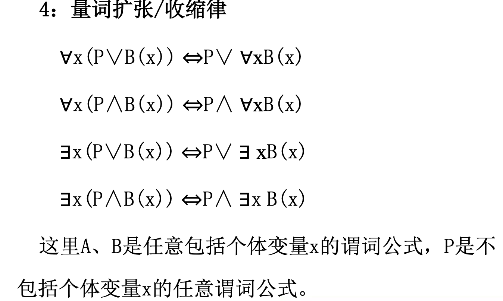

#  离散数学

## 课件内容

### 1. 数理逻辑之命题逻辑

####  1.1 命题与联结词

一、命题及其分类  
1. 命题与真值  
(1)命题—判断结果惟一的陈述句  
(2)命题的真值—判断的结果   
(3)真值的取值:真与假   
(4)真命题与假命题  
注意:  
感叹句、祈使句、疑问句都不是命题 陈述句中的悖论，判断结果不惟一确定的不是命题  

**example**  
1. 华盛顿是美国的首都.  
2. 2+2=3.  
3. A给所有不能给自己理发的人理发。(前提:所 有人都不能给自己理发)  
1，2是命题.命题1的真值为真，2的真值为假。3非命题。  

1. 现在几点了?  
2. 请保持安静.   
3. x+1 =2.  
4. x+y = z.  
 
1， 2不是命题，因为非陈述句. 3和 4也不是命题，因为既非 真也非假。句子的真假和变量的赋值有关系.  

2. 命题的分类  
(1)简单命题(也称原子命题)  
(2)复合命题  
3. 简单命题符号化   
(1)用小写英文字母p，q，r，...，pi，qi，ri (i≥1) 表示简单命题  
(2)用“1”表示真，用“0”表示假  
例如，令  
p: 2 是有理数，则p的真值为0，  
q: 2 + 5 = 7，则q的真值为1   

二、联结词与复合命题   
1、否定式与否定联结词“┐”  

定义1.1 设p为命题，符合命题“非p”(或“p的否 定”)称为p的否定式，记作┐p，符号┐称作否定联结词，并规定┐p 为真当且仅当p为假.   
2、合取式与合取联结词“∧”  

定义1.2 设p，q为二命题，复合命题“p并且q”(或 “p与q”)称为p与q的合取式，记作p∧q，∧称作合 取联结词，并规定p∧q为真当且仅当p与q同时为真. 使用合取联结词时要注意两点:  
(1) 描述合取式的灵活性与多样性  
(2) 分清简单命题与复合命题  

- 灵活性:自然语言中的“既。。。有。。”， “不但。。。而且。。”，“虽然。。。但是”， “一面。。。一面。。”等联结词都可以符号化 合取联结词;  
- 有些含有“与”或“和”有些是简单命题。  

**example**  
P:上海是个大城市。  
┐p ：上海不是个大城市。  
┐p ：上海是个不大的城市。  

P:今天星期五。  
┐p ：今天不是星期五。  

P:今天星期五。 q:今天下雨  
p∧q:今天星期五且今天下雨。  
P:我去看电影。 q:山上有只兔子。  
p∧q:我去看电影与山上有只兔子   
 

3. 析取式与析取联结词“∨”

定义1.3 设p, q为二命题，复合命题“p或q”称作p与q 的析取式，记作p∨q，∨称作析取联结词，并规定 p∨q为假当且仅当p与q同时为假.   

 4. 蕴涵式与蕴涵联结词“→”    
定义1.4 设p, q为二命题，复合命题“如果p, 则q”称作p 与q的蕴涵式，记作p→q，并称p是蕴涵式的前件，q为蕴涵式的后件，→称作蕴涵联结词，并规定，p→q为假当 且仅当p为真q为假.    
说明:  
(1)p→q的逻辑关系:q为p的必要条件  
(2)“如果p, 则q的不同表述法很多:  
若p，就q 只要p，就q p仅当q  
只有q 才p  
除非q, 才p或除非q，否则非p，....   
(3)当p为假时，pq为真，可称为空证明   
(4) 常出现的错误:不分充分与必要条件  

p→q逻辑关系:p为q的充分条件;q为p 的必要条件。(不管用什么样的自然语言 来描述)  

p→q和¬q→¬p是等价的，即他们表示同一个意思  

**example**  

“你可以上校园网，仅当你是计算机专业的学生或者你非新生”   
a:你可以上校园网  
c:你是计算机专业的学生;  
f:你是新生  

a → (c ∨ ¬f )  

**example**    

“如果你身高小于1.5米,你不能坐过山车，除非你超过16岁.“   
r:你身高小于1.5米  
s:你可以坐过山车  
q:你超过16岁  

(r ∧ s) →q  

在蕴含联结词中，一定要分清条件和结论。 如果p，则q。  
因为p，所以q。  
P仅当q。  
只有q才会p。   
除非q，才会p。   
都表示p为q的条件。  

 例8 设p:天冷，q:小王穿羽绒服，将下列 命题符号化   
 (1)只要天冷，小王就穿羽绒服.   
 (2)因为天冷，所以小王穿羽绒服.   
 (3)若小王不穿羽绒服，则天不冷.   
 (4)只有天冷，小王才会穿羽绒服.   
 (5)除非天冷，小王才会穿羽绒服.   
 (6)如果天不冷，则小王不穿羽绒服.   
 (7)小王穿羽绒服仅当天冷的时候.  
注意: p→q与¬q→¬p等值(真值相同) (1)，(2)，(3)符号化为p→q,其余的符号化为q→p

5. 等价式与等价联结词“↔”  
定义1.5 设p，q为二命题，复合命题“p当且仅当q”称作p 与q的等价式，记作p↔q，↔称作等价联结词. 并规定↔ 为真当且仅当p与q同时为真或同时为假.   
p↔q的逻辑关系:p与q互为充分必要条件   
p↔q为真当且仅当p与q同真或同假  

**逻辑联接词的优先级:**  
¬、 ∧、 ∨、 → 、↔  

性质1: 如果一个命题公式有n个互异的命题变项，则命题公式对应的真值有2的n次幂种可能分布。   
真值表:
所有赋值下的取值情况对应成表，称为真值表。  
列真值表的步骤:   
1。写出全部命题变项，共有 2^n种赋值方式;   
2。从低到高写出所有的层;
3。计算真值。  

 例:列出¬(p∧q)↔ ¬p∨¬q 的真值表。  

例:列出 (¬p∧q)→¬r的真值表。

永真命题公式(重言式) 公式中的命题变量无论怎样代入，公式对应的真值恒为T。  
永假命题公式(矛盾式) 公式中的命题变量无论怎样代入，公式对应的真值恒为F。  
可满足命题公式(即非永假式) 公式中的命题变量无论怎样代入，公式对应的真值总有一种情况为T。   
一般命题公式(Contingency) 既不是永真公式也不是永假公式。  

可以通过真值表来判断一个命题是永真式、永假式还是可满足式  

性质2:   
(1)设P是永真命题公式，则P的否定公式是永假命题公式;  
(2)设P是永假命题公式，则P的否定公式 是永真命题公式;  
(3)设P、Q是永真命题公式，则(P ∧ Q)、(P ∨ Q)、(P → Q)、(P ↔ Q)也是永真命题公式  

小结  
1、命题的概念:定义、逻辑值、 符号化表示   
2、从简单命题到复合命题: 逻辑联接词:运算方法、运算优先级   
3、从命题常量到命题变量， 从复合命题到命题公式:命题公式的真值描述:真值表  
4、命题公式的分类: 永真公式、永假公式、可满足公式 、一般公式

### 2. 数理逻辑之等值式

#### 2.1. 等值式

一、等值式与基本的等值式  
1、等值式  
定义2.1 若等价式A→B是重言式，则称A与B等值，记作A⇔B，并称A⇔B是等值式  
注意: ⇔不是联结词!     
几点说明:  
定义中，A, B, ⇔均为元语言符号.    
A或B中可能有哑元出现. 例如，在(p→q) ⇔ ((¬p∨q)∨ (¬r∧r)) 中，r为左边公式的哑元.  
用真值表可验证两个公式是否等值   
请验证:  
p→(q→r) ⇔ (p∧q) →r  
p→(q→r) ⇎ (p→q) →r  

 判断方法:   
 1、利用真值表。 (计算量太大)   

 2、利用已知定律。  

二、等值演算与置换规则  
1、等值演算——由已知的等值式推演出新的等值式的过程  
2、等值演算的基础:   
(1)等值关系的性质:自反、对称、传递性   
(2)基本的等值式  
(3)置换规则(见3)  
3、置换规则  
设(A)是含公式A的命题公式，(B)是用公式B置换 了(A)中的所有的A后得到的命题公式，若B⇔A，则 (B)⇔(A)  

 三、等值演算的应用举例  

 例 证明 p→(q→r) ⇎ (p→q)→r   
方法一 真值表法(自己证)   
方法二 观察赋值法. 易知000, 010等是左边的成真赋值， 是右边的成假赋值  
方法三 用等值演算先化简两个公式，再观察. 

 判断命题公式逻辑等价的方法:   
1、真值表  
2、命题公式的演算  
基本等值定理;  
公式的代入不变性;  
等值关系的传递性。  

 命题公式逻辑等价关系的应用:  
1、判定是否逻辑等价;   
2、判断是否为永真公式或永假公式;   
3、命题公式的化简  

### 3. 数理逻辑之析取范式合取范式

一、析取范式与合取范式  

1、基本概念   
(1)文字——命题变项及其否定的总称   
(2)简单析取式——有限个文字构成的析取式  
p, ¬q, p∨¬q, p∨q∨r, ...   
(3)简单合取式——有限个文字构成的合取式  
p, ¬q, p∧¬q, p∧q∧r, ...   
(4)析取范式——由有限个简单合取式组成的析取式  
A1∨A2∨...∨Ar (r>=1)   
(5)合取范式——由有限个简单析取式组成的合取式  
A1∧A2∧...∧Ar (r>=1)   
(6)范式——析取范式与合取范式的总称

 说明:   
 单个文字既是简单析取式，又是简单合取式 形如p∧¬q∧r, ¬pvqv¬r的公式既是析取范式， 又是合取范式  
主要性质:   
简单析取式与简单合取式的性质见定理2.1   
析取范式与合取范式的性质见定理2.2  

定理2.1   
(1) 一个简单析取式是重言式当且仅当它同时 含某个命题变项及它的否定式.    
(2)一个简单合取式是矛盾式当且仅当它同时含某个命题变项及它的否定式。  
定理2.2   
(1) 一个析取式是矛盾式当且仅当它的每个 简单合取式都是矛盾式  
(2)一个合取范式是重言式当且仅当它的每个简单析取式都是重言式

合取范式(conjunctive normal form)(小项): 有限个简单析取式构成的合取式。  
析取范式(disjunctive normal form)(大项): 有限个简单合取式构成的析取式。  
标准句(standard sentence):合取范式或析取范式  

 
定理2.3:任意一个命题公式都存在与之等价的合取范式和析取范式。   
定理的证明思路:  
1、将所有联结词转换为合取，析取，否定;  
2、将否定联结词移到命题变量的前面;  
3、消除多余的否定联结词;  
4、化成合取范式和析取范式。 
析取范式: ∧ 对 ∨ 分配;  
合取范式: ∨ 对 ∧ 分配;  

定理2.3:任意一个命题公式都存在与之等价的合取 范式和析取范式。  
定理2.3的作用与局限:   
1、标准化但仅仅是初步的  
标准化的形式  
不唯一性(规范化要求:主范式)   
2、能够判定是否为永真或永假公式但不方便  

 二、主析取范式与主合取范式  
1、极小项与极大项  
定义2.4 在含有n个命题变项的简单合取式(简单析取式)中，若每个命题变项均以文字的形式在其中出现且仅 出现一次，而且第i(1=<i=<n)个文字出现在左起第i位上，称这样的简单合取式(简单析取式)为极小项(极大项). 几点说明:  
n个命题变项产生2n个极小项和2n个极大项   
2n个极小项(极大项)均互不等值   
用mi表示第i个极小项，其中i是该极小项成真赋值的十进制表示. Mi表示第i个极大项，其中i是该极大项成假赋 值的十进制表示, mi(Mi)称为极小项(极大项)的名称.  

由p, q两个命题变项形成的极小项与极大项由下表给出  

2、 主析取范式与主合取范式   
定义2.5  
(1)主析取范式——由极小项构成的析取范式   
(2)主合取范式——由极大项构成的合取范式  

例如，n=3, 命题变项为p, q, r时，
 (¬p ∧ ¬q ∧ r)(¬p ∧ q ∧ r) ⇔ m1 ∨ m3 ——主析取范式   
 (¬p ∨ ¬q ∨ ¬r)  (p ∨ q ∨ ¬r)  ⇔ M7 ∧ M1——主合取范式  

3、命题公式A的主析取范式与主合取范式   
(1)与A等值的主析取范式称为A的主析取范式;与A等值的主合取范式称为A的主合取范式.   
(2)主析取范式的存在惟一定理  

定理2.5任何命题公式都存在着与之等值的主析取范式和主合 取范式,并且是惟一的    

 3、主范式的用途——与真值表相同.   
 (1)求公式的成真成假赋值
(p → ¬q) → r ⇔ m1 ∨ m3 ∨ m5 ∨ m6 ∨ m7，其成真赋值为001, 011, 101, 110, 111，当然成假赋值为000, 010, 100. 类似地， 由主合取范式也立即求出成假或成真赋值. 

命题公式中的逻辑联接词的极小完备性  
逻辑联接词组是功能完备的:  
任一个命题公式都能够等价于仅包含这些逻 辑联接词联结起来的公式。  
逻辑联接词组是极小功能完备的:  
是功能完备的并且不能少一个。  

例1:否定、析取、合取组成的逻辑联结词组   
是功能完备的(由范式的存在性)，但不是极小功能完备的。  

例2:否定和合取组成的逻辑联结词组是极小功能 完备的。  

例3:否定和析取组成的逻辑联结词组是极小功能完备的。  

 
与非(p与q的否定)p↑q    ¬(p∧q)

或非(p或q的否定)p↓q    ¬(pvq)

p↑q为真当且仅当p，q不同时为真 p↓q为真当且仅当p，q同时为假

 {↑}{↓}也是联结词完备集。

### 4. 数理逻辑之谓词逻辑

#### 4.1. 一阶逻辑基本概念

 一、个体词:指研究对象中可以独立存在的具体或抽象的客体。   
特定的，称为个体常项，a，b，c...表示;  
抽象:个体变项，x，y，z...表示  
个体变项的取值范围:个体域(论域)  
特殊的，宇宙间一切事务—全总个体域   

二、谓词  
刻画个体词的性质以及个体之间相互性质的词  
分类:谓词常项(具体的性质和关系)，谓词变项(抽象的或泛指的关系)，大写英语字母来表示。n元谓词。  

P(x)表示 “x > 3.” 判定 P(4)， P(2)的真值:一元谓词  
P (4) = T  
P (2) = F  
Q(x, y) 表示 “x = y + 3.” Q(1, 2) 以及 Q(3, 0)的真值?(二元谓词)  
Q(1,2)= F Q(3,0)= T  
R(x,y,z): x+y=z，那么R(1, 2, 3)以及 R(0, 0, 1)的真值?  
R(1,2,3)=T  
R(0,0,1)=F  

当n>1时，通常P给出了xi (i=1, 2, ..., n)之间的关系。   
例如，P(x, y, z)表示x位于y与z之间，是一个三元谓词。  
将杭州、南京、北京代入，则得到:杭州位于南京和北京之间，真值为F。 与n=0时(即0元谓词)，命题函数就对应一个命题。  

三、量词  
个体变(常)项之间的数量关系  
分类:全称量词 ∀，存在量词 ∃  

>  EXAMPLE 1   
表示命题“某班级中的所有学生都学过微积分”  
全域:某班级  
P(x) = “x 学过微积分." S(x) = “x 在某班中."  
∀x（S(x) → P(x)）

>  EXAMPLE 2  
判断真值 ∀x P(x), 其中 P(x): “x2 < 10” 全域:不超过4的正整数。  

∀x P(x)=P(1) ∧P(2) ∧P(3) ∧P(4) = F
 
>  EXAMPLE 3  

判断谓词逻辑 ∃x P(x) 的真值。     
其中 P(x): "x^2 > 10“ 全域:不超过4的正整数  
  
∃x P(x) =P(1) ∨ P(2) ∨ P(3) ∨ P(4) =T  

>  EXAMPLE 4  

P(x): "x > 3."  
判断 ∃x P(x)的真值。全域:实数集  

x=4 ，P(x)真。  
所以 真.  

>  EXAMPLE 5   

符号化命题: 
某班级的每一个学生有一台计算机或者他有一个拥有计算机的朋友.  

全域:某班级的所有学生   
C(x): x有一台计算机  
F(x,y) : x和y 是朋友  
∀x(C(x) ∨ ∃y(C(y)∧F(x,y)))  

 四、 谓词公式定义为  
(1)n元谓词是一个谓词公式;  
(2)若A是谓词公式，则(¬A)也是谓词公式;  
(3)若A，B是谓词公式，则(A∨B)、(A∧B)、 (A→B)、(A↔B)也是谓词公式;     
(4)若A是谓词公式且含有未被量化的个体变量x，则 ∀xA(x)，∃xA(x)也是谓词公式。   
(5)有限次地使用(1)-(4)所得到的也是谓词公式。  

>  EXAMPLE 6  

存在一个学生 x，对所有不同的两个学生 y和 z来说,如果 x与 y是好朋友并且 x 和 z也是好朋友,那么 y和 z不是好朋友，换句话说,存在一个学生，他的朋友互相都不是朋友。  

全域:某学校的所有学生  
F(a,b)表示 a和 b是好朋友，其中S(a,b)表示a和b相同   

∃x∀y∀z((F(x,y)∧F(x,z)∧↓S(y,z)) → ↓F(y,z))  

>  EXAMPLE 7  

并非所有的动物都是猫。  
A(x)表示x是动物;B(x)表示x是猫  
↓(∀x(A(x)→B(x))
∃x(A(x)|↓B(x))   
注:不同个体域中，同一命题的符号化形式可能相同，也可能不同; 同一个命题在不同个体域中真值可能不同。  

>  EXAMPLE 8    

x:男生。y:女生。L(x,y):x喜欢y  
∀x∃yL(x, y) : 每个男生都有喜欢的女生。  
∀y∃xL(x, y) : 每个女生都有男生喜欢她。  
∃x∀yL(x, y) : 有一个男生所有的女生他都喜欢。  
∃y∀xL(x, y) : 有一个女生所有的男生都喜欢她。  

#### 4.2. 变元的约束及公式的分类

一、变量的约束(BINDING VARIABLES)   
1. 自由变量(Free Variable)   
2. 约束变量(Bound Variable)  

给定形如 ∀xP(x), ∃xP(x) 的公式，其中全称量词以及 存在量词后面的变元称为指导变元;  
P(x)称为相应量词的辖域(作用域) 指导变元在辖域中的所有出现，为约束出现;  
非约束出现的其它出现称为自由出现。  
例如:  
∀xP(x) → ∃yQ(x, y)  

约束变元的换名:  
1、指导变元可换名。更改的变元名称为量词后面的指导 、变元以及该量词的辖域中约束出现的该变元，其它部分不变;  
2、换名时一定要改为辖域中未出现的变元名称。 自由变元的更改称为代入。  

二、谓词公式的分类  
与命题公式真值讨论类似，可以描述谓词公 式在指定变量(包含非量化的个体变量和谓词变量) 后的真值情况，进而划分出永真公式或永假公式。  

定理1 两个谓词公式A和B等值当且仅当 A↔B是永真公式。  

前束范式    
A为一阶逻辑公式，若A具有形式:  
Q1 x1 Q2 x2 ...Qk xk B   
且Qi为全称量词或存在量词，B为不含量词的公式。  

 任何公式都具有等值前束范式，但不唯一方法:利用已知的等值公式以及变换规则  
• 置换规则  
• 换名规则(指导变元)  
• 代替规则(自由变量)  

推理  
可使用的定律:  
1、命题推理定律的代换   
2、等值式生成的推理定律   
3、量词的几个推理定律(共4个)  

苏格拉底论证:  
人固有一死，苏格拉底是人，因此苏格拉底固 有一死。  
P(x): x是人，D(x):x是要死的，S:苏格拉底。   
(∀x (P(x) → D(x))) ∧P(S) →D(S)  
1. ∀x (P(x) → D(x)) (前提引入)  
2. P(S) (前提引入)   
3. P(s) → D(s) (UI)  
4. D(S)  

### 5. 集合与关系

一、集合的定义  
集合没有精确的数学定义  
直观理解:由离散个体构成的整体称为集合，称这些个体为集合的元素   
常见的数集:N, Z, Q, R, C 等分别表示自然数、整数、有理数、实数、复数集合   

二、集合的表示法  
1. 枚举法----通过列出全体元素来表示集合   
2. 谓词法----通过谓词概括集合元素的性质  
实例:  
枚举法 自然数集合 N={0,1,2,3,...}   
谓词法 S={x| x 是实数，x^2-1=0}  

三、元素与集合   

1.集合的元素具有的性质

无序性——元素列出的顺序无关   
相异性——集合的每个元素只计数一次   
确定性——对于任何元素和集合，都能确定这个   
元素是否为该集合的元素   
任意性——集合的元素也可以是集合

2.元素与集合的关系——隶属关系:∈或者∉  

四、集合与集合  

五、空集和全集  

六、幂集  

### 6. 群论

1. 群的定义:一个非空集合G中如果定义了一个“乘法”运算, 满足  
(1) 封闭性: ∀a,b∈G, a×b=c∈G;  
(2) 结合律: ∀a,b,c∈G, a× (b×c)=(a×b) ×c   
(3) 有单位元:∃e∈G, ∀a∈G, e×a=a×e=a (4) 每个元a有逆元a^-1: a×a^-1=a^-1×a=e，则称G为一个群. 

交换律成立的群叫交换群或Abel群, 否则叫非交换群或非Abel群.  
群G所含元素个数叫群的阶, 记为|G|. |G|有限时叫有限群, 否则叫无限群.  
例1 G={1,-1}关于普通乘法运算构成一个群.  
例2 G={1, -1, i, -i}关于普通乘法运算构 成一个群, 其中 i=(-1)^(1/2).  
例3 G={0, 1, ..., n-1}关于模n的加法作 成一个群, 记为Zn.  
刚才所给的例子都是有限Abel群.  
例4 容易看出(Z,+), (Q,+), (R,+), (C,+)都是无限Abel群.  
例5 还有(Q*, .), (R*, .) , (C*,.)也是无限交换群.  
例6 元素为实数或复数的n阶可逆矩阵的 全体关于矩阵的乘法组成群, 都是非交换群, 叫全线性群, 记为GL(n,R), 或 GL(n,C).  

2. 群的基本性质  
(1) 群中单位元是唯一的.  
(2) 群中每个元素的逆元素是唯一的.   
(3) 消去律成立: ab=ac ⇒b=c, ba=ca ⇒ b=c.  
(4) 设a是群G的一个元素, 称使得ar=e的最小正整数为元素a的阶(order), 记为 o(a). 如果不存在这样的正整数, 称a是一 个无限阶元素.  

否定联结词 ¬  
合取联结词 ∧  
析取联结词 ∨  
蕴涵联结词 →   
等价联结词 ↔   
等值 ⇔  

与非↑ (p与q的否定)p↑q  ¬(p∧q)  

或非↓ (p或q的否定)p↓q ¬(pvq)  

全称量词 ∀  
存在量词 ∃    

## 专业考

### 2019年7月《离散数学》试卷

#### 1.（10分）用逻辑符号表示下列语句。论域为一切事物。

1. 平面任意两个不同的点，有且仅有一条直线通过它们。  
答：  
F(x): x是平面上的点，G(x,y): x与y相同，H(x): x是直线，L(x,y,z)：x通过y,z，E(x,y)：x与y相同  
∀x∀y(F(x)∧F(y)∧¬G(x,y))→∃z(H(z)∧L(z,x,y)∧∀t(H(t)∧L(t,x,y)→E(z,t)))  

2. 天上飞的不一定是鸟。（要求用两种形式，一种用全称量词，一种用存在量词）  
答：  
F(x): x在天上飞，G(x): x是鸟  
∀xF(x)→(G(x)∨¬G(x))  
∃x(F(x)∨¬G(x)）  

#### 2.（10分）定义与非联结词P↑Q=¬(PꓥQ)，试试只用与非表示出¬P，P∨Q，P →Q。要求结果尽可能简洁。  
答：  
¬P=¬(PꓥP)=P↑P  
P∨Q=¬(¬Pꓥ¬Q)= (P↑P)↑(Q↑Q)  
P→Q=¬P∨Q=¬(Pꓥ¬Q)=P↑(Q↑Q)  

#### 3.（10分）写出(┐P v Q) →(Q ꓥ R)的主合取范式和主析取范式。要求使用极小项和极大项的简洁形式表达。  
答：  
(┐P v Q) → (Q ꓥ R)  
<=> ┐ (┐P v Q) v (QꓥR)  
<=> (P ꓥ ┐Q) v (QꓥR)  
<=> (P ꓥ ┐Q ꓥ R) v (P ꓥ ┐Q ꓥ ┐R)v (P ꓥQ ꓥR) v (┐P ꓥ Q ꓥ R)  
所以主析取范式为m3Vm4Vm5Vm7，主合取范式为M0ꓥM1ꓥM2ꓥM6  
 
#### 4.（20分）已知A是由36的所有因子组成的集合，设“|”为A 上的整除关系。  
1. 证明此关系是一个偏序关系；  
2. 画出此关系的哈斯图；  
3. 确定A中最长链的长度，并且写出所有最长链；  
4. A中元素至少可以划分成多少个互不相交的反链，并完整写出这些反链。  
答：  
1.  集合A = {1，2，3，4，6，9，12，18，36}  
对于任意的x∈A，有x|x=1，即满足自反性  

对于任意的x，y∈A，不能满足x|y = y|x，如6|3=2，但6不能整除3。即不满足对称性  
对于任意的x，y，z∈A，x|y= a, y|z = b => x|z = ab，即满足传递性。  
综上，此关系是一个偏序关系。  
2. 此关系的哈斯图为  

3. A中最长链的长度为5，有6个，{1，2，6，12，36}，{1，2，4，12，36}，{1，3，6，12，36}，{1，3，6，18，36}，{1，2，6，18，36}，{1，3，9，18，36}  

4. 至少可以划分成3个互不相交的反链， {2，3}，{4，6，9}，{12，18}  

#### 5.（10分）已知集合A={a, b, c, d}上的两个二元关系R1={(a, a), (a, b), (b, c)}，R2={(a, b), (b, c), (c, d)}。求R2ᵒR1和R1^3(R1的三次方) 。  
答：  
R2ᵒR1 = {(x, y) | z∈R2, xR1z且zR2y} = {(a, b),(a, c), (b, d)}  
R1^3 = {(a, a), (a, b), (a, c)}  

#### 6.（10分）对任意集合A，B，C，证明(A∩B)∪C = A∩(B∪C)当且仅当C⊆A。  
证明：（同2019年1月期末考试题，同2014年国考题）  
1）证明(A∩B)∪C= A∩(B∪C) => C⊆A  
假设C不包含于A，则一定存在x∈C且x不属于A  
因为x属于C，则x一定属于(A∩B)∪C  
因为x不属于A，则x一定不属于A∩(B∪C)  
由题知，(A∩B)∪C= A∩(B∪C)，矛盾  
所以假设不成立，即C⊆A  
2）证明C⊆A =>(A∩B)∪C = A∩(B∪C)  
(A∩B)∪C  
= (A∪C) ∩(B∪C)-------- 因为C⊆A，所以A∪C= A。代入得  
=A∩(B∪C)  
综上1）2），对任意集合A，B，C，(A∩B)∪C = A∩(B∪C)当且仅当C⊆A得证。  

#### 7.（10分）集合A={1，2，3，4，5，6，7}上的一个划分是{(1，2), (3，4，5), (6，7)}。求对应的等价关系。  
答：  
集合的等价关系与划分一一对应。  

#### 8.（10分）用“≈”表示等势。证明(0, 1] ≈ [a, b) 和N≈Z，其中a,b为实数，且a＜b，N为自然数集合，Z为整数集合。  
答：（同2019年1月期末考试题）  
构造一个函数y=kx+s，使得(0,1]区间和[a,b)区间存在一一（双射）关系。  
当x=0时，y=a  
当x=1时，y=b  
得出k=b-a,s=a,  
所以，存在函数y=(b-a)x+a,0<x≤1  
所以(0,1]区间和[a,b)区间等势。  

#### 9.（10分）证明所有的非零有理数关于乘法构成一个群。  
证明：（同2019年1月期末考试题）  
设Q表示所有非零有理数  
对于任意的x, y∈Q，有x*y∈Q，满足封闭性；  
对于任意的x,y, z属于Q，有(x*y)*z=x*(y*z)，满足结合律；  
对于任意的x∈Q，有x*1=x，幺元为1；  
对于任意的x∈Q，有x*1/x= 1，可逆；  
综上，所有的非零有理数关于乘法构成一个群。  