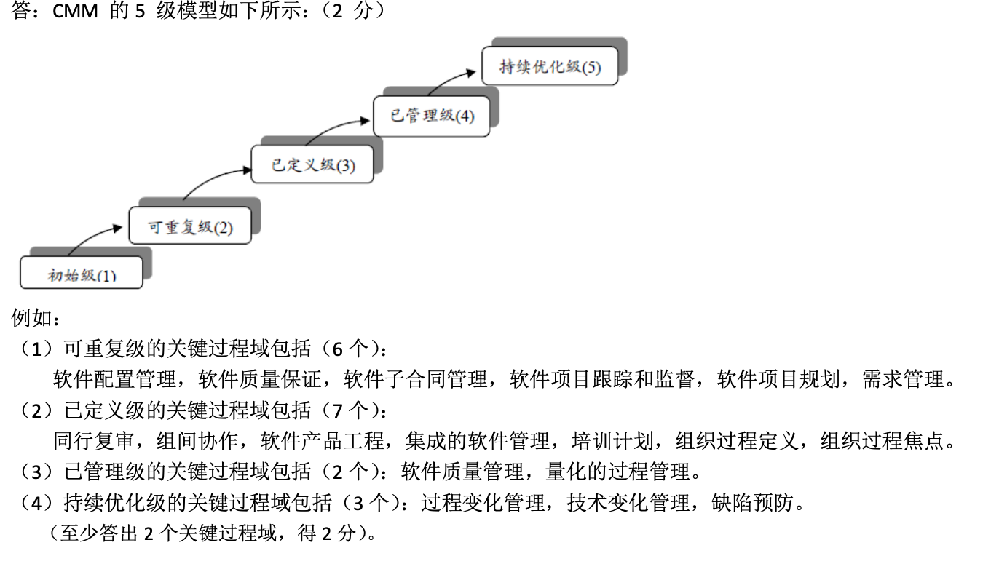

# 软件工程

## 1. 软件与软件工程

### 1.1. 软件工程中常见问题

#### 软件工程的基本问题  

**What is software?**  
Computer programs and associated documentation. Software products may be developed for a particular customer or may be developed for a general market.  

**What are the attributes of good software?**  
Good software should deliver the required functionality and performance to the user and should be maintainable,dependable and usable.  

**What is software engineering?**
Software engineering is an engineering discipline that is concerned with all aspects of software production.  

**What are the fundamental software engineering activities?**  
Software specification, software development, software validation and software evolution.  

**What is the difference between software engineering and computer science?**  

Computer science focuses on theory and fundamentals; software engineering is concerned with the practicalities of developing and delivering useful software.  

**What is the difference between software engineering and system engineering?**  
System engineering is concerned with all aspects of computer-based systems development including hardware,software and process engineering. Software engineering is parts of this more general process.  

**What are the key challenges facing software engineering?**  
Coping with increasing diversity, demands for reduced delivery times and developing trustworthy software.  

**What are the costs of software engineering?**  
Roughly 60% of software costs are development costs, 40% are testing costs. For custom software, evolution costsoften exceed development costs.  

**What are the best software engineering techniques and methods?**  
While all software projects have to be professionally managed and developed, different techniques are appropriate for different types of system. For example, games should always be developed using a series of prototypes, whereas safety critical control systems require a complete and analyzable specification to be developed. You can’t, therefore, say that one method is better than another.  

**What are the main uncertainties in software development?**  
Environmental uncertainty and software complexity  

#### 软件的构成  

Software is a set of items or objects that form a “configuration” that includes  
• programs  
• documents  
• data ...  

#### 软件的特点

1) 软件是一种逻辑实体，而不是具体的物 理实体。因而它具有抽象性。  
2) 软件的生成与硬件不同，在软件的开发 过程中没有明显的制造过程。  
3) 在软件的运行和使用期间，没有硬件那 样的机械磨损、老化问题。  
4) 软件的开发和运行常常受到计算机系统 的限制，对计算机系统有着不同程序的 依赖性。  
5) 软件开发至今尚未完全摆脱手工的开发 方式。  
6) 软件的复杂性。  
7) 软件成本相当昂贵。  
8) 社会性.  

#### 软件的分类

 按功能进行划分  
 按规模进行划分  
 按工作方式划分  
 按服务对象的范围划分  
 按使的频度进行划分  
 按失效的影响进行划分  

### 1.2. 软件工程的基本概念

#### 什么是软件工程

软件工程是一门工程学科，涉及软件生产的各个方面，从最初的系统描述一直到使用后的 系统维护，都属于其学科范畴 。  

#### 软件工程与一般工程的差别

- 软件是逻辑产品，它不会损坏、磨损、老化，而 且可以不断地改进、优化，其可靠性是逻辑性所 确定。  

- 由于软件是逻辑产品，它的功能只能依赖于硬件 和运行环境以及人们对它的操作，才能得以体现。  

- 对软件产品的要求比一般有形产品复杂:  

+ 用户难以清晰、准确地表达软件产品的功能。  
+ 对软件产品的要求，如可靠性、易移植性、易使用性 等等是隐含的，也是难以表达的，而且也缺少度量的 具体标准，和有形产品的质量检验的精度相距甚远。  
+ 软件设计不仅仅涉及到技术复杂性，也不定期涉及到 管理复杂性。  

-  在软件设计中的复杂性，引起的软件特征包括四方面:  

+ 功能多样性(Functional diversity)  
+ 实现多样性(Implementation diversity)  
+ 能见度低(Low visibility)  
+ 软件结构的合理性差(poor rationality of software structure)  

#### 软件工程定义

软件工程是指导计算机软件开发和维护的工程 学科。采用工程的概念、原理、技术和方法来开发 与维护软件，把经过时间考验而证明正确的管理技 术和当前能够得到的最好的技术方法结合起来，以 经济地开发出高质量的软件并有效地维护它，这就 是软件工程。  

#### 软件工程的特点

- 工程是将理论和知识应用于实践的科学。  
- 软件工程借鉴了传统工程的原则和方法，以求高效地开发高质量软件。  
- 软件工程中应用了计算机科学、数学和管理科学。计算机科学和数学 用于构造模型与算法，工程科学用于制定规范、设计范型、评估成本 及确定权衡，管理科学用于计划、资源、质量和成本的管理。  

#### 软件工程知识构成

软件工程的知识域:  
软件需求  
软件设计  
软件构造  
软件测试  
软件维护  
软件配置管理  
软件工程管理  
软件工程过程  
软件工程工具与方法  
软件质量  

软件工程的三个分支:  
软件开发技术  
软件项目管理技术  
软件质量管理技术  

软件工程框架:  
软件工程的目标  
软件工程原则  
软件工程活动  

#### 软件工程3要素

1. 方法:为软件开发提供“如何做”的技术。  
2. 工具:为软件工程方法提供自动或半点自动的软件支撑环境。  
3. 过程:将软件工程的方法和工具综合起来以达到合理、及时地进行 计算机软件开发的目的。  

#### 软件工程的四条基本原则

- 必须认识软件需求的变动性，并采取措施来保证结果产 品能忠实地满足用户需求。
- 采用合适的设计方法。在软件设计中，通常要考虑软件 的模块化、抽象与信息隐蔽、局部化、一致性以及适应 性等特征。合适的设计方法有助于这些特征的实现，以 达到软件工程的目标。
- 软件工程项目的质量与经济开销直接取决于对它所提供 的支撑的质量和效用。
- 有效的软件工程只有在对软件过程进行有效管理的情况 下才能实现。

#### 软件工程的基本原理(Barry. Boehm)

1. 用分阶段的生命周期计划严格管理
2. 坚持进行阶段评审
3. 实行严格的产品控制
4. 采用现代程序设计技术
5. 结果应能清楚地审查
6. 开发小组的人员应该少而精
7. 承认不断改进软件工程实践的必要性

#### 对软件的新认识

- 程序从个人按自己意图创造的“艺术品”转变为广大用 户接受的工程化产品。
- 软件的需求是软件发展的动力。
- 软件工作的范围从只考虑程序的编写到涉及整个软件生存期。
- 软件是服务。
- 好的软件应具有用户所需的功能与性能，而且应该可维 护、可靠和可用。
- 软件工程面临的主要挑战是要面临遗留系统、不断增长 的多样性以及减少交付次数等问题。

### 1.3. 软件生存期模型

#### 软件生存周期

软件产品从构思开始至软件不再可用结束时的时间周期。  
软件生存周期典型的地包括:需要阶段、设计阶段、实现阶段、测试阶段、 安装和验收阶段、操作和维护阶段，有时还包括退役阶段。  

#### 主要的软件生存期模型(life cycle model)

- 瀑布模型
- 原型模型
- 快速应用开发(RAD)模型
- 螺旋模型
- 增量模型和迭代模型
- 构件组装模型
- 并发模型
- 测试驱动(TDD)型的软件开发
- Rational的RUP和UML
- 形式化描述技术FDT
- 敏捷方法(XP)

软件生存期模型意义:  

- 软件开发模型是软件开发全部过程、 活动和任务的结构框架。  
- 软件开发模型能清晰、直观地表达 软件开发全过程，明确规定了要完 成的主要活动和任务，用来作为软 件项目开发的基础。  

软件生存期的主要阶段:  

1. 准备阶段  
2. 开发阶段  
3. 使用和维护阶段

#### 软件生存期主要任务

1. 问题定义  
这个阶段必须回答的关键问题是:“要解决的问题是什么”。  
2. 可行性研究  
这个阶段要回答的关键问题是:“上一个阶段所确定的问题是否有行得通的解决办法”。  
3. 需求分析  
这个阶段的任务仍然不是具体地解决客户的问题，而是准确地回答“目标 系统必须做什么”这个问题。  
这个阶段的另外一项重要任务，是用正式文档准确地记录对目标系统的需求， 这份文档通常称为规格说明(specification)。  
4. 概要设计  
这个阶段的基本任务是，概括地回答“怎样实现目标系统?”这个问题。  
首先，应该设计出实现目标系统的几种可能的方案。  
概要设计的另一项主要任务就是设计程序的体系结构，也就是确定程序由哪些模块  
组成以及模块间的关系。  
5. 详细设计
这个阶段的任务是设计出程序的详细规格说明。就是把解法具体化，也就 是回答“应该怎样具体地实现这个系统”这个关键问题。  
6. 编码和单元测试  
这个阶段的关键任务是写出正确的容易理解、容易维护的程序模块。  
7. 综合测试  
这个阶段的关键任务是通过各种类型的测试(及相应的调试)使软件达 到预定的要求。  
8. 软件维护  
维护阶段的关键任务是，通过各种必要的维护活动使系统持久地满足用 户的需要。  
通常有四类维护活动:  
改正性维护，也就是诊断和改正在使用过程中发现的软件错误;  
适应性维护，即修改软件以适应环境的变化;  
完善性维护，即根据用户的要求改进或扩充软件使它更完善;  
预防性维护，即修改软件为将来的维护活动预先做准备。  

#### 瀑布模型(Waterfall Model)

#### 演化模型(evolutionary model)

- 演化模型主要针对事先不能完整定义需求的软件项目，此模型可以减少风险。
- 为了探索可行性和弄清需求，作第一次试验开发，以取得有效的反馈信息，来支持软件的最终设计和实现。
- 第一次试验开发出来的软件称为原型(prototype)

#### 螺旋模型(Spiral Model)

螺旋模型是瀑布模型与演化模型结合， 并增加两者所忽略的风险分析。  
螺旋模型通常用来指导大型软件项目开发，它将开发划分为:

- 制定计划
- 风险分析
- 实施开发
- 客户评估

#### 喷泉模型(Water Fountain Model)

喷泉模型主要用于采用对象 技术的软件开发项目， “喷 泉”这个词体现了面向对象 软件开发过程迭代和无缝的 特性。  

为避免使用喷泉模型开发软 件时开发过程过分无序，应 该把一个线性过程(例如，快 速原型模型或图中的中心垂 线)作为总目标。但是，同时 也应该记住，面向对象范型 本身要求经常对开发活动进 行迭代或求精。  

#### RAD模型

RAD(Rapid Application Development)模型使用基于构件的建造方法，强调极短的开发周期。  
如果需求理解得很好，且约束了项目的范围，RAD过程使得一个开发组能够在很短时间内创建出功能完善的系统。  

RAD模型的主要阶段:  

1. 业务建模  
2. 数据建模  
3. 处理建模  
4. 应用生成  
5. 测试及反复  

RAD不适用项目:  

1. 如果系统难以被适当地模块化，那么建造RAD所需的构件就会有问题。
2. 如果高性能是一个指标，且该指标必须通过调整接口使用其适应系统构件才能赢得，RAD方法就可能失败。
3. RAD不适合技术风险很高的情况，当一个新应用要采用很 多新技术，或当新构件要求已有计算机程序有高可靠性时， RAD就可能失败。  

RAD的缺陷:  

1. 对于大型项目，RAD需要足够的人力资源以创建足够的RAD组。
2. RAD要求承担必要的快速活动的开发者和用户在一个很短的时间 框架下完成一个系统。如果任何一方没有完成约定，都会导致 RAD项目失败  

#### V 模型

#### 增量模型

优点  

1. 整个产品被分解成若干个构件逐步交付，用户可以不断地看到所开发软件的可运行中间版本。
2. 将早期增量作为原型有助于明确后期增量的需求。
3. 降低开发风险。
4. 重要功能被首先交付，从而使其得到最多的测试。

缺点  

1. 需要软件具备开放式的体系结构。
2. 容易退化为边做边改方式，使软件过程的控制失去整体性。
3. 需求难以在增量实现之前详细定义，因此增量与需求的准确映射以及所有增量的有效集成可能会比较困难。

#### 形式化方法模型

形式化方法模型是采用形 式化的数学方法将系统描 述转换成可执行的程序。  
适合于那些对安全性、可靠性和保密性要求极高的软件系统，这些系统需要在投入运行前进行验证。  

优点  

1. 由于数学方法具有严密性和准确性，形式化方法开发过程所交付的软件系统具有较少的缺陷和较高的安全性  

缺点  

1. 开发人员需要具备一定技能并经过特殊训练
2. 形式化描述和转换是一项费时费力的工作
3. 现实应用的系统大多数是交互性强的软件，但是这些系统难以用形式化方法进行描述  

#### 基于组件的开发模型

组件开发技术的两个重要因素:  
 基于组件的软件体系结构  
 基于组件的开发过程  

优点  
 充分体现软件复用的思想  
 实现快速交付软件  

缺点  
 商业组件的修改受到限制，影响系统的演化  

#### 智能模型(Intelligent Model)

智能模型也称为基于知识的软件开发模型，它是知识工程与软件工程在开发模型上结合的产物。  
智能模型与其它模型不同点是它的维护不在程序一级上进 行，而是在功能规约一级上进行，从而可以把精力更加集 中于具体描述的表达上，这样把问题的复杂性大为降低。  

#### 统一过程(RUP)

- 初始阶段:建立一个业务案 例或理由，确定核心需求， 初步风险评估，原型  
- 细化阶段:建立架构，建立 综合计划，交付的是系统行 为模型(系统环境、场景、 领域模型)，以及基于领域 模型的基线产品构想,开发 计划、评估标准产品发布描 述，其他还有用户手册、测 试计划等  
- 构造阶段:编程，产品包括 可执行代码、系统和用户手 册、部署计划、质量保证结 果等工作产品  
- 发布阶段:已完成的所有制品  

RUP的4+1视图  

 逻辑视图(Logical View):设计的对象模型(使用面向对象的设计方法时)。  
 进程视图(Process View):捕捉设计的并发和同步特征。  
 物理视图(Physical View):描述了软件到硬件的映射， 反映了分布式特性。  
 开发视图(Development View):描述了在开发环境中软 件的静态组织结构。  
 架构的描述，即所做的各种决定，可以围绕着这四个视图 来组织，然后由一些用例 (use cases)或场景(scenarios) 来说明，从而形成了第五个视图，即用例视图(use-case view)。  

#### 敏捷开发(agile development)

敏捷开发方法的宗旨是:沟通、简化、反馈、激励。  
强调人的作用，构建起具有合作精神的、自组织的、有凝聚力量的团队。  
敏捷开发是一种开发过程，而不是软件生命周 期模型。  

#### 极限编程(eXtreme Programming)

(1) 客户作为团队成员  
(2) 用户素材  
(3) 短交付周期  
(4) 验收测试  
(5) 结对编程  
(6) 测试驱动开发  
(7) 集体所有权  
(8) 持续集成  
(9) 可持续的开发速度  
(10)开放的工作空间  
(11)计划博奕  
(12)重构  
(13)隐喻  

#### 软件过程建模(UML)

- 基于UML的过程建模
- 基于IDEF3的过程建模
- 基于Agent的自适应软件过程模型
- 基于SOA的软件过程模型

#### 软件生命周期模型选择问题

### 1.4.软件工程知识体系

## 2. 软件项目管理

### 2.1. 项目管理

### 2.2. 项目度量

### 2.3. 项目估算

### 2.4. 项目计划

### 2.5. 风险管理

### 2.6. 质量管理

## 3. 软件过程

### 3.1. 过程概念

软件过程（process）是在软件生存周期中所实施的一系列活动（activity）的集合，且每个活动可由一些任务（task）组成。  

过程具有的特征  

1. 任何过程都有输入和输出，输入是实施过程的基础和依据，输出是完成过程的结果，即过程会得到有形的或无形的产品。

2. 完成过程必须投入适当的资源和开发相应的活动。例如：需要投入人力、设备、资金等，还要开发诸如计划、设计、检验等活动。

3. 过程本身具有增值的效果，是一种有效益的经济行为。

4. 为确保过程的质量，我们应对输入过程的信息、要求和输出的产品在适当的阶段进行必要的检查、评审和验证。

### 3.2. 软件生存期过程

分成三类：  
 基本生存周期  
 支持生存周期  
 组织的生存周期  

三个基本术语：  
过程是软件生存周期中活动的一个集合  
活动是任务的一个集合
任务是将输入变换为输出的操作  

#### 基本过程

基本过程是指那些与软件生产直接相关的活动集合。  

1. 获取过程 获取者活动，关于：分包、采购  
2. 供应过程 供应帮活动，关于：承包
3. 开发过程 开发者活动，关于：将需求转换为软件  
 此过程可以较详细了解软件开发中的主要活动。  
 该过程包括：需求分析、设计、编码、集成、测试和与软件  产品有关的安装和验收等活动。
4. 运行过程 操作者活动，关于：运行支持
5. 维护过程 维护者活动，关于：软件交付后的支持

#### 支持过程

支持过程是以提高系统或软件产品质量为目标的活动集合。  

1. 文档过程 开发者活动，关于：开发维护过程记录信息
2. 配置管理过程 开发者活动，关于：保证产品的完整性
3. 质量保证过程 QA者活动，关于：产品和过程质量保证  
 QA不能是产品开发人员  
 QA在组织上赋予独立权限  
4. 验证过程 开发者或第三方活动，关于：验证产品符合需求
5. 确认过程 开发者或第三方活动 ，关于：确认需求被满足

#### 组织过程

组织过程是指那些与软件生产组织有关的活动集合。  

1. 管理过程 管理者活动，关于：产品、项目和过程管理  
2. 基础设施过程 涉及多个角色，关于：支持其它过程  
 基础设施包括开发、运行和维护中所使用的硬件、软件、工具、技术、标准设施。  
3. 改进过程 管理者活动，关于：过程改进  
 此过程的目的：建立、评价、测量、控制和改进过程。  
 为组织开发过程资产  
4. 培训过程 管理者和开发者活动，关于：提供合格的人力资源。  

### 3.3. 软件过程改进

#### 过程改进的必要性

凡是活动，都存在过程；  
凡是过程，都存在改进；  
凡是改进，都没有终点。  

1. 经过一段时间后，过程的性能趋于降低
2. 客户有越来越高的需求
3. 组织的过程是逐步成熟的
4. 组织的目标可能是变化的
5. 组织的环境是不断变化的
6. 你的竞争对手在改进

#### 有效的软件过程

> 明确过程的所有者  
SEPG（Software Engineering Process Group）主持运行，负责维护与改进。  
> 过程培训  
培训对象包括：主管人员、 SEPG 、项目管理者、项目组成员、支持人员、质量保证人员等。  
> 过程实施情况的度量和反馈  
过程的有效性、效率、适用性  
> 过程使用者的反馈  
员工主动反映意见和建议，突出者应予奖励  
> 吸收来自外部的反映  
外部环境可能有：法律、法规和标准的变更；技术、方法的进步；政策调整；目标客户的特征、需求的变更  
> 检验与强制机制  
内部审核，认证审核，依从性审核或评审  

### 3.4. 软件过程模型

主要过程模型  
 ISO9000  
 ISO/IEC 15504（SPICE）  
 6 sigma  
 PCM  
 CMMI  

### 3.5. 过程评估

软件过程成熟度（Software Process Maturity）  

指一个特定的软件过程被显式定义、管理、度量、控制和有效的程度。成熟度意味着能力上的增长潜力。 当一个企业达到了一定的软件过程成熟级别后，它将通过制定策略、建立标准和确立机构结构使它的软件过程制度化。而制度化又促使企业通过建立基础设施和公司文化来支持相关的方法、实践和过程。从而使之可以持续并维持一个良性循环。

### 3.6. CMMI模型

CMMI的全称为Capability Maturity Model Integration，即能力成熟度模型集成  

CMMI共有5个级别，代表软件团队能力成熟度的5个等级，数字越大，成熟度越高，高成熟度等级表示有比较强的软件综合开发能力。  

初始级  
已管理级  
已定义级  
已量化管理级  
持续优化级  

什么是关键过程域（KPA）  

除第一级外，CMM的每一级是按完全相同的结构组成的。每一级包含了实现这一级目标的若干关键过程域(KPA)，这些关键过程域指出了企业需要集中力量改进的软件过程。同时，这些关键过程域指明了为了要达到该能力成熟度等级所需要解决的具体问题。每个KPA都明确地列出一个或多个的目标（Goal），并且指明了一组相关联的关键实践（Key Practices）。实施这些关键实践就能实现这个关键过程域的目标，从而达到增加过程能力的效果。  

成熟度等级2  

REQM 需求管理  
PP 项目计划  
PMC 项目监督和控制  
SAM 供应合同管理  
MA 度量和分析  
PPQA 过程和产品质量管理  
CM 配置管理  

成熟度等级3  
RD 需求开发  
TS 技术解决方案  
PI 产品集成  
VER 验证  
VAL 确认  
OPF 组织级过程焦点  
OPD 组织级过程定义  
OT 组织级培训  
IPM 集成化项目管理  
RSKM 风险管理  
DAR 决策分析和解决方案  

成熟度等级4  
OPP 组织级过程性能  
QPM 项目定量管理  

成熟度等级5  
OID 组织级改革和实施  
CAR 因果分析和解决方案  

## 4. 软件开发

### 系统工程

1.1 基于计算机的系统  

系统工程（system engineering）关注于将客户的需求、期望以及提出的限制条件转化到产品的解决方案中，并且在产品的整个生命周期中对解决方案给予始终的支持。  
系统工程涵盖了一个系统所有的开发工作，其中不一定包括软件。  

计算机系统工程  

- 通常把基于计算机的系统定义为某些元素的一个集合，并把这些元素组织起来以实现某种方法、过程或借助处理信息进行控制。
- 一个问题求解活动，目的是揭示、分析所期望的功能，并把它们分配到系统元素中去。
- 它一定包括计算机，并且包括软件。

1.2 业务流程工程  

业务流程工程（BPE，Business Process Engineering）的目标是定义一个体系结构（architecture），使得业务能够高效地使用信息。  

需要分析和设计的体系结构：  

- 数据体系结构（data architecture）  
- 应用体系结构（application architecture）  
- 技术基础设施（technology infrastructure）  

业务流程工程的主要任务  

- 使用集成的过程、方法和工具识别系统如何能最好地满足企业的战略目标。  
- 首先是关注企业，其次才是商业领域。
- 建立企业模型、数据模型和流程模型。
- 建立一个框架，以便获得更好地信息管理分配和控制。

1.3 产品工程  

产品工程（product engineering）的目标是将客户的愿望转化为可工作的产品，是创新、设计、开发、测试和部署软件产品的过程。  
为了达到此目标，产品工程必须导出体系结构和基础设施。  
体系结构包括4种可区分的系统构件：软件、硬件、数据和人。  
产品工程的各个阶段：  
 Product Ideation（产品构思）  
 Product Architecture（产品架构）  
 Product Design（产品设计）  
 Product Testing（产品测试）  
 Product Migration and Porting（产品迁移和移植）  
 Technical Support（技术支持）  
 Sustaining Engineering（支持工程）  
 Professional Services（专业服务）  

### 需求工程

需求工程是一个涵盖创建和维护系统需求文档所必需的一切活动的过程。  

需求开发：指需求的获取、分析、规格说明和验证。典型的需求开发结果是需求规格说明书及相关的分析模型。  
需求管理：在软件开发过程中对需求开发结果的控制、跟踪和管理。  

需求工程的任务：  

1. 引导：决定客户需要什么
2. 分析和协商：理解各种客户需求之间的关系，整理这些关系成为一个高效的解决方案。
3. 需求规格书：建立一个明确的需求模型。
4. 系统模型：建立需求表示，这个表示能用于评估需求的正确性、完整性和一致性。
5. 确认：检查模型。
6. 管理：识别、控制和追踪需求和需求变更。

需求工程包括4个活动：  

1. 可行性研究
2. 需求导出和分析
3. 需求描述和文档编写
4. 需求有效性验证

软件需求分析的原则：  

1. 必须能够表达和理解问题的数据域和功能域。
2. 必须按自顶向下、逐层分解的方式对问题进行分解和不断细化。
3. 要给出系统的逻辑视图和物理视图。

常见的需求分析方法：  

1. 面向数据流的结构分析方法（SA）
2. 面向数据结构的Jackson方法（JSD）
3. 面向对象的分析方法（OOA）
4. 系统动态分析方法：

- 状态迁移图
- Petri网

需求有效性验证是要检验需求能否反映客户的意愿。

有效性检查的内容  

1. 一致性检查
2. 完备性检查
3. 现实性检查
4. 可检验性检查

### 软件需求分析

#### 软件需求分析的任务

1. 需求分析是借助于当前系统导出目标系统的逻辑模型，解决目标系统做什么。

2. 深入描述软件的功能和性能，确定软件设计的限制和软件同其它系统元素的接口细节，定义软件的其它有效性需求。

3. 软件需求规格说明还为评价软件质量提供依据。

#### 需求的内容

1. 用户需求  
用自然语言加图表描述  
描述系统提供的服务及约束  

2. 系统需求  
详细给出系统将提供的服务的约束，也称为功能描述  
是甲已双方合同重要内容  

3. 软件设计描述
 是对软件设计活动的概要描述  
是详细设计和实现的基础  

#### 需求文档

主要内容  
① 概述  
② 任务概述  
③ 数据描述  
④ 功能需求  
⑤ 性能需求  
⑥ 运行需求  
⑦ 质量属性  
⑧ 外部需求  
⑨ 设计约束  
⑩ 其它需求  

### 数据流图

数据流图（DFD，Data Flow Diagram）也称Bubble Chart或Data Flow Graph，是描述数据处理的工具。

DFD从数据传递和加工的角度，以图形的方式刻图数据流从输入到输出的移动变换过程。  

DFD只反映系统必须完成的逻辑功能，是一种功能模型。  

DFD的主要图形元素：

1. 加工  
 输入数据在此进行变换产生输出数据  
 其中要注明加工的名字  
2. 源点和汇点
 其中要注明源点和汇点的名字
3. 数据流  
 被加工的数据与流向  
 要注明数据流名字，可用名词、名词性短语。  
4. 数据存储文件  
 要注明文件名字，用名词或名词短语  

表明多个数据流与加工之间关系的符号

符号对照

办理取款手续的数据流图

银行取款过程的数据流图

#### 数据字典

DD（Data Dictionary）就是用来描述数据流和加工的具体含义。  
DFD只描述了系统的“分解”，它没有表达出各个数据和加工的具体含义。  
有了DFD和DD，才算是较完整的地描述了一个系统。  
对于DFD中出现的所有命名的图形元素在DD中作出一个词条加以定义，使得每一个图形元素的名字有一个确切的解释。  

#### 数据流词条描述

1. 数据流名：
说明：简要介绍作用，即它产生的原因和结果。  
 数据流来源：来自何方。  
 数据流去向：去向何处。  
 数据流构成：数据结构。  
 每个数据量流通量：数据量，流通量。  

2. 数据元素名：  
 类型：数字（离散值，连续值），文字（编码类型）  
 长度  
 取值范围  
 相关的数据元素及数据结构  

3. 数据文件名：  
 简述：存放的是什么数据。  
 输入数据  
 输出数据  
 数据文件组成：数据结构  
 存储方式：顺序，直接，关键码  
 存取频率  

#### 加工逻辑词条描述

1. 加工名：  
 加工编号：反映该加工的层次。  
 简要描述：加工逻辑及功能简述。  
 输入数据流  
 输出数据流  
 加工逻辑：简述加工程序，加工顺序。  
2. 源点及汇点词条描述  
 名称：外部实体名称。  
 简要描述：什么外部实体。  
 有关数据流  
 数目  

例：存折在DD中的定义  
 存折=户名+所号+帐号+开户日+性质+(印密)+1{存取行}50  
 户名=2{字母}24  
 所号="001"…"99999999"  
 开户日=年+月+日  性质="1"…"6"  
 印密="0"  
 存取行=日期+(摘要)+支出+存入+余额+操作+复核  
 日期=年+月+日  
 年="00".."99"  
 月="01".."12"  
 日="01".."31"  
 摘要=1{字母}4  
 支出=金额  
 金额="0000000.01".."9999999.99"  
 操作="00001".."99999"

#### 加工逻辑说明

写基本加工逻辑的说明时，应满足如下要求：  
 对DFD的每一个基本加工，必须有一个加工逻辑说明；  
 加工逻辑说明必须描述基本加工如何把输入数据流变换为输出数据流的加工规则；  
 加工逻辑说明必须描述实现加工和策略而不是实现加工的细节。  

### 软件设计

#### 软件设计的重要性

1. 除维护阶段以外，开发阶段占软件工程总成本的75%以上。
2. 软件设计是软件开发阶段最重要的步骤。
3. 软件设计是将用户要求准确地转化顾为最终的软件产品的唯一途径。

#### 设计分类

1. 数据设计 侧重于数据结构的定义
2. 系统结构设计  定义软件系统各主要成份之间的关系。
3. 过程设计   把结构成份转换成软件的过程性描述。

#### 软件设计任务

软件设计的目标是要取得最佳解决方案。  
最佳是指所候选方案中，就节省开发费用，降低资源消耗，缩短开发时间的条件，选择能够赢得较高生产率、较高的可靠性和可维护性的方案。  

概要设计的任务：  
① 制定规范  
② 软件系统结构的总体设计  
③ 处理方式设计  
④ 数据结构设计  
⑤ 数据的保护性设计  
⑥ 可靠性设计  
⑦ 编写概要设计文档  

详细设计的任务：  
① 确定软件各个组成部分内算法以及部分的内部数据组织。  
② 选定某种过程表达形式来描述各种算法。  
③ 进行详细设计评审。  

软件结构:  
体系结构  
程序结构  
数据结构  
软件过程  

设计思想:  
模块化  
抽象化  
信息隐蔽  
自顶向下，逐步细化  

### 结构化设计方法

结构化设计方法（Structure Design，SD）是基于模块化、自顶向下逐层细化、结构化程序设计等程序设计技术基础上发展起来的。  

结构化设计方法的主要内容:  

#### 自顶向下，逐步细化  

1. 将软件的结构按自项向下方式，对各个层次的过程细节和数据细节逐层细化，直到用程序设计语言的语句能够实现为止，从而最后确立整个的体系结构。  
2. 自项向下是一个反复推敲的过程。  
3. 由抽象到具体。  

#### 软件结构—软件的结构包括2部分

1. 程序模块的层次结构
2. 数据的结构
对于同一组软件需求，用不同的软件设计方法，可能得到不同的软件结构。  

#### 程序结构

程序结构表明了程序各个成份（模块）的组织情况，它通常是树状结构或网状结构。  

#### 数据结构

数据结构是数据的各个元素之间的逻辑关系的一种表示。  
数据结构影响过程设计，它与过程结构同等重要。  
数据结构可以在不同的抽象层次上表示。  
数据结构设计的内容：  
 数据组织  
 存取方式  
 相关程序  
 处理方法  

#### 软件过程

软件过程设计：描述模块的处理细节，提供精确的处理说明，包括事件的顺序、正确的判定点、重复的操作、数据的组织和结构等。  

模块最重要特征：抽象和信息隐藏。  

通过抽象，可以确定组成软件的过程（信息）实体；通过信息隐蔽，可以定义和实施对模块的过程细节和局部数据结构的限制。  

#### 模块化

将子系统分解为模块时有2种模型：  
① 面向对象  
② 数据流模型  

#### 抽象化

抽象就是将事务的相似方面集中和概括起来，暂时忽略它们之间的差异。或者说，抽象是抽象事务的本质特性而暂时不考虑它们的细节。  
在软件设计时，可以有不同的抽象层次：  
 在最高的抽象层次上，可使用自然语言描述问题。  
 较低的抽象层次上，采用过程化方法描述问题解决方法。  
 最低层的抽象层次上，使用能够直接实现的方式来描述解决问题的方法。

#### 信息隐蔽

信息隐蔽的核心内容是：一个模块中所包含的信息（包括数据和过程），不允许其它不需要这些信息的模块访问。  
信息隐蔽就意味着对程序处理细节的隐蔽，有助于提高模块的独立性。  

### 结构化分析

### 软件实现

## 6. 软件测试

## PART 2. 试题

### 2.1. 2004 年软工程-同等学力计算机综合真题及答案

一、单项选择题(每小题 1 分，共 5 分)  
1. 软件可用性是指( )。  
A.用户界面友好的程度  
B.软件结构，实现及文档为用户可用的程度  
C.修改软件错误的难易程度  
D.符合用户使用习惯的程度  

S 解:B 软件工程目标:生产具有正确性、可用性以及开销合宜的产品。正确性指软件产品达到预期功能的程度。 可用性指软件基本结构、实现及文档为用户可用的程度。开销合宜是指软件开发、运行的整个开销满足用户要求的程度。

2. 设计阶段的主要任务是( )。  
A.给出软件解决方案   
B.给出系统模块结构   
C.定义需求并建立系统模型   
D.定义模块算法  

S 解:A  

3. 演化模型与增量模型的主要区别是( )。  

A.软件工程活动不同   
B.针对的项目大小不同   
C.针对不同的软件开发方法   
D.针对的需求完整性不同  

S 解:D 增量模型与演化模型的相同点是:基本思想都是非整体开发，以渐增方式开发系统。 不同点:增量模型:产生结果给客户使用;演化模型:多次迭代，产生结果给测试。  

4. 飞机和发动机都是类，它们之间是一种( )关系。  
A.分类结构   
B. is a   
C.聚合结构   
D.一般-特殊结构  

S 解:C  

5.按不同人员的工作内容来分类软件过程，组织过程包括( )。  

A.维护过程和改进过程等  
B.确认过程和审计过程等   
C.管理过程和改进过程等   
D.配置管理过程和裁剪过程等   

S 解:C  
按照不同人员的工作内容来分，将软件生存周期过程分为三类:基本过程、支持过程、组织过程。基本过程是指那些与软件生产直接相关的过程(5 个):获取过程、供应过程、开发过程、运行过程、维护过程 .支持过程是有关各方按他们的支持目标所从事的一系列相关活动集(9 个):
文档过程、配置管理过程、质量保证过程、验证过程、确认过程、联合评审过程、审计过程、问题解决过程、易用性过程等。 组织过程是指那些与软件生产组织有关的过程(8 个)。管理过程、基础设施过程、改进过程、人力资源过程、资产管理过程、复用程序管理过程、领域软件工程过程、培训过程。  

二、判断题(每小题 1 分，共 5 分。如果正确，用“√”表示，否则，用“×”表示)  
1. 软件就是计算机系统中的程序。( )  
S 解:× 软件是指计算机系统中的程序及其文档，程序是计算任务的处理对象和处理规则的描述;文档是为了便于了解程序所需的阐明性资料。  

2. 一个软件模型的控制范围应该在其作用范围之内。( )  
S 解:× 在软件设计阶段，划分模块的原则是，一个模块的作用范围应该在其控制范围之内。  

3. 测试用例时，只需检查程序是否做了它应该做的事情。( )  
S 解:× 测试用例应由测试的输入数据和预期的输出结果两部分组成。  

4. COAD-YOURDON 分析方法是“模型驱动的方法”。( )  
S 解:√ Coad 和 Yourdon 的方法是建立在信息模型化技术、面向对象的程序设计和知识库系统的基础之上的，方法分为 面向对象的分析(OOA)和面向对象的设计(OOD)。Coad 和 Yourdon 认为面向对象的分析主要应该考虑:一个与特定应用有 关的对象，对象与对象在结构和相互作用上的关系。在面向对象的分析中，需要建立分析模型来描述系统的功能。  

5. 软件开发环境中最主要的组成部分是软件工具。( )  
S 解:√   

三、问答题(共 12 分，每小题 4 分)

1. 给出软件测试过程模型。  

S 答:五种测试模型分别为:V 模型，W 模型，H 模型，X 模型和前置测试模型  

V 模型:V 模型是软件开发瀑布模型的变种，主要反映测试活动与分析和设计的关系，从左到右，描述了基本的开发过程和测试行为。它非常明确地标明了测试过程中存在的不同级别，强调了在整个软件项目开发中需要经历的若干个测试 级别，并与每一个开发级别对应。  
W 模型:我们可以认为，W 模型，测试与开发是同步进行的，从而有利于今早的发现问题。强调了测试计划等工作的先 行和对系统需求和系统设计的测试;  
H 模型:软件测试是一个独立的流程，贯穿于产品的整个生命周期，与其他流程并发的进行。软件测试原则“尽早准备， 尽早执行”;强调测试是独立的，只要测试准备完成，就可以执行测试。  
X 模型:探索性测试，能够帮助有经验的测试人员在测试计划之外发现更多的软件错误。   
前置测试模型:前置测试能给需要使用测试技术的开发人员、测试人员、项目经理和用户等带来很多不同于传统方法的 内在的价值。与以前的方法中很少划分优先级所不同的是，前置测试用较低的成本来及早发现错误，并且充分强调了测 试对确保系统的高质量的重要意义。它不仅能节省时间，而且可以减少那些令开发人员十分厌恶的重复工作。   

2. 将下面给出的伪码转换成 N-S 图和 PAD 图。

begin  
输入 10 个数给 a[1]到 a[10]; max=0;  
min=0;  
if a[1]> a[2] then { max= a[1];  
min= a[2];} then { max= a[2]; min= a[1];}  
i=3;  
while i<=10  
begin if a[i]>max then max=a[i];  
i=i+1; end;  
输出 max,min; end;  
else if a[i]<min  
then min=a[i];  

3、COAD-YOURDON 的 OOD 模型包括哪几部分?这几部分各自的任务是什么?   

S 答:OOD 模型包括:设计数据管理子系统、设计任务管理子系统、构建问题域子系统、设计人机交互子系统。   
1)数据管理子系统的任务是，将一个系统的实现和它所需的具体数据存储分离开来，建立完善的数据存储管理体系;主要针对系统中涉及的数据，采用独立管理方式，即保证数据的安全又方便对数据进行操作;包括选择数据管 理模式和数据管理子系统的设计。   
2)任务管理子系统的任务是，对系统各种任务进行选择和调整;任务管理明确任务的类型并设计处理过程。   
3)问题域子系统的任务是，通过对问题的详细分析，已初步得到了问题域的基本模型，但进入设计阶段，要根据应用环境、编程环境对分析模型进行细化和晚上，进入详细设计阶段需要对问题域模型进行补充修改。   
4)人机交互子系统的任务是，根据具体实现环境，用户界面部分是在分析应用的基础上，确定人机交互的细节;  

四、建模题(共 8 分)

问题陈述:在一简化的图书管理系统中:
图书管理员负责:  
●录入每一入库的图书(书名，图书编号，图书种类，作者，单价，入库数量);   
●当图书出现丢失时，修改该图书的库存数量;如果图书库存数量小于库存下限，则将购书通知(书名，购书量)发给采购员。 采购员负责:  
●将图书管理员发来的购书通知(书名，购书量)存入购书目录文件({书名，购书量}); ●每月末，根据购书目录文件，制定购书计划({书名，购书量})，并将购书计划提交馆长审批;   
●馆长审批通过购书计划后，开始购书，并清除购书目录文件中的相应记录。 馆长负责:审批采购员提交的购书计划，并返回审批意见(同意或不同意)。
图书馆主任负责:  
●随时查询某类图书的库存情况(图书种类，库存量，库存金额);   
●在每月末，按图书种类统计库存情况(图书种类，库存量，库存金额)。  

1.(3 分)用结构化分析方法给出该系统的顶层 DFD(系统环境图);   
2.(2 分)给出上述顶层 DFD 的数据字典;
3.(3 分)定义一个交互，并以顺序图给出该交互的描述。

### 2.2. 2005 年软件工程
(共30 分)
一、单项选择题(每小题 1 分，共 5 分)  
1、软件的正确性是指( B )  
A.软件产品能正常运行   
B.软件产品达到预期功能的程度  
C.软件产品符合用户的要求   
D.软件产品运行中不出现任何错误  

2、软件开发模型是( B )  
A.瀑布开发方法   
B.以活动对软件开发的一种分解   
C.瀑布模型   
D.一种软件过程

3、结构化分析方法中的主要概念有( D )
A.摸块内聚和耦合   
B.对像及类   
C.摸块和信息隐蔽   
D.加工、数据流和数据源等   

4、软件测试目标是( B )  
A.证明软件是正确的  
B.发现错误，降低错误带来的风险   
C.排除软件中的所有错误   
D.与软件调试相同  

5、软件过程是( D )  
A.特定的开发模型   
B.一种软件求解的计算逻辑   
C.活动的集合   
D.软件生存周期模型   

二、判断题(如果正确，用”√”表示;否则，用”×”表示。每题 1 分，共 5 分)   
1、在软件生命周期中的软件工程活动包括性能优化。( √ )   
2、两个模块共同引用一个全局数据项，模块间的这种耦合称为数据耦合。( × )  
S 解:数据耦合指两个模块之间有调用关系,传递的是简单的数据值,相当于高级语言的值传递.数据耦合联系简单,耦合度低, 模块独立性好,模块间的影响最小，是最理想的一种耦合形式。耦合度低的模块结构设计,系统的复杂性降低,系统易于理解， 易于修改与维护。  

3、白盒测试技术和黑盒测试技术都基于程序的逻辑结构。( × )  
S 解:白盒测试又称为结构测试、逻辑驱动测试或基于程序本身的测试，着重于程序的内部结构及算法，通常不关心功能与性能指标。黑盒测试又被称为功能测试、数据驱动测试或基于规格说明的测试，不考虑程序内部结构和内部特性。 而是从用户观点出发，针对程序接口和用户界面进行测试，根据产品应该实现的实际功能和已经定义好的产品规格，来验证产品所应该具有的功能是否实现，是否满足用户的要求。  

4、ISO9000-3 是 ISO9003 的一个子集。( × )  

S 解:ISO9001 质量体系是在软件设计、开发、生产、安装和维护时的质量保证的参考文件。此标准应用于所有软件产品 和满足各种技术需求的软件维护活动中。它是评价软件质量的首要标准。ISO9000-3 是对 ISO90001 进行改造后，将其应用到软件工业中对软件开发、供应和维护活动的知道文件。 ISO9003:1994《质量体系最终检验和试验的质量保证模式》适用于汇编及测试运行情况的标准。目前已经不再使用。   

5、在对象的整个生命周期中，不同的对象可以具有相同的标识。( × )  

S 解:每个对象都有自身唯一的标识，通过这种标识，可找到相应的对象。在对象的整个生命期中，它的标识都不改变，不同的对象不能有相同的标识。   

三、简答题(每小题 4 分，共 12 分)  

1、给出模块内聚的定义，并举例说明 3 种模块内聚。  
答:内聚按强度从低到高有以下几种类型:  
(1)偶然内聚。如果一个模块的各成分之间毫无关系，则称为偶然内聚。   
(2)逻辑内聚。几个逻辑上相关的功能被放在同一模块中，则称为逻辑内聚。如一个模块读取各种不同类型外设的输入。 尽管逻辑内聚比偶然内聚合理一些，但逻辑内聚的模块各成分在功能上并无关系，即使局部功能的修改有时也会影响全 局，因此这类模块的修改也比较困难。   
(3)时间内聚。如果一个模块完成的功能必须在同一时间内执行(如系统初始化)，但这些功能只是因为时间因素关联在一起，则称为时间内聚。   
(4)过程内聚。如果一个模块内部的处理成分是相关的，而且这些处理必须以特定的次序执行，则称为过程内聚。   
(5)通信内聚。如果一个模块的所有成分都操作同一数据集或生成同一数据集，则称为通信内聚。   
(6)顺序内聚。如果一个模块的各个成分和同一个功能密切相关，而且一个成分的输出作为另一个成分的输入，则称为 顺序内聚。
(7)功能内聚。模块的所有成分对于完成单一的功能都是必须的，则称为功能内聚。

2、将下面给出的伪码转换为 N-S 图和 PAD 图。   
Begin  
输入 10 个数到 a[1]到 a[10]; sum=0;  
max=0;  
n=1;  
while n<= 10do begin  
sum=sum+a[n]; n=n+1  
end;  
输出 sum 和 max end;  

3、给出 CMM 中关键过程域的定义，并举例说明两个关键过程域。   
答:关键过程域:指明组织改善软件过程能力应关注的区域，并指出为了达到某个成熟度等级所要着手解决的问题。 达到一个成熟度等级，必须实现该等级上的全部关键过程域。每个关键过程域包含了一系列的相关活动，当这些活动全 部完成时，就能够达到一组评价过程能力的成熟度目标。要实现一个关键过程域，就必须达到该关键过程域的所有目标。   
可重复级:软件配置管理，软件质量保证，软件子合同管理，软件项目跟踪和监督，软件项目规划，需求管理   
已定义级:对等复审，组间协作，软件产品工程，集成的软件管理，培训计划，组织过程定义，组织过程焦点    
已管理级:软件质量管理，量化的过程管理  
持续优化级:过程变化管理，技术变化管理，缺陷预防  

四、建模题( 8 分)  
问题陈述:已知在一个简化的教学管理信息系统中，分工如下:  
教务员负责:  
·录入教师教学信息(姓名，工作证号，课程名，总学时，上课地点，上课时间); 录入教师缺课情况(姓名，工作证号，缺课时间，原因);  
教学秘书负责:  
·录入学生各科成绩(姓名，学号， [课程名，成绩])。  
教学主任负责:  
·每学期统计每一个教师的工作量(姓名，工作证号，上课学时数); 每学期统计每一个学生的不及格课程(姓名，学号，{不及格课程名，成绩，补考时间，补考地点})，若大于2 门， 则给学生发降级通知(姓名，学号)。  
要求完成:  
1、(3 分)用结构化分析方法给出该系统的顶层 DFD(系统环境图)。  
2、(2 分)给出上述顶层 DFD 的数据字典。  
3、(3 分)定义一个交互，并以顺序图给出该交互的描述。  

### 2.3. 2006 年软件工程  
(共30 分)    
一、在每小题的四个备选答案中选出一个正确的答案。      
1. 软件工程的基本目标可概括为(A)  
A.可用性、正确性、合算性    
B.可用性、正确性、可靠性    
C.有效性、正确性、鲁棒性     
D.可用性、可靠性、方便性     
解析:软件工程目标—包括可用性、正确性和合算性，规定了软件工程实践的结果(即软件)应具有的基本性质。    

2. 模块 A 直接访问模块 B 的数据，属于(A)  
A.内容耦合   
B.数据耦合  
C.公共耦合  
D.控制耦合  
解析:内容耦合:两个模块间发生下面情形: (1)一个模块直接访问另一个模块的内部数据; (2)一个模块不通过正常入口转到另一个模块内部(3)两个模块有一部分程序代码重叠(只可能程序在汇编语言中); (4)一个模块有多个入口。 

3. 螺旋模型相比演化模型主要增加了( B )。  
A.制定计划   
B.风险分析   
C.客户评估   
D.工程实施 解析:螺旋模型将瀑布模型与演化模型结合起来，并且加入两种模型均忽略了的风险分析。    

4. 需求规约的最主要结果为( C )。  
A.用户需求描述文档   
B.数据流图和数据字典   
C.需求规格说明书  
D.可行性分析报告  

5. OOA 阶段建立的最主要模型是( B )。  
A.用况图   
B.类图  
C.顺序图  
D.对象图  
S 解:用况图-用来建立需求模型;类图-面向对象建模，显示类内部结构及类之间关系;对象图-是类图的实例，显示对象 和对象之间的关系。顺序图-是用来描述对象自身及对象间信息传递顺序的视图。    

二、判断题(共 5 分，每小题 1 分)  
判断以下每句话是否正确。如果正确，用“√”表示，否则，用“×”表示。  

1. “我们是否完成了正确的产品?” 解释了验证(verification)的概念。( × )  
解析:错误。 为把握软件开发各个环节的正确性，需要进行各种确认和验证工作。 验证(Verification)，是保证软件正确地实现了某一功能的一系列活动。 验证:“我们是否正确地完成了产品?”(过程正确) 确认(Validation)， 是保证软件的实现满足了用户需求的一系列活动。 确认:“我们是否完成了正确的产品?”(结果正确)  

2. 软件质量保证过程是软件开发过程的一部分。( √ )

3. α 测试是在受控环境中进行的。( √ )  
解析:正确。 α测试由用户在开发者的场所进行，并且在开发者的指导下进行测试。开发者负责纪录发现的错误和 使用中遇到的问题，也就是说 α 测试是在受控的环境中进行的。 (α 版:受控版 β 版:用户直接测试)   

4. 软件配置管理是 CMM 2 级的一个关键过程域。( √ )
解析:正确。 CMM 第 2 级(可重复级)有 6 个关键过程域，主要涉及建立软件项目管理控制方面的内容。 需求管理，软件项目计划，软件项目跟踪与监控，软件子合同管理，软件质量保证，软件配置管理。   

5. 接口是面向对象方法中必不可少的概念。( √ )  

三、简答题(共 9 分，每小题 3 分)  
1. 简述白盒测试中的覆盖类型，并说明哪种最强，哪种最弱 ?     
解析:白盒测试有六种覆盖类型:语句覆盖、判定覆盖、条件覆盖、判定/条件覆盖、条件组合覆盖和路径覆盖， 发现错误的能力呈由弱至强的变化。  
语句覆盖每条语句至少执行一次。  
判定覆盖每个判定的每个分支至少执行一次。  
条件覆盖每个判定的每个条件应取到各种可能的值。  
判定/条件覆盖同时满足判定覆盖条件覆盖。  
条件组合覆盖每个判定中各条件的每一种组合至少出现一次。  
路径覆盖使程序中每一条可能的路径至少执行一次。  

 
2. CMM 5 级(持续优化级)相对 4 级(已管理级)增加了哪些关键过程域?  
解析:第 5 级(持续优化级)相对 4 级(已管理级)增加了 3 个关键过程域，主要涉及的内容是软件组织和项目中 如何实现持续不断的过程改进问题。包括缺陷预防，技术变更管理，过程变更管理  

3. 需求阶段的主要任务是什么?  
解析: 需求分析是指理解用户需求，就软件功能与客户达成一致，估计软件风险和评估项目代价，最终形成开发 计划的一个复杂过程。在这个过程中，用户的确是处在主导地位，需求分析工程师和项目经理要负责整理用户需求， 为之后的软件设计打下基础。简言之,需求分析的任务是确定待开发的软件系统"做什么"。具体任务包括确定软件系 统的功能需求，性能需求和运行环境约束,编制软件需求规格说明书，软件系统的验收测试准则和初步的用户手册。  

四、建模题(共 11 分)  

### 2.4. 2007 年软件工程
(共30 分)   

一、单项选择题( 每小题 1 分，共 5 分)   
1. 软件是( C )。  
A.计算方法   
B.一个计算任务的处理对象的描述  
C.程序和文档   
D.一个计算任务的处理规则的描述  

2. 对于软件需求明确的软件项目，适合于使用( D )模型进行软件开发。   
A.喷泉   B.增量   C.螺旋   D.瀑布  

3. 软件设计阶段的主要任务是( A )。    
A.给出系统的模块结构   
B.给出问题的软件解决方案   
C.定义需求并建立系统模型   
D.定义模块的算法和数据结构  

4. 软件测试过程模型给出了( B )。  
A.用例设计过程   B.软件测试的要素以及它们之间的关系   C.白盒测试技术的要点   D.测试覆盖准则  

5. 运输工具和汽车都是类，它们之间是一种( A )关系。
A.一般特殊结构 B.组合结构  C.整体部分结构  D.聚合结构  

二、判断题( 每小题 1 分，共 5 分) 正确的用“√”表示，不正确的用“ X”表示。  

1. 模块间通过参数传递基本类型的数据，模块间的这种耦合称为数据耦合。( √ )   
2. 以结构化分析方法建立的系统模型就是数据流图。( × )  
3. 软件测试和程序调试都是发现错误的过程。( × )  
S 解:软件测试目的是为了发现错误而执行程序的过程;程序调试的目的诊断和改正程序中的错误。  

4. 软件质量保证是为保证产品和服务充分满足开发者的要求而进行的活动。( × )   
S 解:软件质量保证将使软件项目满足机构方针的要求  

5. 流程图是面向对象方法中用于描述动态模型的一种工具。( ×)   
S 解:系统流程图是一种传统工具(详细设计工具)，它用于描述物理模型。  

三、简答题( 每小题 4 分，共 12 分)  
1. 阐述结构化分析方法的主要概念及分析步骤。     
答:结构化分析方法是一种面向数据流进行需求分析的方法。它是一种建模技术，建立的分析模型如下:  
其中，核心是数据字典(DD):包括在目标系统中使用和生成的所有数据对象;   
数据流图(DFD):描述数据在系统中如何被传送或变换，以及描述如何对数据流进行变换的功能(子功能)，用于功能建模;   
实体- 关系图(ER 图):描述数据对象及数据对象之间的关系，用于数据建模;  
状态- 迁移图(STD):描述系统对外部事件如何响应、如何动作， 用于行为建模。 结构化分析的基本步骤是:由顶向下对系统进行功能分解，画出分层 DFD 图;由后向前定义系统的数据加工，编制 DD 和 PSPEC (加工规格说明); 最终写出 SRS(软件需求规格说明)。  
1、画出顶层 DFD，确定系统边界;  
2、由顶向下按功能逐层分解，根据分析需要画出各层 DFD;  
3、当不再分解时，建立 DD 并对处理进行描述;  
4、建立 E-R/EE-R、控制流图 CFD、控制说明 CSPEC 和状态迁移图 STD 等作为补充;  
5、沿 DFD 回溯:从最终的输出数据流出发， 审查输入/ 输出的合理性、一致性、完整性;  
6、修改完善 SRS。  

2. 将下面给出的伪码转换成 N-S 图和 PAD 图.  
begin  
 s1 ;  
if x>1 then s2 else s3 ; for n :=1 to 10 do s4 ; if y>1 then s5 ;  
end;  

3. 给出黑盒测试的定义，并列举三种黑盒测试技术。   
答:黑盒测试着眼于软件的外部特性，而不考虑软件的内部逻辑结构和处理过程，只依据程序的需求规格说明书， 检查程序的功能是否符合它的功能说明，故又称为功能测试。  
黑盒测试检查的主要方面有: 程序的功能是否正确或完善;数据的输入能否正确接收，输出是否正确;能否保证 外部信息(如数据文件)的完整性，等等。  
黑盒测试技术主要有:等价类划分;边界值分析;因果图。 

四、建模题( 共 8 分)  
问题陈述:在一简化的商场管理信息系统中，  
库房管理员负责:  
● 输入、修改、删除入库商品信息( 商品名，编号，数量，单价，入库日期) ;   
● 打印库房商品库存清单( 商品名，编号，库存量，库存金额) 。  
销售员负责:    
● 录入商品销售信息( 商品名，编号，销售量，单价) ;  
● 输入、修改、删除前台商品信息( 商品名，编号，数量，单价，入库日期);  
● 打印前台商品库存清单( 商品名，编号，库存量，库存金额) 。   
部门经理负责:  
● 统计月商品销售金额;  
● 统计月商品库存情况( 商品名，编号，库存量，库存金额) 。  
1.(3 分) 用结构化分析方法给出该系统的顶层 DFD(系统环境图) ;  
2.(2 分) 给出上述顶层 DFD 的数据字典;  
3.(3 分) 选择该商场管理信息系统中的一个交互，用顺序图给出该交互的描述。   

### 2.5. 2008 年软件工程
(共30 分)   

一、单项选择题(本大题共 5 小题，每小题 1 分，共 5 分)  
1.软件开发的需求活动，其主要任务是( D )。  
A.给出软件解决方案 B.给出系统模块结构 C.定义模块算法 D.定义需求并建立系统模型  
S 解:各阶段主要任务， 需求阶段:定义需求并建立系统模型，编制需求规约; 设计阶段:给出软件解决方案; 总体设计:给出软件体系结构，设计各模块;详细设计:给出系统模块结构和定义模块算法;
实现:软件编码; 确认:软件测试; 支持:完善性维护，纠错性维护  

2.软件总体设计结束后得到( B )。  
A.初始化的软件结构图 B.优化的软件结构图 C.模块的算法   

3.面向对象分析方法与结构化分析方法的区别之一是( B )。   
A.一个使用了“抽象”，而另一个没有使用“抽象”  
B.一个以问题域的成分为基点来构造一个模块，而另一个不是  
C.一个目标明确，而另一个目标不明确  
D.一个需要考虑数据结构，而另一个不需要考虑数据结构  
S 解:A 都使用了抽象(面向对象:类、对象和他们之间的关系;结构化方法:DFD、加工);  B 结构化只是抽象了问题处理过程; C 目标都明确; D 都考虑数据结构;  

4.确定测试的计划是在( A )阶段制定的。  
A.需求分析 B.详细设计 C.编码 D.测试  
S 解:分析之后—确定测试计划;设计之后—设计测试用例;编码之后—测试实施;测试—测试工作的展开     

5.按不同人员的工作内容来分类软件过程，基本过程包括( C )。  
A.维护过程和改进过程等 B.开发过程和改进过程等  
C.获取过程和供应过程等 D.改进过程和裁减过程等  

二、判断题(本大题共 5 小题，每小题 1 分，共 5 分。如果正确，用“√”表示，否则，用“×”表示)   

1.在软件开发方法中，结构化方法总的指导原则是自顶向下、逐步求精。( √ )   

2.当一个模块直接修改另一个模块的数据时，模块间的这种耦合称为数据耦合。( × )  
S 解:模块间通过参数传递基本类型的数据，模块间的这种耦合称为数据耦合。 

3.测试用例只需选用合理的输入数据。( × )  
S 解:测试用例要包括 欲测试的功能、应输入的数据和预期的输出结果。测试数据应该选用少量、高效的测试数据进行 尽可能完备的测试;  

4.边界值分析法是一种白盒测试法。( × )  
S 解:七种黑盒测试方法:等价类划分法、边界值法、错误推测法、因果图法、判定表法、状态迁移法、正交实验法   

5.关联是建立类之间关系的一种手段。( √ )
S 解:UML 图中类之间的关系:依赖，泛化，关联，聚合，组合，实现    

三、简答题(本大题共 3 小题，每小题 4 分，共 12 分)  
1.给出模块耦合的定义，并举例说明 3 种模块耦合。  
答:耦合是对不同模块之间相互依赖程度的度量。(定义 1 分)  
一般地，模块耦合可分为: 1)内容耦合:当一个模块直接修改或操作另一个模块的数据时，模块间的这种耦合称为内容耦合。 2)公共耦合:当两个以上的模块共同引用一个全局数据项时，模块间的这种耦合称为公共耦合。 3)控制耦合:一个模块在界面上传递一个信号控制另一个模块，接收信号的模块的动作根据信号值进行调整，模 块间的这种耦合称为控制耦合。 4)标记耦合:当两个模块至少有一个通过界面传递的公共参数时，模块间的这种耦合称为标记耦合。 5)数据耦合:当模块间通过参数传递基本类型的数据时，模块间的这种耦合称为数据耦合。
(给出任意 3 种模块耦合，得 3 分，其中每种耦合 1 分)

2.将下面的伪码转换成 N-S 图和 PAD 图。   
BEGIN  
S1;  
S2;  
IF a>5 THEN S3 ELSE S4; n=1;  
WHILE n<=5 DO  
{ S5; n=n+1; }  
IF b>5 THEN S6 ELSE S7; END.  

3.给出 CMM 的 5 级模型，并以其中一个 CMM 等级为例，列出该等级包含的关键过程域。   

  

四、建模题(本大题共 3 小题，共 8 分)  
问题陈述:在一简化的某学校图书管理系统中，  
库房管理员职责: 根据各系的要求负责购买图书，并为新书编制图书卡片(分类目录号、流水号、书名、作者、价格、购书日期)， 写入图书目录文件。  
图书管理员职责:  
根据借还书的要求负责借还图书处理:  
(1)当没有要借的图书时，向借阅人发无书通知; (2)当借阅人将图书丢失时，以图书丢失单的形式报告图书管理员，由图书管理员下罚款单给借阅人;同时图书 管理员负责修改图书目录文件，并通知库房管理员。  
图书馆主任职责:  
每月末根据分类目录号查看某种图书库存量，当库存量低于库存下限时，通知库房管理员购书。  
1.(3 分)用结构化分析方法给出该系统的顶层 DFD(系统环境图);  
2.(2 分)给出顶层 DFD 的数据字典;  
3.(3 分)选择该图书管理系统中的一个交互，并用顺序图来描述。  
   

### 2.6. 2009 年软件工程  
(共30 分)  

一、单项选择题(每小题 1 分，共 5 分)  
1.在软件生命周期的( A )阶段中出错，对软件质量影响最大。  
A.需求分析 B.总体设计 C.详细设计 D.编码实现  

S 解:越靠上的环节出现问题，造成的影响越大  

2.瀑布模型与喷泉模型的主要区别是( B )。  
A.软件工程活动不同 B.支持不同的软件开发方法 C.针对的需求完整性不同 D.针对的项目大小不同    

S 解:工程活动相同(需求、分析、设计、编码等); 开发方法(瀑布:结构化分析，喷泉:面向对象开发范型)     

3.软件详细设计阶段的主要任务是( D )。  
A.给出系统的模块结构 B.给出问题的软件解决方案 C.建立系统模型 D.定义模块的算法和数据结构  

4.在白盒测试的用例设计中，( C )是最强的覆盖准则。  
A.语句覆盖 B.条件覆盖 C.路径覆盖 D.分支覆盖   

S 解:语句覆盖--判定覆盖--条件覆盖--判定/条件覆盖--条件组合覆盖--路径覆盖(由弱到强)   

5.动物和牛都是类，它们之间是一种( A )关系。    
A.泛化 B.组合 

S 解:泛化:继承或实现关系  

二、判断题(每小题 1 分，共 5 分。如果正确，用“√”表示，否则，用“×”表示)   
1.软件的正确性是指软件产品能正常工作。( × )  
S 解:正确性指软件产品达到预期功能的程度。(满足用户需求)   

2.两个模块都使用同一张表，模块之间的这种耦合称为数据耦合。( × )  
S 解:模块间通过参数传递基本类型的数据，模块间的这种耦合称为数据耦合。   

3.演化模型与增量模型的主要区别是软件工程活动不同。( × )  
S 解:活动相同(需求、分析、设计、编码等);区别:增量模型--产生结果给客户使用;演化模型--多次迭代，产生结果给测试。   

4.ISO9003 是一种用于“供方建立质量保证体系的标准”。 ( √ )  
S 解: ISO9001 证实企业设计和生产合格产品的过程控制能力;(需求方要求供方提供)  
ISO9002 证实企业生产合格产品的过程控制能力;(需求方要求供方提供)  
ISO9003 证实企业对成品实施检验或试验的能力。(需求方要求供方提供)  
三种模式逐次包容:ISO9001 规定 20 项，比 ISO9002 多 1 项，比 ISO9003 多 4 项。都是外部质量保证模式和认证的依据。 IS09004 为准备建立和实施质量体系的企业提供指南。为企业持续改进质量体系提供指南。不能作为认证依据。(供方内部)  

5.软件开发环境是一些软件工具的集合。( √ )  

三、问答题(每小题 4 分，共 12 分)  

1.给出模块内聚的定义，并举例说明 3 种模块内聚类型。  
答:模块内聚是模块内各处理成分之间的相互关联。作为模块化度量指标之一，它是指导人们进行模块结构设计的重要概念。(1 分)   
模块内聚可分为: (给出 3 种模块内聚类型，得 3 分，其中每种内聚 1 分)   
(1)偶然内聚:即一个模块内各成分之间毫无关系，则称为偶然内聚。   
(2)逻辑内聚:即把几个逻辑上相关的功能放在一个模块中，则称为逻辑内聚。   
(3)时间内聚:即如果一个模块完成的功能必须在同一时间内执行，则称为时间内聚。  
(4)过程内聚: 即如果一个模块内部的处理成分相关，且这些处理成分必须以特定的次序执行，则称为过程内聚。   
(5)通信内聚:即如果一个模块的所有成分都操作同一数据集或生成同一数据集，则称为通信内聚。   
(6)顺序内聚:即如果一个模块的各个处理成分和同一功能相关，且一个成分的输出作为另一成分的输入，则称为顺序内聚。   
(7)功能内聚:即模块的所有成分对于完成单一功能都是基本的，则称为功能内聚。  

2.将下面的伪码转换成 N-S 图和 PAD 图。   
begin
输入 10 个数给 x[0]到 x[9]; max=0;
min=0;
if x[0]>x[1] then { max=x[0];
min=x[1];} else{ max=x[1];
min=x[0];}
i=2;
while i<=9
begin if x[i]>max then max=x[i];
i=i+1; end;
输出 max 和 min; end;

  

3.给出整体-部分结构关系的定义，并举 2 个例子说明。  
答:如果对象 a 是对象 b 的一个组成部分,对象 b 为对象 a 的整体对象,对象 a 为对象 b 的部分对象,对象 b 和对象 a 的关系称作“整体-部分结构关系”。 (评分说明:定义 2 分，2 个例子各 1 分。)  

四、建模题(共 8 分)  
问题陈述 在一简化的教学管理系统中:  
教务负责  
 录入教师教学信息(姓名，工作证号，{课程名，学时，上课地点，上课时间})。   
教学助理负责  
 录入学生各科成绩(姓名，学号，{课程名，成绩});  
 录入学生缺考信息(姓名，学号，{课程名，原因})。  
教务主任负责  
 统计每位教师的教学工作量(姓名，工作证号，总学时);  
 统计每个学生的不及格课程(姓名，学号，{不及格课程名，成绩})，  
若有 1 门不及格，则给学生发补考通知  
(姓名，学号，{不及格课程名，成绩，补考时间，补考地点});若有 2 门不及格，则给学生发降级通知(姓
名，学号);若大于等于 3 门不及格，则发退学通知(姓名，学号)。   
1.用结构化分析方法给出该系统的顶层 DFD;(3 分)  
2.给出顶层 DFD 的数据字典;(2 分)   
3.选择该教学管理系统中的一个交互，并用顺序图来描述。(3 分)   

  

### 2.7. 2010 年软工

一、单项选择题(每小题 1 分，共 5 分)   
1.软件需求规格说明书不应包括( D )。    
A.用户界面的描述 B.主要功能的描述 C.软件性能的描述 D.算法的描述  

2.下列选项中，(D)不是软件生存周期模型。  

A.瀑布模型 B.增量模型  
C.演化模型 D.功能模型  

3.使用白盒测试方法时，确定测试数据应依据(B）  
A.程序的数据结构 B.程序的内部逻辑  C.程序使用说明书 D.程序的功能  

4.汽车有一个发动机，汽车和发动机之间是一种(A）关系。  
A.聚合 B.分类 C.依赖  

5.若运输工具和火车都是类，则它们之间是一种(C）关系。
A.聚合 B.分类 C.泛化  

二、判断题(每小题 1 分，共 5 分。如果正确，用“√”表示，否则，用“×”表示)   
1.在软件生命周期中的软件工程活动包括性能优化。( √ )  
2.软件过程是一种软件求解的计算逻辑。( × )  
S 解:软件过程求解软件的计算逻辑  
3.等价类划分法是一种常用的白盒测试技术。( × )  
S 解:七种黑盒测试方法:等价类划分法、边界值法、错误推测法、因果图法、判定表法、状态迁移法、正交实验法   
4.统一软件开发过程 RUP 是一种以体系结构为中心、迭代、增量式开发。( √ )  
5.ISO9000 系列标准的主导思想是产品质量形成于产品生产的全过程。( √ )  

三、问答题(每小题 4 分，共 12 分)  

1.给出数据流图的定义，并举例说明数据流图的四个基本构成成份。   
答:数据流图是一种描述数据变换的图形工具。系统接受输入的数据，经过一系列的变换(或称加工)，最后输出结果数据。(1 分)   
数据流图由以下四个基本成分组成:   
(1)加工(用圆圈表示):是对数据进行处理的单元。它接受一定的输入数据，对其进行处理，并产生输出;(1 分)   
(2)数据流(用箭头表示):表示数据和数据流向(0.5 分);   
(3)数据存储(用两条平行线表示):用于表示信息的静态存储(0.5 分);   
(4)数据源和数据潭(用矩形表示):数据源是数据流的起点，数据潭是数据流的最终目的地。(1 分)   
评分说明:定义 1 分，加工 1 分，数据源和数据潭 1 分，数据流和数据存储各 0.5 分。     

  
  

### 2.8. 2011 软件工程
(共30 分)   

一、单项选择题(每小题 1 分，共 5 分)   
1.( B )的说法是错误的。  
A.螺旋模型和演化模型都适用于软件需求不明确的项目开发 B.演化模型和增量模型都适用于软件需求不明确的项目开发     
C.螺旋模型是在瀑布模型和演化模型的基础上加以修改而形成的 D.增量模型是在瀑布模型的基础上加以修改而形成的  
S 答:B 每一个增量开发过程都要有明确的需求。螺旋模型=瀑布模型+演化模型+风险分析活动;识别风险迭代的进行。  

2.设计软件结构不需考虑( D)。
A.模块之间的接口 B.模块间的调用关系 C.模块的功能 D.模块内的局部数据  

3.( D)的目标是发现软件的功能实现与需求规约的不一致。   
A.单元测试 B.集成测试 C.有效性测试 D.验证测试  
S 答:D 单元测试-详细设计;集成测试-概要设计;系统测试-规格说明书;验证测试-需求分析(正确实现需求);    

4.千里马和马都是类，它们之间是一种( D )关系。  
A.聚合 B.分类 C.依赖 D.泛化  
S 答:D 泛化:人有老师、学生;关联:球员和球队;聚合:电话机和话筒，学校和老师;组合:人和人的心脏;依赖:司机依赖车;    

5.公司有一名法人代表，公司和法人代表之间是一种(A )关系。  
A.聚合 B.分类 C.泛化 D.依赖  

二、判断题(每小题 1 分，共 5 分。 如果正确，用“√”表示，否则，用“×”表示)  

1.UML 既是一种建模语言，又是一种建模方法。( )  
S 答:× UML 是一种建模语言，不是一种建模方法，它可采用各种各样的建模方法。     

2.两个模块共同引用一个全局数据项，模块间的这种耦合称为数据耦合。( )  
S 答:× 数据耦合指两个模块之间有调用关系，传递的是简单的数据值，相当于高级语言的值传递。   

3.在应用演化模型时，可以使用瀑布模型来管理每一个演化的增量。( )  
S 答:× 管理每一个迭代过程  

4.在软件生存周期过程中，质量保证过程是一类组织过程。( )   
S 答:× 质量保证过程是支持过程  

5.CMM 的每一成熟度等级表示了过程能力，并且包含一组特定的关键过程域。( )  
S 答:× CMM 共 5 级，除第 1 级外，每一级都包含了实现这一级目标的若干关键过程域，每一个关键过程域又包含若干关键实践。

  
  

### 2.9. 2012 年软件工程
(共30 分)  

一、单项选择题(每小题 1 分，共 5 分)  
1.软件的正确性是指( )。   
A.软件能正常运行 B.软件达到预期功能的程度 C.软件符合用户的要求 D.软件运行中不出现任何错误   
【答案】B
【解析】软件的正确性是指软件达到预期功能的程度。  

2.结构化分析方法中的主要概念有( )。  
A.模块内聚和耦合 B.对象及类 C.模块和信息隐蔽 D.加工、数据流和数据源等   
答案】D 【解析】模块内聚和耦合是从功能角度来度量模块内的联系;对象及类是面向对象的程序设计语言中的概念; 模块和信息隐藏是开发整体程序结构时使用的法则;加工、数据流和数据源等是结构化分析法中的主要概念。   

3.软件需求很明确时，适用的软件开发模型是( )。    
A.喷泉模型 B.增量模型 C.瀑布模型 D.螺旋模型  
【答案】C 【解析】喷泉模型使开发过程具有迭代性和无间隙性;增量模型是分析员先作出需求分析和概要设计,用户参与逐步完善; 需求明确且稳定时，适用瀑布模型;螺旋模型将瀑布模型和快速原型模型结合起来，强调了其他模型所忽视的风险分析， 特别适合于大型复杂的系统。  

4.软件测试过程模型给出了( )。  
A.用例设计过程 B.软件测试的要素以及它们之间的关系 C.白盒测试技术的要点 D.测试覆盖准则   
【答案】B  

5.教师是学校的一个部分，学校和教师之间是一种( )关系。  
A.聚合 B.分类 C.泛化 D.依赖  
【答案】A 【解析】聚合关系是整体与部分的关系;且部分可以离开整体而单独存在:如车和轮胎是整体和部分的关系， 轮胎离开车仍然可以存在; 泛化关系是一种继承关系，表示一般与特殊的关系，它指定了子类如何特化父类的所有特征 和行为，例如:老虎是动物的一种，既有老虎的特性也有动物的共性; 依赖关系是一种使用的关系，即一个类的实现需要另一个类的协助，所以要尽量不使用双向的互相依赖。   

二、判断题(每小题 1 分，共 5 分。 如果正确，用“√”表示，否则，用“×”表示)   

1.在对象的整个生命周期中，不同的对象可以具有相同的标识。( X )   
【解析】每个对象都有自身唯一的标识，通过这种标识，可找到相应的对象。在对象的整个生命期中，它的标识都不改 变，不同的对象不能有相同的标识。  

2.模块间通过参数传递基本类型的数据，模块间的这种耦合称为数据耦合。( √ )   
【解析】数据耦合指两个模块之间有调用关系，传递的是简单的数据值，相当于高级语言的值传递。  

3.以结构化分析方法建立的系统模型就是数据流图。( X )   
【解析】结构化分析方法采用介于形式语言和自然语言之间的描述方式，建立起以数据流图为核心，以数据字典和处理 逻辑说明为补充说明工具的新系统的逻辑模型。因此，不能说以结构化分析方法建立的系统模型就是数据流图。  

4.CMM(能力成熟度模型)的第三级是已定义级。( √ )   
【解析】CMM(能力成熟度模型)分为五个等级:一级为初始级，二级为可重复级，三级为己定义级，四 级为己管理级，五级为优化级。  

5.面向对象分析方法与结构化分析方法的区别之一是一个使用“抽象”，而另一个没有使用“抽象”。( X ) 【解析】面向对象分析方法与结构化分析方法均使用“抽象”。  

三、简答题(每小题 4 分，共 12 分)  
1.给出模块耦合的定义，并举例说明 3 种模块耦合。  
答: 模块耦合是指两个或两个以上模块之间存在紧密配合与相互影响，并通过接口从一个模块向另一个模块传输 信息，概括地说，模块耦合就是两个模块相互依赖对方的一个量度。   
举例如下:  
内容耦合:当一个模块直接修改或操作另一个模块的数据时，或者直接转入另一个模块，此时，被修改 的模块完全依赖于修改它的模块。   
控制耦合:一个模块在界面上传递一个信号控制另一个模块，接收信号的模块的动作根据信号值进行调整，模块间 的这种耦合称为控制耦合。   
数据耦合:指两个模块之间有调用关系，传递的是简单的数据值，相当于高级语言的值传递，当一个模块访问另一 个模块时，彼此之间是通过简单数据参数(不是控制参数、公共数据结构或外部变量)来交换输入、输出信息的。  

2.给出对象的关联关系定义，并举例说明。   
答:对象的关联关系是一种结构关系，说明一个事物的对象与另一个事物的对象相联系。给定一个连接两个类的关 联，可以从一个类的对象导航到另一个类的对象。关联可以有方向，即导航。一般不作说明的时候，导航是双向的， 不需要在线上标出箭头。大部分情况下导航是单向的，可以加一个箭头表示。例如客户类 A 与订单类 B 关联，则表 示成 A—>B，事实上，订单类 B 也与客户类 A 关联，即二者相互关联，则表示成 A 一 B。   
关联在代码中一般表示为属性(成员变量)，例如「面例子中 class A 与 B 关联:  
public class A {  
private B b ;  
}  
如果 B 也关联到 A，那么它们就是双向的关联。  
Public class B {  
Private A a ;  
}  

3.给出模块的高内聚、低耦合原则的具体含义。   
答:高内聚，就是在一个模块内，让每个元素之间都尽可能的紧密相连，也就是充分利用每一个元素的功能， 各施所能，以最终实现某个功能。如果某个元素与该模块的关系比较疏松的话，可能该模块的结构还不够完善， 或者是该元素是多余的。  
低耦合，就是一个完整的系统中，模块与模块之间，尽可能的使其独立存在。 也就是说，让每个模块，尽可能的 独立完成某个特定的子功能，模块与模块之间的接口，尽量的少而简单。如果某两个模块间的关系比较复杂的话， 最好首先考虑进一步的模块划分。这样有利于修改和组合。  

四、建模题(8 分)    
问题陈述:在一简化的图书销售管理系统中，  
库房管理员负责: (1)输入、修改、删除入库图书信息(图书名，图书编号，数量，单价，入库日期); (2)打印库房图书库存清单(图书名，图书编号，库存量，库存金额)。  
销售员负责:  
(1)录入图书销售信息(图书名，图书编号，销售量，单价); (2)输入、修改、删除前台图书信息(图书名，图书编号，数量，单价); (3)打印前台图书库存清单(图书名，图书编号，库存量，库存金额)。 部门经理负责:  
(1)统计月图书销售金额; (2)统计月图书库存情况(图书名，图书编号，库存量，库存金额)。  
试回答:  
1.(3 分)用结构化分析方法给出该系统的顶层 DFD;  
2.(2 分)给出顶层 DFD 的数据字典;  
3.(3 分)选择该图书销售管理系统中的一个交互，并用顺序图来描述。  

### 2.10. 2013 年 软件工程  
(共30 分)  

一、单项选择题(每小题 1 分，共 5 分)   
1.一个重要的软件生存周期模型是增量模型。以下各选项中，不属于该模型开发活动的是( )。 A  
.增量分析 B.增量设计 C.增量实现 D.增量发布
S 解:D 增量模型是把待开发的软件系统模块化，将每个模块作为一个增量组件，从而分批次地分析、设计、编码和测试 这些增量组件。开发活动仅包括:需求、设计、实现、确认、支持。   

2.在使用结构化分析方法时，首先需要定义系统的边界。通常用于表达系统边界的是( )。  
A.数据存储 B.外部实体 C.数据接口 D.运行环境  
S 解:B   

3.内聚是模块内部各个成分之间相互关联的紧密程度的度量。如果一个模块内部各个处理必须按特定的次序执行， 那么这种内聚类型是( )。  
A.逻辑内聚 B.通信内聚 C.过程内聚 D.功能内聚  
【答案】C  
【解析】逻辑内聚是将几个逻辑上相关的功能被放在同一模块中; 通信内聚指一个模块的所有成分都操作同一数据集或生成同一数据集; 过程内聚指一个模块内部的处理成分是相关的，而且这些处理必须以特定的次序执行; 功能内聚指模块内所有元素共同完成一个功能，缺一不可。  

4.对于下图所示的程序流程图，为达到 100%的语句覆盖率，至少需要的测试用例数为( )。
A.5 B.6 C.7 D.8
S 解:A 语句覆盖，就是设计若干个测试用例，运行被测程序，使得每一可执行语句至少执行一次。这里的“若干个”， 意味着使用测试用例越少越好。语句覆盖率的公式可以表示如下:语句覆盖率=被评价到的语句数量/可执行的语句总数 x100%   

5.CMM 认为，支撑软件质量的要素有三个。以下各选项中，不属于软件质量三要素的是( )。   
A.人员素质 B.过程 C.管理 D.技术  
S 解:A  

二、判断题(每小题 1 分，共 5 分。如果正确，用“√”表示，否则，用“×”表示)   

1.系统的性能刻画了功能执行达到什么样的效果，因此，在考虑需求时功能和性能必须一起考虑。( √ )  
S 解:√  

2.对于规模较大的模块，应通过分解以提高其内聚性，从而降低其模块独立性。( )  
S 解:× 设计、评价模块结构的一个重要原则是: 尽可能低耦合高内聚，从而提高模块的独立性。   

3.如果一个剧组包含许多演员，每个演员又可以是其他剧组的成员，那么剧组和演员之间的关系应属于一种特殊 的聚合关系，即组合关系。( )  
S 解:× 聚合关系(Aggregation):表示的是整体和部分的关系，整体与部分可以分开。如电话机和话筒
组合关系(Composition):也是整体与部分的关系，但是整体与部分不可以分开，如人和人的心脏。   

4.等价类划分和边界值方法都没有考虑输入条件之间的关系。( )  
S 解:√ 等价类划分法和边界值分析方法都是着重考虑输入条件，但没考虑输入条件的各种组合、输入条件之间的相互 制约关系。这样虽然各种输入条件可能出错的情况已经测试到了，但多个输入条件组合起来可能出错的情况却被忽视了。 因果图方法是充分考虑了输入情况的各种组合及输入条件之间的相互制约关系的一种方法。   

5.最常用的软件规模度量方法是代码行度量和功能点度量。( )
S 解:√

三、简答题(每小题 4 分，共 12 分)    

1.验证和确认是软件质量审查的两个重要手段，简述它们的区别和联系。  

答:验证:就是要用数据证明我们是不是在正确的制造产品。注意这里强调的是过程的正确性。   
确认:就是要用数据证明我们是不是制造了正确的产品。注意这里强调的是结果的正确性。   
设计和开发中“验证”和“确认”都是认定，区别在于: 验证的目的是检查设计输出是否满足设计输入的规定要求。 确认的目的是检查设计形成的最终产品是否达到顾客的使用要求。  
注:  
确认测试(验收测试):目标是验证软件的有效性。   
验证(verification):保证软件正确地实现了某个特定要求的一系列活动。(过程)   
确认(validation):为了保证软件确实满足用户需求而进行的一系列活动。(结果)  

2.说明什么是 UML 状态图?它的作用是什么?  

答:状态图(Statechart Diagram) 是 UML 中对系统动态方面建模的图之一，是描述一个实体基于事件反应的动态行 为，显示了该实体如何根据当前所处的状态对不同的事件做出反应的，状态描绘了对象的动态生命周期。在对象的 整个生命周期中，它的状态是会发射功能变化的， 而状态机就是用来表示一个对象在它的生命周期中响应事件所 发生的状态变化以及对事件的响应。  
通常我们创建一个 UML 状态图是为了以下的研究目的:研究类、角色、子系统、或组件的复杂行为。 状态图用于描述模型元素的实例(如对象或交互)的行为。它适用于描述状态和动作的顺序，不仅可以展现一个对象拥 有的状态，还可以说明时间如何随着时间的推移来影响这些状态。   

3.说明什么是条件组合覆盖准则，说明对于一个判断中的复合条件( A≥9 ) and (B <0 )，为达到 100%的条件组合覆盖率， 至少需要多少测试用例。  

S 答:条件组合覆盖也称为多条件覆盖:设计足够的测试用例,使得每个判定中条件的各种可能组合都至少出现一次。 如设计:A=9、B=-1;A=9、B=1;A=0、B=-1;A=0、B=1 四组测试用例即可达到 100%的条件组合覆盖率。  

类似题目:一个判定中的复合条件表达式为(A>1)or(B<=3)，为了达到 100%的条件覆盖率，至少需要设计多少个测试用例? 【解析】由条件覆盖定义:设计若干测试用例，运行被测程序，使得每个判定的每个条件的可能取值至少评价一次。 针对该题取 A=3、B=3 和 A=0、B=5 两组测试用例即可达到 100%的条件覆盖率。  

四、建模题(共 8 分)  

问题陈述:下面是一个简化的 Web 商品购销存信息系统的描述。  
Web 用户:   
(1)注册/登录系统。用户输入用户名和密码，系统验证。如果正确，系统返回注册/登录成功信息，否则返回注册/登录失败信息。     
(2)在系统显示窗口上浏览商品和选购商品，系统显示购物车信息。   
(3)根据购物车信息确定订单，网上支付，系统显示交易成功信息。  
(4)得到发票。  
仓储主管:  
(1)获取商品库存清单。  
(2)根据订单，确认出库单。  
(3)根据到货单，确认入库单。  
销售经理:确认系统制作出的销售报表。  
采购经理:  
(1)根据销售报表和商品库存清单，确定采购清单。  
(2)提交到货单。  
试回答:  
1.(3 分)用结构化方法给出系统的顶层数据流图。  
2.(2 分)简述系统中可能用到的数据存储文件。  
3.(3 分)用 UML 顺序图给出 Web 用户登录到系统的一个交互。  

## 2.11. 2014 年软件工程
(共30 分)

一、单项选择题(每小题 1 分，共 5 分)   

1、瀑布模型是一种( )。

A. 软件产品模型 B.软件过程模型 C. 软件项目模型 D. 软件测试模型   
【答案】B 【解析】瀑布模型是软件工程中应用最广泛的过程模型，其他常用的软件过程模型还有增量模型、螺旋模型、喷泉模型等。   

2、软件需求开发阶段包括多种活动，不属于需求开发活动的是( )。  

A. 软件需求获取 B.软件需求分析建模 C. 软件需求定义与评审 D.软件需求管理   
【答案】D
【解析】需求开发活动主要包括需求获取、需求分析、需求定义、需求验证。   

3、模块设计中，最差的内聚类型是( )。
A. 功能内聚 B.逻辑内聚 C.信息内聚 D. 巧合内聚  
【答案】D 【解析】巧合内聚又称为偶然内聚，是摸块设计中最差的内聚类型，表示模块的各成分之间毫无关系，也就是说该模块 完成一组任务，而这些任务之间的关系松散，实际上没有什么联系。  

4、软件集成测试主要依据的文档应该是( )。  
A. 软件需求规格说明书 B.软件工作分解结构 C.软件概要设计说明书 D. 软件详细设计说明书   
【答案】C
【解析】软件集成测试也称联合测试或组装测试。 指在单元测试的基础上，将所有模块按照概要设计要求组装成为子系统或 系统时进行的测试。    

5、软件项目管理中，用于实施进度控制的图是( )。  
A. Gantt 图 B.IPO 图 C.管理图 D. 系统流程图  
【答案】A  
【解析】Gantt 图是对简单项目进行计划与排序的一种常用工具，是将活动与时间联系起来的最早尝试之一。 它直观地表明任务计划何时进行，实际进展与计划要求的对比。  

二、判断题(每小题 1 分，共 5 分。如果正确，用“√”表示，否则，用“×”表示)  

1. 软件配置管理是一种保护伞活动，它贯穿于整个软件生存周期过程，用于控制变更。( √ )   
【解析】软件配置管理用于控制变更，核心是配置数据库，主要有两个方面:一个是怎样实现软件配置改变的安全隔离; 另一个是怎样把最后确定下来的改变发布到整个开发组织中。因而可以说是一种保护伞活动，而且该活动贯穿整个软件 的生存周期。  

2. 若对象 a 是对象 b 的一个组成部分，则对象 a 是整体对象，对象 b 是部分对象。( × )   

3. 边界值分析法是一种常用的白盒测试的测试用例设计方法。(× ) 【解析】边界值分析法是一种常用的黑盒测试的测试用例设计方法。  

4. 在使用SD的变换分析方法建立系统模块结构时，模块结构的主模块应是由DFD的变换中心部分映射而来。( × )   
S 解: 在变换型结构中，信息沿输入通路进入系统，同时由外部形式变换成内部形式，进入系统的信息通过变换中心， 经加工处理以后再沿输出通路变换成外部形式离开软件系统。变换型结构的数据流图呈一种线性状态。 事务型结构中，信息沿输入通路到达一个处理，这个处理根据输人数据的类型在若干个动作序列中选出一个来执行。事 务型结构的数据流图则呈束状。  

5. MVC 架构是一种典型的软件体系结构，它主要包括三部分，即表示层、控制逻辑层和数据层。( × )  
S 解: MVC 架构的框架内容是模型、视图、控制器。  

三、问答题(每小题 4 分，共 12 分)  
1. 什么是面向对象系统中的消息?一个消息应包括哪几部分?   
答:面向对象系统中的消息是指对象向另一个对象发出的服务请求。一个消息应包括:对象名、调用的服务名和适当的参数 三部分。  

2. 什么是基本路径覆盖测试?它应满足哪一种测试覆盖准则?   
答:基本路径覆盖测试法是在程序控制流图的基础上，通过分析控制构造的环路复杂性，导出基本可执行路径集合， 从而设计测试用例的方法。  
基本路径覆盖测试应满足白盒测试覆盖准则。  

3. 什么是 CMMI ?在 CMMI 连续式表示中把能力等级划分为哪几个等级?  
答:CMMI (Capability Maturity Model Integration)即能力成熟度集成模型，就是把所有的以及将被发展出来的各种 能力成熟度模型，集成到一个框架中去。   
这个框架有两个功能， 第一，软件采购方法的改革: 第二，建立一种 从集成产品与过程发展的角度出发、包含健全的系统开发原则的过程改进。  
在 CMMI 连续式表示中把能力等级划分为初始级、己管理级、己定义级、量化管理级、优化级这五个等级。   

四、建模题(共 8 分)  
一个简化的教学管理系统的描述如下:  
●与学生相关的活动:  
◇学生向系统提出注册申请  
◇系统向学生反馈学籍通知  
◇系统向部分优秀学生发出奖励通知  
●与教务处相关的活动:  
◇教务处将学籍审批结果输入系统  
◇系统向教务处显示统计报告  
◇教务处向系统提供奖励凭证  
●与系教学办相关的活动:  
◇系统显示学籍报告管理情形  
◇系教学办将学籍处理意见和奖励建议输入系统  
●与教师相关的活动:  
◇系统将教学安排通知教师  
◇教师将学生成绩输入系统  
试回答:  
1. ( 3 分)根据以上描述，画出该系统的顶层数据流图;  
2. ( 2 分)写出至少两个相关的数据文件;  
3. ( 3 分)如果系统的主要功能是注册管理、学籍管理、成绩管理、奖励管理，请画出系统的第一层数据流图。  

2015 年软工(暂无) 2016 年软工(暂无)  

## 2.12. 2017 年软件工程
(共30 分)  

一、单项选择题(每小题 1 分，共 5 分)
1. 创建和分发软件产品版本并安装到它们的工作场所，这是 RUP 的( )工作表应做的事情。  
A. 分析和设计 B. 部署 C. 需求 D. 配置和变更管理  
S 答:B RUP(Rational Unified Process)，统一软件开发过程，是一个面向对象且基于网络的程序开发方法论。  
  
2. 在描述 UML 用例模型活动场景的顺序图中，将所有相关对象安排在图的顶部，其中最靠近参与者(外部实体)
的对象属于(
A. 实体类 B. 控制类 C. 边界类 D. 主动类
S 答:C

3. 在软件生存周期过程中，属于生存周期基本过程的是( )。  
A. 运行过程 B. 管理过程 C. 配置管理过程 D. 质量保证过程  
S 答:A   

4. 在有关程序设计风格或编码规范的说法中，错误的是( )。  
A.可以把多个短语句写在一行内 B.在源程序的首部应插入注释 C.标识符的命名应清晰并有明确含义 D.不能随便改变与其他模块的接口   
S 答:A  

5. 在有关软件测试的测试用例设计方法中，属于白盒测试的是( )。   
A.边界值分析法 B.条件组合覆盖法 C.等价类划分法  
S 答:B 黑盒测试:等价类划分、边界值分析法、猜错法、因果图 白盒测试:代码检查法、静态结构分析法、静态质量度量法、逻辑覆盖法、基本路径测试法、域测试、符号测试、路径覆盖和程序变异   

二、判断题(每小题 1 分，共 5 分。如果正确，用“√”表示，否则，用“×”表示)  
1. 软件需求规格说明应描述待开发系统“能做什么”而不是“怎样实现”。( )  
S 答:√  

2. 划分程序的模块机构时，要求模块的控制范围应在该模块的作用范围内。( )  
S 答:× 本题考查软件设计的基础知识。模块的控制范围包括模块本身及其所有的从属模块。模块的作用范围是指模块 一个判定的作用范围，凡是受这个判定影响的所有模块都属于这个判定的作用范围。原则上一个模块的作用范围应该在 其控制范围之内，若没有，则可以将判定所在模块合并到父模块中，使判定处于较高层次;将受判定影响的模块下移到 控制范围内;将判定上移到层次中较高的位置。  

3. 建立系统体系结构的第一步是建立系统的逻辑视图，即建立系统面向问题的逻辑架构。( )  
S 答:√  

4. 在设计软件测试用例时应尽量把所有可能的情况都考虑到。( )  
S 答:× 实际上，软件测试用例的详细程度首先要以覆盖到测试点为基本要求  

5. 编制预算和进度表，属于 CMMI 已管理级“项目策划”过程域的专用实践。( )  
S 答:× CMMI 能力成熟度集成模型分为 5 个级别:初始级，已管理级，已定义级，量化管理级，优化级。   

三、简答题(每小题 4 分，共 12 分)  
1. 如果待开发软件是大系统的一部分。为什么在该软件的需求规格说明中需要针对大系统的描述。  
S 答: 软件需求规格说明书大致包括概述、功能性需求、非功能性需求、约束等几大块。 概述主要描述系统的上下文、关键性功能场景、角色以及角色能够使用的功能即用例。 功能性需求主要描述用例、报表、接口三大类。非功能性需求通常情况下有性能、安全等，视具体要求而定。 约束同非功能性需求一样，需要才补充，有技术选型、软硬件、使用场景、UIUE 的要求，法律法规等。 因为待开发软件是大系统的组成部分，当需求规格说明中具体描述待开发软件的功能及所应具有的外部行为时，必然要 涉及到大系统的各种输入、输出和约束关系进行描述。  

2. 软件质量保证的活动之一是进行技术评审。什么是技术评审，它的主要目标是什么?  
S 答:(1)技术评审(Technical Review): 是一种静态分析，评审对象通常是技术文档、计划、测试用例和测试数据、 测试结果等，是质量控制最有效的手段之一。常见的技术评审包括了走查(Walkthrough)、轮查(Pass Around)、正式的 同行评审(Peer Reviews)等。 (2)目的是尽早地发现工作成果中的缺陷，并帮助开发人员及时消除缺陷，从而有效地提高产品的质量。并向管理提供 证据，以表明产品是否满足规范说明并遵从标准，而且可以控制变更。 注:管理评审就是最高管理者为评价管理体系的适宜性、充分性和有效性所进行的活动。管理评审的主要内容是组织的 最高管理者就管理体系的现状、适宜性、充分性和有效性以及方针和目标的贯彻落实及实现情况进行正式的评价，其目 的就是通过这种评价活动来总结管理体系的业绩，并从当前业绩上考虑找出与预期目标的差距，同时还应考虑任何可能 改进的机会，并在研究分析的基础上，对组织在市场中所处地位及竞争对手的业绩予以评价，从而找出自身的改进方向。 检查的目的是检测和识别软件产品异常。一次检查通常针对产品的一个相对小的部分。发现的任何异常都要记录到文档中，并提交。 走查的目的是评价软件产品，走查也可以用于培训软件产品的听众，主要目标是:发现异常、改进软件产品、考虑虑其他实现、 评价是否遵从标准和规范说明。走查类似于检查，但通常不那么正式。走查通常主要由同事评审其工作，以作为一种保障技术。 软件审计的目的是提供软件产品和过程对于可应用的规则、标准、指南、计划和流程的遵从性的独立评价。审计是正式 组织的活动，识别违例情况，并产生一个报告，采取更正性行动。  

3. 什么是程序调试?程序调试活动是由哪两部分活动组成?  
S 答:(1)程序调试:是测试发现错误后，进行的排错过程。软件错误的外部表现和它的内在原因之间可能并没有 明显的联系;调试就是把症状和原因联系起来的过程;试图找出原因，以便改正错误。 (2)组成活动:1)发现原因，排除错误。2)没有找出原因，从新设计测试用例。  

四、建模题(共 8 分)  
问题陈述:一个图书管理系统的简化的“图书采编”业务可描述如下:  
 图书采购人员  
·提交购书单(包括 ISBN 号，书名，作者名，出版社，出版日期，印次，单价，册数); ·得到汇总的购书清单(包括 ISBN 号，书名，作者名，出版社，出版日期，印次，单价，册数，合计); ·录入图书订单(包括订单号，供货商名称，图书清单，总价，下单日期); ·录入图书到货清单(包括订单号，供货商名称，图书清单，总价，发货日期)  
 读者  
·提交缺书登记表(包括 ISBN 号，书名，作者名，出版社);  
·得到图书上架通知(包括馆藏号，ISBN 号，书名，作者名，出版社);  
 财务人员  
·得到图书到货清单(包括订单号，供货商名称，图书清单，总价，发货日期);  
·图书入账(包括 ISBN 号，订单号，书名，册数，单价，总价，入账日期); ·保存发票底单(包括发票流水号，发货单位，总价，开票日期);  
 图书分编人员  
·得到图书到货清单(包括订单号，供货商名称，图书清单，总价，发货日期); ·编辑图书目录(包括馆藏号，ISBN 号，书名，作者名，出版日期，印次，内容简介); ·发送图书上架通知(包括馆藏号，ISBN 号，书名，作者名，出版社);  
试回答:  
(可能如下)  
1.(3 分)结构化分析方法给出该系统的顶层 DFD 及其数据字典;  
2.(2 分)画出 USE/CASE 图;  
3.(3 分)选择该书管理系统中的一个交互，并用顺序图来描述。  
